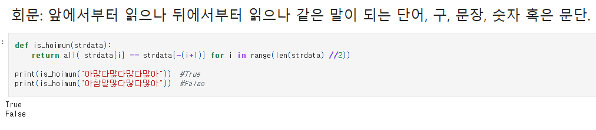
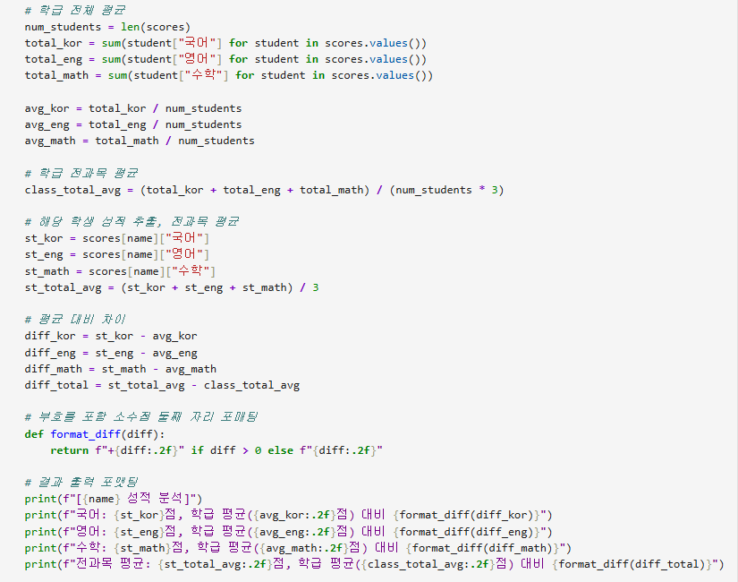
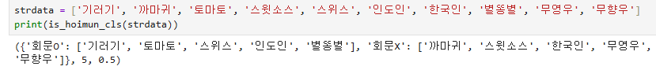
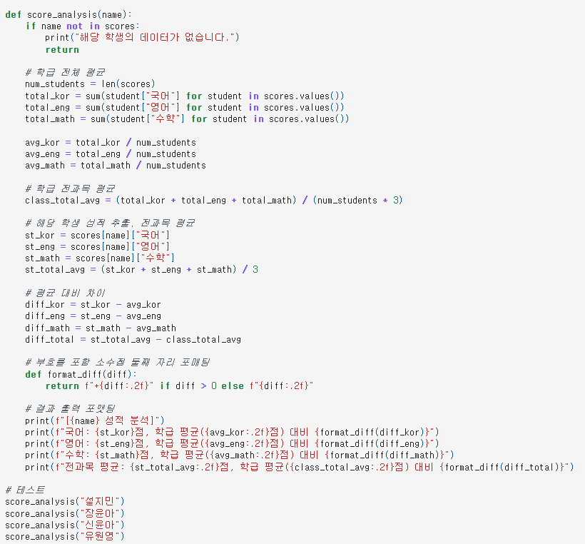

# AIFFEL Campus Online Code Peer Review Templete
- 코더 : 김민욱
- 리뷰어 : 김수경


# PRT(Peer Review Template)
- [x]  **1. 주어진 문제를 해결하는 완성된 코드가 제출되었나요?**
    - 문제에서 요구하는 최종 결과물이 첨부되었는지 확인
        - 중요! 해당 조건을 만족하는 부분을 캡쳐해 근거로 첨부  

  
코드가 잘 작성되었습니다.  
회문 단어뜻도 적어두어서 문제에 대한 이해도 직관적으로 잘 되었고,  
출력값에 대한 결과값을 주석으로 달아둔 bool이랑 출력되어서 잘 만든 코드라고 생각합니다.  
  
- [x]  **2. 전체 코드에서 가장 핵심적이거나 가장 복잡하고 이해하기 어려운 부분에 작성된 
주석 또는 doc string을 보고 해당 코드가 잘 이해되었나요?**
    - 해당 코드 블럭을 왜 핵심적이라고 생각하는지 확인
    - 해당 코드 블럭에 doc string/annotation이 달려 있는지 확인
    - 해당 코드의 기능, 존재 이유, 작동 원리 등을 기술했는지 확인
    - 주석을 보고 코드 이해가 잘 되었는지 확인
        - 중요! 잘 작성되었다고 생각되는 부분을 캡쳐해 근거로 첨부  
  
계산값이 많이 필요해서 어렵다 생각한 문제였는데  
주석으로 적절한 설명과 직관적인 코드로 잘짜여있어서 이해하는데 도움이 되었습니다.  
  
- [ ]  **3. 에러가 난 부분을 디버깅하여 문제를 해결한 기록을 남겼거나
새로운 시도 또는 추가 실험을 수행해봤나요?**
    - 문제 원인 및 해결 과정을 잘 기록하였는지 확인
    - 프로젝트 평가 기준에 더해 추가적으로 수행한 나만의 시도, 
    실험이 기록되어 있는지 확인
        - 중요! 잘 작성되었다고 생각되는 부분을 캡쳐해 근거로 첨부
   
리스트 안에 '무영우', '무향우' 단어가 문제랑 다르게 입력되어 결과가 다르게 나왔으나   
코드에는 문제가 없어서 해당 리스트에 맞는 결과값이 나왔습니다.  


    
- [ ]  **4. 회고를 잘 작성했나요?**
    - 주어진 문제를 해결하는 완성된 코드 내지 프로젝트 결과물에 대해
    배운점과 아쉬운점, 느낀점 등이 기록되어 있는지 확인
    - 전체 코드 실행 플로우를 그래프로 그려서 이해를 돕고 있는지 확인
        - 중요! 잘 작성되었다고 생각되는 부분을 캡쳐해 근거로 첨부
회고 부분이 있는지 몰랐네요! 
        
- [x]  **5. 코드가 간결하고 효율적인가요?**
    - 파이썬 스타일 가이드 (PEP8) 를 준수하였는지 확인
    - 코드 중복을 최소화하고 범용적으로 사용할 수 있도록 함수화/모듈화했는지 확인
        - 중요! 잘 작성되었다고 생각되는 부분을 캡쳐해 근거로 첨부



# 회고(참고 링크 및 코드 개선)
```
# 리뷰어의 회고를 작성합니다.
# 코드 리뷰 시 참고한 링크가 있다면 링크와 간략한 설명을 첨부합니다.
# 코드 리뷰를 통해 개선한 코드가 있다면 코드와 간략한 설명을 첨부합니다.
```
같은조 되어 많이 배울 수 있어서 큰 도움 되었습니다!  
파이썬을 잘 이해하고 계셔서 코드를 잘 작성하신거같아요.  
앞으로 남은 교육도 잘해내시길 응원할게요!  