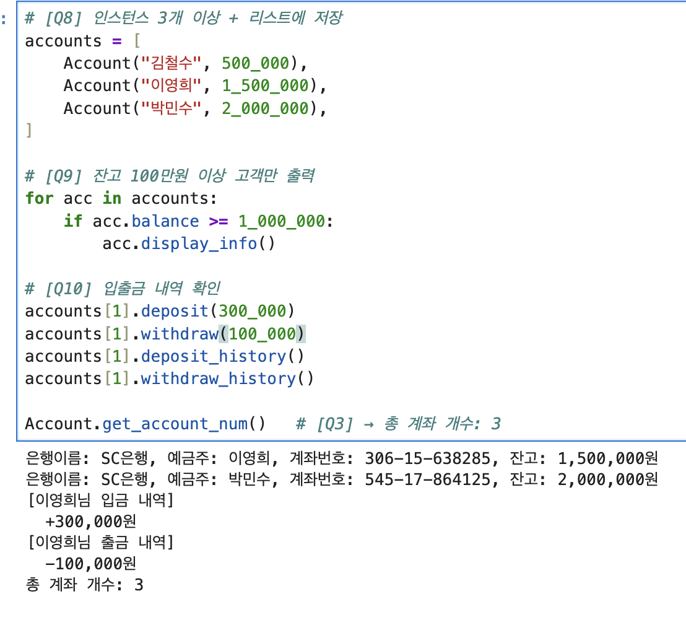
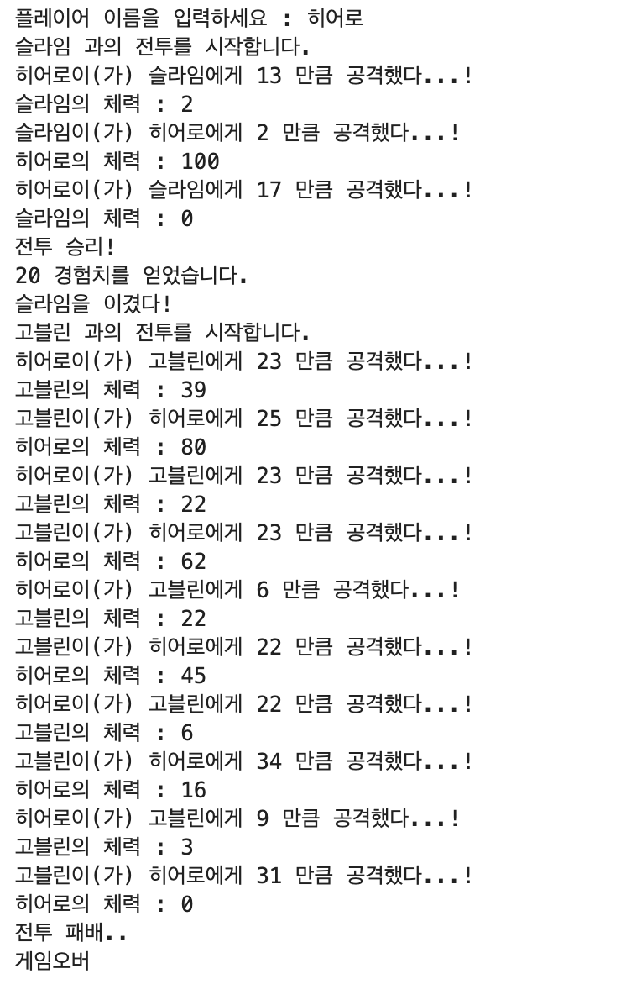
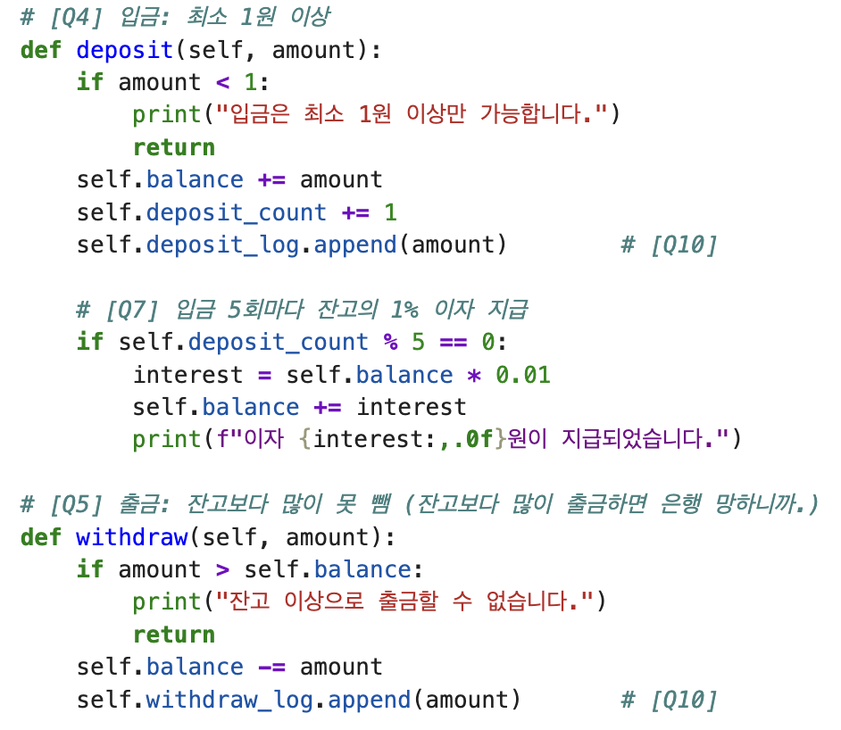
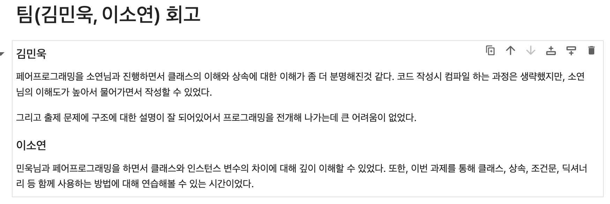
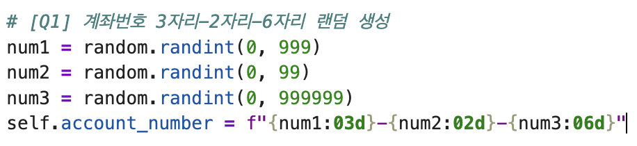

# AIFFEL Campus Online Code Peer Review Templete
- 코더 : 김민욱
- 리뷰어 : 이다겸 


# PRT(Peer Review Template)
- [x]  **1. 주어진 문제를 해결하는 완성된 코드가 제출되었나요?**


  
주어진 퀘스트를 잘 수행하였다. 
 
- [x]  **2. 전체 코드에서 가장 핵심적이거나 가장 복잡하고 이해하기 어려운 부분에 작성된 
주석 또는 doc string을 보고 해당 코드가 잘 이해되었나요?**
     
  
해당 코드는 은행의 계좌에서 입출금이라는 가장 핵심적인 기능을 담당하는 메서드들이다.    
이 메서드들의 각각의 예외처리 부분에 대해서, 친숙한 표현으로 설명을 추가해 놓은것이 인상적이다 


        
- [ ]  **3. 에러가 난 부분을 디버깅하여 문제를 해결한 기록을 남겼거나
새로운 시도 또는 추가 실험을 수행해봤나요?**

    디버깅한 부분이나, 새로이 추가된 부분은 보이지 않았다. 
        
- [x]  **4. 회고를 잘 작성했나요?**

  
팀 회고로 두 코더의 생각을 모두 확인할 수 있어서 바람직한 작성방법이라 생각한다.    
회고를 통해 어떤 부분에서 공부가 더 필요한지, 협업은 제대로 이루어 졌는지 등을 확인할 수 있었다. 
        
- [x]  **5. 코드가 간결하고 효율적인가요?**
      
<  
  
계좌의 각 자리수에 들어가야할 랜덤한 숫자들을 따로 변수로 지정하고, 이를 실제 계좌에 대입시킬 때, :0Nd 포맷팅을 이용해서 자리수를 고정시키는 방법은 매우 강력한 통제이자 파이썬의 기능을 잘 확용한 부분이라 생각한다. 


# 회고(참고 링크 및 코드 개선)
```
# 리뷰어의 회고를 작성합니다.
# 코드 리뷰 시 참고한 링크가 있다면 링크와 간략한 설명을 첨부합니다.
# 코드 리뷰를 통해 개선한 코드가 있다면 코드와 간략한 설명을 첨부합니다.
```
코드를 보면서 미처 생각하지 못했던 부분들, 앞으로 작성할 코드들에 사용할 수 있는 부분들을 찾아낼 수 있어서 매우 유익한 시간이었다.   
예를 들어     
```python
if self.hp < 0:
    self.hp = 0
```
과 같이, 음수가 나올 수 있는 부분을 다시 0으로 맞추는 코드는 실제 게임을 플레이할 때 발생할 수 있는 오류를 사전에 제거하는 좋은 방법이라 생각한다. 