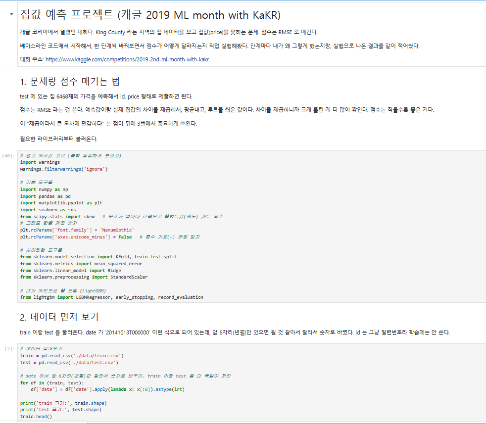
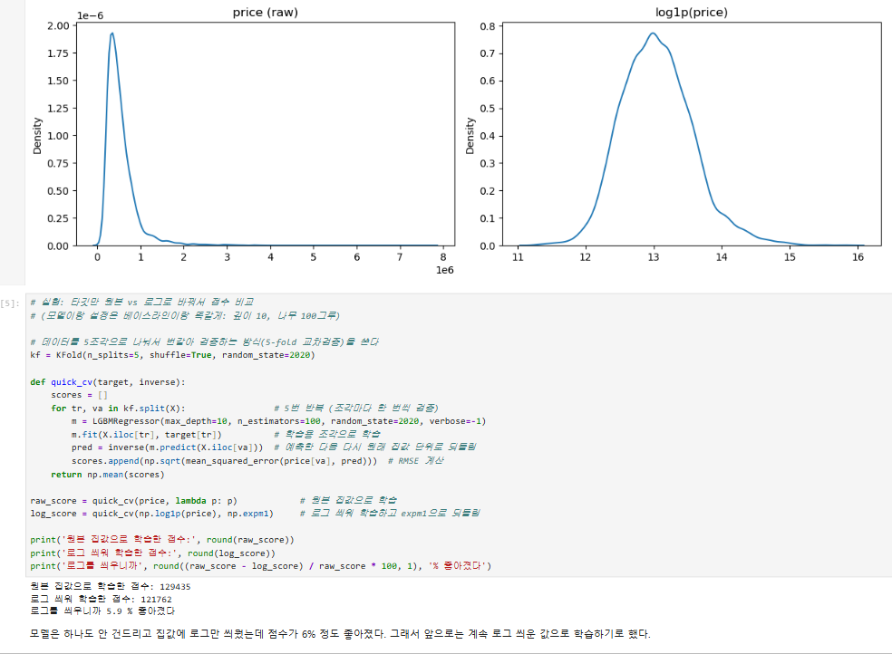
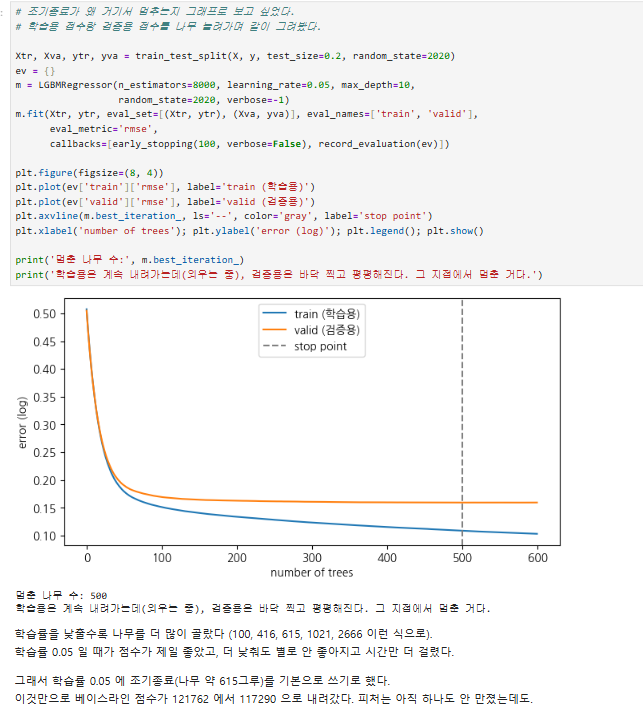
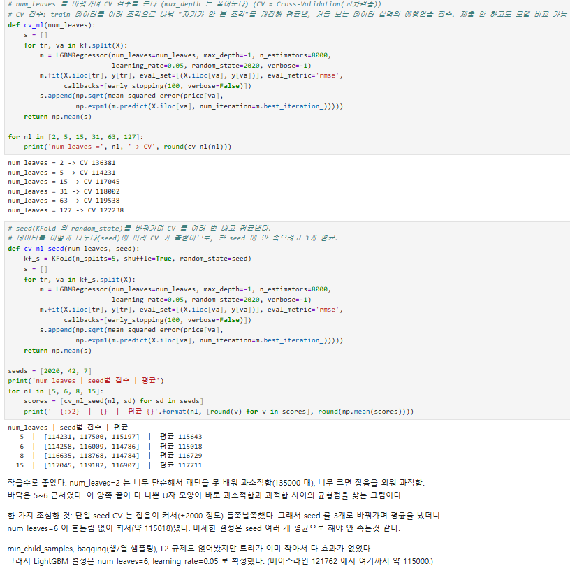
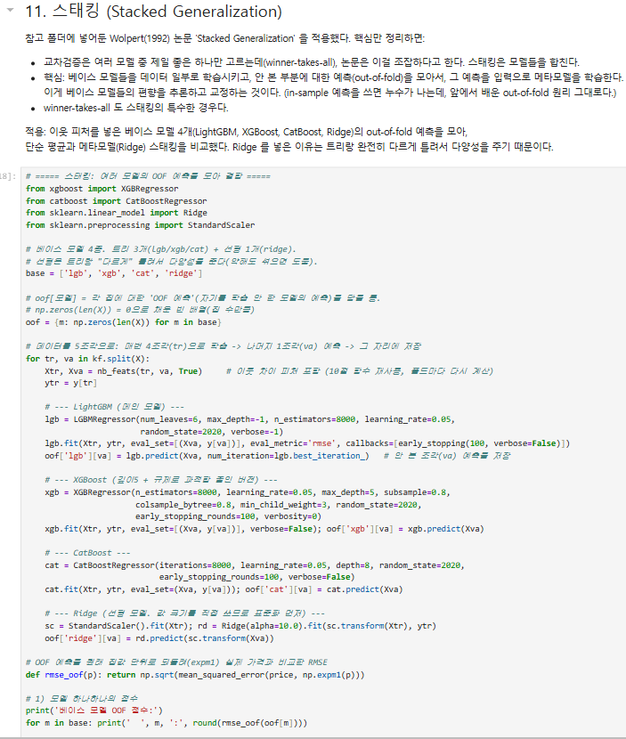
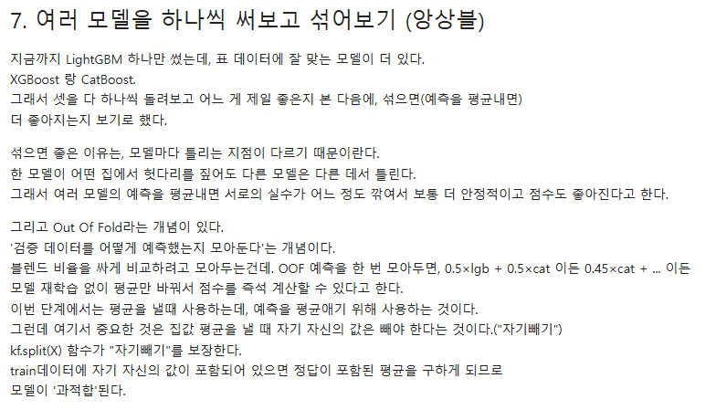
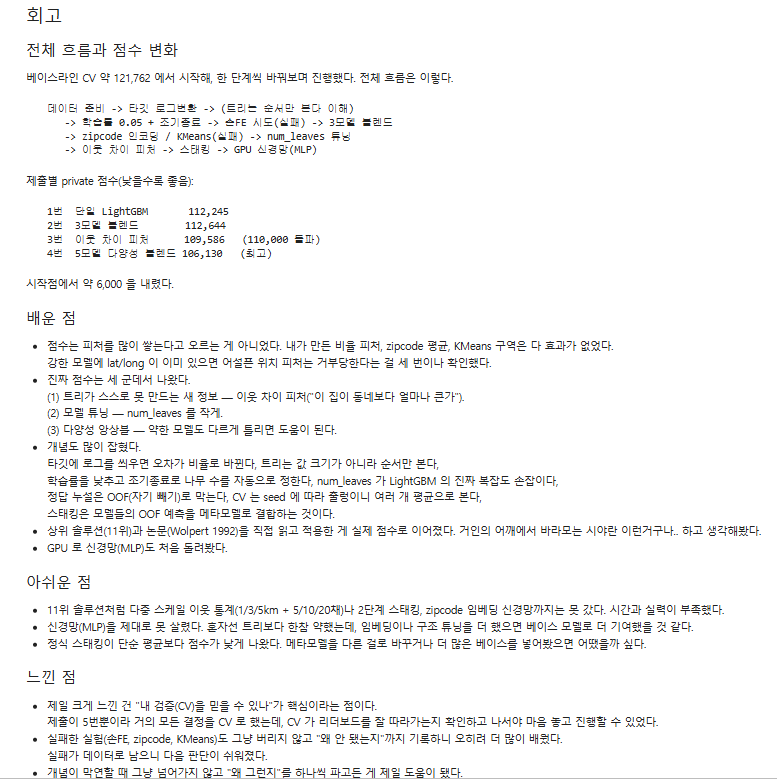
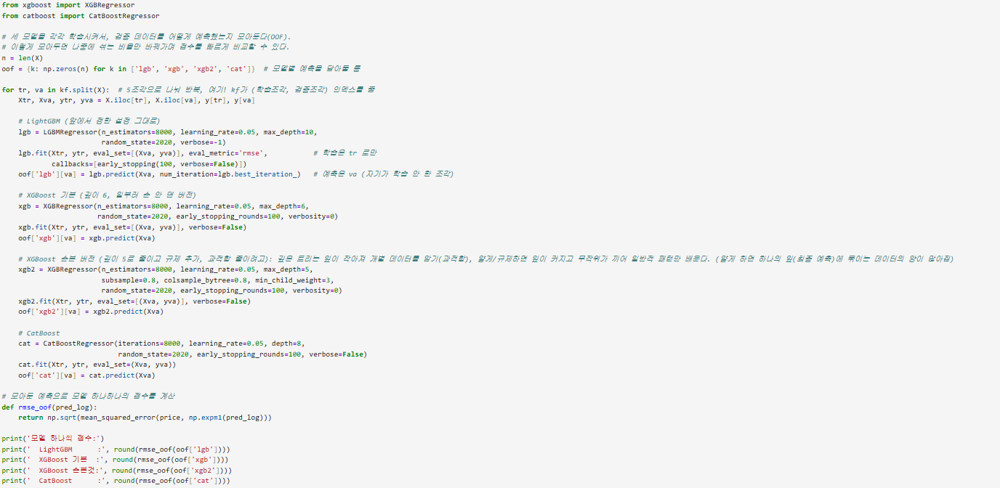

# AIFFEL Campus Online Code Peer Review Templete
- 코더 : 김민욱
- 리뷰어 : 조연우

# PRT(Peer Review Template)
- [x]  **1. 주어진 문제를 해결하는 완성된 코드가 제출되었나요?**

       

:먼저 주어진 문제를 정의하고 완성된 결과를 글로 정의 한 후 본인만의 해석도 추가 되었어요
    
- [x]  **2. 전체 코드에서 가장 핵심적이거나 가장 복잡하고 이해하기 어려운 부분에 작성된 
주석 또는 doc string을 보고 해당 코드가 잘 이해되었나요?**

:모든 코드마다 큰 제목글과 설명을 붙이고 본인의 해석을 잘 정리한거 같다 논문 자료를 참고하여 공부를 하셨고 공부한 내용을 글로 서술하여 정리 후 코드를 짜면서 코드안에도 앞전에 설명햇던 내용이 들어가 있어서 
어렵고 이해가 어려운 부분을 코드가 만들어지는 과정을 보면서도 이해가 될 정도로 잘 설명하였다

- [x]  **3. 에러가 난 부분을 디버깅하여 문제를 해결한 기록을 남겼거나
새로운 시도 또는 추가 실험을 수행해봤나요?**
   

:여러 모델을 합치면서 과적합이 생기는 에러를 발견 하였습니다

- [x]  **4. 회고를 잘 작성했나요?**

:이렇게 긴 회고는 처음 보았습니다 

- [x]  **5. 코드가 간결하고 효율적인가요?**

:효율적인 코드를 구성하였습니다

# 회고(참고 링크 및 코드 개선)

:모든 코드마다 큰 제목글과 설명을 붙이고 생각을 글로 정리를 함과 동시에 이는 제 3자가 보았을때 한번에 쉽게 이해 할수있게 도와주는 설명이 되었다. 
이번 과제에서는 유심히 보지 못하고 넘어간 것이 많았는데 김민욱님의 파일을 리뷰하면서 공부가 많이 되었습니다 감사합니다. 모델을 만들면서 김민욱님의 해석이 적힌 부분은 모델이 돌아가고 ai스스로 학습하는 과정에서 
모델이 학습하는 기준과 우선순위를 파악하신거 같고 그러하여서 학습 상황을 조정하는 것에 예측했던 결과가 눈으로 쉽게 보이지 않았을까? 하는 생각이 드는 분석이였습니다. 화이팅 입니다!

