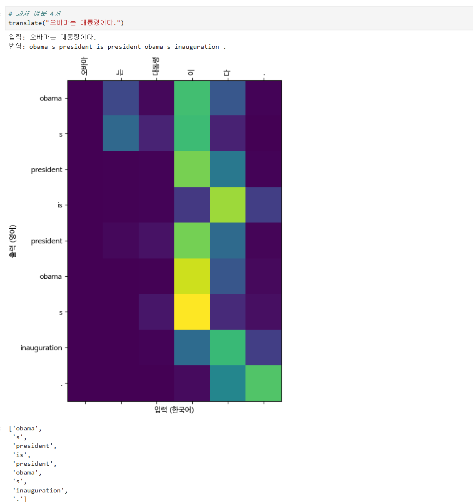
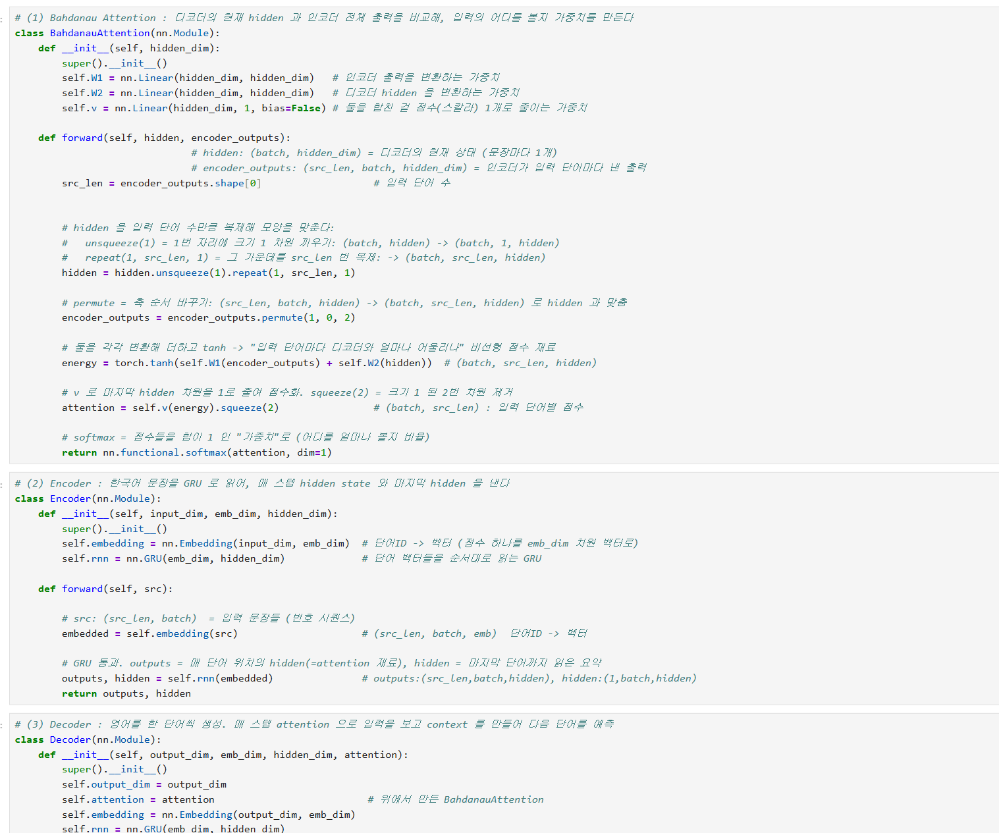
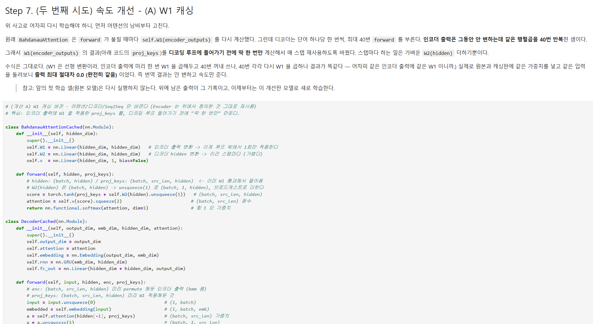
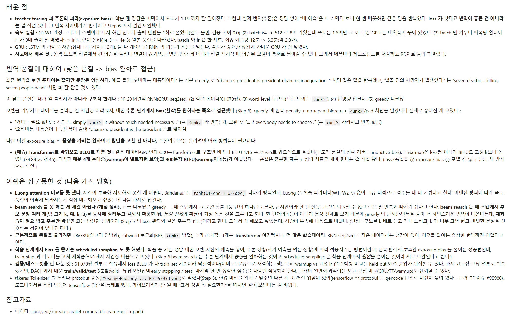
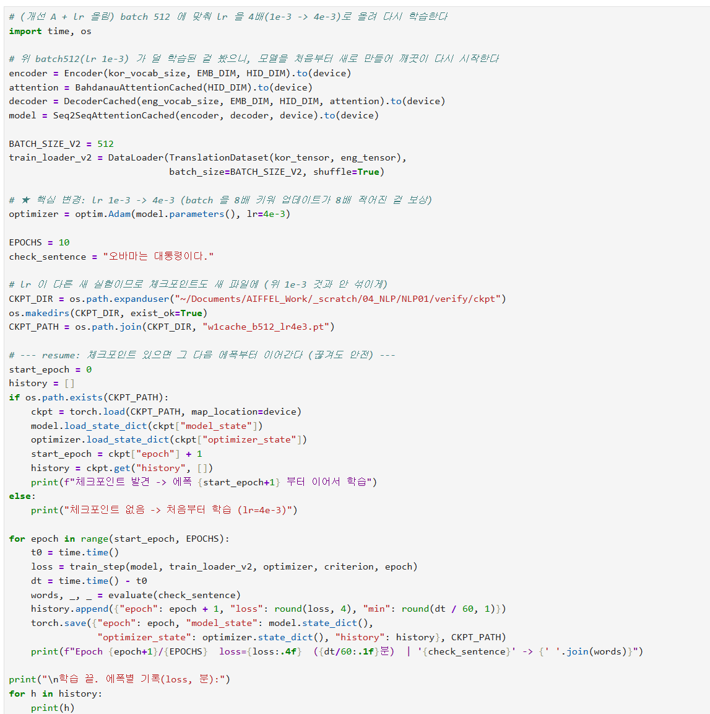

# AIFFEL Campus Online Code Peer Review Templete
- 코더 : 김민욱
- 리뷰어 : 임성배


# PRT(Peer Review Template)
- [X]  **1. 주어진 문제를 해결하는 완성된 코드가 제출되었나요?**
    - 정답과 유사한 영어 번역 작업이 진행되었고, 이를 시각화 하였으며, 훈련 과정에서 training loss가 안정적으로 떨어지며 학습이 진행된 것을 확인하였습니다.  

        
    
- [X]  **2. 전체 코드에서 가장 핵심적이거나 가장 복잡하고 이해하기 어려운 부분에 작성된 
주석 또는 doc string을 보고 해당 코드가 잘 이해되었나요?**
    - Attention seq2seq 모델을 만드는 핵심적인 코드이며, 각 코드마다 어떻게 동작하는지 상세히 주석을 기재하여 이해하는 데에 도움이 되었습니다.  
      
        
        
- [X]  **3. 에러가 난 부분을 디버깅하여 문제를 해결한 기록을 남겼거나
새로운 시도 또는 추가 실험을 수행해봤나요?**
    - 학습 Epoch 당 시간을 줄이고 효율적으로 학습을 진행하기 위한 시도와 그 과정들이 잘 기재되어 있었습니다.  

        
        
- [x]  **4. 회고를 잘 작성했나요?**
    - 프로젝트에 대한 요약, 진행 시 시행착오와 개선한 점, 향후 개선 방향 등에 대해 상세히 작성되어 있었습니다.  
 
        
        
- [x]  **5. 코드가 간결하고 효율적인가요?**
    - 전체적인 코드가 간결하고 효율적으로 작성되어 있었습니다.  

        


# 회고(참고 링크 및 코드 개선)
```
# 리뷰어의 회고를 작성합니다.
# 코드 리뷰 시 참고한 링크가 있다면 링크와 간략한 설명을 첨부합니다.
# 코드 리뷰를 통해 개선한 코드가 있다면 코드와 간략한 설명을 첨부합니다.
```

단순히 프로젝트 풀이에 해당하는 것이 아닌, 학습 목표와 평가 기준에 근거하여 각 단계 별로 어떻게 코딩을 하였는지 잘 이해할 수 있었고, peer review 시 많은 도움이 되었습니다.  
프로젝트에서 요구한 항목 외에도 더 좋은 방법이 있는지를 미리 찾아보고, 이를 적용해보며 그 차이를 확인하려는 모습이 매우 인상적이었습니다.  

상당한 분량의 내용이었는데, 퀘스트 진행하시느라 정말 수고 많으셨습니다.  
