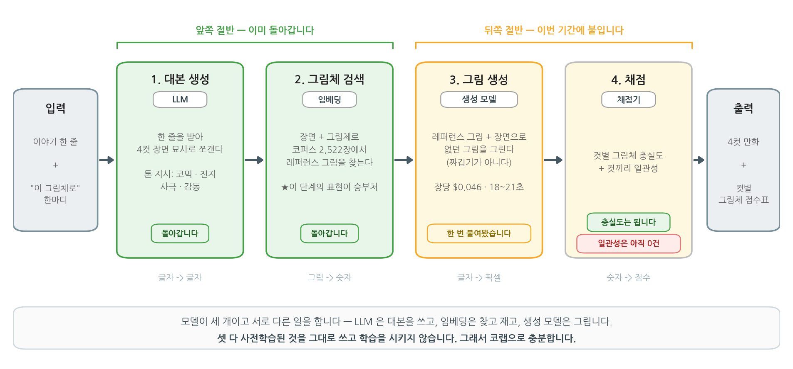

# DLthon2 프로젝트 계획서 — 그림체로 검색하는 RAG

> 팀 노션에 제출한 제안서의 사본이다. 예시 이미지 3종(그림체 비교·생성 비교·통제쌍)은 코퍼스 원본이 들어가 AI-Hub 이용정책상 여기엔 싣지 않는다(팀 내부 드라이브에만).

- **팀이름**: `[미정 — 오후에 정합니다]`
- **팀장**: 김민욱 / **팀원**: 김민욱 · 경수 · 수경 · 희연 · 진현 (5명)
- **주제**: 그림체(Style) Visual RAG
- **깃허브**: `[레포/폴더명 오후 확정 — 후보: DLthon2_그림체RAG]`

---

## 0. 개요

### **한 줄 이야기와 "이 그림체로" 한마디를 넣으면, 그 그림체의 4컷 만화가 나옵니다. 그리고 각 컷이 요청한 그림체에 얼마나 맞는지가 점수로 같이 나옵니다.**

- **파는 것**: 그림을 뽑아주는 서비스는 이미 많습니다. **요청한 그림체로 나왔는지를 점수로 보여주는 곳이 없습니다.** 검수를 사람 눈에서 떼어내는 것이 이 아이템이 파는 것입니다.
- **방법**: 그림체를 말로 지시하는 대신 **그 그림체의 실물을 검색해 생성 모델에 물립니다.** 문서를 검색해 답변에 물리는 RAG와 구조가 같고, 검색 대상만 이미지로 바뀝니다.
- **지금 상태**: 파이프라인 앞쪽 절반(검색)은 **이미 돌아갑니다.** 데이터 20클래스 2,522장 준비 완료. 학습을 시키지 않고 사전학습 모델만 조합하므로 **코랩으로 충분합니다.**

| 심사 축 | 이 제안서의 답 |
|---|---|
| **팔리는가** | 결과물에 점수가 붙어 나옵니다. 채점기만 떼어내도 다른 생성 파이프라인 뒤에 붙는 자동 검수기가 됩니다 |
| **구현이 되는가** | 검색·채점·생성을 이미 한 번씩 돌려봤고 비용까지 실측했습니다(장당 $0.046). 아래 실측 표에 되는 것과 안 되는 것을 갈라 적었습니다 |

---

## 1. 문제인식

### 프로젝트 목표 및 목적

**목표: 이야기 한 줄과 그림체 지정 하나로 4컷 만화를 만들고, 각 컷의 그림체 충실도를 매번 점수로 내놓습니다.**

**목적 — 왜 이게 문제인가. 두 겹입니다.**

**첫째, 말로 지시하는 것만으로는 그림체가 안 잡힙니다.** 이건 저희 짐작이 아니라 만든 쪽이 인정하고 있습니다.
Midjourney 공식 문서는 참조 이미지를 쓸 때 **"원하는 그림체를 얻기 어려우면, 참조 이미지에 맞는 묘사 단어를 프롬프트에 넣으라"** 고 안내합니다.
그림체를 맞추는 일이 **사용자가 손으로 단어를 찾아내는 작업**으로 넘어와 있다는 뜻입니다.

**둘째, 더 근본적으로 검색에 쓰는 임베딩 자체가 그림체를 잘 못 봅니다. 직접 재봤습니다.**
내용을 고정하고 기법만 바꾼 그림 591장으로, 한 장을 던져 가장 가까운 5장을 봤을 때 무작위 대비

- 같은 **내용**(같은 그림을 다른 기법으로 그린 것): **102배**
- 같은 **그림체**(다른 그림인데 같은 기법): **1.5배**

그림체는 픽셀에 분명히 있고 사람 눈에는 확연히 보이는데, 임베딩은 "무엇이 그려졌나"를 먼저 봅니다.

**그래서 이 프로젝트는 재는 자를 먼저 만들고, 그 자로 방법을 고른 다음, 고른 방법으로 4컷을 만듭니다.** 순서를 뒤집지 않는 것이 이 프로젝트의 태도입니다.

### 아이템의 독창성

**비슷한 서비스는 있습니다. 그런데 둘이 없습니다 — 말로 그림체를 지정하는 것과, 쓰는 사람 손에 점수가 오는 것.**

| 서비스 | 그림체를 어떻게 지정하나 | 쓰는 사람이 점수를 받나 |
|---|---|---|
| Midjourney `--sref` | 참조 이미지 URL 또는 스타일 코드를 직접 지정 (강도는 `--sw`) | 안 준다 (눈으로 판단) |
| LoRA 학습형 (Stable Diffusion 계열) | 5~10장 올려서 10분 학습시킨다 | 안 준다 (학습 loss 뿐) |
| Dashtoon 등 웹툰 AI 플랫폼 | 플랫폼이 준 스타일 목록에서 고른다 | 플랫폼 자체 평가 (사용자 미공개) |
| **이 프로젝트** | **말로 하면 검색이 레퍼런스를 찾아온다** | **매번 숫자로 나온다** |

1. **말로 지정할 수 있습니다.** 참조 이미지를 미리 갖고 있어야 하거나, 학습을 돌려야 하거나, 플랫폼이 준 목록 안에서 골라야 하는 제약이 없습니다. 코퍼스에서 검색이 대신 찾아옵니다.
2. **평가가 결과물과 같이 나옵니다.** "그림체가 유지됐나"를 사람 눈이 아니라 지표로 보여줍니다.

**독창성의 근거를 스스로 깎아서 밝힙니다.** "그림체를 숫자로 재는 걸 처음 한다"고 주장하지 않습니다. CLIP 유사도 계열 지표는 연구에 이미 있습니다.
저희가 새로 만드는 것은 **누수를 걷어낸 채점 규격**과, **그 점수가 서비스 출력에 붙어 나오는 형태**입니다.

---

## 2. 개발 및 연구 내용

### 구현체의 구체적 구조

**모델 세 개를 조합하며, 셋 다 학습시키지 않습니다. 앞쪽 절반(1~2)은 이미 돌아가고, 뒤쪽 절반(3~4)을 붙이는 것이 이번 기간의 일입니다.**



승부처는 **2번(그림체 검색)의 표현을 무엇으로 하느냐**입니다. 여기가 흔들리면 뒤의 생성과 채점이 전부 흔들립니다.
그래서 팀 Task 중 가장 많은 사람이 이 단계에 붙습니다.

4번(채점) 중 **컷별 그림체 충실도는 계산되고, 컷끼리 일관성은 아직 0건**입니다. 그 자리를 이번 기간에 채웁니다.

### RAG 자리에 이미지를 바꿔 끼운 구조

**자리를 그대로 두고 내용물만 이미지로 바꿉니다. RAGAS 지표도 이름을 그대로 쓰고 대상만 바꿉니다.**

| RAG 원본 | 이 프로젝트 | | RAGAS 지표 | 이 프로젝트에서 재는 것 |
|---|---|---|---|---|
| 문서 코퍼스 | 그림체 코퍼스 | | context_precision | 검색된 레퍼런스가 정말 그 그림체인가 |
| 텍스트 임베딩 | 이미지·텍스트 임베딩 | | context_recall | 그 그림체의 대표를 놓치지 않았나 |
| 검색된 청크 | 검색된 레퍼런스 그림 | | faithfulness | 생성 그림이 검색된 그림체에 충실한가 |
| 답변 생성 | 그림 생성 | | answer_relevancy | 생성 그림이 그 컷의 내용에 맞는가 |

네 지표 모두 정답표가 있거나 정답 없이도 계산됩니다. **계산이 안 되는 지표는 넣지 않았습니다.**

### 요구되는 데이터

**세 도메인 20클래스 2,522장을 이용조건 확인까지 마쳐 이미 준비했습니다. 전부 개방데이터 또는 공개 라이선스입니다.**

| 도메인 | 클래스 | 장수 | 원본 | 난이도 |
|---|---|---|---|---|
| ink | 흑백 회화 기법 9종 | 1,259 | AI-Hub "168. 한국 전통 수묵화 화풍별 제작 데이터" (개방데이터) | 어렵다 (색 단서가 없다) |
| paint | WikiArt 사조 6종 | 565 | WikiArt (퍼블릭 도메인 회화) | 중간 |
| vector | 공개 라이선스 일러스트 5종 | 698 | Twemoji · OpenMoji · Noto Emoji · unDraw (CC BY / CC BY-SA) | 쉽다 |

**전처리에서 이미 걷어낸 함정** — 안 걷어내면 그림체가 아니라 다른 것을 재게 됩니다.

- **작가당 장수 상한 + 질의 작가 제외** — 안 넣었을 때는 그림체가 아니라 같은 화가를 찾고 있었습니다
- **같은 원본 그룹 이웃 제외** — 같은 그림을 다른 기법으로 그린 짝이 딸려 오면 내용을 재게 됩니다
- 384px 축소 + 정답표(`meta.csv`) 동봉. 팩 생성 스크립트의 seed가 고정되어 **돌리면 똑같이 재현**됩니다

**공개 범위 제약** (이용조건을 확인하고 정한 선입니다)

- AI-Hub 데이터는 제3자 제공 제한이 있어 **팀 내부 학습 목적으로만** 씁니다. 공개 저장소·공개 링크에 올리지 않습니다
- 발표·외부 공유용으로 **이용조건이 자유로운 것만 모은 별도 팩(10클래스 1,123장)** 을 따로 준비했습니다
- 깃허브에 올리는 것은 코드·문서·리더보드까지입니다. 이미지는 올리지 않습니다
- AI-Hub 2차 저작물 출처 표기(한국지능정보사회진흥원 사업결과물)와 CC BY / CC BY-SA 표기를 발표자료에 넣습니다

### 실현 가능성 — 기간 안에 되는지부터 먼저 돌려봤습니다

**결론: 검색·채점·생성이 전부 한 번씩 돌았습니다. 다만 "레퍼런스를 물리면 얼마나 더 충실해지나"는 아직 못 잽니다.**

| 확인한 것 | 결과 |
|---|---|
| 학습 없이 임베딩 숫자만으로 그림체가 갈리나 | **갈린다.** 전 코퍼스에서 무작위의 **7.72배** (기준선 하나) |
| 다른 표현을 쓰면 더 갈리나 | **더 갈린다.** 붓결·질감을 뽑는 방식이 **9.52배**. 짝지어 비교 +0.0928, 95% 구간 [0.0793, 0.1062] |
| 검색 결과를 생성에 물리면 그림체가 끌려오나 | **끌려온다.** 다만 먹 톤으로 옮겨간 것이 확실히 보인 건 4컷 중 한 컷이고, 나머지는 사람 눈에도 애매했다 |
| 얼마나 끌려왔는지 잴 수 있나 | **아직 못 잰다.** 코퍼스 유사도 0.547 -> 0.565, **0.018 차이.** n이 2이고 노이즈 바닥을 안 쟀다 |
| 생성 비용은 얼마인가 | 한 장 **$0.046**, 4컷 한 편 **$0.182**, 한 장에 18~21초 |

0.018은 **"이겼다"가 아니라 "아직 못 잰다"는 뜻으로만 씁니다.** 그래서 "얼마나 차이나야 진짜 개선인지"를 정하는 일이 팀 Task 하나로 들어가 있습니다.

**미리 아는 위험 세 가지와 관리 방법**

1. **측정이 또 틀릴 수 있다** — 준비 중 세 번 틀렸고 세 번 다 잡았습니다(작가 누수 / 내용 누수 / 수집 스크립트가 250장 전부 엉뚱한 그림). **셋 다 에러가 안 났고 숫자도 그럴듯했습니다.** 그래서 "수집·전처리가 끝나면 표본을 눈으로 본다"를 팀 규칙에 넣었습니다
2. **생성 비용** — 평가는 1컷 단위로 대량, 4컷 완성본은 소수만 만듭니다
3. **데이터가 좋아서 손이 간다** — 쓸 수 있는 라벨이 너무 많습니다. 첫날에 쓸 라벨 세 개만 정하고 나머지는 안 쓴다고 못 박습니다

### 개발 아이템 기대효과

**핵심은 채점기가 파이프라인에서 떼어내도 값이 있다는 점입니다.** 다른 생성 파이프라인 뒤에 붙여 "요청한 그림체로 나왔나"를 자동 판정하는 검수기로 쓸 수 있습니다.

서비스로 배포되었을 때의 활용 용도

- **웹툰·숏폼 제작 보조** — 작가가 자기 기존 원고를 코퍼스로 등록하면 "내 그림체로" 콘티 4컷을 뽑고 컷별 유사도를 같이 봅니다. 눈으로 검수하던 단계가 숫자로 걸러집니다
- **교육·홍보 콘텐츠** — 같은 대본을 그림체만 바꿔 여러 판으로 뽑습니다(어린이용, 사극풍, 수묵화). 대본을 다시 쓰지 않습니다
- **생성 결과 품질 게이트** — 위에 적은 채점기 단독 활용
- **문화재·전통화 아카이브 활용** — 개방데이터로 풀린 전통 수묵화가 어떤 기법으로 갈리는지를 검색 가능한 형태로 만듭니다

---

## 3. 실행 계획

### 프로젝트 완성을 위한 전략

**전략의 전제: 일정이 4일인데 연속이 아닙니다.** 7/30(목) · 7/31(금) 다음에 방학이 끼고 8/10(월) · 8/11(화)로 이어집니다.
가운데 열흘 공백이 가장 큰 제약이라, 전략을 여기에 맞췄습니다.

1. **방학 전 2일에 "돌아가는 최소본(v1)"을 목표로 둡니다.** 7/31 저녁까지 "한 줄 넣으면 4컷이 나온다"를 세웁니다. 뒤로 미루지 않습니다
2. **방학(8/1~8/9)은 계획에 넣지 않습니다.** 팀원에게 방학 작업을 요구하지 않습니다. 더 밀고 싶은 사람만 자유롭게 합니다
3. **7/31 저녁에 상태를 동결합니다.** 코퍼스 버전·리더보드 점수·다음 할 일을 문서로 고정해서, 열흘 뒤에 되살릴 대상이 "기억"이 아니라 "파일"이 되게 합니다. 8/10~8/11은 정리와 발표 준비 전용입니다

**병렬로 굴리는 방식**: Task 다섯 개가 서로를 막지 않게 잘라서 동시에 굴립니다. 규격은 함수 하나로 맞춥니다.

```python
def encode(images):        # PIL.Image 리스트
    return vectors         # numpy (N, D) float32
```

이 규격만 지키면 무엇을 꽂아도 자동 채점기가 점수를 냅니다. 결과는 리더보드 한 표에 모입니다.
**보고서를 따로 쓰지 않아도 실행하면 이름·날짜·점수가 자동으로 쌓입니다.**

**팀장 개인 준비분과 팀 작업의 경계를 날짜로 자릅니다.** 7/28~7/29에 팀장이 혼자 만든 코퍼스·채점기·기준선 2개는 **팀 성과가 아니라 넘어야 할 선**으로 둡니다. 7/30부터가 팀 기록이고, 리더보드에 날짜가 남아 자동으로 구분됩니다.

### DLthon2 기간 내 마일스톤

| Task | 기간 | 상세 내용 | 완료 판정 |
|---|---|---|---|
| T0 규격 합의 · 제안서 | 7/30 오전~오후 | 제안서 제출, `encode()` 규격 합의(안 맞으면 그 자리에서 고침), 팀이름·쓸 라벨 3개 확정 | 제안서 링크 첨부 |
| T1 데이터 EDA · 전처리 확인 | 7/30 오후 | 20클래스 표본 그리드를 눈으로 확인, 도메인·클래스별 장수와 난이도 파악, 누수 차단 규칙 공유 | 전원이 판을 눈으로 봤다 |
| T2 전원 첫 점수 | 7/30 오후 | 기준선을 각자 한 번 돌려 같은 숫자 확인. 안 나오면 환경 문제를 그 자리에서 잡는다 | 리더보드에 5명 이름 |
| T3 그림체 표현 탐색 | 7/30 오후 ~ 7/31 | 표현 후보를 각자 만들어 리더보드 도전. 짝지어 비교로 승패 판정 | 리더보드에 팀 방법 3개 이상 |
| T4 측정을 믿을 수 있게 | 7/30 오후 ~ 7/31 오전 | 노이즈 바닥, 95% 구간, 도메인·클래스별 보고 규칙 확정 | "얼마나 차이나야 진짜인지" 문서화 |
| T5 오케스트레이션 비교 | 7/30 오후 ~ 7/31 | 같은 4컷 파이프라인을 LangGraph와 AutoGen으로 각각. 하나 막혀도 다른 게 살아 있다 | 둘 다 도는 스켈레톤 |
| **T6 검색기 확정 + 4컷 생성** | **7/31** | 제일 나은 표현으로 검색기 고정, 뒤쪽 절반(생성) 연결 | **한 줄 -> 4컷이 끝까지 돈다** |
| T7 컷 간 일관성 재는 법 | 7/31 | 4컷이 같은 그림체를 유지하는지 재는 방법 초안 (현재 0건에서 시작) | 재는 방법 문서 + 첫 숫자 |
| T8 v1 동결 · 인수인계 | 7/31 저녁 | 코퍼스 버전·점수·다음 할 일 고정. 열흘 공백 대비 | 동결 문서 커밋 |
| (방학) | 8/1 ~ 8/9 | **계획에 넣지 않습니다.** 자율 | — |
| T9 재개 · 결과표 정리 | 8/10 | 동결 상태 복구, 평가 표 정리, **실패한 시도도 기록** | 결과·실패 표 완성 |
| T10 발표자료 · 리허설 | 8/10 ~ 8/11 오전 | 15분 대본 + 시간 재는 리허설. 결과물은 미리 만들어 둔 4컷과 점수표로 보여줍니다(별도 UI는 만들지 않습니다). **8/11 오전 10:00 자료 마감** | 자료 제출 |
| T11 발표 | 8/11 14:00 | 발표 15분 + 질의응답 10분 (구글밋) | — |

**끊는 선을 미리 정합니다.** T6까지가 완성본입니다. T7이 못 끝나도 "이렇게 재면 된다"까지 나오면 성공으로 봅니다. **8/10에 새 실험을 시작하지 않습니다.**

### 팀장 및 팀원 역할 분배

**팀장이 배정하지 않습니다. 하고 싶은 것을 먼저 고른 뒤 빈 자리만 팀장이 채웁니다.**

첫날 회의에서 확정한 배정입니다. 각자 배경과 진도가 달라서, 역할을 못박기 전에 **갈래별 빌드업부터**
시작했습니다. 아래는 1일차 기준이고 2일차(7/31) 회의에서 진행을 보고 조정합니다.

| 이름 | 담당 Task | 하는 일 | 첫날 산출물 |
|---|---|---|---|
| 김민욱 (팀장) | 코퍼스·채점기 유지 / T4 측정 신뢰 / T6 생성 뒤쪽 절반 | 규격 유지, 막힌 사람 풀어주기, 빌드업 자료 제공 | 전원이 첫 점수를 냈다 |
| 진현 | T3 그림체 표현 탐색 (임베딩 빌드업) | 임베딩 표현 후보를 만들어 리더보드 도전 준비 | 기준선 실행 + 임베딩 파악 |
| 수경 | T3 그림체 표현 탐색 (임베딩 빌드업) + 팀 소통 채널 | 임베딩 빌드업, 팀 디스코드 개설·운영 | 기준선 실행 + 디스코드 개설 |
| 희연 | T5 오케스트레이션 비교 (LangGraph·AutoGen) | 4컷 파이프라인 뼈대를 두 도구로 비교 | 빌드업 노트북 완주 |
| 경수 | 프로젝트 파악 (T1·T2) 후 2일차에 Task 선택 | 데이터·과제 구조 파악, 기준선 실행 | 기준선 실행 + 첫 점수 |

고를 수 있는 Task 다섯 개

| Task | 하는 일 | 난이도 | 비고 |
|---|---|---|---|
| T3 그림체 표현 찾기 | 표현을 만들어 리더보드 도전 | 자기가 정함 | 채점기가 있어 피드백이 바로 옵니다. 진입 비용 최저 |
| T7 컷 간 일관성 | 4컷이 같은 그림체를 유지하나 재는 법 만들기 | 어렵다 | **아직 0건.** 제일 어렵고 제일 값집니다 |
| 컷 수 확장 | 4컷을 6·8컷으로. 흐트러짐과 비용의 관계 | 보통 | 비용·시간 표가 산출물 |
| T5 오케스트레이션 비교 | LangGraph와 AutoGen으로 같은 파이프라인 | 보통 | 비교 표가 그대로 산출물 |
| T4 측정 신뢰 | 노이즈 바닥, 짝지어 비교, 클래스별 보고 | 보통 | 제일 중요한데 제일 안 고릅니다. 안 나오면 팀장이 맡습니다 |

**팀장 몫을 크게 잡지 않습니다.** 팀장이 병목이 되면 다섯이 멈춥니다. 컷 간 일관성·컷 수 확장은 팀장이 손대지 않습니다. 오케스트레이션은 희연님 주도로 가고, 팀장은 첫날 빌드업 자료(코랩 노트북)를 만들어 건네는 온보딩까지만 맡습니다.

### 작업 관리

노션 스프린트 보드로 관리하고, **스프린트를 방학으로 자릅니다.**

- **스프린트 1 (7/30 ~ 7/31)**: 목표 = "한 줄 넣으면 4컷이 나온다" + "측정을 믿을 수 있다"
- **스프린트 2 (8/10 ~ 8/11)**: 목표 = 결과·실패 정리 + 발표

병목은 리더보드와 보드 두 곳에서 같이 봅니다. **리더보드에 이름이 안 올라온 사람이 곧 막힌 사람입니다.**

### 평가 항목과의 대응 (자체 점검용)

| 평가 항목 | 어디서 채우나 |
|---|---|
| 1. 데이터 EDA와 전처리 | T1. 20클래스 표본을 눈으로 확인 + 누수 차단(작가·원본 그룹) + 384px 정규화 |
| 2. Task에 알맞은 모델 탐색·선정 | T3. 기준선 2개를 두고 리더보드로 후보를 겨룸. **도메인마다 승자가 뒤집히는 것**을 이미 확인 |
| 3. 성능향상을 위한 논리적 접근 | T3 + T4. 올렸다고 말하기 전에 짝지어 비교와 95% 구간으로 판정 |
| 4. 여러 가지 시도 | Task 5개 병렬. 실패한 시도도 지우지 않고 표에 남김 |
| 5. 결론의 설득력 | 되는 것과 안 되는 것을 나눠 씀. 0.018처럼 못 잰 것은 못 잤다고 씀 |
| 6. metric 설정과 근거·결과 분석 | 채점 규격(가장 가까운 5장 중 같은 그림체 비율) + 무작위 대비 배수 + 도메인·클래스별 분해 |
| 7. 발표 진행과 시간 준수 | T10에 리허설을 별도 Task로 잡음. 15분 준수 |

---

## 4. 레퍼런스

### 아이디어 제안에 도움이 된 소스

- **Midjourney Style Reference (`--sref`) 공식 문서** — `docs.midjourney.com/hc/en-us/articles/32180011136653-Style-Reference`
  인용: "Use your text prompt to describe what you want to see, not how Midjourney should modify the reference image." /
  "If achieving a specific style is difficult, include descriptive words that match your reference image."
  (참조 강도는 `--sw` 0~1000, 기본 100)
- Dashtoon Studio 등 웹툰 생성 플랫폼 — 스타일을 목록에서 고르게 하는 방식
- Stable Diffusion LoRA 스타일 학습 사례 — 소량 이미지로 학습시키는 방식

### 실현 방안의 근거 (참고 논문)

- **Gram matrix로 그림체(질감·붓결)를 뽑는 방식**: Gatys et al., "Image Style Transfer Using Convolutional Neural Networks", CVPR 2016
- **텍스트로 이미지를 검색하는 임베딩**: Radford et al., "Learning Transferable Visual Models From Natural Language Supervision" (CLIP), ICML 2021
- **검색을 생성에 물리는 구조**: Lewis et al., "Retrieval-Augmented Generation for Knowledge-Intensive NLP Tasks", NeurIPS 2020
- **RAG 파이프라인 평가 지표**: RAGAS (context_precision / context_recall / faithfulness / answer_relevancy)
- **오케스트레이션 비교 대상**: LangGraph 공식 문서 / Microsoft AutoGen 공식 문서

### 데이터 출처

- AI-Hub "168. 한국 전통 수묵화 화풍별 제작 데이터" (개방데이터, 본인 명의 이용 신청)
- WikiArt (`huggingface.co/datasets/huggan/wikiart`, 원본 `wikiart.org`) — 퍼블릭 도메인 회화
- Twemoji (CC BY 4.0) · OpenMoji (CC BY-SA 4.0) · Google Noto Emoji (CC BY 4.0) · unDraw (자유 이용)

### 자체 실험 기록 (이 계획서 숫자의 출처)

숫자는 전부 `verify/facts.json` 한 곳에서 관리하고 문서에 손으로 옮기지 않습니다.
주장은 `verify/claims.md` 에 근거와 같이 올린 것만 씁니다. **근거가 없으면 아직 말하지 않습니다.**

---

## 프로젝트 아이템 개요 (요약)

### 아이템 소개

**한 줄 이야기와 "이 그림체로" 한마디로 4컷 만화를 만들고, 각 컷이 그 그림체에 얼마나 맞는지 점수를 같이 내놓는 서비스입니다.**

말로만 지시하면 그림체가 컷마다 달라지므로, **그 그림체의 실물을 코퍼스에서 검색해 생성 모델에 물립니다.** 문서를 검색해 답변에 물리는 RAG와 구조가 같고, 검색 대상만 이미지로 바뀝니다.

주요 기능 세 가지

1. **말로 그림체 지정** — 참조 이미지를 미리 갖고 있지 않아도, 학습을 돌리지 않아도 됩니다
2. **4컷 자동 생성** — 대본부터 그림까지. 사전학습 모델만 씁니다
3. **컷별 그림체 점수** — 요청한 그림체로 나왔는지가 결과물과 같이 숫자로 나옵니다

### 아이템의 특징 및 차별성

- **결과에 점수가 붙어 나옵니다.** 기존 서비스는 눈으로 판단하게 하고 쓰는 사람 손에 점수를 주지 않습니다. **검수를 사람 눈에서 떼어내는 것이 이 아이템이 파는 것입니다**
- **학습을 시키지 않습니다.** 사전학습 모델 세 개(LLM · 임베딩 · 생성)를 그대로 조합합니다. 코랩으로 충분합니다
- **재는 자를 먼저 만들었습니다.** 그림체가 임베딩에서 잘 안 보인다는 것(내용 102배 vs 그림체 1.5배)을 직접 재서 확인하고 거기서부터 시작합니다
- **데이터가 전부 개방데이터·공개 라이선스입니다.** 20클래스 2,522장을 이용조건 확인까지 마쳐 준비했고, 생성 스크립트의 seed가 고정되어 재현됩니다
- **되는 것과 안 되는 것을 갈라서 밝힙니다.** 생성 충실도 개선분 0.018은 노이즈 바닥을 재지 않아 "아직 못 잰다"로 둡니다

### 이미지

첨부할 이미지 네 장. **1번은 위 2장(개발 및 연구 내용)에도 같이 넣습니다.**

| # | 무엇 | 파일 |
|---|---|---|
| 1 | **파이프라인 구조도** — 4단계와 각 단계의 현재 상태 | `images/pipeline_diagram.png` |
| 2 | 같은 대본을 그림체만 바꿔 검색한 4컷 예시 | (미첨부 - 데이터 정책) |
| 3 | 레퍼런스를 물렸을 때와 말로만 했을 때의 생성 결과 비교 | (미첨부 - 데이터 정책) |
| 4 | 내용을 고정하고 기법만 바꾼 통제쌍 예시 (내용 102배 vs 그림체 1.5배의 근거) | (미첨부 - 데이터 정책) |
