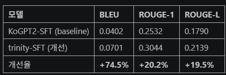
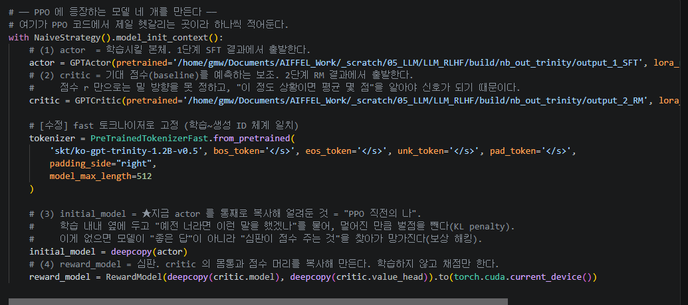
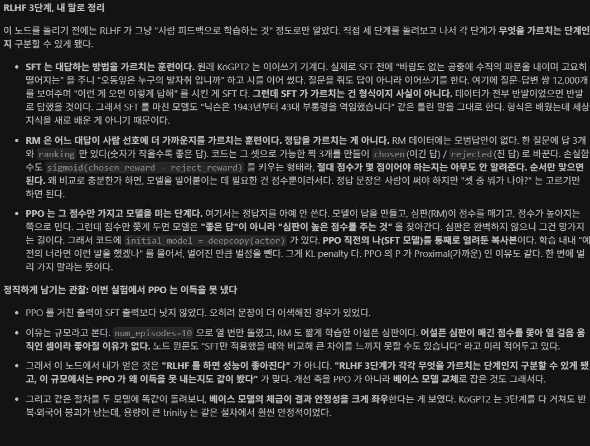

# AIFFEL Campus Online Code Peer Review Templete
- 코더 : 김민욱
- 리뷰어 : 채진현


# PRT(Peer Review Template)
- [x]  **1. 주어진 문제를 해결하는 완성된 코드가 제출되었나요?**
    - 문제에서 요구하는 최종 결과물이 첨부되었는지 확인
        - 중요! 해당 조건을 만족하는 부분을 캡쳐해 근거로 첨부   

  - foundation model 교체라는 개선 방향을 명확히 선택하고, SFT·RM·PPO 3단계 재학습과 정성·정량 비교를 모두 노트북에 구성했다.
  - 기준 모델과 Trinity 모델의 SFT 지표를 표로 제시해 개선 결과를 확인할 수 있다.
    
- [x]  **2. 전체 코드에서 가장 핵심적이거나 가장 복잡하고 이해하기 어려운 부분에 작성된 
주석 또는 doc string을 보고 해당 코드가 잘 이해되었나요?**
    - 해당 코드 블럭을 왜 핵심적이라고 생각하는지 확인
    - 해당 코드 블럭에 doc string/annotation이 달려 있는지 확인
    - 해당 코드의 기능, 존재 이유, 작동 원리 등을 기술했는지 확인
    - 주석을 보고 코드 이해가 잘 되었는지 확인
        - 중요! 잘 작성되었다고 생각되는 부분을 캡쳐해 근거로 첨부   

  - SFT/RM/PPO 각 단계의 목적, PPO의 KL penalty 역할, 평가 지표의 해석 범위를 서술해 흐름을 따라가기 좋다.
        
- [x]  **3. 에러가 난 부분을 디버깅하여 문제를 해결한 기록을 남겼거나
새로운 시도 또는 추가 실험을 수행해봤나요?**
    - 문제 원인 및 해결 과정을 잘 기록하였는지 확인
    - 프로젝트 평가 기준에 더해 추가적으로 수행한 나만의 시도, 
    실험이 기록되어 있는지 확인
        - 중요! 잘 작성되었다고 생각되는 부분을 캡쳐해 근거로 첨부
  - PPO를 `num_episodes=10`으로 실험했으나 품질 이득을 확인하지 못한 결과와 RM의 분별력 한계를 숨기지 않고 분석했다.
        
- [x]  **4. 회고를 잘 작성했나요?**
    - 주어진 문제를 해결하는 완성된 코드 내지 프로젝트 결과물에 대해
    배운점과 아쉬운점, 느낀점 등이 기록되어 있는지 확인
    - 전체 코드 실행 플로우를 그래프로 그려서 이해를 돕고 있는지 확인
        - 중요! 잘 작성되었다고 생각되는 부분을 캡쳐해 근거로 첨부   

  - RLHF 각 단계가 무엇을 학습하는지, SFT와 PPO의 차이, RM 품질이 PPO 결과를 좌우한다는 점을 구체적으로 정리했다.
        
- [x]  **5. 코드가 간결하고 효율적인가요?**
    - 파이썬 스타일 가이드 (PEP8) 를 준수하였는지 확인
    - 코드 중복을 최소화하고 범용적으로 사용할 수 있도록 함수화/모듈화했는지 확인
        - 중요! 잘 작성되었다고 생각되는 부분을 캡쳐해 근거로 첨부
  - 재사용 함수로 SFT/PPO 생성과 BLEU·ROUGE 계산을 분리했으며, 동일 질문 세트로 네 모델을 비교해 조건을 통제했다.

# 회고(참고 링크 및 코드 개선)
```
# 리뷰어의 회고를 작성합니다.
# 코드 리뷰 시 참고한 링크가 있다면 링크와 간략한 설명을 첨부합니다.
# 코드 리뷰를 통해 개선한 코드가 있다면 코드와 간략한 설명을 첨부합니다.
```

이번 프로젝트를 굉장히 짧은 시간내에 해야되서 내용을 완전히 파악하지 못하고 급하게 프로젝트를 진행해야 했는데 민욱님의 노트북의 흐름과 회고를 통해 내용을 좀 이해하게 된 것같아 좋았습니다. 앞으로도 화이팅입니다!