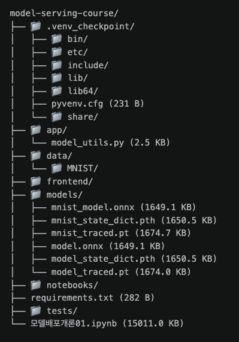
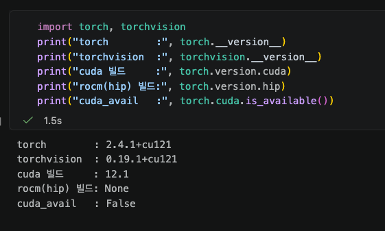
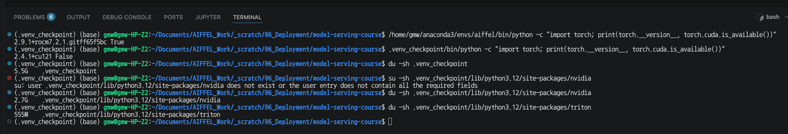

# DP01 — RESTful API & 모델 직렬화 실습 정리

모델 배포 기초 1일차. 노트북 `모델배포개론01.ipynb` 를 처음부터 끝까지 돌리고 정리한 것이다.

제출 요구 두 가지는 아래 1절과 2절에 있다.

| 절 | 내용 |
| --- | --- |
| 1 | 제출 항목 ① — 5.7절 프로젝트 최종 구조 캡처 |
| 2 | 제출 항목 ② — 섹션별 체크포인트 답변 (16문) |
| 3 | 실습 결과 — 학습 · 직렬화 검증 · 추론 속도 |
| 4 | 환경 구성 메모 — requirements.txt 가 담지 못하는 것 |
| 5 | 추가 실험 — trace 는 그때의 모드를 굳힌다 |
| 6 | 회고 |

3절부터는 노트북을 돌리며 확인한 것들이다. 노트북에도 내가 추가한 셀 다섯 개가 있다. trace 실험은 내용상 4장에 붙어서 4.6절 뒤에 두었고, 나머지 넷은 맨 뒤 **부록 A1~A4** 에 모아뒀다. 3~5절의 숫자는 전부 거기서 나온 것이다.

실습 환경은 이렇다.

- OS: Ubuntu 24.04.4
- 가상환경: `.venv_checkpoint` (시스템 파이썬 3.12.3 기반)
- 노트북 커널: 위 가상환경을 `ipykernel` 로 등록해서 사용
- 편집기: 맥에서 VS Code Remote-SSH 로 우분투에 붙어 작업
- 작업 폴더: `model-serving-course/` (내일 이후 노드에서도 계속 쓴다)

---

## 1\. 제출 항목 ① — 5.7절 프로젝트 최종 구조

노트북 5.7절 `show_tree(".")` 실행 결과다.



`models/` 안에 파일이 여섯 개인 이유는, 4장에서 랜덤 가중치 모델(`model_*`)로 한 번 연습하고 5장에서 학습한 MNIST 모델(`mnist_*`)로 다시 했기 때문이다.

`.venv_checkpoint/` 가 트리에 같이 찍혔다. `show_tree()` 의 제외 목록이 `.venv`, `.venv_test` 로 하드코딩되어 있는데 노트북 2.2절은 "여러분들의 고유한 가상환경 이름으로 만들어주세요"라고 해서, 내 이름은 그 목록에 안 걸렸다. 덕분에 가상환경까지 한 장에 같이 보인다.

---

## 2\. 제출 항목 ② — 섹션별 체크포인트 답변

### 1장 — 들어가며 (체크포인트 3문)

**Q1. `.pth` 파일만 전달했을 때, 상대방이 모델을 바로 사용할 수 없는 이유는?**

`.pth` 파일에는 모델의 가중치(Parameter) 정보만 저장되어 있기 때문이다. 모델을 실행하려면 프레임워크(PyTorch 등)의 환경이 일치해야 하며, 전후처리 로직과 모델의 구조(클래스)를 정의한 파이썬 코드가 반드시 함께 필요하다.

오늘 노트북에서 그 차이를 바로 봤다. 같은 커널 안에서 `state_dict` 쪽은 `SimpleClassifier` 를 먼저 만들어야 로드가 됐고, `torch.jit.load` 쪽은 클래스 없이 그냥 열렸다. 환경이 같아도 갈리는 문제라는 뜻이다.

**Q2. 모델 학습(Training)과 모델 배포(Serving)의 핵심 차이를 한 문장으로?**

모델 학습이 최적의 성능을 내는 '좋은 모델을 만드는 과정'이라면, 모델 배포는 완성된 모델을 코드를 모르는 일반 사용자도 쉽게 이용할 수 있도록 '서비스(API) 형태로 세상에 제공하는 과정'이다.

결정적인 차이는 성공의 기준이다. 학습은 "지표가 오르느냐", 배포는 "남의 환경에서 돌아가느냐". 오늘 테스트 정확도가 99.06% 나왔지만, `.pth` 하나만 넘기면 상대는 못 돌린다. 정확도와 실행 가능성은 별개다.

**Q3. 모델 배포에서 사용자와 서버가 소통하는 방식은?**

HTTP 통신을 기반으로 한 API(RESTful API) 방식으로 소통하고, JSON 이 그 매개체다.

모델의 가중치 파일은 서버 내부에 있고 네트워크로 나가지 않는다. 오가는 것은 JSON 뿐이다.

### 2장 — 환경 세팅 (체크포인트 3문)

**Q1. 가상환경 없이 `pip install` 을 하면 패키지가 어디에 설치되나? 그것이 왜 문제가 될 수 있나?**

가상환경 없이 설치하면 시스템 전역의 파이썬에 깔린다. 정확히는 그 파이썬의 `site-packages` 폴더다.

문제는 그 자리를 모든 프로젝트가 같이 쓴다는 점이다. 프로젝트마다 필요한 버전이 다르면 나중에 깐 쪽이 앞의 것을 덮어버리고, 덮인 쪽은 어느 날 갑자기 깨진다. 노트북 2.1절이 "간혹 발생하기 때문에 더 위험하다"고 한 게 이 얘기다.

이 컴퓨터만 봐도 그렇다. conda `aiffel` 환경에는 `torch 2.9.1+rocm7.2.1` 이 있고, 오늘 만든 venv 에는 `torch 2.4.1+cu121` 이 있다. 같은 torch 인데 가속기 빌드부터 다르다. 격리가 없었으면 한 컴퓨터에 둘 중 하나만 있을 수 있었다.

**Q2. `pip freeze` 로 생성한 파일과 직접 작성한 `requirements.txt` 의 차이는?**

`pip freeze` 는 설치된 패키지는 물론 그 패키지가 의존하는 하위 패키지들의 정확한 버전까지 모두 기록하므로 완벽한 환경 재현에 유리하지만 가독성이 낮다. 반면 직접 작성한 `requirements.txt` 는 프로젝트에 필수적인 핵심 패키지 목록만 관리하므로 사람이 읽고 파악하기 쉽다.

특히 개수 차이가 두드러진다. 오늘 `requirements.txt` 에 내가 적은 것은 9개인데, 실제로 설치된 것은 108개였다. 99개는 딸려온 것이다.

**Q3. 동료에게 프로젝트를 전달할 때, `.venv` 폴더 대신 무엇을 공유해야 하나?**

`requirements.txt` 파일을 공유해야 한다. `.venv` 폴더는 용량이 크고 각자의 운영체제에 종속적으로 생성되기 때문에 통째로 복사해서 전달하면 제대로 동작하지 않는다.

그런데 OS 종속보다 더 결정적인 이유가 있다. 경로 종속이다.

```
pyvenv.cfg    : /home/gmw/Documents/.../model-serving-course/.venv_checkpoint
bin/activate  : VIRTUAL_ENV=/home/gmw/Documents/.../.venv_checkpoint
bin/pip 첫 줄 : #!/home/gmw/Documents/.../.venv_checkpoint/bin/python3
```

스크립트마다 절대 경로가 박혀 있다. 다른 컴퓨터는커녕 이 컴퓨터 안에서 폴더 이름만 바꿔도 깨진다. 용량도 5.5GB 였다.

### 3장 — RESTful API (체크포인트 4문)

**Q1. 모델 추론 요청에 GET 이 아닌 POST 를 사용하는 이유는?**

모델 추론을 위해서는 모델에 넣을 입력 데이터(이미지, 텍스트 등)를 서버에 보내야 한다. GET 메서드는 요청 본문(body)이 없어 데이터를 URL 에 포함해야 하므로 복잡하거나 큰 데이터를 보내기 어렵지만, POST 메서드는 요청 본문에 JSON 형태 등으로 데이터를 넉넉하고 안전하게 담아 보낼 수 있기 때문이다.

**Q2. 상태 코드 `422` 는 어떤 상황에서 발생하나?**

클라이언트가 보낸 데이터가 형식은 갖췄는데 내용이 규약과 다를 때 발생한다. 400 과 헷갈리기 쉬운데 경계가 다르다.

```
400  요청 자체가 망가짐        JSON 문법이 깨져서 파싱조차 안 된다
422  파싱은 됐는데 내용이 틀림  필수 필드 누락, 타입 불일치, 값이 범위를 벗어남
```

둘을 구분해야 클라이언트가 "내가 잘못 보냈나, 서버가 고장났나"를 알 수 있다. 내일 진행한다고 알고 있는 FastAPI 는 Pydantic 으로 입력을 검사하고 규약과 안 맞으면 자동으로 422 를 돌려준다고 한다.(https://leapcell.io/blog/ko/fastapi-wa-pydantic-wonhamb-nh-yudae-gtaem-wihan-deiteo-jeongui). 노트북 3.7절 미리보기의 `class PredictRequest(BaseModel): text: str` 이 그 검사기 역할을 한다.

**Q3. `requests.post(url, json=data)` 에서 `json=` 파라미터는 내부적으로 어떤 일을 하나?**

파이썬 딕셔너리 형태의 `data` 를 JSON 문자열로 자동 변환(직렬화)해주며, HTTP 요청 헤더에 `Content-Type: application/json` 을 자동으로 설정하여 서버가 이 데이터가 JSON 임을 알 수 있게 해 준다.

실제로 보내는 요청을 열어보니 한 단계가 더 있었다. (노트북 부록 A3)

```
Content-Type : application/json
본문 타입     : <class 'bytes'>
본문         : b'{"flag": true, "value": null, "text": "\ud55c\uae00"}'
```

dict 에서 JSON 문자열로, 다시 바이트로 바뀐다. 네트워크로는 바이트만 나갈 수 있기 때문이다. 한글은 `\ud55c\uae00` 처럼 이스케이프되어 나가는데, 이것도 유효한 JSON 이라 서버가 풀면 그대로 "한글"이 된다. 노트북 3.5절은 한글을 다룰 때 `ensure_ascii=False` 를 "반드시" 쓰라고 하지만 `requests` 의 `json=` 은 그 옵션을 줄 수 없고 기본값이 True 다. 사람이 읽기 편하라고 쓰는 옵션이지 안 쓴다고 깨지는 것은 아니었다.

**Q4. Python 의 `True` 는 JSON 에서 어떻게 표현되나?**

첫 글자가 소문자인 `true` 로 표현된다. 위 출력의 `"flag": true` 가 그것이고, `None` 은 `null` 이 된다.

### 4장 — 모델 직렬화 (체크포인트 4문)

**Q1. `state_dict` 로 저장한 `.pth` 파일을 불러올 때, 모델 클래스 정의가 필요한 이유는?**

`state_dict` 로 저장한 `.pth` 파일에는 모델의 각 레이어에 대한 가중치(파라미터 숫자 값)만 딕셔너리 형태로 저장되어 있을 뿐, 모델의 구조(어떤 레이어가 어떤 순서로 연결되는지)에 대한 코드는 없기 때문이다. 가중치를 제자리에 매핑하려면 뼈대가 되는 모델 클래스가 반드시 필요하다.

**Q2. `torch.jit.trace` 와 `torch.jit.script` 는 각각 어떤 상황에서 사용하나?**

노트북은 모델에 `if/else` 분기가 없으면 trace, 있으면 script 를 쓰라고 안내한다. 그런데 5절에서 직접 해보니 그 기준만으로는 부족했다.

내가 쓴 `SimpleClassifier` 에는 `if` 가 한 글자도 없는데 `nn.Dropout` 안에 "지금 학습 중인가"를 보는 분기가 숨어 있었다. train 모드에서 trace 하니 그 값이 상수로 굳어서, 나중에 `.eval()` 을 불러도 드롭아웃이 안 꺼졌다. script 로 만든 쪽은 `.eval()` 이 먹었다.

그래서 이렇게 정리했다.

```
trace    추론 전용으로 내보낼 때. 반드시 model.eval() 을 부른 뒤에 trace 한다.
         한 번 굳으면 나중에 모드를 못 바꾼다.
script   입력에 따라 연산 경로가 달라지는 모델이거나, 저장한 뒤에도 모드를 바꿔야 할 때.
         대신 지원되지 않는 파이썬 문법에서 에러가 날 수 있다.
```

"내 코드에 `if` 가 없다"는 trace 를 써도 된다는 근거가 못 된다. 분기는 라이브러리 레이어 안에 있다.

**Q3. ONNX 의 가장 큰 장점은 무엇이며, 어떤 상황에서 선택해야 하나?**

가장 큰 장점은 프레임워크와 언어에 독립적이라는 것이다. PyTorch 로 만든 모델을 TensorFlow 쪽 환경이나 TensorRT, OpenVINO 같은 최적화 엔진에서 돌릴 수 있고, 실행도 파이썬 말고 C++ · C# · Java 에서 가능하다.(https://onnxruntime.ai/)

선택 기준은 "모델 파일 말고 무엇을 같이 보내야 하는가"로 잡는 게 맞다고 생각한다.

```
state_dict   .pth   + 모델 클래스 코드 + Python + PyTorch
TorchScript  .pt    + PyTorch 또는 libtorch
ONNX         .onnx  + ONNX Runtime          <- PyTorch 자체가 없어도 된다
```

그러니 배포 대상이 파이썬 환경이 아니거나, 그쪽 프레임워크 버전을 내가 통제할 수 없을 때 ONNX 를 고른다.

속도는 직접 재봤다(3절). 배치 8장 50회 반복에서 state_dict 0.49ms, TorchScript 0.43ms, ONNX 0.44ms 로 사실상 같았다. 노트북은 ONNX Runtime 이 "매우 빠른 추론 속도를 제공한다"고 하는데, 적어도 이 42만 파라미터짜리 모델에서는 차이가 없었다. 속도를 이유로 ONNX 를 고르려면 내 모델에서 먼저 재보는 게 맞겠다.

**Q4. `torch.onnx.export()` 에서 `dynamic_axes` 를 지정하지 않으면 어떤 문제가 생길 수 있나?**

모델의 입력 크기(특히 배치 사이즈)가 고정(예: `batch_size=1`)되어 버린다. 실제 배포 환경에서는 요청에 따라 한 번에 1개, 4개, 8개 등 다양한 배치 크기로 추론을 해야 할 수 있는데, `dynamic_axes` 를 지정하지 않으면 지정된 크기가 아닌 입력이 들어왔을 때 유연하게 대응하지 못하고 에러가 발생하게 된다.

### 5장 — 마치며 (앞 장과 겹치지 않는 2문)

노트북 "마치며"의 Q1~Q8 은 위 1~4장 체크포인트와 같은 질문이라 여기서는 겹치지 않는 두 개만 답한다.

**Q9. 모델 저장 전에 `model.eval()` 을 호출해야 하는 이유는?**

모델 내부에 있는 Dropout 이나 BatchNorm 같은 특정 레이어들이 학습(Training) 모드와 추론(Evaluation/Serving) 모드에서 서로 다르게 동작하기 때문이다. 배포를 위해 모델을 저장할 때는 실전 환경에 맞춰 일관되고 안정적인 추론 결과를 내야 하므로, 반드시 사전에 `model.eval()` 을 호출하여 평가 모드로 전환한 뒤 저장(직렬화)해야 한다.

오늘 숫자로도 확인했다. Dropout 이 켜진 채 잰 학습 정확도는 98.2% 였고, `model.eval()` 로 끄고 잰 테스트 정확도는 99.06% 였다. 그리고 5절 실험에서 본 것처럼 TorchScript 로 trace 할 때는 이걸 빠뜨리면 나중에 되돌릴 수도 없다.

**Q10. `predict()` 함수를 별도 모듈로 분리한 이유는?**

이후에 만들 FastAPI 웹 서버(API 엔드포인트) 코드에서 추론 로직을 쉽게 `import` 하여 연결하고 재사용하기 위함이다. 서버의 통신을 담당하는 API 백엔드 코드와 순수 모델 추론 코드를 모듈로 분리해두면, 코드가 깔끔해지고 유지보수가 훨씬 용이해질 것 같다.

---

## 3\. 실습 결과 — 학습 · 직렬화 검증 · 추론 속도

MNIST 를 3에폭 학습했다. CPU 로 돌렸다.

```
학습 정확도   93.5% -> 97.7% -> 98.2%   (에폭 진행 중 누적 평균)
테스트 정확도 99.06%  (9906 / 10000)
```

테스트 정확도가 학습 정확도보다 높게 나왔는데 이상한 게 아니다. 학습 정확도는 에폭이 도는 중간중간의 누적 평균이라 덜 배운 초반이 섞여 있고, 무엇보다 학습 중에는 Dropout 이 켜져 있어 뉴런 절반을 끈 상태로 맞힌 성적이다. 평가할 때는 `model.eval()` 로 껐다.

노트북은 `test_loader` 를 만들어놓고 평가를 하지 않는다. 테스트 정확도 셀은 내가 따로 넣었다.

### 세 방식으로 저장하고 복원 검증

```
방식                 파일 크기      복원 후 예측    원본과 일치
state_dict (.pth)   1650.5 KB     7             True
TorchScript (.pt)   1674.7 KB     7             True
ONNX (.onnx)        1649.1 KB     7             True
```

배치 8장으로도 확인했고 세 방식 모두 8장 전부 일치했다.

파일 크기가 셋 다 비슷한 게 처음엔 이상했다. 구조까지 담는 쪽이 더 클 줄 알았는데 아니었다. 파라미터를 세어보니 421,642개였고, float32 니까 `421,642 x 4바이트 = 약 1,647 KB` 다. **세 파일의 99%가 똑같은 숫자 덩어리**이고 구조 정보는 몇 KB 짜리 명세일 뿐이었다. 그러니 셋을 고르는 기준은 파일 크기가 아니다.

### 추론 속도도 재봤다

노트북은 ONNX Runtime 이 "매우 빠른 추론 속도를 제공한다"고 하는데, 실제로 얼마나 빠른지는 안 나와 있어서 직접 쟀다. 배치 8장, 워밍업 1회 후 50회 반복이다.

```
state_dict  : 0.49 ms  (표준편차 0.04)
TorchScript : 0.43 ms  (표준편차 0.03)
ONNX        : 0.44 ms  (표준편차 0.82)
```

**이 모델에서는 세 방식의 속도가 사실상 같았다.** state_dict 와 TorchScript 의 차이는 0.06ms 인데 표준편차가 0.03~0.04 라 의미를 두기 어렵다. ONNX 는 표준편차가 평균보다 커서 50회 중 몇 번이 크게 튀었다는 뜻이고, 이런 경우 평균을 대표값으로 쓰면 안 된다.

파라미터 42만개짜리 작은 모델이라 연산보다 파이썬 호출 오버헤드가 시간을 지배해서 그런 것으로 보인다. ONNX Runtime 의 이점은 더 큰 모델이나 하드웨어 최적화 엔진과 붙일 때 나올 것 같다.

---

## 4\. 환경 구성 메모 — requirements.txt 가 담지 못하는 것

노트북의 `requirements.txt` 에는 `torch>=2.1.0,<2.5.0` 이라고만 적혀 있다. 이걸 그대로 설치했더니 기존 conda 환경과 결과가 갈렸다.





```
                        기존 conda 환경        새로 만든 venv
torch                   2.9.1+rocm7.2.1      2.4.1+cu121
torch.version.cuda      없음                  12.1
torch.version.hip       있음                  None
cuda_avail              True                 False
```

이 컴퓨터는 AMD GPU 라서 평소에는 ROCm 빌드를 쓴다. ROCm 빌드는 CUDA API 를 흉내 내도록 만들어져 있어서 AMD 인데도 `cuda_avail` 이 True 로 나온다. 그런데 새 venv 에는 PyPI 기본 휠인 NVIDIA 빌드가 깔렸고, 이 컴퓨터엔 NVIDIA GPU 가 없으니 False 가 됐다.

용량도 재봤다.

```
.venv_checkpoint 전체                    5.5 GB
그중 nvidia/ 폴더                        2.7 GB   (nvidia-* 패키지 12개)
그중 triton/ 폴더                        555 MB
```

**약 3.3GB 가 이 컴퓨터에서 영원히 쓰이지 않을 NVIDIA 전용 파일이다.**

`requirements.txt` 는 파이썬 패키지의 이름과 버전까지만 고정한다. 어느 가속기 빌드를 받을지는 담기지 않는다. 노트북이 "나머지 절반은 Docker 가 해결한다"고 한 그 나머지 절반을 직접 밟은 셈이다.

오늘 실습에는 GPU 가 필요 없어서 CPU 로 그대로 진행했다. 배포 서버에는 GPU 가 없는 경우가 많고, 노트북도 저장 전에 `model.cpu()` 로 옮기는 등 그 전제로 쓰여 있다.

### 그 뒤에 한 것 — venv 를 ROCm 휠로 바꿨다

위 내용을 정리하다 "그럼 언젠가 GPU 를 쓸 때는 어떻게 하나"가 걸려서, 실습을 마친 뒤 환경을 바꿔봤다.

먼저 짚고 갈 것이 있다. **아무 ROCm 휠이나 되는 게 아니다.** 예전에 이 GPU 에서 겪은 일인데,
PyTorch 공식 인덱스(`download.pytorch.org/whl/rocm*`)의 휠은 gfx1151 용 코드가 안 구워져 있어서
연산을 시키면 죽는다. 그런데 `torch.cuda.is_available()` 은 True 로 나오고 GPU 이름도 제대로 뜬다.
**속고 나서 한참 뒤에 안다.** 그래서 AMD 자체 저장소의 휠을 써야 한다.

```
repo.radeon.com/rocm/manylinux/rocm-rel-7.2.1/
  torch       2.9.1+rocm7.2.1.lw.gitff65f5bc
  torchvision 0.24.0+rocm7.2.1.gitb919bd0c
  triton      3.5.1+rocm7.2.1.gita272dfa8
```

여기서도 함정이 하나 있었다. **torch 휠이 triton 을 빌드 해시까지 못박아둔다.** 같은 `3.5.1` 이라도
해시가 다른 것을 집으면 `ResolutionImpossible` 로 설치가 거부된다. 세 개를 한 번에 넘겨야 한다.

바꾼 뒤에는 `is_available()` 만 보면 안 되니까 관문을 나눠서 확인했다.

```
1차  torch.cuda.get_arch_list() 에 gfx1151 이 있나   -> 있음 (총 11개 중)
     없으면 GPU 연산에서 그냥 죽는다
2차  Conv2d 가 도는가 (MIOpen conv 커널)             -> 정상
     matmul 은 되는데 conv 에서 죽는 경우가 있었다
검증 같은 입력에 CPU 와 GPU 결과가 같은가            -> 예측 일치, 최대 차이 5.72e-06
```

2차 관문이 이 프로젝트에서는 특히 중요했다. 오늘 만든 모델이 `Conv2d` 두 개짜리 CNN 이라,
matmul 만 되고 conv 가 안 되면 정작 이 모델에서 GPU 를 못 쓴다.

용량은 5.5GB 에서 4.9GB 로 **0.6GB 밖에 안 줄었다.** 처음엔 NVIDIA 파일 3.3GB 가 사라지니
그만큼 줄 거라 생각했는데 아니었다. NVIDIA 쪽은 라이브러리를 `nvidia-*` 라는 별도 패키지 12개로
떼어놓고, ROCm 쪽은 그걸 `torch/lib/` 안에 넣어둔다. 그래서 `nvidia/` 폴더가 사라진 자리에
`torch/` 가 1.6GB 에서 3.1GB 로 불어난다. **자리만 옮긴 셈이다.**

정리하면 목적에 따라 답이 갈린다.

```
용량을 줄이고 싶다   ->  CPU 휠 (--index-url .../whl/cpu). 1GB 안쪽으로 떨어진다
GPU 를 쓰고 싶다     ->  AMD 저장소의 ROCm 휠. 용량은 거의 그대로다
```

> 위 3~5절의 숫자와 노트북 부록 A1~A4 의 출력은 **바꾸기 전(CUDA 휠) 상태**에서 잰 것이다.
> 이 절은 그 다음에 한 일이다.

### 그밖에 밟은 것들

- **우분투 시스템 파이썬에는 `ensurepip` 이 없다.** 노트북은 "Python 3.3 이상에는 venv 가 내장되어 있어 별도 설치 없이 바로 사용할 수 있다"고 하는데, 데비안 계열은 표준 라이브러리를 쪼개놔서 `apt install python3.12-venv` 를 먼저 해야 했다.
- **conda base 가 켜진 셸에서 `python3 -m venv` 를 하면 아나콘다 파이썬 위에 만들어진다.** `pyvenv.cfg` 의 `home` 이 `/home/gmw/anaconda3/bin` 으로 찍혀 있어서 알았다. 격리하려고 만든 환경이 정작 격리하려던 것 위에 얹힌 셈이라, `/usr/bin/python3` 로 전체 경로를 박아 다시 만들었다.
- **노트북에서 패키지를 깔 때는 `!pip` 가 아니라 `%pip` 를 써야 한다.** 느낌표는 셸을 거치는데, 그 셸의 PATH 는 주피터를 띄운 환경 것이라 커널과 다른 곳에 깔릴 수 있다.
- **`%%writefile` 은 셀의 첫 줄이어야 한다.** 노트북 셀 맨 위에 주석이 한 줄 있어서 그대로 돌리면 SyntaxError 가 난다. "이 주석을 지우고 실행하세요"가 진짜 지시였다.

---

## 5\. 추가 실험 — trace 는 그때의 모드를 굳힌다

노트북 4.4절은 "모델에 if/else 분기가 없다면 trace 를 사용한다"고 안내한다. 내가 쓴 `SimpleClassifier` 에는 `if` 가 한 글자도 없으니 안전하겠다고 생각했는데, 확인해보니 아니었다. 분기는 `nn.Dropout` 안에 숨어 있었다.

```python
model.train();  t_train = torch.jit.trace(model, dummy_input)
model.eval();   t_eval  = torch.jit.trace(model, dummy_input)
t_train.eval(); t_eval.eval()          # 둘 다 나중에 eval 을 불러본다
```

같은 입력을 두 번씩 넣어 결과가 흔들리는지 봤다(노트북 4.6절 뒤 "추가 실험" 셀). Dropout 이 켜져 있으면 매번 다른 뉴런을 끄니까, 두 번의 결과가 다르면 아직 켜져 있다는 뜻이다.

```
train 모드로 trace -> 두 번 동일 : False    <- .eval() 을 불렀는데도 안 먹었다
eval  모드로 trace -> 두 번 동일 : True
script(train)      -> 두 번 동일 : False
script 에 .eval() 부른 뒤        : True    <- 이쪽은 먹었다
```

`trace` 는 실행 경로를 따라가며 기록하는 방식이라, 그때의 "학습 중인가" 값이 상수로 굳는다. 나중에 `.eval()` 로 스위치를 내려도 그 스위치를 읽는 코드 자체가 기록에 없다. `script` 는 파이썬 코드를 컴파일하므로 실행할 때마다 그 값을 읽는 코드가 남아서 반영된다.

무서운 건 이게 에러를 안 낸다는 점이다. train 모드로 trace 한 모델을 배포해도 서버는 뜨고 응답도 온다. 다만 같은 이미지를 두 번 보내면 다른 답이 나오고 정확도가 조금 낮다. 검증하지 않으면 모른다.

정리하면 이렇다.

```
1. trace 전에는 반드시 model.eval()
2. traced 모델은 나중에 모드를 못 바꾼다 -> 추론 전용으로만
3. 학습을 재개할 거면 traced 말고 state_dict
```

---

## 6\. 회고

오늘 제일 많이 잡아먹은 건 모델도 API 도 아니고 **PATH** 였다. 그것도 같은 원인이 하루에 세 번, 얼굴만 바꿔서 나왔다.

```
1) conda base 가 켜진 셸에서 venv 를 만들었더니 아나콘다 파이썬 위에 지어졌다
2) 노트북에서 !pip 를 쓰면 커널이 아닌 다른 환경에 깔릴 뻔했다
3) conda run -n aiffel python 이 venv 의 파이썬을 실행했다
```

셋 다 "셸은 PATH 를 앞에서부터 뒤져 처음 만난 것을 실행한다"는 한 가지 규칙이었다.  
1번은 파일에 흔적이 남아서 알았고 2번은 미리 피했는데, **3번은 에러 없이 그럴듯한 숫자를 뱉었다.**  
두 환경을 비교한 캡처를 찍었는데 사실은 같은 환경을 두 번 찍은 것이었다. 하마터면 그대로 근거로 쓸 뻔했다. 전체 경로를 박아서 다시 찍었다.

그리고 노트북을 그대로 따라가면 막히는 자리가 생각보다 많았다. `ensurepip` 부재, `%%writefile` 앞의 주석, `!pip`, `show_tree()` 의 하드코딩된 제외 목록, 만들어만 두고 안 쓰는 `test_loader`.  
자료가 부실하다기보다 **문서가 상정한 환경과 내 환경이 다르기때문**이다. 오늘 배운 게 또 정확히 그 내용이다.

직렬화 세 방식은 처음엔 크기나 속도로 고르는 건 줄 알았다. 그런데 재보니 셋 다 1.6MB 언저리에 0.5ms 언저리였다.  
둘 다 기준이 못 됐다. 남는 기준은 **모델 파일 말고 무엇을 같이 보내야 하는가** 하나였다. 이건 직접 재보고 알게 되었다.

아쉬운 건 ONNX 속도 측정이다. 표준편차가 평균보다 큰 걸 보고 중앙값으로 다시 재려다 다음으로 미뤄뒀다. 큰 모델에서 다시 재보고 싶다.

내일은 FastAPI 다. 오늘 만든 `app/model_utils.py` 를 서버가 `import` 하게 될것으로 예상한다.  
모델 로드를 엔드포인트 함수 안에 넣지 않도록 조심하는 부분을 미리 짚어본다.  
요청마다 디스크에서 파일을 다시 읽게 되는데, 이것도 에러는 안 나고 느려지기만 할 것 같다.
