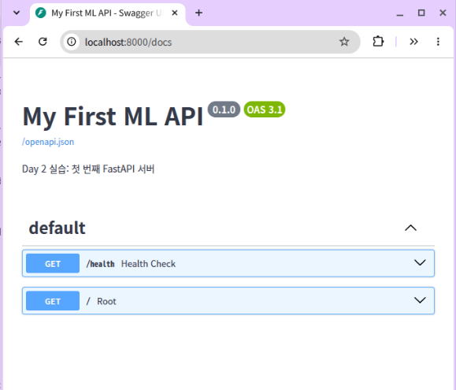
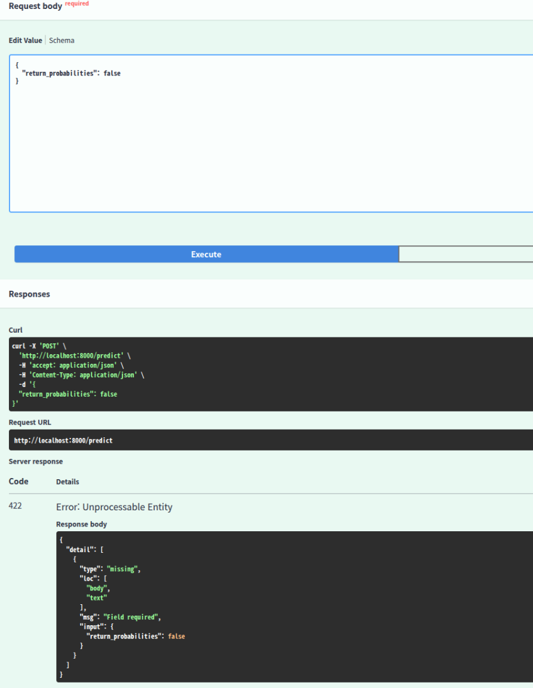
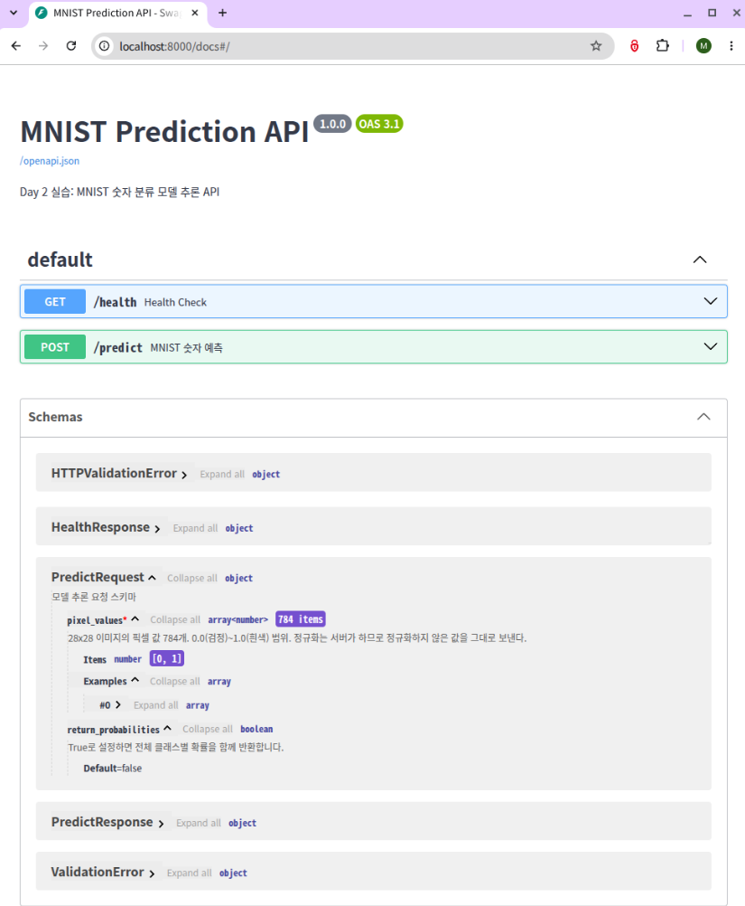

# DP02 — FastAPI 기초와 데이터 처리 실습 정리

모델 배포 기초 2일차. 노트북 `모델배포개론02.ipynb` 를 돌리고 정리한 것이다.
어제 파일로 저장해둔 모델을, 오늘 HTTP 요청으로 부를 수 있게 만들었다.

제출 요구 네 가지는 1절부터 4절까지에 있다.

| 절 | 내용 |
| --- | --- |
| 1 | 제출 항목 1 — 1.5절 최소 서버 실행 |
| 2 | 제출 항목 2 — 2장, 3장 셀 출력 |
| 3 | 제출 항목 3 — 5장 모델 추론 엔드포인트 |
| 4 | 제출 항목 4 — 섹션별 체크포인트 답변 (20문) |
| 5 | 내가 고친 곳 — 설명에 적힌 값과 실제로 보내는 값이 달랐다 |
| 6 | 추가로 재본 것 — async 로 감쌌더니 네 배 느려졌다 |
| 7 | 하다가 막혔던 것들 |
| 8 | 회고 |

5절과 6절은 노트북을 돌리다 이상한 걸 발견해서 따로 재본 것이다.
노트북 원본도 그에 맞춰 고쳤고, 어디를 고쳤는지는 노트북 맨 앞 마크다운 셀에도 적어뒀다.

실습 환경은 어제와 같다.

- OS: Ubuntu 24.04.4
- 가상환경: `.venv_checkpoint` (시스템 파이썬 3.12.3 기반)
- 패키지: fastapi 0.115.0 / uvicorn 0.30.0 / pydantic 2.13.4 / torch 2.9.1+rocm7.2.1
- 편집기: 맥에서 VS Code Remote-SSH 로 우분투에 붙어 작업
- 작업 폴더: `model-serving-course/` (어제 만든 것 그대로 이어서 씀)

---

## 1\. 제출 항목 1 — 1.5절 최소 서버 실행

노트북 1.5절에서 `app/main_basic.py` 를 만들고 `serve_in_thread` 로 띄운 결과다.



엔드포인트가 `/health` 와 `/` 두 개뿐이고, 문서 제목이 `main_basic.py` 에 적은
`title="My First ML API"` 그대로 나온다. 내가 코드에 쓴 문자열이 화면에 그대로 나타나는 걸
처음 확인한 지점이다.

서버 접속은 맥에서 안 되고 RDP 로 우분투 데스크톱에 붙어서 했다.
VS Code 의 자동 포트 포워딩이 안 잡혔는데, 노트북 헬퍼가 `log_level='warning'` 으로 서버를 띄워서
uvicorn 이 찍는 `Uvicorn running on http://127.0.0.1:8000` 이 INFO 레벨이라 안 나오기 때문이다.
VS Code 는 터미널 출력에서 주소를 찾아 포워딩하는데 찾을 단서가 없었던 것이다.
에러가 나는 게 아니라 그냥 아무 일도 안 일어나서, 한참 브라우저만 새로고침했다.

---

## 2\. 제출 항목 2 — 2장, 3장 셀 출력

### 2장 — Path, Query, Body 세 가지 파라미터

`app/main_params.py` 에 엔드포인트를 하나씩 이어붙여 만들었다.
전부 만든 뒤 `/openapi.json` 으로 확인한 결과다.

```
title: Parameter Examples
  GET   /models/{model_name}          (2.2 Path)
  GET   /predictions/{prediction_id}  (2.2 Path + int 타입 지정)
  GET   /models                       (2.3 Query)
  POST  /predict                      (2.4 Request Body)
```

세 방식이 실제로 어떻게 구분되는지는 일부러 틀린 값을 보내보면 바로 보인다.
422 응답의 `loc` 첫 번째 값이 FastAPI 가 어디를 뒤졌는지 알려준다.

```
POST /predict   에서 text 를 빼고 보냄
  {"type":"missing",     "loc":["body","text"],           "msg":"Field required"}

GET /predictions/abc    (int 자리에 글자)
  {"type":"int_parsing", "loc":["path","prediction_id"],  "input":"abc"}

GET /models?limit=abc   (int 자리에 글자)
  {"type":"int_parsing", "loc":["query","limit"],         "input":"abc"}
```

`body`, `path`, `query`. 2장에서 배운 세 가지가 그대로 나온다.
FastAPI 는 어디서 값을 꺼낼지 내가 안 써줘도 함수 인자의 이름과 타입을 보고 알아서 정하는데,
그렇게 정한 결과가 여기 그대로 나온다.

### 3장 — Swagger UI

브라우저에서 `http://localhost:8000/docs` 로 접속했다.



`text` 를 지우고 `{"return_probabilities": false}` 만 보낸 결과다.
Swagger UI 가 내가 누른 요청을 `curl` 명령으로도 같이 보여주는데,
이걸 그대로 복사하면 터미널에서 똑같이 재현할 수 있다.

노트북 셀에 남은 출력도 같은 것을 보여준다.

```
상태: 200, 응답: {'prediction_id': 42, 'label': '긍정', 'confidence': 0.92}
상태: 422
에러: {'detail': [{'type': 'int_parsing', 'loc': ['path', 'prediction_id'],
       'msg': 'Input should be a valid integer, unable to parse string as an integer',
       'input': 'abc'}]}

기본 응답: {'label': '긍정', 'confidence': 0.92, 'probabilities': None}
확률 포함: {'label': '긍정', 'confidence': 0.92,
           'probabilities': {'긍정': 0.92, '부정': 0.05, '중립': 0.03}}

상태: 422 / 에러: Field required
상태: 422 / 에러: Input should be a valid string
```

422 를 볼 때 한 번 헷갈렸다. `Try it out` 을 누르기 전에도 화면 아래쪽 `Responses` 칸에
422 예시가 이미 나와 있는데, 그게 이렇게 생겼다.

```json
{"detail":[{"loc":["string",0],"msg":"string","type":"string"}]}
```

`"string"` 과 `0` 은 값이 아니라 타입 이름이다. 서버가 보낸 게 아니라
Swagger UI 가 스키마를 읽어서 틀만 그려준 문서다.
실제 응답은 `Execute` 를 눌러야 위쪽에 `Server response` 로 새로 생긴다.
사람이 읽을 수 있는 문장(`Field required`)이 들어 있으면 진짜고,
`"string"` 이 보이면 문서다.

### 3장에서 제일 중요했던 것 — 문서는 코드에서 계산된다

노트북 3.4절이 "문서가 코드에서 자동 생성되는 원리"인데,
`/openapi.json` 을 직접 열어보니 자동 생성이라는 게 한 종류가 아니었다.

내가 쓴 코드는 이것뿐인데,

```python
class PredictRequest(BaseModel):
    text: str
    return_probabilities: bool = False
```

문서에는 이렇게 들어가 있었다.

```json
{
  "type": "object",
  "properties": {
    "text": { "type": "string", "title": "Text" },
    "return_probabilities": { "type": "boolean", "default": false }
  },
  "required": ["text"]
}
```

`"required": ["text"]` 라는 문장은 내 소스 어디에도 없다.
FastAPI 가 "text 에는 등호 뒤에 값이 없으니 필수" 라고 판단해서 만들어낸 것이다.
`str` 이 `"type": "string"` 이 된 것도, `text` 가 `"Text"` 가 된 것도 계산 결과다.

반면 엔드포인트의 `description` 은 내가 쓴 docstring 이 줄바꿈까지 그대로 복사돼 있었고,
`summary` 는 `"Predict"` 였는데 이건 코드에 없는 문자열이라 함수 이름 `def predict` 에서 만들어낸 것이다.

이게 꽤 중요한 포인트다. 만약 그냥 문서를 복사해 오는 방식이라면
나중에 코드를 고쳤을 때 문서만 옛날 버전으로 남을 수 있다.
하지만 애초에 코드에서 계산해서 뽑아내는 거라면 애당초 어긋날 일이 없다.
"코드와 자동 동기화"라는 말이 이 얘기였다.

---

## 3\. 제출 항목 3 — 5장 모델 추론 엔드포인트

어제 저장한 `models/mnist_state_dict.pth` 를 불러와 `/predict` 로 연결했다.



`PredictRequest` 를 펼치면 `pixel_values` 가 `array<number>` 에 `784 items` 이고
`Items number [0, 1]` 로 값의 범위까지 붙어 있다.
이 범위 제약은 원본에 없던 것이고 내가 고쳐 넣은 것이다. 자세한 건 아래 5절에 적었다.

노트북 5.6절 셀 출력이다.

```
상태 코드: 200
응답: {'status': 'healthy', 'model_loaded': True}

이미지 크기: torch.Size([1, 28, 28])
정답 레이블: 7
픽셀 값 개수: 784
실제 픽셀 값 범위: 0.0000 ~ 1.0000

상태 코드: 200
응답:
{
  "label": 7,
  "confidence": 1.0,
  "probabilities": null,
  "model_version": "1.0.0"
}

이미지      정답     예측     확신도
---------------------------------------------
  #0     7      7      1.0
  #1     2      2      1.0
  #2     1      1      1.0
  #3     0      0      0.9999
  #4     4      4      0.9996
  #5     1      1      1.0
  #6     4      4      0.9996
  #7     9      9      0.9998
  #8     5      5      0.9987
  #9     9      9      1.0

정확도: 10/10 (100%)
```

`실제 픽셀 값 범위: 0.0000 ~ 1.0000` 이 문서에 적힌 범위와 이제 일치한다.
고치기 전에는 여기가 `-0.4242 ~ 2.8215` 였다.

서버에 직접 요청을 보내 에러 상황까지 확인한 결과다.

```
/health -> {'status': 'healthy', 'model_loaded': True}

테스트 이미지 정답 = 7
[200] 정상 (0~1 raw 784개)          -> label=7  conf=1.0
[422] 정규화해서 보냄                  -> greater_than_equal at ['body','pixel_values',0]
[200] 예시값 전부 0.0                 -> label=0  conf=0.1162
[422] 개수 부족 (100개)               -> too_short at ['body','pixel_values']

  이미지 0: 정답 7 / 예측 7 / 확신도 1.0
  이미지 1: 정답 2 / 예측 2 / 확신도 1.0
  이미지 2: 정답 1 / 예측 1 / 확신도 1.0
  이미지 3: 정답 0 / 예측 0 / 확신도 0.9999
  이미지 4: 정답 4 / 예측 4 / 확신도 0.9996
  이미지 5: 정답 1 / 예측 1 / 확신도 1.0
  이미지 6: 정답 4 / 예측 4 / 확신도 0.9996
  이미지 7: 정답 9 / 예측 9 / 확신도 0.9998
  이미지 8: 정답 5 / 예측 5 / 확신도 0.9987
  이미지 9: 정답 9 / 예측 9 / 확신도 1.0

10장 중 10장 정답
```

세 번째 줄이 좀 걸린다. 픽셀을 전부 0.0 으로 채워 보내면 그건 아무 그림도 아닌데
`label=0` 을 확신도 0.1162 로 돌려준다. 그런데도 상태 코드는 200 이다.
값의 범위는 막아뒀지만 "이게 진짜 숫자 그림이 맞나"는 아무도 안 보기 때문이다.
이건 스키마로 막을 수 있는 문제가 아닌 것 같아서 일단 알고만 있기로 했다.

---

## 4\. 제출 항목 4 — 섹션별 체크포인트 답변

### 1장 — FastAPI 개론 (4문)

**Q1. FastAPI 가 Flask 보다 모델 배포에 적합한 이유 세 가지는?**

첫째로 데이터 검증을 알아서 해준다는 점이다. Pydantic 덕분에 데이터 타입이나 조건만 적어두면,
알아서 잘못된 값을 쳐내고 어디가 틀렸는지 422 에러로 짚어준다.
굳이 수동으로 검증 코드를 짤 필요가 없어서 편했다.

둘째로 API 문서가 자동으로 만들어진다. 타입 힌트랑 Pydantic 모델, docstring 만 써두면
문서가 알아서 생기니까 따로 쓰거나 고칠 일이 없다.

그리고 비동기 처리가 된다는 것도 큰 장점이다. ASGI 기반이다 보니
I/O 대기 시간이 긴 작업들이 들어올 때 요청을 겹쳐서 처리하기 좋다.

다만 세 번째는 좀 조심해야 한다. 여기서 겹칠 수 있는 건 I/O 대기 시간이지 CPU 계산이 아니다.
모델 추론은 CPU 를 붙잡는 작업이라 `async def` 로 감싸면 오히려 느려진다.
직접 재봤더니 1초짜리 작업 네 개를 동시에 보낼 때 `def` 는 1.01초, `async def` 는 4.01초였다.
그래서 오늘 만든 `/predict` 도 `async def` 가 아니라 `def` 로 두었다. 자세한 건 6절에 적었다.

**Q2. Uvicorn 의 역할은 무엇이며 왜 FastAPI 와 함께 쓰는가?**

Uvicorn 은 ASGI 서버로, 클라이언트의 HTTP 요청을 받아 FastAPI 앱에 전달하고
응답을 돌려주는 문지기 역할이다.
FastAPI 자체에는 네트워크 요청을 직접 받는 기능이 없어서 반드시 짝으로 써야 한다.

오늘 이 둘이 다르다는 걸 몸으로 알았다. 노트북 안에서 띄운 서버는
주피터 커널 프로세스 안의 스레드로 돌기 때문에, 노트북을 닫으니까 서버도 같이 죽었다.
그런데 이틀 전에 터미널에서 띄워둔 uvicorn 은 별도 프로세스라 이틀 내내 살아 있었다.
같은 uvicorn 인데 어디에 담겨 있느냐에 따라 수명이 달랐다.

**Q3. `@app.get("/health")` 에서 `get` 과 `"/health"` 는 각각 무엇을 뜻하는가?**

`get` 은 HTTP 메서드 중 GET 을 뜻하고, 데이터를 조회하거나 서버 상태를 확인할 때 쓴다.
`"/health"` 는 엔드포인트의 URL 경로로, 클라이언트가 접속하는 주소다.

**Q4. FastAPI 에서 dict 를 반환하면 무슨 일이 자동으로 일어나는가?**

반환한 파이썬 딕셔너리가 자동으로 JSON 으로 변환되어 응답으로 나간다.
`json.dumps()` 를 직접 부를 필요가 없다.

### 2장 — Path, Query, Body (4문)

**Q5. `/models/sentiment-v1` 에서 `sentiment-v1` 은 어떤 파라미터인가?**

Path 파라미터다. URL 경로의 일부로 들어가서 특정 리소스를 식별할 때 쓴다.

**Q6. `/models?status=running&limit=5` 에서 `status` 와 `limit` 은?**

Query 파라미터다. URL 뒤에 물음표와 함께 `key=value` 형태로 붙고
`&` 로 여러 개를 연결하며, 검색이나 필터링, 개수 제한 조건에 쓴다.

**Q7. 모델 추론 요청에 Request Body 를 쓰는 이유는?**

1) 추론에 필요한 입력(픽셀 784개, 긴 텍스트, 추론 옵션 등)은 URL 길이 제한이 있는
   Path 나 Query 에 담기에 너무 크고 구조도 복잡하다.

2) Body 를 쓰면 중첩된 JSON 구조를 그대로 보낼 수 있다.

3) 관례상 GET 요청에는 본문을 담지 않고, 서버에 데이터를 넘겨 처리를 요청할 때는
   POST 와 Request Body 를 짝으로 쓴다.

**Q8. FastAPI 는 파라미터가 Path, Query, Body 중 어디서 오는지 어떻게 판별하는가?**

데코레이터의 경로와 함수 인자의 타입 힌트를 보고 정한다.

- 데코레이터 경로에 `{이름}` 으로 들어 있으면 Path
- 타입이 Pydantic 모델이면 Request Body
- 경로에 없고 기본 타입(str, int, bool 등)이면 Query

필요하면 `Path()`, `Query()`, `Body()` 를 기본값 자리에 넣어 명시적으로 지정할 수도 있다.

스프링은 `@PathVariable`, `@RequestParam` 처럼 애노테이션으로 선언해야 하는데
FastAPI 는 안 써도 추론한다. 편한 대신 내 의도와 다르게 판정될 수도 있다는 뜻이라,
헷갈리면 일부러 타입이 안 맞는 값을 보내보면 된다.
422 의 `loc` 첫 값에 FastAPI 가 실제로 어디를 뒤졌는지 찍혀 나온다.

### 3장 — Swagger UI (4문)

**Q9. Swagger UI 에 접속하려면 어떤 URL 로 가는가?**

서버 주소 뒤에 `/docs` 를 붙인다. 예를 들어 `http://localhost:8000/docs`.

**Q10. Swagger UI 가 코드와 항상 동기화될 수 있는 이유는?**

FastAPI 가 코드의 타입 힌트, Pydantic 모델, docstring 을 바탕으로
OpenAPI 스펙(`openapi.json`)을 만들어내고 Swagger UI 는 그 스펙을 읽어서 화면을 그리기 때문이다.
사람이 손대는 문서 파일이 따로 없으니 코드와 문서가 어긋날 자리가 없다.

**Q11. `Field(description=, examples=)` 는 Swagger UI 의 어디에 반영되는가?**

`description` 은 해당 필드의 설명 문구로, `examples` 는 Try it out 을 눌렀을 때
입력칸에 미리 채워지는 예시 값으로 나온다.
둘 다 Request body 영역과 페이지 맨 아래 `Schemas` 섹션에서 볼 수 있다.

**Q12. Swagger UI 와 ReDoc 의 핵심 차이는?**

Swagger UI(`/docs`)는 문서를 보여줄 뿐 아니라 브라우저에서 바로 API 를 호출해볼 수 있는
개발과 테스트 중심 화면이다.
ReDoc(`/redoc`)은 호출 기능이 없는 대신 3단 레이아웃으로 읽기 좋게 정리해주는 조회 전용 화면이다.

둘 다 같은 `/openapi.json` 을 읽는다. 원재료는 하나고 화면만 둘이다.

### 4장 — Pydantic (4문)

**Q13. `text: str` 과 `text: str = "기본값"` 의 차이는?**

앞은 기본값이 없으니 필수 필드다. 값을 빼고 보내면 422 가 난다.
뒤는 기본값이 있으니 선택 필드다. 안 보내면 서버가 `"기본값"` 으로 채운다.

**Q14. `Field(..., min_length=1, max_length=5000)` 에서 `...` 은 무엇을 뜻하는가?**

파이썬의 Ellipsis 이고, Pydantic 에서는 이 필드가 필수라는 표시다.
기본값이 없고 반드시 값을 받아야 한다는 뜻이다.

**Q15. 422 응답의 `loc` 필드는 어떤 정보를 담는가?**

에러가 난 위치를 리스트로 담는다. 문자열 하나가 아니라 리스트인 이유는, 안쪽으로 한 단계씩 짚어 들어가야 하기 때문이다.
`["body","text"]` 면 요청 본문 안의 `text` 필드고,
`["body","items",3,"price"]` 처럼 중첩 구조 안쪽도 정확히 짚을 수 있다.

오늘 실제로 본 것들이다.

```
["body",  "text"]              필수 필드 누락
["path",  "prediction_id"]     경로에 int 자리에 글자
["query", "limit"]             쿼리에 int 자리에 글자
["body",  "pixel_values", 0]   배열의 0번째 원소가 범위를 벗어남
["body",  15]                  JSON 자체가 깨져서 15번째 글자에서 파싱 실패
```

마지막 두 개가 재밌었다. 배열이면 몇 번째 원소인지까지 짚고,
필드 이름을 못 읽을 만큼 JSON 이 깨졌으면 글자 위치로 짚는다.

**Q16. `response_model` 을 지정하면 어떤 이점이 있는가?**

응답 스키마가 문서에 정확히 반영되어 문서 품질이 올라가고,
응답 모델에 정의되지 않은 필드는 자동으로 잘려 나가서
내부 데이터가 실수로 클라이언트에 노출되는 걸 막아준다.

지금까지 배운 검증은 전부 들어오는 것을 막는 쪽이었는데 이건 나가는 것을 거른다.
방향이 반대인 검증이 나온 게 여기가 처음이다.

### 5장 — 모델 추론 엔드포인트 (4문)

**Q17. 모델을 서버 시작 시 한 번만 로드해야 하는 이유는?**

모델 파일을 읽어 메모리에 올리는 일은 무겁고 시간이 걸린다.
요청마다 하면 매 추론에 그 시간이 통째로 더 붙는다.
한 번 올려두고 여러 요청이 같이 쓰는 게 맞다.

여기에 오늘 배운 게 하나 더 붙는다. 스레드는 같은 프로세스 안에 있어서 메모리를 공유하므로,
포트를 여러 개 띄워도 모델 객체는 하나다.
그런데 `uvicorn --workers 4` 처럼 프로세스를 여러 개 띄우면 프로세스마다 각자 heap 을 가지므로
모델이 네 벌 올라간다. 지금 모델은 1.6MB 라 티가 안 나지만 수 GB 짜리면 그대로 사고다.

**Q18. `pixel_values` 가 784개가 아닌 요청이 오면 어떤 일이 생기는가? 이를 처리하는 코드를 직접 작성했는가?**

`min_length=784`, `max_length=784` 제약에 걸려서 Pydantic 이 422 를 돌려준다.
`too_short` 또는 `too_long` 타입으로 나온다.

직접 작성하지는 않았다. 이 질문의 포인트가 그거인 것 같다.
`main.py` 의 `predict_digit()` 안에 `if len(pixel_values) != 784:` 같은 코드를 한 줄도 안 썼는데 막힌다.
검증이 함수보다 먼저 끝나버려서 함수 안은 아예 실행조차 안 된다.
직접 짜야 할 코드를 조건만 적어두는 걸로 대신한 것이다.

**Q19. `HTTPException(status_code=503)` 은 어떤 상황에 썼는가? 왜 500 이 아니라 503 인가?**

서버는 떴는데 모델이 로드되지 않은 상태에서 추론 요청이 들어왔을 때 썼다.

500은 말 그대로 서버 쪽 코드에서 뭔가 예기치 않게 터졌다는 뜻이다.
반면에 503은 서버 자체는 켜져 있는데 아직 요청을 받을 준비가 덜 됐다는 느낌에 가깝다.
모델 미로드는 코드 버그가 아니라 준비 안 됨에 가까우니 503 이 맞다.

의미만의 문제가 아니라 상대의 행동이 갈린다.
503 은 "조금 있다 다시 해봐라" 라는 뜻이라 클라이언트나 로드밸런서가 다시 시도해볼 수 있고,
500 은 "다시 해도 똑같다" 라서 재시도가 의미 없다.

**Q20. Swagger UI 에서 `PredictRequest` 의 `description` 과 `examples` 는 어디에 표시되는가?**

Request body 영역과 페이지 맨 아래 `Schemas` 섹션 양쪽에 나온다.
`description` 은 필드 설명 문구로, `examples` 는 Try it out 을 눌렀을 때
입력칸에 미리 채워지는 값으로 표시된다.

Request body 칸에서 스키마를 보려면 `Example Value` 옆의 `Schema` 탭을 눌러야 한다.
Try it out 이 켜져 있으면 그 탭 자체가 안 보여서 한참 찾았다.

---

## 5\. 내가 고친 곳 — 설명에 적힌 값과 실제로 보내는 값이 달랐다

노트북 5.4절 `app/schemas.py` 의 `pixel_values` 설명은 이렇게 적혀 있었다.

```python
description="28x28 이미지의 픽셀 값 (784개). 0.0~1.0 범위.",
```

그런데 5.6절 테스트 셀이 실제로 보내는 값의 범위를 찍어보니 달랐다.

```
실제 픽셀 값 범위: -0.4242 ~ 2.8215
```

정규화를 거친 값이었다. 정규화 공식이 `(값 - 평균) / 표준편차` 이고
MNIST 상수가 평균 0.1307, 표준편차 0.3081 이니까

```
0.0  ->  (0.0 - 0.1307) / 0.3081  =  -0.4242
1.0  ->  (1.0 - 0.1307) / 0.3081  =   2.8215
```

정확히 맞아떨어진다. 문서에 적힌 `0.0~1.0` 은 정규화하기 전 범위였던 것이다.

### 왜 이게 위험한가

`Field` 의 `min_length` 와 `max_length` 는 개수만 검사하고 값의 범위는 안 본다.
그래서 문서를 믿고 0~1 값을 보내도 422 가 안 나고 그냥 200 이 나간다.
얼마나 손해인지 테스트셋 10,000장 전부로 재봤다.

| | 정규화된 값을 보냄 (서버가 기대하는 것) | 문서를 믿고 0~1 을 보냄 |
| --- | --- | --- |
| 정확도 | 99.06% (9906/10000) | 98.80% (9880/10000) |
| 평균 확신도 | 0.9913 | 0.7920 |
| 답이 갈린 이미지 | | 45장 / 10000 |

정확도 손해는 26장이라 작다. 처음엔 "조용히 크게 틀린다" 고 예상했는데 재보니 그렇지 않았다.
MNIST 가 쉬운 데이터이기도 하고, 정규화가 그냥 곱하고 빼는 거라
CNN 이 그 차이를 어느 정도 견디는 것 같다.

대신 확신도가 많이 떨어진다. 평균 0.9913 에서 0.7920 이 됐다.
확신도가 얼마 이하면 사람이 검토하게 하는 식으로 기준을 걸어둔 서비스라면
여기서 대부분의 요청이 검토 대기로 넘어간다. 모델은 멀쩡한데 서비스가 멈춘다.

그리고 진짜 문제는 크기가 아니라 안 잡힌다는 것이다.
상태 코드 200, 응답 스키마 정상, 답도 98.8% 맞다. 로그에 에러도 안 남고 헬스체크도 healthy 다.
어떤 자동 테스트로도 안 걸린다.

### 근본 원인

`model_utils.py` 에 `preprocess` 파이프라인이 정의되어 있는데
`main.py` 가 그걸 import 조차 안 한다. 그냥 받은 숫자를 모양만 바꿔 모델에 넣는다.

```python
input_tensor = torch.tensor(request.pixel_values, dtype=torch.float32)
input_tensor = input_tensor.reshape(1, 1, 28, 28)
```

전처리 책임이 서버가 아니라 클라이언트에 떠 있었던 것이다.
그런데 그 내용이 문서 어디에도 안 적혀 있고, 오히려 반대로 적혀 있었다.

### 어떻게 고쳤나

1) `model_utils.py` 에 정규화 상수와 `to_model_input()` 을 추가했다. 정규화를 서버가 한다.

```python
MNIST_MEAN = 0.1307
MNIST_STD = 0.3081

def to_model_input(pixel_values: list[float]) -> torch.Tensor:
    t = torch.tensor(pixel_values, dtype=torch.float32)
    t = t.reshape(1, 1, 28, 28)
    return (t - MNIST_MEAN) / MNIST_STD
```

2) `schemas.py` 에서 리스트 원소마다 범위를 강제했다. 주석이 아니라 검사로 바꾼 것이다.

```python
pixel_values: list[Annotated[float, Field(ge=0.0, le=1.0)]] = Field(
    ..., min_length=784, max_length=784,
    description="28x28 이미지의 픽셀 값 784개. 0.0(검정)~1.0(흰색) 범위. "
                "정규화는 서버가 하므로 정규화하지 않은 값을 그대로 보낸다.",
)
```

3) `main.py` 가 직접 텐서를 만들던 부분을 `to_model_input()` 호출로 바꿨다.

4) 5.6절 테스트 셀에서 `transforms.Normalize` 를 뺐다. 클라이언트는 0~1 값을 그대로 보낸다.

### 고친 뒤 확인

범위를 벗어난 값은 422 로 막힌다.

```
[422] 정규화된 값(2.8215 포함) -> less_than_equal    at ('pixel_values', 0)
[422] 음수 -0.4242            -> greater_than_equal at ('pixel_values', 0)
```

정확도와 확신도는 원래 정상 경로와 완전히 같았다.

```
정확도 9906/10000 = 99.06%   평균 확신도 0.9913
```

그리고 파이썬에 건 `ge=0.0, le=1.0` 이 `/openapi.json` 에 `minimum`, `maximum` 으로 자동 반영됐다.
3장에서 배운 "코드에서 문서가 만들어진다"는 얘기를 내가 고친 코드로 직접 확인해본 셈이 됐다.

```json
"items": { "type": "number", "minimum": 0.0, "maximum": 1.0 },
"minItems": 784, "maxItems": 784
```

### 남은 약점

값의 범위는 강제했지만 이게 진짜 숫자 그림인지는 여전히 아무도 안 본다.
난수 784개를 0~1 로 보내도 통과하고 모델은 아무 숫자나 자신 있게 답한다.
그건 스키마 검증이 아니라 이상 탐지 영역이라 오늘 범위를 넘는다. 알고 남겨뒀다.

또 원소 784개마다 범위 검사가 돌기 때문에 요청당 비용이 조금 늘었을 텐데 재보지 않았다.

---

## 6\. 추가로 재본 것 — async 로 감쌌더니 네 배 느려졌다

노트북 1장이 비동기 처리를 FastAPI 의 강점으로 소개한다.
그런데 정작 5장에서 만든 추론 엔드포인트는 `async def` 가 아니라 그냥 `def` 다.
왜 그런지 궁금해서 따로 서버를 하나 띄워 재봤다.

```python
def heavy():
    time.sleep(1.0)          # 모델 추론처럼 CPU 를 붙잡는 작업 흉내

@app.get("/sync")
def sync_ep():
    heavy(); return {"ok": True}

@app.get("/async")
async def async_ep():
    heavy(); return {"ok": True}
```

1초짜리 작업 네 개를 동시에 보낸 결과다.

```
/sync    -> 1.01초
/async   -> 4.01초
```

`async def` 쪽이 네 배 느렸다. 이유는 이렇다.

```
def 엔드포인트
  FastAPI 가 알아서 threadpool 로 보낸다
  요청 네 개가 스레드 네 개에서 진짜 병렬로 돈다 -> 1초

async def 엔드포인트
  이벤트 루프에서 직접 돈다
  안에서 CPU 를 붙잡으면 루프 전체가 멈춘다
  다음 요청은 앞 요청이 끝나야 시작 -> 1+1+1+1 = 4초
```

비동기의 이점은 기다리는 시간을 겹치는 것이다.
네트워크 응답 대기, DB 조회 대기처럼 CPU 가 놀고 있는 동안 다른 요청을 처리하는 것이다.
모델 추론은 기다리는 게 아니라 CPU 를 쥐고 계산하는 작업이라 겹칠 틈이 없다.

핵심은 이벤트 루프가 제어권을 강제로 뺏지 못한다는 점이다.
OS 의 라운드 로빈은 시간이 되면 강제로 회수하지만, 이벤트 루프는 작업이 자발적으로 넘겨야 한다.
`time.sleep(1)` 도 모델 추론도 제어권을 안 넘긴다. 그래서 4초가 됐다.

노트북이 추론 엔드포인트를 `def` 로 짠 건 실수가 아니라 일부러 그런 것이었다.

---

## 7\. 하다가 막혔던 것들

오늘 막혔던 것들을 모아보니 공통점이 있었다. 대부분 에러가 안 났다.

**1) 이틀 전 서버가 포트를 잡고 있었다.**
8000번에 8월 11일에 띄운 uvicorn 이 이틀째 살아 있었다.
잘 뜨는지만 확인해보려고 띄웠다가 안 끈 것이다.
그대로 뒀으면 새 서버가 안 뜨거나, 더 나쁘게는 옛 서버의 응답을 내 서버 것으로 착각할 뻔했다.

**2) 코랩용 셀이 두 번 나온다.**
`from google.colab import output` 이 3.2절에 있는데 로컬에서는 당연히 에러가 난다.
바로 위 마크다운에 "로컬 환경은 브라우저에서 바로 접속" 이라고 적혀 있으니 건너뛰면 된다.
나는 원본 셀은 그대로 두고 바로 아래에 로컬용 셀을 새로 만들었다.
`/docs` 상태 코드와 `/openapi.json` 의 엔드포인트 목록을 찍게 해서,
빨간 에러 대신 서버가 실제로 응답한다는 게 셀 출력으로 남게 했다.

```
/docs 상태 코드: 200

문서 제목: Parameter Examples
등록된 엔드포인트:
  GET   /models/{model_name}
  GET   /predictions/{prediction_id}
  GET   /models
  POST  /predict
```

**3) `%%writefile` 과 `%%writefile -a` 의 차이.**
2장을 처음부터 다시 돌리다가 `%%writefile app/main_params.py` (덮어쓰기)만 실행하고 넘어갔더니
파일이 처음 만든 상태로 돌아가면서 Query 와 Body 엔드포인트가 사라졌다.
그런데 에러가 안 난다. Swagger UI 에 엔드포인트가 하나만 보일 뿐이다.

**4) 커널을 재시작하면 반쪽만 날아간다.**
`%%writefile` 로 디스크에 쓴 `.py` 파일은 남는데, `def` 로 정의한 함수와 `import` 한 모듈은 사라진다.
챕터 2부터 다시 돌리면 1.5절에 있는 `serve_in_thread` 정의를 건너뛰게 되어 `NameError` 가 난다.

**5) 서버가 안 떴는데 떴다고 나온다.**
서버 도우미 셀을 다시 실행하면 그 안의 `_SERVERS = {}` 도 같이 실행되어 빈 것으로 바뀐다.
그런데 앞서 띄운 스레드는 그대로 살아 있다.
어떤 서버가 떠 있는지 적어두는 곳이 비었으니 `stop_server()` 는 멈출 것을 못 찾고,
새 서버는 `[Errno 98] address already in use` 로 막힌다.

그런데도 화면에는 `서버 실행됨: http://127.0.0.1:8000` 이라고 찍힌다.
헬퍼의 성공 판정이 "포트가 열려 있나" 뿐이라서, 옛 서버가 열어둔 포트를 보고 자기가 성공한 줄 안 것이다.

커널을 재시작하면 지금까지 올려둔 걸 다 잃으니 그러지 않고 고쳤다.
어디 적어뒀는지를 잃어버린 것뿐이지 서버 객체 자체는 메모리에 남아 있어서,
파이썬이 관리하는 객체 목록을 뒤져서 찾아냈다.

```python
import gc, uvicorn
for s in [o for o in gc.get_objects() if isinstance(o, uvicorn.Server)]:
    s.should_exit = True
```

영구 수정은 셀 43 의 한 줄을 이렇게 바꾸면 된다.

```python
_SERVERS = globals().get("_SERVERS", {})   # 셀을 다시 돌려도 앞서 띄운 서버 목록을 잃지 않는다
```

**6) 모듈 캐시가 한 개만 지워진다.**
헬퍼는 `"app.main:app"` 을 `:` 로 잘라 `app.main` 하나만 `sys.modules` 에서 지운다.
그런데 `main.py` 가 import 하는 `app.model_utils` 와 `app.schemas` 는 안 지워진다.
그래서 파일을 고치고 서버를 다시 띄우면 새 `main.py` 가 옛 모듈에서 함수를 찾다가 `ImportError` 가 난다.
`app` 으로 시작하는 모듈을 전부 지우고 띄워야 한다.

**7) VS Code 는 셀 번호를 안 보여준다.**
코드셀 왼쪽의 `[1] [2]` 는 실행 순서지 위치가 아니다.
노트북이 워낙 길어서 "몇 번째 셀" 로는 위치를 못 잡고,
절 번호와 셀 첫 줄("`%%writefile app/main_params.py` 로 시작하는 셀" 같은 식)로 찾아다녔다.
나중에 알았는데 Outline 패널(`Ctrl+Shift+O`)을 열면 마크다운 제목이 목록으로 떠서
그걸 썼으면 훨씬 편했을 것 같다.

1, 3, 5, 6 은 결국 같은 얘기다. 파일은 고쳤는데 메모리에는 옛것이 남아 있었고,
그 상태로도 아무 에러 없이 돌아갔다.

---

## 8\. 회고

어제는 모델을 파일로 만드는 게 목표였고 오늘은 그 파일을 HTTP 로 부를 수 있게 만드는 게 목표였다.
노트북 마지막 문장대로 "주피터에서만 돌아가던 모델이 API 가 되었다" 는 게 오늘의 결과인데,
정작 오래 붙잡고 있었던 건 모델이 아니라 그 주변이었다.

제일 크게 남는 건 검사를 내가 직접 짜지 않아도 된다는 것이다.
`if len(pixel_values) != 784:` 를 한 줄도 안 썼는데 개수가 틀린 요청이 막힌다.
`text` 가 없으면 422 가 나는데 함수 본문은 실행조차 되지 않는다.
조건을 적어두기만 하면 검사는 FastAPI 가 한다.
DB DDL시 default로 테이블에 `NOT NULL` 이나 `CHECK` 를 걸어두는 것과
유사한 구조라는 생각이 들었다.
테이블에 거는 이유가 그 테이블을 쓰는 프로그램이 하나가 아니라서인데,
API 도 붙는 게 프론트엔드 하나가 아니므로 그런 면에서 유사한 구조라 생각된다.

두 번째는 자동으로 만들어지는 문서라고 다 같은 게 아니라는 점이다.
스키마는 타입을 보고 만들어내는 거라 코드와 어긋날 수가 없는데,
docstring 이나 description 은 내가 쓴 글을 그대로 옮기는 것뿐이다.
오늘 걸린 게 정확히 뒤쪽이었다. 옮겨 적기만 하는 거니까 실제와 달라져도 아무도 못 잡는다.
그런데 Swagger UI 를 보면 둘이 한 화면에 나란히 있어서 구분이 안 간다.
어느 쪽이 코드에서 만들어진 거고 어느 쪽이 사람이 쓴 글인지 봐야 한다는 걸 생각하게 되었다.

세 번째는 "빠르다" 는 말이 나오면 뭐가 빠른 건지 확인하자는 것이다.
FastAPI 가 비동기라 빠르다는 설명을 읽고 모델 추론도 그 덕을 볼 거라 생각했는데,
재보니 `async def` 로 감싸면 오히려 네 배 느렸다.
빠른 건 기다리는 시간이 있는 작업이었지 계산하는 작업이 아니었다.
내가 하려는 게 어느 쪽인지 먼저 봐야 했다.

아쉬운 건 오늘 문제를 잡아낸 방식이 우연에 가까웠다는 점이다.
문서에 적힌 `0.0~1.0` 과 실제 값을 대조해본 건 그냥 한 번 찍어보자는 생각이었는데
거기서 걸렸다. 매번 운에 맡길 수는 없으니
다음부터는 설명에 적힌 값과 실제로 오가는 값을 한 번씩 찍어보는 걸 버릇으로 들이려고 한다.
설명 문구는 코드가 아니라서 틀려도 아무도 안 알려준다.
