# DP03 — 비동기 처리와 에러 핸들링 실습 정리

모델 배포 기초 3일차. 노트북은 같은 폴더의 [`모델배포개론03.ipynb`](모델배포개론03.ipynb) 이고,
아래 숫자는 전부 그 노트북 셀 출력에서 가져온 것이다.

```
환경    Ubuntu · Python 3.12.3 · fastapi 0.115.0 · uvicorn 0.30.0 · torch 2.9.1(ROCm)
        CPU 32코어. 서버는 127.0.0.1 의 8000~8004 를 나눠 썼다
모델    Day 1 에서 만든 MNIST CNN (SimpleClassifier)
```

오늘 미션이 다섯 개였다.

```
1  동기 vs 비동기 함수의 실행 시간을 직접 비교
2  동시 요청을 보내 blocking 엔드포인트가 헬스체크까지 막는 현상 재현
3  Day 2 의 /predict 에 run_in_executor 적용
4  글로벌 Exception Handler + 로깅 미들웨어를 붙인 최종 서버를 띄우고 동시 요청 테스트로 검증
5  (사이드) 자유주제 블로그
```

---

## 1. 미션 1 — 동기와 비동기의 실행 시간 비교

2초짜리 작업 세 개를 순차로 돌린 것과 `asyncio.gather` 로 같이 돌린 것을 비교했다. (2.2절)

```
===== 동기 실행 =====          ===== 비동기 실행 =====
  [작업A] 시작                   [작업A] 시작
  [작업A] 완료 (2초)              [작업B] 시작
  [작업B] 시작                   [작업C] 시작
  [작업B] 완료 (2초)              [작업A] 완료 (2초)
  [작업C] 시작                   [작업B] 완료 (2초)
  [작업C] 완료 (2초)              [작업C] 완료 (2초)

총 소요 시간: 6.0초             총 소요 시간: 2.0초
```

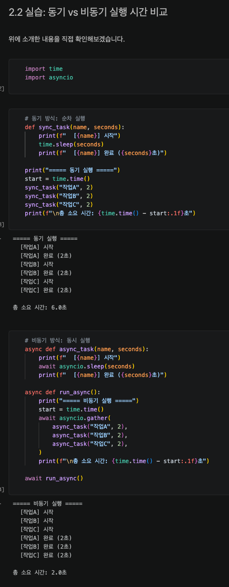

*2.2절 셀 출력. 같은 2초짜리 작업 세 개인데 6.0초와 2.0초로 갈렸다.*

동기 쪽은 시간이 더해지고 비동기 쪽은 제일 긴 작업 하나만큼만 걸린다.
출력 순서를 보면 비동기 쪽은 A, B, C 가 먼저 다 시작한 뒤에 완료가 몰려 있다.
`await` 를 만날 때마다 제어권을 넘겨서 다음 작업이 바로 시작된 것으로 보인다.

여기서 쓴 건 `asyncio.sleep` 이라 기다리는 작업이었다. 계산하는 작업이면 이렇게 안 된다는 걸
뒤에서 확인하게 됐다.

---

## 2. 미션 2 — blocking 엔드포인트가 헬스체크까지 막는 것

3초 걸리는 추론을 흉내낸 엔드포인트 두 개를 만들었다. (3장)

```python
@app.post("/predict/blocking")
async def predict_blocking():      # async def 인데 안에서 동기 함수를 부른다
    time.sleep(INFERENCE_TIME)

@app.post("/predict/threadpool")
def predict_threadpool():          # 그냥 def
    time.sleep(INFERENCE_TIME)
```

먼저 3개를 동시에 보내봤다.

```
/predict/blocking                    /predict/threadpool
  요청 #1: 6.0초                       요청 #1: 3.0초
  요청 #2: 3.0초                       요청 #2: 3.0초
  요청 #3: 9.0초                       요청 #3: 3.0초
  전체 소요 시간: 9.0초                 전체 소요 시간: 3.0초
```

blocking 쪽 개별 응답이 3.0 / 6.0 / 9.0 으로 3초씩 밀렸다. 완전히 줄을 선 모양이다.
번호 순서가 아니라 이벤트 루프에 등록된 순서대로 나간 것 같다.

그다음이 오늘의 핵심이었다. 추론이 도는 도중에 헬스체크를 던져봤다. (3.4절)

```
===== /predict/blocking 중 헬스체크 =====
  추론 응답: 3.0초
  헬스체크 응답: 2.5초       <- 단순 상태 확인인데 2.5초를 기다렸다

===== /predict/threadpool 중 헬스체크 =====
  추론 응답: 3.0초
  헬스체크 응답: 0.0초       <- 즉시
```

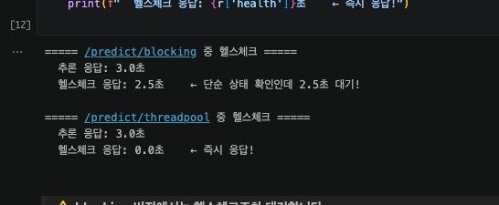

*3.4절 셀 출력. 같은 3초 추론인데 헬스체크가 2.5초와 0.0초로 갈렸다.*

헬스체크는 서버가 살아 있는지만 확인하는 가벼운 요청인데 2.5초가 걸렸다.
0.5초 시점에 던졌으니 남은 2.5초를 그대로 기다린 것이다.

`async def` 로 선언했지만 안에서 부른 게 동기 함수라, 그 함수가 끝날 때까지 이벤트 루프가
아무것도 못 한 것으로 보인다. 겉모습만 비동기이고 속은 막혀 있는 상태다.

---

## 3. 미션 3 — Day 2 의 `/predict` 에 `run_in_executor` 적용

4.2절에서 세 가지 방식을 나란히 놓고 3개씩 동시 요청을 보냈다.

```
버전 1: async def + time.sleep (blocking)     전체 9.0초
버전 2: 일반 def (FastAPI 자동 스레드풀)         전체 3.0초
버전 3: async def + run_in_executor            전체 3.0초
```

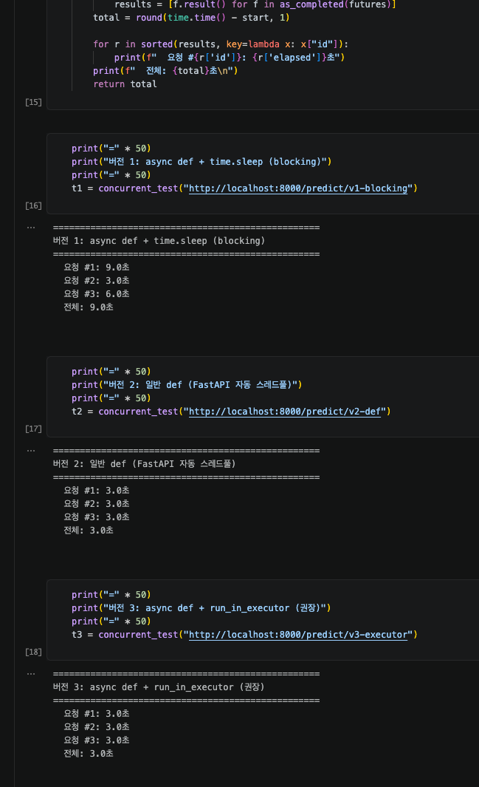

*4.2절 셀 출력. 버전 1만 9.0초이고 나머지 둘은 3.0초다.*

그리고 Day 2 의 API 에 3번 방식을 적용해 `app/main_v2.py` 를 만들었다.
바뀐 부분은 추론 호출 한 줄이다.

```python
# 전처리는 가벼우니 이벤트 루프에서 그대로 한다
pixel_tensor = (torch.from_numpy(pixel_array) - 0.1307) / 0.3081

# 무거운 추론만 전용 스레드풀로 넘긴다
loop = asyncio.get_event_loop()
result = await loop.run_in_executor(inference_executor, run_inference, pixel_tensor)
```

`inference_executor` 는 `max_workers=4` 로 따로 만든 풀이다.
`def` 로 두면 FastAPI 가 알아서 넘겨주는데도 굳이 이렇게 하는 이유는 나중에 재보고 알게 됐다.

---

## 4. 미션 4 — 최종 서버와 동시 요청 테스트

`app/main_final.py` 에 오늘 만든 것을 다 넣었다.

```
setup_logger              시간·레벨·로거이름이 붙은 로그
register_error_handlers   잡히지 않은 예외를 500 으로 받아내는 안전망
RequestLoggingMiddleware  모든 요청의 메서드·경로·상태코드·처리시간 자동 기록
run_in_executor           추론을 전용 스레드풀로
```

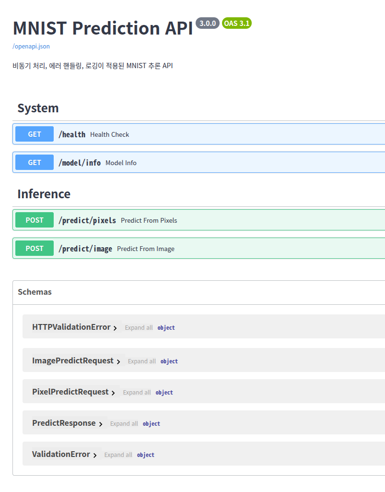

*최종 서버의 Swagger 화면. /health, /model/info, /predict/pixels, /predict/image 네 개가 떠 있다.*

동시 요청 수를 늘려가며 재봤다. (6.2절)

```
  1개 동시 요청 -> 전체 0.02초
  2개 동시 요청 -> 전체 0.01초
  4개 동시 요청 -> 전체 0.02초
  8개 동시 요청 -> 전체 0.03초
```

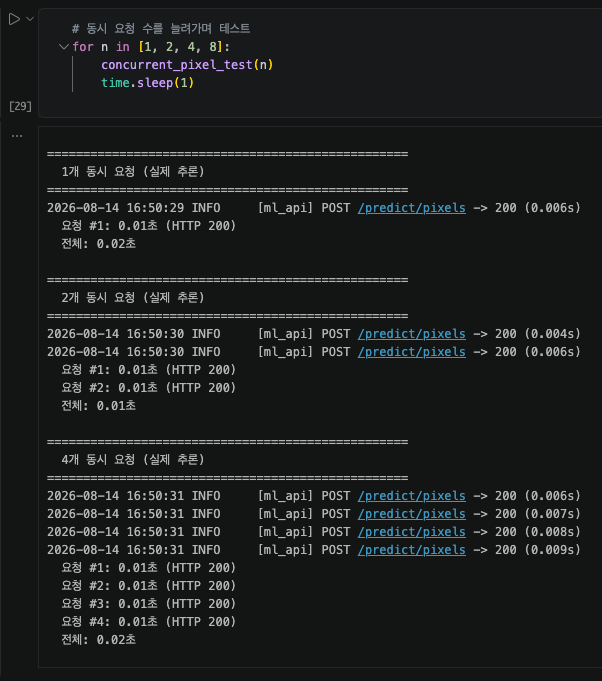

*6.2절 셀 출력 앞부분. 1개, 2개, 4개 동시 요청.*

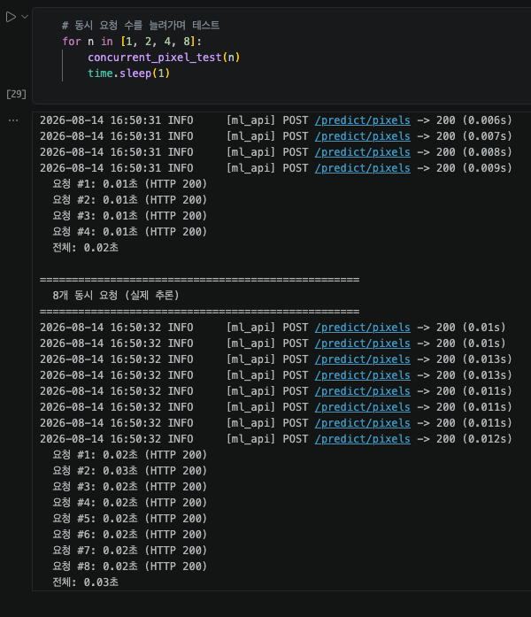

*같은 셀 뒷부분. 8개까지 늘려도 전체 0.03초다.*

에러 핸들링도 확인했다. (6.3절)

```
[정상 요청]      상태: 200, 예측: 7
[잘못된 크기]     상태: 422
[잘못된 Base64]  상태: 400, 에러: 이미지 처리 실패: cannot identify image file ...
[헬스체크]       상태: 200, 응답: {'status': 'healthy', 'model_loaded': True}
```

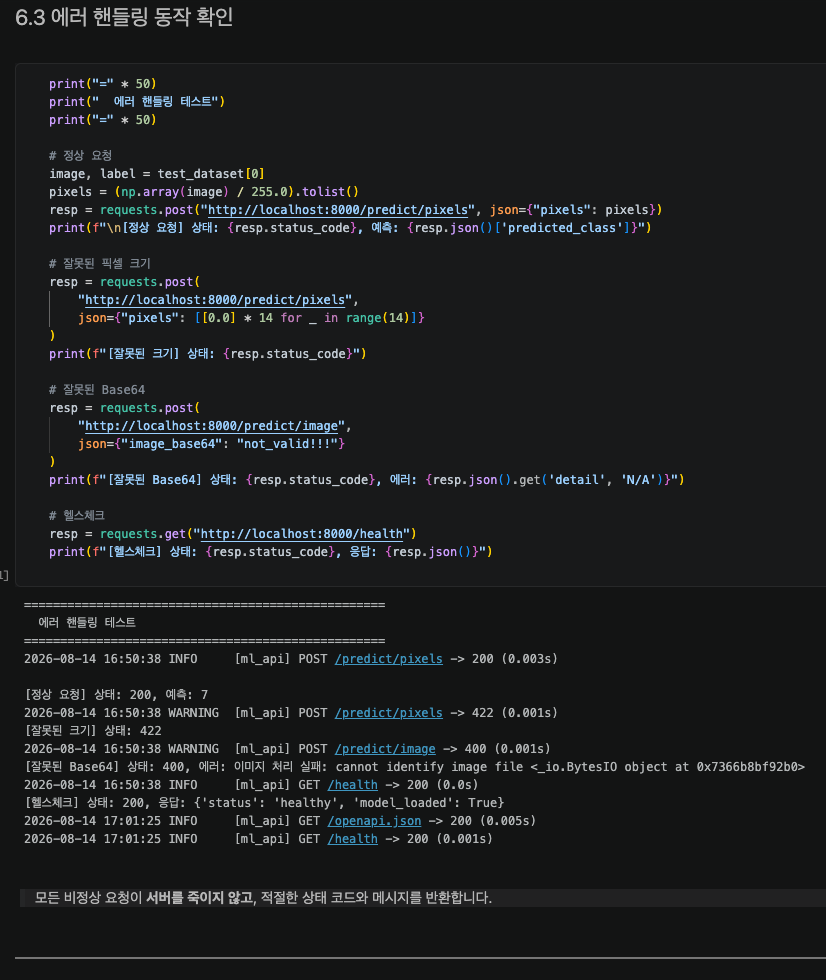

*6.3절 셀 출력. 잘못된 요청에도 서버가 죽지 않고 상태 코드를 돌려준다.*

비정상 요청이 들어와도 서버가 죽지 않고 상태 코드와 메시지를 돌려줬다.

**그런데 이 결과를 보고 걸리는 데가 있었다.**

요청을 8배로 늘렸는데 시간이 안 늘었으니 얼핏 개선이 잘 된 것처럼 읽힌다.
그런데 서버 로그를 보면 추론 한 건이 6밀리초다.
그렇게 가벼운 일이면 `run_in_executor` 를 붙이든 빼든 이 표에는 차이가 안 나타날 것 같았다.
그러면 이 숫자는 개선했다는 근거로 쓰기 어렵다.

그리고 6.3절에서 나온 건 200, 422, 400 뿐이다.
오늘 만든 글로벌 Exception Handler 는 500 을 돌려주는 물건인데 한 번도 안 걸렸다.
만들어놓고 동작하는 걸 못 본 상태였다.

이 두 가지 때문에 노트북 뒤에 실험을 열한 개 붙였다.

---

## 5. 추가로 재본 것 — A 부터 K 까지

노트북 6.3절 뒤에 순서대로 들어 있다. 여기서는 결과만 짧게 적는다.

### 5.1 부하를 올려도 안 보였고, 원인은 내 측정 쪽이었다 (A, B)

동시 요청을 300개까지 올렸더니 요청 37.5배에 시간도 37.3배로 늘었다. 완전한 직렬이다.
그런데 그때 서버는 노트북 셀에서 띄운 것이라 **커널 안의 스레드**였고,
부하를 만드는 클라이언트도 같은 커널의 스레드였다. 둘이 GIL 하나를 나눠 쓰고 있었다.

같은 코드를 별도 프로세스로 띄우고 다시 쟀다.

```
                    300개 전체    개별 중앙값
커널 안 (같은 프로세스)   1.13초      906.1ms
커널 밖 (별도 프로세스)   0.40초       32.0ms
```

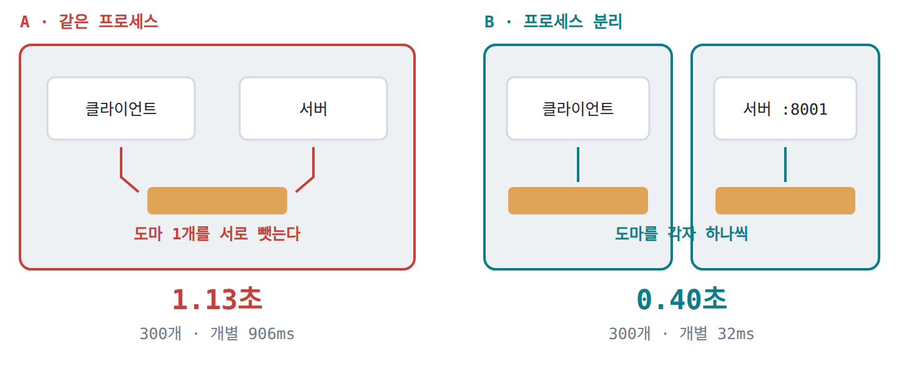

*왼쪽은 클라이언트와 서버가 한 프로세스에 있어 GIL 을 서로 뺏는 상태. 오른쪽은 갈라놓은 것.*

코드는 한 글자도 안 바꿨는데 이렇게 갈렸다.
노트북 6.2절이 시킨 방식, 그러니까 셀에서 서버를 띄우고 같은 셀에서 부하를 주는 배치는
실습으로 서버를 띄워보기엔 편한데 성능 숫자를 얻기에는 맞지 않는 것 같다.

### 5.2 비교 대상을 세웠는데 답할 수 없는 실험이었다 (C, D)

`run_in_executor` 를 뺀 서버를 하나 더 만들어 비교했더니 785 대 723 req/s 로 8.6% 차이가 났다.
그런데 같은 서버를 여러 번 재는 동안 331 에서 785 까지 출렁였다.
잡음이 신호보다 커서 차이가 있다고 말할 수가 없었다.

원인을 찾으려고 서버가 거의 일을 안 하는 `/health` 를 같은 방식으로 때려봤다.
1185 req/s 가 나왔다. 앞의 723~785 는 그 천장의 61~66% 지점이다.
서버가 병목이 된 적이 없었으니, C 는 "차이가 없다"가 아니라
**이 측정으로는 답할 수 없는 실험**이었다고 적는 게 맞을 것 같다.

### 5.3 추론을 로컬 LLM 으로 바꿨더니 성격이 바뀌었다 (E)

도구를 더 세게 만드는 대신 일을 무겁게 하기로 했다.
로컬에 있는 ollama(qwen3:4b, 한 건 1.3초)를 붙였다.

그런데 ollama 는 별도 프로세스라, 내 서버 입장에서 그 1.3초는 계산이 아니라 기다림이다.
CPU 바운드가 아니라 I/O 바운드가 된 것이다.
3장에서 쓴 `time.sleep(3)` 이 흉내내려던 게 이것이었다는 생각이 들었다.

미리 확인해보니 ollama 는 요청을 하나씩 처리했다(3개 동시에 3.80초).
그러면 내 서버를 뭘로 짜든 전체 시간은 안 줄어든다. 그래서 비교하는 축을 응답성으로 바꿨다.

```
방식                                 전체        헬스체크
async def + 동기 HTTP                4.01초      3503ms
def (FastAPI 자동 스레드풀)            3.80초         5ms
async def + run_in_executor          3.80초         4ms
async def + 비동기 클라이언트           3.84초         3ms
```

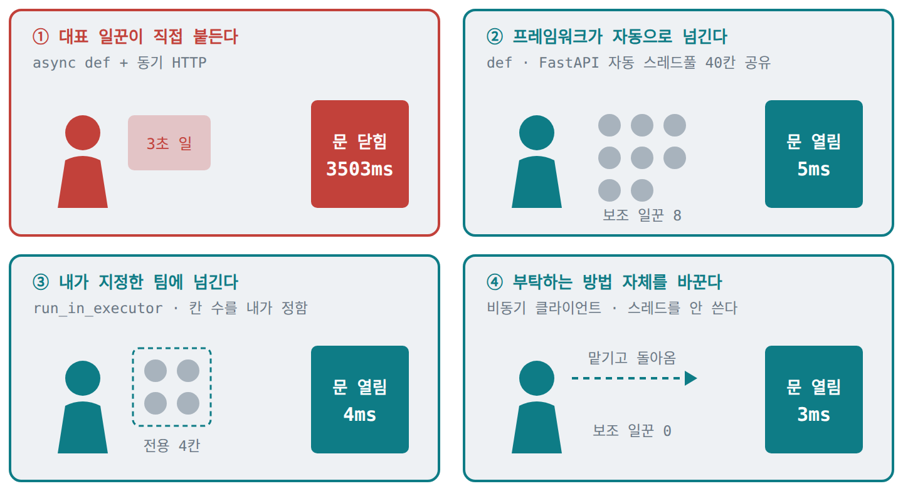

*추론 3건이 도는 도중에 던진 헬스체크의 응답 시간. 1번만 3.5초 동안 문을 닫았다.*

**전체 시간은 넷 다 같다.** 천장이 ollama 라서 내 코드로는 못 줄인다.
갈린 것은 헬스체크뿐이다. 같은 3.8초를 쓰면서도 첫 번째 방식은 응답 없는 서버로 보인다.

3503ms 는 숫자가 맞아떨어진다. 0.5초에 던졌고 3.503초 뒤에 받았으니 합이 4.00초로,
전체 4.01초와 같다. 헬스체크가 추론 3개를 전부 기다린 것이다.

### 5.4 스레드를 세어보니 방식마다 비용이 달랐다 (F, F2)

응답 시간으로는 뒤의 세 방식이 안 갈렸다(3, 4, 5ms). 갈리는 축은 스레드 사용량이었다.
방식마다 서버를 새로 띄우고 요청 8개를 보내 세어봤다.

```
방식                                전체 스레드   전용풀   기본풀
async def + 동기 HTTP                    2         0       0
def (FastAPI 자동 스레드풀)                10         0       8
async def + run_in_executor               6         4       0
async def + 비동기 클라이언트                2         0       0
```

평상시가 2개다. `def` 쪽은 요청 수만큼(8개) 늘었고,
`run_in_executor` 쪽은 내가 정한 4개에서 멈췄다. 나머지 4개는 스레드를 못 받고 기다렸다.
비동기 클라이언트는 하나도 안 늘리고 8개를 처리했다.

그러니까 `def` 와 `run_in_executor` 는 빠르기가 아니라 **한계를 누가 정하느냐**가 다른 것 같다.
`def` 는 프레임워크가 정한 40칸이고, `run_in_executor` 는 내가 정한 값이다.

### 5.5 CPU 작업에서 스레드가 효과가 있는지 (H)

여기까지는 기다리는 작업 이야기였다.
원래 궁금했던 것, 서버가 직접 계산할 때 스레드가 효과가 있느냐에는 답을 안 한 상태였다.

배운 대로라면 이렇다. 파이썬 코드를 실행할 수 있는 자리는 한 번에 하나뿐이라,
일꾼(스레드)을 아무리 늘려도 그 자리 앞에 한 명씩 줄을 선다.


*GIL 을 그림으로 옮겨본 것. 일꾼이 몇이든 파이썬 코드를 도는 자리는 하나다.*

그런데 파이토치 추론은 계산을 C++ 로 넘기고, 넘기는 순간 그 자리를 비워준다고 한다.
그렇다면 다른 일꾼이 와서 자기 계산을 또 넘길 수 있다.

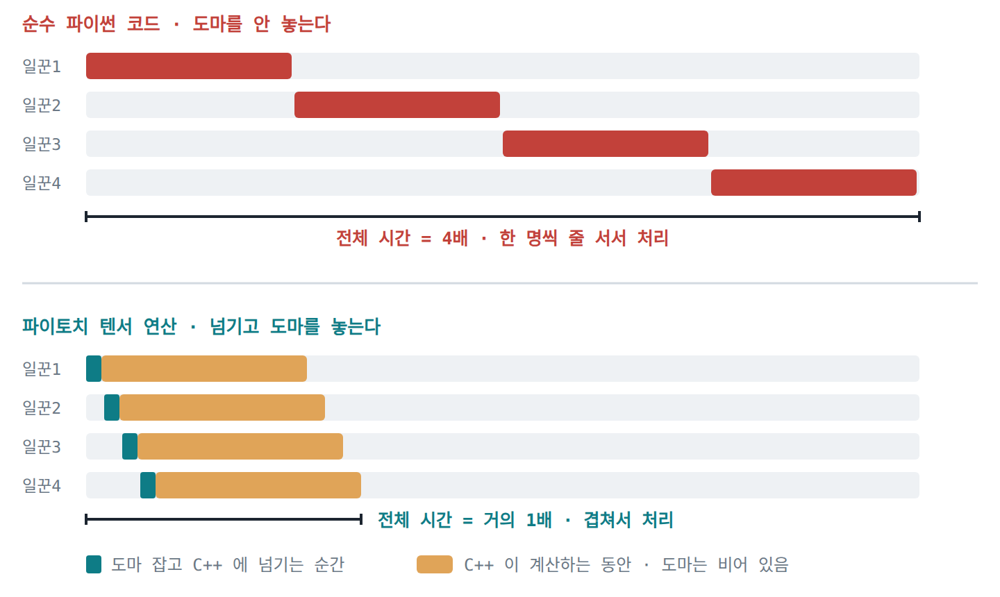

*위는 자리를 계속 붙들어서 네 배, 아래는 넘기고 비워줘서 거의 한 배. 재보기 전에 그려본 그림이고, 실측은 아래쪽이 한 배까지는 안 갔다.*

조건을 통제했다. `torch.set_num_threads(1)` 로 한 요청이 코어 하나만 쓰게 묶고
(안 그러면 요청 하나가 32코어를 다 먹어서 스레드를 늘려도 자리가 없다),
순전파 반복 횟수로 무게를 조절하고, 요청에 몸통을 없앴다.

판정 지표는 병렬도 = (동시요청 4개 × 단건 시간) ÷ 전체 시간. 1.0 이면 직렬, 4.0 이면 완전 병렬.

```
단건 시간     async def 직접   def   run_in_executor
  0.8ms          0.43        0.53       0.65
  3.4ms          0.77        1.43       1.41
 30.5ms          0.94        2.33       2.27
301.9ms          0.99        3.30       3.23
```

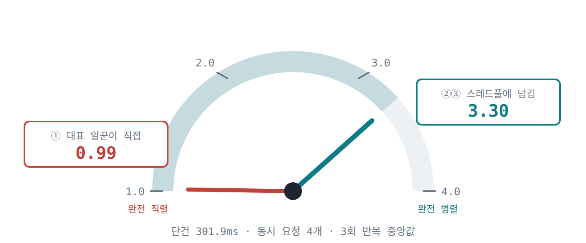

*제일 무거운 조건(단건 301.9ms)에서의 병렬도. 0.99 와 3.30 으로 갈렸다.*

작업이 무거워질수록 첫 번째는 1.0 으로 수렴하고 나머지는 3.3 쪽으로 올라간다.
1.0 은 4개를 보내도 1개 보낸 것과 같은 속도라는 뜻이다.

파이토치는 무거운 계산을 C++ 로 넘기면서 GIL 을 놓아주는 것으로 보인다.
그래서 "GIL 때문에 스레드는 CPU 작업에 소용없다"는 말은
순수 파이썬 코드에 해당하는 이야기이고 텐서 연산에는 그대로 적용되지 않는 것 같다.

### 5.6 그런데 칸을 늘려도 3.2배가 천장이었다 (I, J)

`run_in_executor` 를 쓰는 이유로 "칸 수를 내가 정할 수 있어서"라고 적어놓고,
정작 칸을 줄였을 때 무슨 일이 벌어지는지는 안 쟀다는 걸 나중에 알았다.
그래서 칸 수를 바꿔가며 다시 쟀다.

```
칸 수    처리량      배속
  1     3.3/s     1.00배
  4    10.7/s     3.24배     <- 천장
  8    10.5/s     3.18배
 16     7.4/s     2.24배     <- 오히려 떨어진다
```

32코어인데 3.2배에서 멈추고, 16칸에서는 되레 나빠졌다.

이 천장이 파이토치 쪽인지 서버 쪽인지 가르려고, FastAPI 와 uvicorn 과 이벤트 루프를
전부 걷어내고 같은 작업만 스레드로 돌려봤다.

```
스레드    서버를 통과      HTTP 없이
  1       1.00배        1.00배
  2       1.94배        1.93배
  4       3.24배        3.22배
  8       3.18배        3.29배
 16       2.24배        2.22배
```

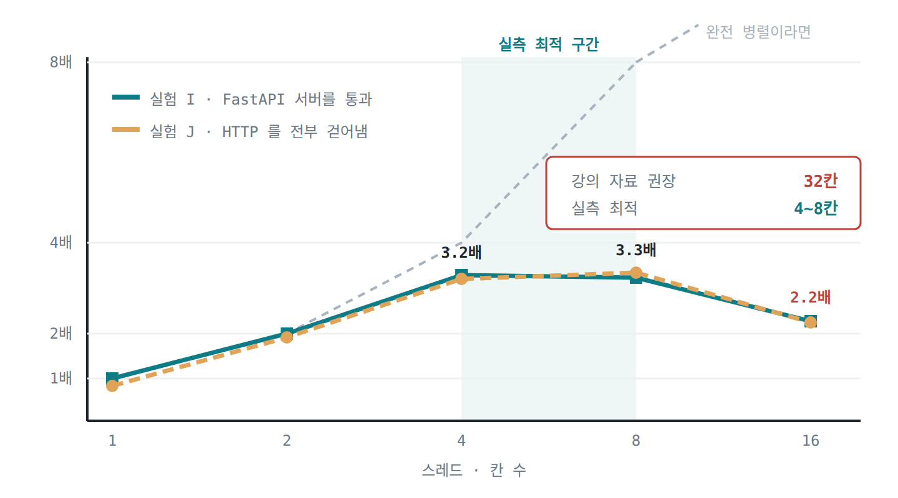

*서버를 통과한 곡선과 서버를 걷어낸 곡선이 거의 겹친다. 점선은 완전히 겹쳐 돌았다면 나왔을 값이다.*

곡선이 거의 겹쳤다. 천장은 서버가 만든 게 아니었다.
뒤집어 보면 오늘 만든 서버는 파이토치가 낼 수 있는 최대를 그대로 통과시키고 있었다는 뜻이 된다.

그리고 이게 4.5절과 어긋난다. 4.5절은 CPU 추론이면 코어 수와 비슷하게 잡으라고 했고,
그 셀을 이 기계에서 돌리니 권장값이 32 로 나왔다. 실측으로 좋았던 값은 4에서 8 사이다.
(4와 8 사이는 이 측정으로 못 갈랐다. 처리량 10.7 과 10.5, p95 1473ms 와 1484ms 로 오차 안이다.)

4.5절도 "너무 많으면 컨텍스트 스위칭 오버헤드"라고 같은 현상을 말하고 있는데,
그 한계가 코어 수보다 훨씬 먼저 왔다. 안 재보고 `os.cpu_count()` 를 그대로 넣었으면
한참 어긋난 값을 쓸 뻔했다.

여기서 `torch.set_num_threads` 도 같이 변수로 풀어봤다. 실험 H 에서는 1로 고정해뒀던 값이다.

```
칸 수  torch 스레드   실제 쓰는 코어    단건        전체       처리량
  4        1              4        303.3ms     737ms     10.9/s
  4        8             32        158.6ms     975ms      8.2/s
  8        4             32        165.5ms    1400ms      5.7/s
  8        8             64        147.6ms    1168ms      6.8/s
 32        1              8        303.9ms     691ms     11.6/s
```

곱이 같은 `(4,8)` 과 `(8,4)` 가 975ms 와 1400ms 로 1.4배 차이가 났다. 배분도 변수인 것 같다.
그리고 torch 스레드를 올리면 단건은 303ms 에서 158ms 로 절반이 되는데
전체 처리량은 10.9 에서 8.2 로 떨어졌다.

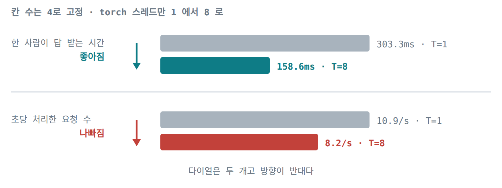

*칸 수는 4로 두고 torch 스레드만 1에서 8로 올렸을 때. 한쪽은 좋아지고 한쪽은 나빠진다.*

지연을 줄이고 싶으면 torch 스레드를 올리고, 처리량을 늘리고 싶으면 1로 두고 칸을 올리는 쪽인 것 같다.
이 모델 크기에서는 뒤쪽이 이겼다. `(32,1)` 이 691ms 로 제일 좋았는데,
동시 요청이 8개뿐이라 칸 32개 중 8개만 쓰인 것이고 `(4,1)` 737ms 와 큰 차이가 없다.
칸을 동시 요청 수보다 늘리는 건 아무 일도 안 한다는 뜻으로 읽힌다.

### 5.7 예외가 스레드 안에서 터지면 (K)

6.3절에서 500 을 한 번도 못 봤으니, 일부러 예외를 내는 경로를 만들어 확인했다.
예외가 터질 수 있는 자리 세 군데에서 각각 10번씩 터뜨렸다.

```
터지는 자리                    상태코드   응답 본문
이벤트 루프에서                   500     {"success":false,"error":"서버 내부 오류가 발생했습니다."}
기본 스레드풀에서 (def)            500     같음
전용 스레드풀에서                  500     같음
```

세 자리 모두 같은 응답이다. 클라이언트는 예외가 어디서 터졌는지 알 수 없다.
서버 로그에는 예외 종류와 파일 이름, 줄 번호, 전체 스택이 남았다.
5.2절이 말한 "로그는 상세하게, 클라이언트는 안전하게"가 그대로 갈렸다.

스레드가 죽는지도 세어봤다.

```
              예외 전   예외 30번 뒤
전용 스레드풀     4          4
기본 스레드풀     0          1
```

워커가 안 죽었다. 기본 스레드풀이 0에서 1로 는 게 오히려 증거인 것 같다.
10번을 터뜨렸는데 워커가 1개만 생겼으니 한 워커가 열 번을 다 받아낸 것이다.

`ThreadPoolExecutor` 가 작업 호출을 감싸두고 예외를 `Future` 에 담아 돌려주기 때문으로 보인다.
예외가 결과값처럼 전달되고 워커 자신은 다음 작업을 받는다.

예외를 서른 번 낸 뒤에도 추론 요청이 200 으로 돌아왔고 헬스체크도 정상이었다.
다만 여기서 확인한 건 예외가 잡힌다는 것까지다.
예외 전에 그 워커가 잡아둔 자원이 정리되는지는 이 실험으로 알 수 없다.

### 5.8 결론 여섯 개

```
1  파이토치는 텐서 연산 중 GIL 을 놓는다. 다만 전부는 아닌 것 같다
   스레드 2개까지는 거의 공짜(1.93배), 4~8개에서 3.2~3.3배가 천장,
   16개에서는 2.2배로 손해. 32코어여도 그렇다
   이 천장은 서버가 아니라 파이토치 쪽으로 보인다

2  run_in_executor 에 손익분기점 같은 건 없다
   이득이 연속적으로 커지므로 비율이 아니라 아껴진 시간으로 판단해야 할 것 같다
   0.3ms 작업에서 2.5ms 아끼는 것과 302ms 작업에서 856ms 아끼는 것은 다르다

3  def 와 run_in_executor 는 성능이 같다. 다른 것은 한계를 누가 정하느냐다
   칸을 동시요청 수보다 늘리는 건 아무 일도 안 한다
   칸 수와 torch 스레드 수는 곱만이 아니라 배분도 변수다

4  추론을 별도 서버로 넘기면 CPU 바운드가 I/O 바운드가 된다
   그때는 비동기 클라이언트가 스레드 0개로 같은 일을 한다

5  처리량은 추론 자원이 정하고, 응답성은 내 서버가 정한다

6  지연과 처리량은 서로 다른 다이얼이고 방향이 반대다
   그리고 max_workers 는 코어 수가 아니라 재서 정해야 하는 값인 것 같다
```

---

## 6. 미션 5 — 블로그

오늘 실험 과정을 블로그 글로 정리했다.
제목은 "32코어에서 max_workers 4가 최적이었던 이유"이고,
5절에 적은 A 부터 K 까지를 처음 보는 사람도 따라올 수 있게 다시 썼다.

https://gettingds.blogspot.com/2026/08/32-maxworkers-4.html

글에 쓰려고 그림을 몇 장 그렸는데, 이 문서 5절에도 같은 그림을 넣었다.

---

## 7. 섹션별 체크포인트 답변

### 2장 뒤 — 1. `time.sleep(3)` vs `await asyncio.sleep(3)`

`time.sleep(3)` 은 현재 실행 중인 스레드와 이벤트 루프 전체를 3초 동안 멈춘다.
이벤트 루프에 제어권을 돌려주는 지점(`await`)이 없어서, 그 코루틴이 끝날 때까지
다른 비동기 태스크나 요청(예: 헬스체크)을 일절 처리할 수 없다.

`await asyncio.sleep(3)` 은 이벤트 루프에게 "3초 후에 다시 실행해달라"고 예약한 뒤
즉시 제어권을 넘긴다. 그래서 기다리는 동안 이벤트 루프가 다른 작업을 정상적으로 처리한다.

처음에는 `time.sleep` 이 CPU 점유권 자체를 안 놓는다고 적었는데 그건 아니었다.
`time.sleep` 은 GIL 을 놓기 때문에 다른 스레드는 그동안 돌 수 있다.
3.3절에서 `def` 로 선언한 threadpool 엔드포인트에 3개를 동시에 보냈더니
9초가 아니라 3.0초가 나온 게 그 증거다. 붙들고 있었다면 9초가 나왔어야 한다.
문제는 CPU 점유가 아니라 이벤트 루프에 제어권을 넘길 자리가 없다는 쪽이었다.

### 2장 뒤 — 2. CPU 바운드 작업에서 `async/await` 만으로 동시 처리가 안 되는 이유

asyncio 는 단일 스레드의 이벤트 루프 위에서 동작하고, `await` 를 만났을 때만 제어권을 넘긴다.
I/O 작업은 외부 응답을 기다리는 시간이 있어 그 틈에 다른 태스크를 처리할 수 있지만,
CPU 바운드 작업은 연산을 쉼 없이 수행하므로 제어권을 넘길 대기 시간이 없다.
그래서 `async def` 안에서 무거운 동기 코드를 실행하면 연산이 끝날 때까지 이벤트 루프가 묶인다.

직접 재보니 302ms 짜리 추론을 동시에 4개 보냈을 때
`async def` 안에서 그냥 호출한 쪽은 병렬도가 0.99 였다.
4개를 보냈는데 1개 보낸 것과 같은 속도로만 처리했다는 뜻이다.
같은 작업을 스레드풀로 넘긴 쪽은 3.30 이었다.

### 3장 뒤 — 1. `async def` 안의 `time.sleep(3)` 이 다른 요청까지 지연시키는 이유

`async def` 함수는 단일 이벤트 루프 스레드에서 직접 실행된다.
`await` 로 제어권을 넘겨야 다른 요청을 처리할 수 있는데 `time.sleep` 은 넘기지 않으므로,
이벤트 루프가 멈춰 있는 동안 들어오는 모든 요청이 대기 상태가 된다.

3.2절에서 3개를 동시에 보내니 개별 응답이 6.0 / 3.0 / 9.0초, 전체 9.0초로 나왔다.

### 3장 뒤 — 2. 일반 `def` 엔드포인트를 FastAPI 가 처리하는 방식

메인 이벤트 루프에서 직접 실행하지 않고 별도의 스레드풀에 위임한다.
무거운 동기 작업이 별도 스레드에서 돌기 때문에 이벤트 루프는 막히지 않는다.

스레드 수를 직접 세어보니 요청 8개를 보냈을 때 기본 스레드풀 워커가 정확히 8개 생겼고,
`async def` 로 선언한 쪽은 평상시 2개에서 하나도 안 늘었다.

### 3장 뒤 — 3. blocking 추론 중 헬스체크가 막히면 실무에서 생기는 문제

- 로드 밸런서(ALB, Nginx, Kubernetes 등이 있다고 한다)는 `/health` 를 주기적으로 호출해
  인스턴스 생존 여부를 판단한다. 응답이 지연되면 서버가 다운된 것으로 간주된다.
- 쿠버네티스의 Liveness/Readiness Probe 가 실패해 멀쩡히 연산 중인 컨테이너를
  강제로 재시작하거나 타깃 그룹에서 제외한다고 한다.
- 한 서버가 빠지면 남은 서버로 트래픽이 몰려 연쇄적으로 장애가 번질 수 있다.

직접 재보니 추론 3건이 도는 도중 헬스체크가 이렇게 갈렸다.

```
async def 안에서 동기 호출     3503ms
def (자동 스레드풀)              5ms
run_in_executor                 4ms
비동기 클라이언트                 3ms
```

그런데 전체 걸린 시간은 넷 다 3.80~4.01초로 같았다.
일이 빨리 끝난 게 아니라 일하는 동안 문을 열어뒀느냐만 갈린 것이다.

### 4장 뒤 — 1. `run_in_executor` 가 블로킹을 방지하는 원리

무거운 동기 함수를 메인 이벤트 루프 스레드가 아닌 별도 스레드에 위임해 실행한다.
그 사이 이벤트 루프는 막히지 않고 다른 요청이나 헬스체크를 계속 처리하고,
작업이 끝나면 결과를 비동기적으로 받아 반환한다.

### 4장 뒤 — 2. 첫 번째 인자에 `None` 을 넣으면

이벤트 루프의 기본 스레드풀이 사용된다.

### 4장 뒤 — 3. 일반 `def` 와 `async def` + `run_in_executor` 의 차이

`def` 는 FastAPI 가 기본 스레드풀(보통 40칸 규모)에 자동으로 위임한다.
간편하지만 크기를 제어할 수 없고 다른 동기 엔드포인트들과 풀을 공유한다.

`run_in_executor` 는 추론 전용 풀을 직접 지정할 수 있다.
스레드 수를 명시적으로 제한해 과도한 동시 연산을 막고,
추론 부하가 다른 엔드포인트에 영향을 주지 않도록 격리할 수 있다.

요청 8개를 보내고 세어보니 `def` 쪽은 워커가 8개까지 늘었고
`run_in_executor` 쪽은 `max_workers=4` 그대로 4개에서 멈췄다.
빨라서 좋은 게 아니라 한계를 내가 정할 수 있어서 쓰는 것이라는 생각이 들었다.

### 4장 뒤 — 4. GPU 추론 시 스레드풀을 1~2 로 제한하는 이유

- 여러 스레드가 동시에 큰 텐서 연산을 요청하면 GPU 메모리가 소진되어
  OOM 으로 서버가 내려갈 위험이 있을 것 같다.
- GPU 는 이미 내부적으로 병렬 연산을 하고 있어서, CPU 쪽 스레드를 늘려도
  처리 속도 향상은 크지 않고 경합만 늘어난다고 한다.

GPU 는 아니지만 CPU 에서 비슷한 걸 확인했다. 32코어짜리에서 칸 수를 늘려가며 재보니
4~8칸에서 3.2배가 천장이었고 16칸에서는 2.24배로 오히려 떨어졌다.
칸 수와 torch 스레드 수를 같이 올려 코어 수를 넘기니
`(4,8)` 975ms 가 `(8,8)` 1168ms 로 느려지기도 했다.
코어 수를 기준으로 잡으면 한참 어긋날 수 있겠다는 생각이 들었다.

### 5장 뒤 — 1. 글로벌 Exception Handler 가 줄이는 반복

라우트마다 에러 로깅, 응답 포맷팅, 상태 코드 반환을 일일이 쓰지 않고
한곳에서 처리할 수 있다. 그리고 모든 예외에 같은 규격의 JSON 응답을 자동으로 만들어준다.

### 5장 뒤 — 2. 클라이언트에게 스택 트레이스를 노출하면 안 되는 이유

스택 트레이스에는 서버 내부 파일 경로, 프레임워크 버전, DB 구조, 내부 변수명 같은
민감한 정보가 담겨 있어 공격자의 표적이 될 수 있다.
그리고 일반 사용자에게는 기술적 오류 로그보다 안전한 안내 메시지가 적절하겠다.

일부러 예외를 내서 확인해보니 클라이언트가 받은 건
`{"success":false,"error":"서버 내부 오류가 발생했습니다."}` 한 줄뿐이었고,
서버 로그에는 예외 종류와 파일 이름, 줄 번호, 전체 스택이 남았다.

### 5장 뒤 — 3. `logging` 이 `print()` 보다 나은 점

- 타임스탬프, 모듈명, 프로세스/스레드 ID 를 포맷터로 일관되게 남길 수 있다.
- DEBUG 부터 CRITICAL 까지 심각도를 나눠 환경에 맞게 필터링할 수 있다.
- 콘솔뿐 아니라 파일이나 외부 로그 시스템으로 보낼 수 있다.

### 최종 Q1. 동기 서버에서 3초 추론을 3명이 동시에 요청하면

총 9초다. 동기 서버는 한 번에 하나씩 순차 처리하므로 앞 요청이 끝나야 다음이 시작된다.
요청 1은 3초, 요청 2는 6초, 요청 3은 9초 뒤에 응답이 끝난다.

3.2절에서 실제로 보내보니 전체 9.0초가 나왔고 개별 응답은 6.0 / 3.0 / 9.0초였다.

### 최종 Q2. `time.sleep(3)` 과 `await asyncio.sleep(3)` 의 차이

`time.sleep` 은 이벤트 루프에 제어권을 돌려줄 지점이 없어 그 자리에서 멈춘다.
`await asyncio.sleep` 은 예약해두고 제어권을 넘기므로 그동안 다른 요청이 처리된다.
(2장 답에 적은 대로 `time.sleep` 이 GIL 자체를 붙드는 건 아니다.)

### 최종 Q3. `async def` 안의 동기 블로킹 코드가 헬스체크까지 막는 이유

`async def` 엔드포인트는 단일 이벤트 루프 스레드에서 직접 실행되기 때문에,
동기 블로킹 코드가 루프 자체를 멈추면 가벼운 헬스체크도 큐에 묶여 응답하지 못한다.

3.4절에서 헬스체크가 2.5초를 기다렸고 스레드풀 버전에서는 0.0초에 응답했다.
로컬 LLM 으로 더 무겁게 했을 때는 3503ms 대 3ms 로 갈렸다.

### 최종 Q4. `run_in_executor` 가 블로킹을 방지하는 원리

무거운 동기 함수를 별도 스레드풀로 위임해 백그라운드에서 실행시키고,
그동안 이벤트 루프는 다른 요청을 처리하다가 작업이 끝나면 결과를 받는다.

### 최종 Q5. 글로벌 Exception Handler 를 쓰는 이유

엔드포인트마다 try-except 를 쓰지 않고 한곳에서 예외를 처리할 수 있고,
통일된 규격의 응답을 반환하면서 내부적으로는 상세 로그를 남길 수 있다.

예외가 터질 수 있는 자리를 세 군데 만들어 각각 10번씩 터뜨려보니
어디서 터지든 클라이언트가 받는 응답이 500 에 같은 본문이었다.
30번을 터뜨린 뒤에도 스레드풀 워커가 죽지 않았고 서버도 정상이었다.
다만 확인한 건 예외가 잡힌다는 것까지이고, 예외 전에 잡아둔 자원 정리는 안 봤다.

### 최종 Q6. 스택 트레이스를 노출하면 안 되는 이유

서버 내부 파일 경로, 프레임워크 버전, DB 스키마, 코드 구조 같은 민감한 정보가
그대로 드러나 악용될 위험이 크겠다.
클라이언트에게는 안전한 안내 메시지를 주고 상세 내용은 서버 로그에만 남기는 것이 맞다.

---

## 8. 하다가 막혔던 것들

**같은 이름 노트북이 두 군데 있는 것.** 어제 겪은 일인데 오늘도 조심했다.
작업용과 제출용을 미리 둘 다 만들어두면 어느 쪽을 연 건지 헷갈린다.
`%%writefile` 이 현재 폴더 기준으로 파일을 만들기 때문에, 제출용 폴더에서 열면
거기에 `app/` 이 새로 생기고 모델 파일이 없어서 로드에 실패한다.
오늘은 제출 직전까지 복사를 미뤘다.

**6.0절 셀이 `if True:` 로 되어 있는 것.** "없으면 생성"이 아니라 무조건 덮어쓴다.
어제 고쳐둔 `app/schemas.py` 와 `app/model_utils.py` 가 통째로 사라졌다.
아카이브에 커밋해둔 게 있어서 되살렸다.

**측정하려던 것보다 측정 도구가 더 자주 문제였다.**
커널을 공유해서, 클라이언트가 먼저 지쳐서, ollama 가 하나씩 처리해서, 스레드가 안 죽어서.
네 번 다 처음에는 서버가 이상하다고 생각했다.

**예상을 먼저 적어두는 게 도움이 됐다.**
숫자를 보고 나서 해석을 붙이면 끼워맞추게 되는데, 미리 적어두면 빗나간 게 그대로 보인다.
파도 모델은 예측 다섯 개를 미리 박아뒀는데 뒤의 세 개가 크게 어긋났다.

**한 번만 재고 넘어갔다가 틀릴 뻔했다.**
같은 조건에서 10.64초와 17.21초가 나온 적이 있는데, 세 번 다시 재보니
10.67 / 10.64 / 10.64초로 폭이 0.03초였다. 17.21초는 재현되지 않았다.
한 번만 재고 "이 방식이 7초 더 걸린다"고 적었으면 틀린 숫자를 올릴 뻔했다.

---

## 9. 회고

오늘 제일 크게 남은 건 결론 여섯 개가 아니라 **재는 방법 쪽**인 것 같다.

실험을 열한 번 했는데 그중 네 번은 잰 대상이 아니라 재는 쪽에 문제가 있었다.

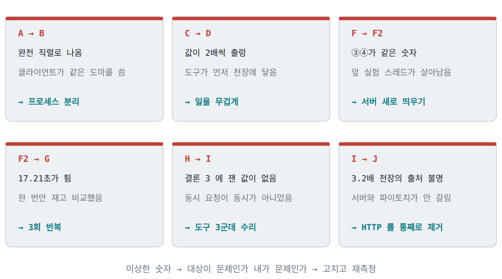

*이상한 숫자가 나올 때마다 대상이 아니라 재는 쪽을 먼저 의심하게 됐다. 여섯 번 그랬다.*

그리고 내가 세운 가설이 세 번 기각됐고, 미리 정해둔 판정 기준을 두 번 잘못 잡았다.
처음에는 이게 실패처럼 보였는데, 정리하고 보니 이 과정이 결과보다 오래 남을 것 같다.

특히 4.5절 권장값과 실측이 어긋난 걸 본 게 컸다.
자료에 적힌 대로 `os.cpu_count()` 를 넣었으면 32칸을 잡았을 텐데,
재보니 16칸에서 이미 성능이 떨어지고 있었다.
자료가 틀렸다기보다 내 조건에서 안 맞았던 건데, 그 차이는 재보지 않으면 알 수가 없다.

아직 못 푼 것도 있다.
`localhost` 로 재던 구간에서 100개 요청이 전부 200밀리초 근처에 몰린 적이 있는데
원인을 못 찾았고, 위에 적은 17.21초도 왜 그랬는지는 모른다.
다음에 이어서 잰다면 여기서부터일 것 같다.

내일은 Streamlit 으로 화면을 만들어 이 서버에 붙인다고 한다.
오늘 만든 서버가 요청을 어떻게 받아내는지 봤으니, 그 앞단이 붙는 걸 보면
전체 그림이 좀 더 이어질 것 같다.
