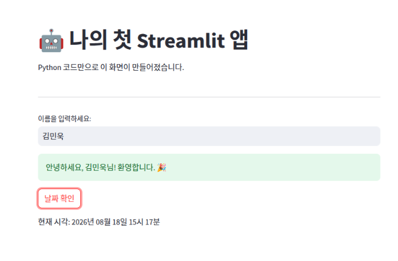
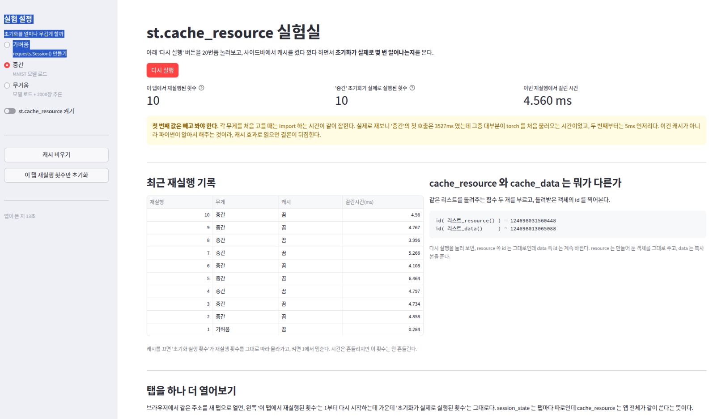
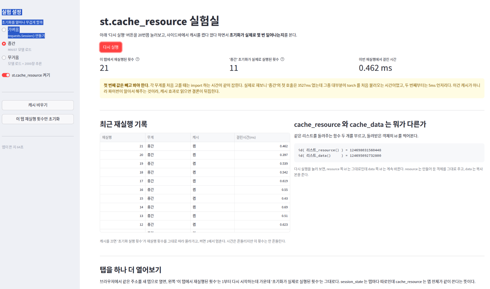
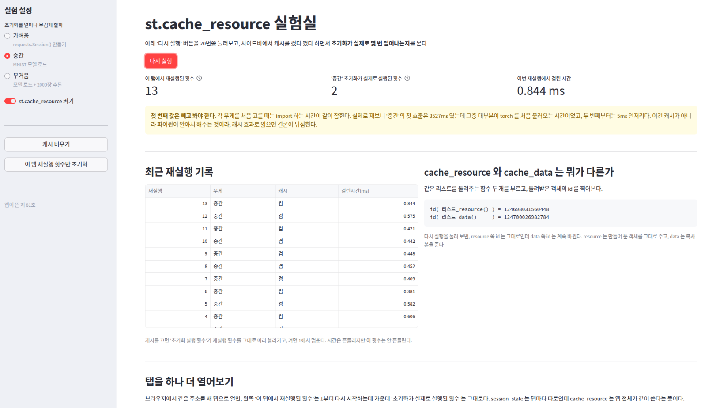
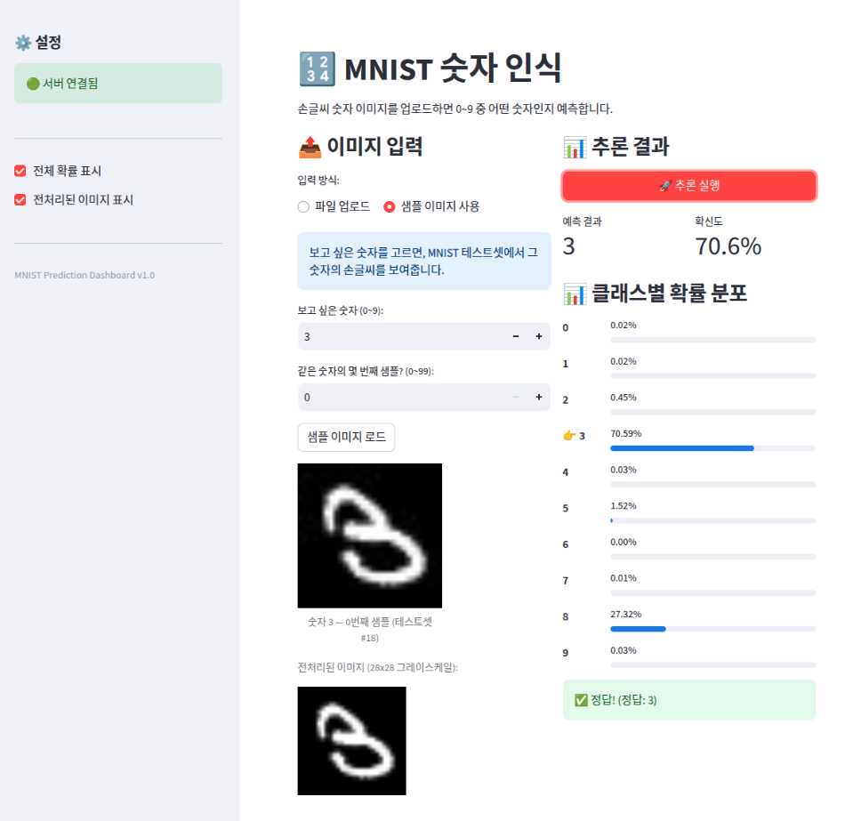
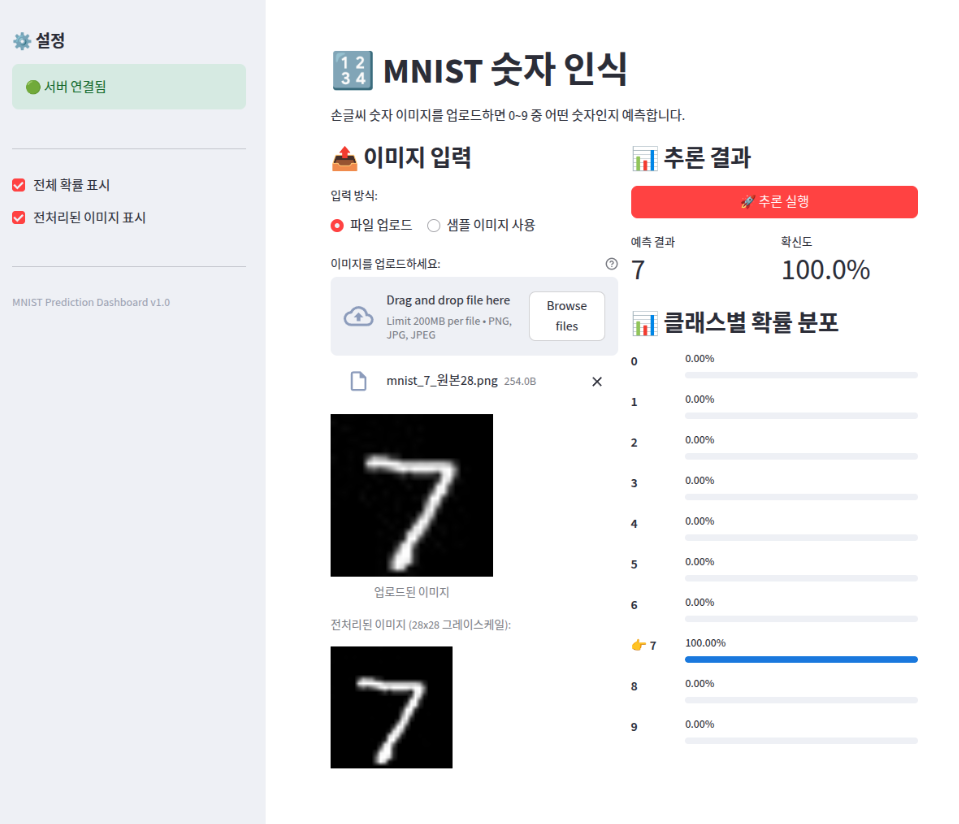
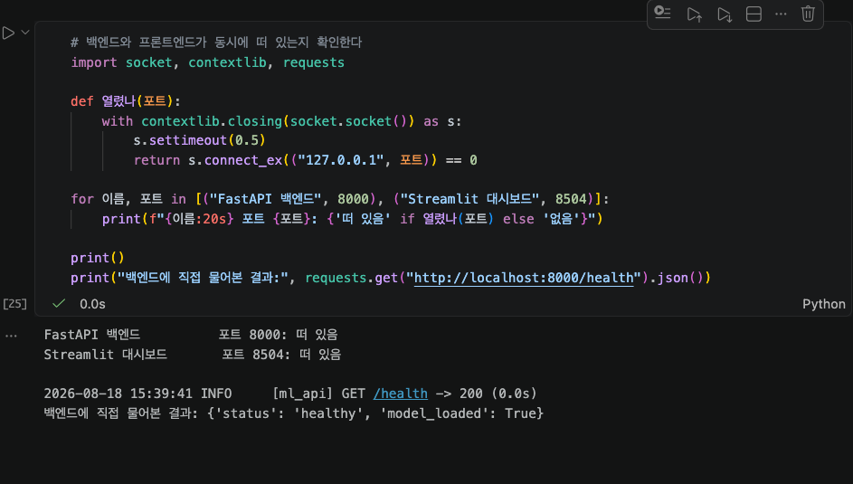
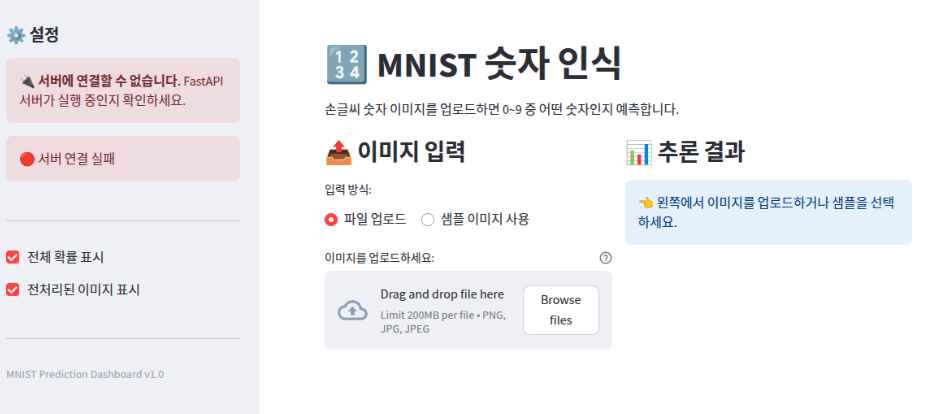
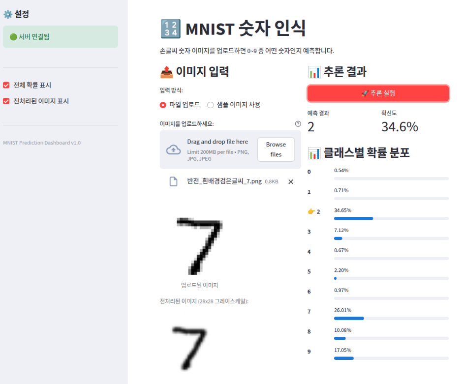
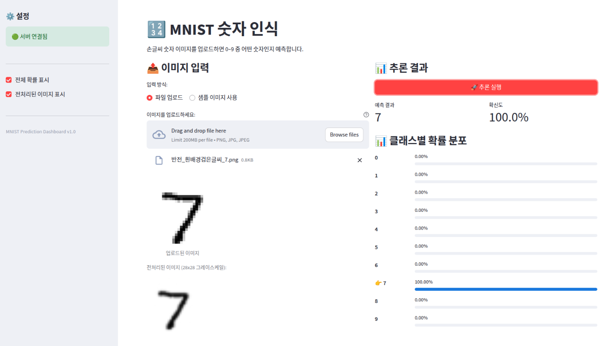

# DP04 — Streamlit 과 프론트엔드 백엔드 분리 실습 정리

모델 배포 기초 4일차. 노트북은 같은 폴더의 [`모델배포개론04.ipynb`](모델배포개론04.ipynb) 이고,
아래 숫자는 전부 그 노트북 셀 출력이나 화면 캡처에서 가져온 것이다.

```
환경    Ubuntu · Python 3.12.3 · streamlit 1.38.0 · fastapi 0.115.0 · torch 2.9.1(ROCm)
포트    FastAPI 8000 · 대시보드 8504 · 첫 앱 8505 · 캐시 실험실 8506
모델    Day 1 에서 만든 MNIST CNN (SimpleClassifier)
```

이 글에 나오는 소스는 같은 폴더에 같이 뒀다.

| 파일 | 무엇 |
| --- | --- |
| [`frontend/app_hello.py`](frontend/app_hello.py) | 미션 1 의 첫 앱 |
| [`frontend/app_cache_lab.py`](frontend/app_cache_lab.py) | 미션 2 를 재보려고 내가 만든 실험실 |
| [`frontend/app_dashboard.py`](frontend/app_dashboard.py) | 미션 3 의 MNIST 추론 대시보드 |
| [`app/model_utils.py`](app/model_utils.py) | 5 절에서 전처리를 고친 백엔드 파일 |

오늘 미션이 네 개였다.

```
1  첫 번째 Streamlit 앱을 실행해보고 코드를 한 줄씩 뜯어보기
2  st.cache_resource 가 있을 때와 없을 때 차이 확인
3  이미지 업로드부터 FastAPI 호출, 결과 시각화까지 MNIST 추론 대시보드 완성
4  백엔드와 프론트엔드를 각각 띄워 Day 1~4 가 하나의 서비스로 동작하는지 확인
```

---

## 1. 미션 1 — 첫 Streamlit 앱

`frontend/app_hello.py` 를 만들어 띄웠다. 파이썬 코드만으로 입력창과 버튼이 있는 웹 화면이 나왔다.



*이름을 넣으면 인사말이 뜨고, 버튼을 누르면 현재 시각이 나온다.*

한 줄씩 보면 이렇다.

```python
st.set_page_config(...)          # 페이지 제목과 아이콘. 다른 st 명령보다 먼저 와야 한다
st.title("...")                  # 제목
name = st.text_input("이름을 입력하세요:")   # 입력창을 그리고, 지금 들어있는 값을 돌려준다
if name:                         # 값이 있으면 인사말, 없으면 안내
    st.success(...)
if st.button("날짜 확인"):        # 버튼을 그리고, "방금 눌렸는지"를 True/False 로 돌려준다
    st.write(...)
```

제일 낯설었던 게 `if st.button(...)` 이었다. 자바로 치면 버튼에 이벤트 리스너를 붙이는 자리인데
여기서는 그냥 `if` 문이다. Streamlit 은 이벤트가 생길 때마다 스크립트를 처음부터 다시 돌리고,
그 한 번의 재실행에서만 `st.button()` 이 `True` 를 돌려준다. 그래서 리스너를 등록하는 게 아니라
위에서 아래로 읽어 내려가는 `if` 로 쓸 수 있는 것 같다.

원본 노트북에는 이 앱을 만드는 셀만 있고 띄우는 셀이 없어서, 띄우는 셀을 하나 만들어 넣었다.

---

## 2. 미션 2 — `st.cache_resource` 가 있을 때와 없을 때

### 2.1 노트북 코드로는 이 미션을 할 수 없었다

`@st.cache_resource` 는 노트북에서 설명 셀에만 나온다. 돌려볼 수 있는 코드 셀에는 한 번도 없고,
5절에서 만드는 대시보드에도 쓰이지 않았다. 그래서 차이를 직접 재보려고
`frontend/app_cache_lab.py` 를 따로 만들었다.

재는 방법을 정하면서 걸린 게 하나 있었다. 시간은 돌릴 때마다 흔들려서, 차이가 작으면
노이즈인지 효과인지 구분이 안 된다. 그래서 시간 말고 **초기화 함수가 실제로 몇 번 불렸는지**를
같이 세기로 했다. 이건 안 흔들린다.

그런데 그 횟수를 담을 곳이 문제였다. 그냥 전역 변수에 담으면 스크립트가 통째로 다시 돌면서
그 변수도 매번 0 으로 돌아간다. 그래서 **횟수를 세는 상자 자체를 `st.cache_resource` 에 담았다.**
재려는 것을 재기 위해 그것을 써야 하는 모양이 됐는데, 이게 오히려 캐시가 무슨 일을 하는지
제일 잘 보여준 것 같다.

### 2.2 캐시를 껐을 때

초기화를 "MNIST 모델 로드"로 두고 캐시를 끈 채 다시 실행을 열 번 눌렀다.



*재실행 10 회, 초기화도 10 회. 걸린 시간은 3.996 에서 6.464 ms 사이였다.*

재실행 횟수와 초기화 횟수가 나란히 올라갔다. 누를 때마다 모델을 새로 읽고 있었다.

### 2.3 캐시를 켰을 때

같은 조건에서 캐시만 켰다.



*재실행 21 회, 초기화 11 회.*

처음에는 이 화면을 보고 잘못된 줄 알았다. 초기화가 11 이면 캐시가 안 먹은 것처럼 보였다.
그런데 앞 실험에서 쌓인 10 이 그대로 남아 있던 것이었다.
재실행이 10 에서 21 로 열한 번 늘어나는 동안 초기화는 딱 한 번만 늘었으니 캐시는 먹고 있었다.

숫자를 지우고 다시 재봤다.



*재실행 13 회, 초기화 2 회. 걸린 시간은 0.381 에서 0.844 ms 사이였다.*

초기화 2 회는 캐시를 비운 직후에 한 번, 캐시를 켜면서 또 한 번 만든 것이다.
그 뒤 열한 번을 더 눌렀는데 한 번도 안 만들었다.

| | 캐시 끔 | 캐시 켬 |
| --- | --- | --- |
| 재실행 횟수 | 10 | 13 |
| 초기화가 실제로 실행된 횟수 | 10 | 2 |
| 걸린 시간 | 3.996 ~ 6.464 ms | 0.381 ~ 0.844 ms |

### 2.4 재보면서 알게 된 것

**첫 번째 값은 빼고 봐야 한다.** 각 무게를 처음 고를 때는 그 자리에서 torch 를 처음 불러오는
시간이 같이 잡혀서 유난히 느리게 나온다. 두 번째부터 5 ms 언저리로 떨어진다.
이건 파이썬이 한 번 읽은 모듈을 기억하고 있어서 그런 것이라 Streamlit 캐시가 해준 일이 아니다.
모르고 봤으면 캐시가 몇 초를 아껴줬다고 읽을 뻔했다.

**그리고 노트북이 캐시하라고 시킨 것으로는 차이가 안 보인다.** 노트북 예시는 API 클라이언트를
캐시하라고 하는데, 실험실에서 그 항목을 골라 재보면 0.3 ms 아래라 캐시를 켜나 끄나 티가 안 난다.
그래서 캐시를 거는 이유가 속도 하나만은 아니라는 생각이 들었다. 실험실에서 하나를 더 확인했다.

같은 리스트를 돌려주는 함수를 `cache_resource` 와 `cache_data` 로 각각 만들어 `id()` 를 찍어봤다.
위 캡처 두 장을 비교해 보면 `cache_resource` 쪽 id 는 두 화면에서 같은 값인데
`cache_data` 쪽은 화면마다 다른 값이다. 앞은 만들어 둔 객체를 그대로 주고 뒤는 복사본을 준다.

그러니까 무거워서 거는 것만은 아니고, 복사되면 곤란한 것에도 거는 것 같다.
연결이나 클라이언트가 딱 그런 것이라, 속도 차이가 안 나도 거는 게 맞다는 생각이 들었다.

---

## 3. 미션 3 — MNIST 추론 대시보드

`frontend/app_dashboard.py` 를 만들고 백엔드(8000)와 함께 띄웠다.



*샘플 이미지로 숫자 3 을 불러 추론한 결과. 예측 3, 확신도 70.6%.*

확신도가 70.6% 인데 확률 분포를 보면 8 이 27.32% 로 두 번째다.
사람이 봐도 3 인지 8 인지 애매하게 생긴 손글씨라, 모델이 헷갈린 자리가 확률 분포에 그대로 보였다.



*파일 업로드 방식. MNIST 에서 꺼내 파일로 저장해 둔 그림을 올렸다.*

코드에서 흐름만 따로 떼어보면 이렇다.

```python
image_bytes = uploaded.getvalue()                      # 업로드된 파일에서 바이트를 꺼내고
image_base64 = base64.b64encode(image_bytes).decode()  # JSON 에 담기게 텍스트로 바꾸고
result = call_api(f"{API_BASE}/predict/image",         # 백엔드에 보내고
                  json_data={"image_base64": image_base64, ...})
st.metric(label="예측 결과", value=result["predicted_class"])   # 받은 JSON 을 그린다
```

여기서 Streamlit 은 모델에 대해 아무것도 안 한다. 바이트를 텍스트로 바꿔 보내고,
돌아온 JSON 을 화면에 그릴 뿐이다.

`getvalue()` 를 쓴 이유도 나중에 알게 됐다. `read()` 는 한 번 읽으면 읽기 위치가 끝으로 가서
두 번째로 부르면 빈 바이트가 나온다. Streamlit 은 재실행할 때마다 같은 파일을 또 읽으니까
몇 번을 불러도 전체를 주는 `getvalue()` 가 맞다.

---

## 4. 미션 4 — Day 1~4 가 하나로 도는지 확인

### 4.1 두 서버가 같이 떠 있는 것



*8000 과 8504 가 둘 다 떠 있고, 백엔드에 직접 물어본 응답도 정상이다.*

출력에 `[ml_api] GET /health -> 200 (0.0s)` 이 같이 찍혔다.
이건 Day 3 에서 만든 로깅 미들웨어가 지금도 돌고 있다는 뜻이다.
Day 1 의 모델, Day 2 의 스키마, Day 3 의 미들웨어와 에러 핸들러, Day 4 의 화면이
전부 한 요청 안에서 이어져 있는 게 로그 한 줄로 보였다.

### 4.2 백엔드를 껐을 때

`stop_server(8000)` 으로 백엔드만 내리고 화면을 새로고침했다.



*사이드바가 빨간색으로 바뀌고, 오른쪽 결과 영역도 비었다.*

여기서 한 가지를 알게 됐다. 앞서 백엔드가 꺼진 상태에서 대시보드를 먼저 띄운 적이 있었는데,
그 뒤에 백엔드를 살렸는데도 화면은 계속 빨간색이었다. **새로고침을 하니 그제서야 초록색이 됐다.**
사이드바의 서버 상태는 "지금 서버 상태"가 아니라 "마지막으로 재실행된 순간의 서버 상태"였다.
Streamlit 이 이벤트가 있을 때만 다시 돈다는 게 이런 식으로도 나타나는 것 같다.
이 화면을 찍을 때도 백엔드를 내린 뒤 새로고침을 해야 빨간색이 됐다.

그리고 화면에는 스택 트레이스가 아니라 "서버에 연결할 수 없습니다. FastAPI 서버가 실행 중인지
확인하세요" 가 떴다. `call_api` 가 예외를 잡아서 안내 문구로 바꿔주기 때문이다.

---

## 5. 추가로 해본 것 — 흰 종이에 검은 펜으로 쓴 그림

### 5.1 밝기를 뒤집었더니 틀렸다

대시보드에 이런저런 그림을 넣어보다가, 같은 7 인데 밝기만 뒤집은 것을 올려봤다.



*예측 2, 확신도 34.6%. 7 은 26.01% 로 두 번째다.*

노트북에는 "3 epoch 만 학습이 되어서 일을 잘 못한다"고 적혀 있어서 처음엔 학습이 모자란 탓인 줄 알았다.
그런데 그렇다기엔 MNIST 에서 꺼낸 그림은 확신도 100% 로 맞히고 있었다.

화면의 "전처리된 이미지" 칸이 좀 걸렸다. 전처리를 거친 뒤에도 흰 배경에 검은 글씨 그대로였다.

### 5.2 픽셀 값을 재봤다

```
mnist_7_확대224.png             배경 값   0   평균 밝기   23.7
반전_흰배경검은글씨_7.png        배경 값 255   평균 밝기  231.3
```

배경 값이 0 과 255 로 정반대였다. 모델이 학습할 때 본 MNIST 는 전부 검은 배경에 흰 획이라,
모델은 값이 큰 픽셀을 획으로 배웠을 것이다. 밝기가 뒤집힌 그림에서는 값이 큰 곳이 배경 전체다.
모델은 7 을 본 게 아니라 7 모양으로 구멍이 뚫린 커다란 덩어리를 본 것이 된다.
확신도가 34.6% 로 낮았던 것도 자기도 헷갈렸다는 뜻으로 읽힌다.

### 5.3 어디를 고칠지 정하기

두 가지가 떠올랐다.

1. 전처리에서 뒤집기. 배경이 밝은 그림이 들어오면 뒤집어서 모델이 배운 생김새로 맞춰준다.
2. 학습 데이터에 뒤집힌 것도 섞어 다시 학습하기. 모델 자체가 두 종류를 다 알게 만든다.

2 번이 더 근본적이긴 한데 모델을 다시 학습하고 성능을 다시 검증하고 새 가중치를 다시 배포해야 한다.
1 번은 `app/model_utils.py` 한 파일만 고치면 된다.
오늘 배운 "모델을 업데이트할 때는 FastAPI 서버만 재배포하면 된다"를 직접 해보게 되겠다는
생각이 들어서 1 번으로 했다.

그런데 무조건 뒤집으면 지금 잘 맞히던 그림이 반대로 틀리게 된다. 그래서 기준이 필요했는데,
두 장만 보고 정하면 두 장으로 규칙을 만드는 것이라 테스트셋 1만 장을 전부 재봤다.

```
이미지별 평균 밝기   최소 7.2 / 중앙 33.0 / 최대 83.4
128 을 넘는 장수      0 장
가장 밝은 장과 128 의 거리  44.6
```

한 장도 128 을 안 넘었다. 이 기준이면 원래 잘 되던 그림을 잘못 뒤집을 걱정은 안 해도 될 것 같았다.

### 5.4 결과

`preprocess` 의 `Grayscale` 다음에 한 단계를 넣었다.

```python
def 배경이_밝으면_뒤집기(img):
    if np.array(img, dtype=np.float32).mean() > 128.0:
        return ImageOps.invert(img)
    return img
```



*같은 파일인데 예측 7, 확신도 100.0%.*

| | 고치기 전 | 고친 뒤 |
| --- | --- | --- |
| 뒤집힌 7 | 2 (34.6%) | 7 (100%) |
| 정상 7 (28x28) | 7 (100%) | 7 (100%) |
| 정상 7 (확대본) | 7 (100%) | 7 (100%) |
| 테스트셋 2000장 정확도 | 0.9865 | 0.9865 |

뒤집힌 그림은 살아났고 원래 되던 것은 안 깨졌다.
고친 파일은 `app/model_utils.py` 하나였고 다시 띄운 것도 FastAPI 하나였다.
Streamlit 은 코드도 안 고쳤고 다시 띄우지도 않았는데 화면의 결과가 바뀌었다.

### 5.5 그러다 다른 걸 하나 봤다

고친 뒤 화면을 보면 오른쪽 결과는 7 로 바뀌었는데, 왼쪽 아래 "전처리된 이미지" 칸은
여전히 흰 배경에 검은 7 이다. 위 캡처에서 그대로 보인다.

`app_dashboard.py` 를 보니 그 미리보기는 백엔드의 `preprocess` 를 불러다 쓰는 게 아니라
프론트엔드가 같은 일을 따로 적어둔 것이었다.

```python
img = Image.open(io.BytesIO(image_bytes)).convert("L").resize((28, 28))
```

생각해보면 고치기 전에도 이미 어긋나 있었다. 백엔드 전처리에는 정규화 단계도 있는데 여기에는 없다.
정규화는 눈에 보이는 변화가 아니라서 몰랐던 것 같다. 이번에 백엔드에 단계가 하나 늘면서
차이가 처음 화면에 드러났다.

나눠두면 각자 배포할 수 있어서 좋다고 배웠는데, 같은 일을 양쪽에 각각 적어두면
한쪽만 고쳤을 때 어긋나는 것 같다. 백엔드만 고쳐도 되는 게 좋은 점이었는데,
프론트엔드가 그 일을 따라 하고 있으면 백엔드만 고쳤을 때 화면이 사실과 다른 것을 보여주게 된다.

---

## 6. 곁가지로 해본 것 — React 로 같은 개념을 다시 봤다

수년 전에 SPA 를 잠깐 공부하다 개념이 어려워서 흐지부지된 적이 있었다.
오늘 Streamlit 의 재실행 모델을 하루 종일 손으로 겪고 나니 비교해 볼 수 있겠다는 생각이 들어서,
`Vite` 로 React 화면을 하나 띄워봤다. 백엔드는 손대지 않았다.

화면에 숫자를 두 개 뒀다. 버튼 하나가 **둘 다 1 씩 더한다.**

```jsx
const [누른횟수, set누른횟수] = useState(0)   // 재실행을 견디는 값
let 그냥변수 = 0                              // 그냥 변수

onClick={() => {
  set누른횟수(누른횟수 + 1)
  그냥변수 = 그냥변수 + 1
}}
```


*스물한 번 눌렀는데 위는 21 이고 아래는 0 이다. (폰에서 접속해 찍은 화면이라 가로가 좁다)*

버튼을 누르면 이 함수가 처음부터 다시 실행되고, 그때 `let 그냥변수 = 0` 을 다시 만난다.
`onClick` 에서 더한 값은 다음 재실행에서 사라진다.

**Streamlit 에서 이미 겪은 자리다.** 대시보드에서 추론 결과를 `st.session_state` 에 안 넣으면
버튼을 누르는 순간 사라졌다. 같은 문제에 같은 해법인데 이름만 다르다. 딱 하나가 다르다.

| | 값이 어디에 사는가 | 무엇이 다시 실행되나 |
| --- | --- | --- |
| `st.session_state` | **서버** 메모리 (내 우분투 안) | 스크립트 파일 전체 |
| React `useState` | **브라우저** 메모리 (내 폰 안) | 그 컴포넌트 함수 |

값이 브라우저에 살기 때문에 화면을 바꾸려고 서버에 다녀올 필요가 없다.
예전에 SPA 에서 이상하게 느꼈던 "페이지가 안 넘어가는데 화면이 바뀌는 것"이 이것 같다.

같은 대시보드를 두 도구로 만든다면 서버 왕복이 이렇게 갈릴 것 같다.

| 하는 일 | Streamlit | React |
| --- | --- | --- |
| 사이드바 체크박스 껐다 켜기 | 서버 왕복 | 브라우저 안에서 끝 |
| 업로드한 그림 미리보기 | 서버 왕복 (파일이 두 번 건넌다) | 브라우저 안에서 끝 |
| 추론 실행 | 서버 왕복 | 서버 왕복 |

**서버가 답해야만 알 수 있는 것**만 서버로 가고 나머지는 브라우저가 혼자 한다.
Streamlit 은 편함을 얻고 왕복을 치렀고 React 는 반대를 고른 것 같다.

여기까지가 오늘 해본 것이다. **대시보드를 React 로 옮긴 것은 아니다.**
숫자 두 개짜리 화면으로 개념만 확인했다. 옮기는 것은 다음에 해보고 싶다.

---

## 7. 하다가 막힌 것 두 가지

둘 다 에러가 안 나서 알아채기 어려운 종류였다.

### 7.1 포트 8501 이 이미 다른 앱의 것이었다

내 컴퓨터는 8501 부터 8503 까지를 전부터 돌리던 다른 Streamlit 앱 세 개가 쓰고 있는데,
노트북은 8501 을 그대로 쓴다. 그런데 노트북의 실행 함수는 이렇게 되어 있다.

```python
if port_open(port):
    print(f"이미 실행 중 (포트 {port})")
    return None
```

포트가 열려 있으면 성공한 것처럼 넘어간다. 그다음 셀이 그 포트를 노트북 안에 화면으로 띄우니까,
내 대시보드가 아니라 **다른 앱 화면이 뜨게 된다.** 에러가 안 나고 화면도 멀쩡히 나와서
모르고 지나갔으면 한참 헤맸을 것 같다. 시작하기 전에 8504 와 8505 로 바꿔뒀다.

### 7.2 서버를 다시 띄웠는데 고친 내용이 반영되지 않는 자리

`app/model_utils.py` 를 고치고 서버를 다시 띄우면 될 줄 알았는데 그렇지 않았다.
노트북 맨 위 셀의 서버 실행 함수 안에 이런 줄이 있다.

```python
sys.modules.pop(app.split(':')[0], None)   # 파일을 다시 저장한 경우 최신 내용 반영
```

`app.split(':')[0]` 이 `"app.main_final"` 이라 그것 하나만 다시 읽는다.
그런데 서버를 한 번 띄우면 파이썬이 읽어두는 건 그것 하나가 아니었다.

```
다시 읽게 만든 모듈: ['app', 'app.schemas', 'app.model_utils', 'app.logger_config',
                     'app.error_handlers', 'app.middleware', 'app.main_final']
```

일곱 개가 남아 있고 내가 고친 `app.model_utils` 도 그 안에 있다.
그래서 `app` 으로 시작하는 것을 전부 지우고 나서 띄우도록 셀을 만들었다.

여기에 하나가 더 있었다. `stop_server(8000)` 을 불러도 서버가 안 죽는 일이 있었다.
맨 위 셀에는 실행 중인 서버를 적어두는 곳이 있는데,

```python
_SERVERS = {}  # port -> (server, thread)
```

앞에서 함수 하나를 고치느라 맨 위 셀을 다시 실행한 적이 있었고, 그때 이 줄도 같이 돌면서
적어둔 것이 지워졌다. 서버는 살아 있는데 멈추라고 말할 방법만 없어진 것이다.
`stop_server` 는 찾는 게 없으면 조용히 그냥 돌아온다.
결국 커널을 다시 시작해서 풀었다. 서버가 커널 안에서 도는 스레드라
노트북 탭을 닫아도 커널이 살아 있으면 포트를 계속 쥐고 있었다.

두 가지가 같은 종류라는 생각이 들었다. 둘 다 에러 없이 아무 일도 안 일어나서
화면만 보면 잘 된 것처럼 보인다.

---

## 8. 체크포인트 답변

### 1 장 뒤 — 1. Streamlit 의 스크립트 재실행 모델이란

사용자가 버튼을 클릭하거나 텍스트를 입력하는 등 화면에서 인터랙션이 발생할 때마다,
해당 이벤트 핸들러만 실행되는 대신 파이썬 스크립트 전체가 위에서 아래로 다시 실행되는 방식이다.

### 1 장 뒤 — 2. `st.text_input()` 에 값을 입력하면 내부적으로 어떤 일이 일어나는가

값을 입력하고 전송하면 스크립트 전체가 처음부터 다시 실행된다.
재실행 과정에서 `st.text_input()` 이 새로 입력한 최신 문자열을 돌려주어 변수에 할당된다.

### 1 장 뒤 — 3. `st.set_page_config()` 를 스크립트 중간에 호출하면

`StreamlitAPIException` 이 발생한다.
`st.set_page_config()` 는 스크립트 안에서 가장 먼저 실행되는 Streamlit 명령이어야 한다.

### 2 장 뒤 — 1. `st.file_uploader()` 로 업로드된 파일의 바이트를 얻는 방법

업로드된 파일 객체에서 `.getvalue()` 또는 `.read()` 를 호출한다.

```python
uploaded = st.file_uploader("이미지 업로드")
if uploaded:
    image_bytes = uploaded.getvalue()
```

다만 `.read()` 는 한 번 읽으면 읽기 위치가 끝으로 가서 두 번째 호출에는 빈 바이트가 나온다.
Streamlit 은 재실행할 때마다 같은 파일을 또 읽으므로 `.getvalue()` 가 맞다.

### 2 장 뒤 — 2. `@st.cache_resource` 를 사용하는 이유

인터랙션마다 스크립트 전체를 다시 실행하므로, DB 연결이나 API 클라이언트, 모델 로드 같은
무거운 전역 객체를 매번 새로 만들면 느려진다. 최초 1회만 만들어 캐시에 두고 이후에는 재사용한다.

직접 재보니 모델 로드를 캐시 없이 열 번 재실행했을 때 초기화도 열 번 일어났고
한 번에 3.996 에서 6.464 ms 가 걸렸다. 캐시를 켜니 열한 번을 더 눌러도 초기화가 일어나지 않았고
0.381 에서 0.844 ms 로 떨어졌다.

### 3 장 뒤 — 1. 모놀리식과 분리 아키텍처의 핵심 차이

모놀리식은 UI 와 모델 추론을 하나의 앱에서 처리하고, 분리 아키텍처는 사용자 인터페이스와
모델 서빙을 독립된 서버로 나눠 동작한다.

### 3 장 뒤 — 2. 모델을 업데이트할 때 재배포해야 하는 서버

모델을 관리하고 추론을 수행하는 FastAPI 백엔드 서버만 재배포하면 된다.

5 절에서 실제로 그렇게 됐다. `app/model_utils.py` 만 고치고 FastAPI 만 다시 띄웠는데
Streamlit 화면의 결과가 바뀌었다.

### 3 장 뒤 — 3. Streamlit 앱에 PyTorch 가 설치되어 있지 않아도 되는 이유

Streamlit 은 입력을 HTTP 요청으로 백엔드에 전달하고 돌아온 JSON 을 화면에 그릴 뿐이고,
텐서 변환과 모델 연산은 FastAPI 백엔드가 전담하기 때문이다.

### 4 장 뒤 — 1. 이미지를 API 에 보낼 때 Base64 로 인코딩하는 이유

JSON 은 바이너리를 직접 담을 수 없고 문자열만 처리할 수 있다.
이미지 바이트를 ASCII 텍스트로 바꿔 JSON 본문에 실어 보내기 위해서다.
대신 3 바이트를 4 글자로 바꾸는 방식이라 보내는 양이 3 분의 1 쯤 늘어난다.

### 4 장 뒤 — 2. `response.raise_for_status()` 의 역할

응답 상태 코드를 확인해서 4xx 나 5xx 이면 `HTTPError` 예외를 발생시킨다.
정상 응답이면 아무 일도 하지 않는다.

`requests` 는 500 이 와도 예외를 안 던지고 응답 객체를 그냥 준다.
`raise_for_status()` 가 그것을 예외로 바꿔주니까, 연결 실패나 타임아웃과 같은 방식으로
`try/except` 안에서 함께 처리할 수 있다.

### 최종 — Q1. Streamlit 의 스크립트 재실행 모델이란

버튼 클릭이나 입력값 변경 등 인터랙션이 발생할 때마다 스크립트 전체를
위에서 아래로 처음부터 끝까지 다시 실행하는 방식이다.

### 최종 — Q2. `@st.cache_resource` 를 사용하는 이유는

재실행 때마다 무거운 전역 객체를 다시 만들지 않고, 최초 1회 생성 후 캐시하여 재사용하기 위해서다.

### 최종 — Q3. 프론트엔드와 백엔드를 분리하는 핵심 이유 두 가지는

독립적인 개발과 배포, 확장이 가능하다. UI 변경 시에는 프론트엔드만, 모델 업데이트나
부하 처리 시에는 백엔드만 따로 손대고 배포할 수 있다.

다양한 클라이언트를 지원할 수 있다. 백엔드 API 를 하나 만들어 두면 Streamlit 뿐 아니라
모바일 앱이나 다른 서버에서도 같은 API 를 호출해 쓸 수 있다.

### 최종 — Q4. Streamlit 앱에 PyTorch 가 필요 없는 이유는

텐서 변환과 추론은 FastAPI 서버가 전담하고, Streamlit 은 입력을 HTTP 로 전달한 뒤
JSON 응답을 받아 화면에 시각화하는 역할만 하기 때문이다.

### 최종 — Q5. API 호출 실패 시 스택 트레이스가 아닌 메시지를 보여줘야 하는 이유는

사용자 경험과 보안 때문이다. 스택 트레이스는 일반 사용자가 이해하기 어렵고,
서버의 내부 구조나 파일 경로 같은 정보가 노출될 수 있다.
원인과 조치 방법을 알려주는 안내 문구를 보여주고, 상세한 내용은 서버 로그에만 남긴다.

### 최종 — Q6. `st.session_state` 에 결과를 저장하는 이유는

동작마다 스크립트 전체가 다시 실행되므로 일반 변수에 담은 값은 다시 그려질 때 사라진다.
`st.session_state` 에 저장해야 재실행 후에도 추론 결과나 이미지가 남아 화면에 계속 표시된다.

대시보드에서 실제로 그랬다. 샘플 이미지를 불러온 뒤 추론 실행을 누르면 그 클릭으로
스크립트가 다시 도는데도 왼쪽 그림이 그대로 남아 있었다.
`sample_image_bytes` 를 `session_state` 에 넣어뒀기 때문이다.

### 최종 — Q7. 이미지를 API 로 전달할 때 Base64 인코딩이 필요한 이유는

JSON 은 바이너리를 직접 담을 수 없고 문자열만 지원하므로,
이미지 바이트를 ASCII 텍스트로 바꿔 JSON 본문에 실어 보내기 위해서다.

---

## 9. 회고

오늘은 코드를 많이 쓴 날은 아니었는데 배운 게 많았다.

제일 크게 남은 건 **에러가 안 나는 문제들**이었다. 포트가 이미 쓰이고 있어도, 고친 파일이
반영이 안 돼도, 서버를 멈추라고 했는데 안 멈춰도 빨간 글씨가 하나도 안 났다.
화면은 멀쩡히 나오고 서버도 잘 떴다고 찍혔다. 지금까지는 에러 메시지를 읽고 고치는 게
디버깅이라고 생각했는데, 그것보다 어려운 게 있다는 걸 알게 됐다.

밝기를 뒤집은 그림이 틀린 것도 그랬다. 모델은 아무 불평 없이 2 라고 답했고 확신도까지 붙여줬다.
확신도가 34.6% 로 낮았던 게 유일한 신호였는데, 처음에는 그것도 그냥 어려운 그림이라 그런 줄 알았다.

**분리 아키텍처가 왜 좋은지도 말이 아니라 손으로 확인했다.** 전처리를 고칠 때
백엔드 파일 하나만 고치고 FastAPI 만 다시 띄웠는데 화면 결과가 바뀌었다.
Streamlit 은 열어보지도 않았다. 그런데 바로 그다음에 반대 경우도 봤다.
프론트엔드가 전처리를 흉내 내 그리고 있어서, 백엔드만 고쳤더니 화면과 실제가 어긋났다.
나눠두는 게 좋은 건 맞는데 같은 일을 양쪽에 적어두면 그 좋은 점이 사라지는 것 같다.

**아쉬운 것**은 미션 2 를 처음 재봤을 때 앞 실험 숫자를 안 지우고 재서 11 이라는 값을 얻은 것이다.
숫자만 보고 캐시가 안 먹는 줄 알았다. 재기 전에 시작 상태를 맞춰놓는 걸 빼먹었다.
다시 재서 알게 됐지만, 만약 그 한 번만 재고 넘어갔으면 반대로 결론 냈을 것 같다.

**뜻밖에 남은 것**은 React 였다. 수년 전에 SPA 가 어려웠던 게 "왜 그냥 변수에 담으면 안 되지"가
안 풀려서였던 것 같은데, 오늘 Streamlit 에서 같은 일을 먼저 겪고 나니 숫자 두 개로 바로 보였다.
새 개념을 배운 게 아니라 오늘 배운 것을 다른 도구에서 다시 만난 쪽에 가까웠다.

**다음에 해보고 싶은 것**은 5.5 절에서 접어둔 것이다. 전처리된 그림을 백엔드가 돌려주는 자리를
하나 만들고 프론트엔드가 그것을 받아 그리게 하면, 화면과 실제가 어긋날 일이 없어질 것 같다.
그리고 밝기 반전을 학습 데이터 쪽에서 푸는 방법도 언젠가 해보고 싶다.
오늘은 배포 이야기라 전처리로 갔지만 어느 쪽이 나은지는 아직 잘 모르겠다.
