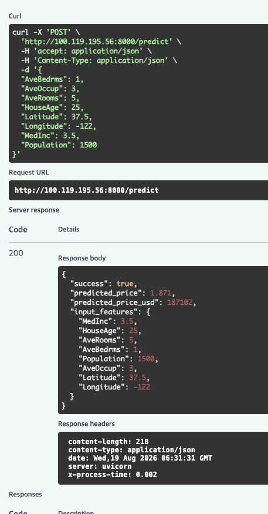
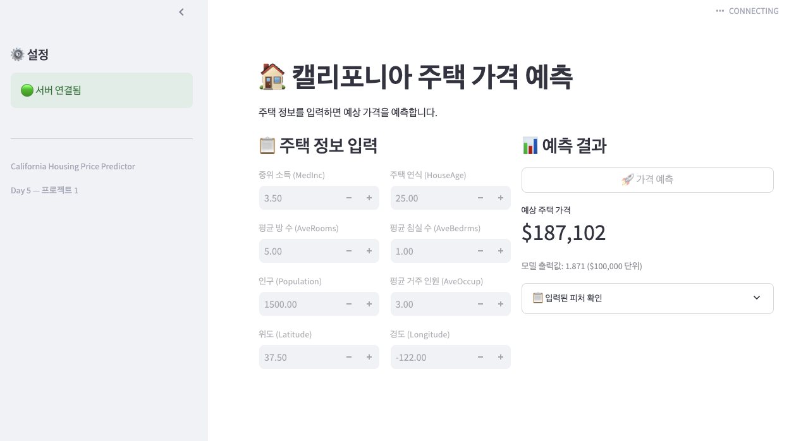
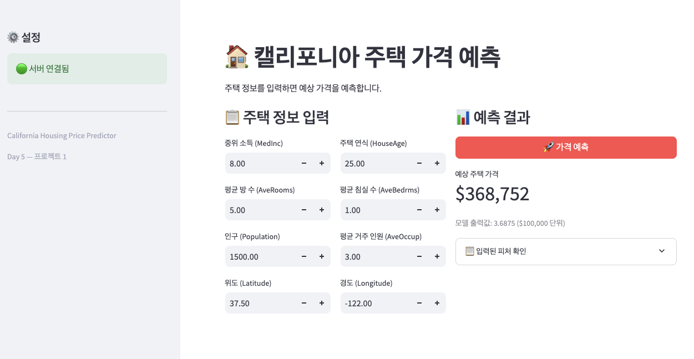
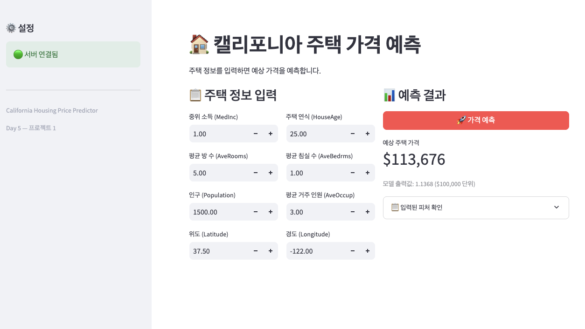

# DP05 — 정형 데이터 예측 서비스 만들기

모델 배포 기초 5일차. 프로젝트 1이라 새 개념을 배우는 날이 아니라
Day 1부터 4까지 배운 걸 새 데이터에 처음부터 끝까지 다시 끼워 맞추는 날이었다.
노트북은 같은 폴더의 [`모델배포개론05.ipynb`](모델배포개론05.ipynb) 이고,
아래 숫자는 전부 그 노트북 셀 출력에서 가져온 것이다.

```
환경    Ubuntu · Python 3.12.3 · torch 2.9.1(ROCm) · fastapi · streamlit
포트    FastAPI 8000 · Streamlit 8507
데이터  California Housing (scikit-learn 내장, 20,640개 중 학습 16,512 / 테스트 4,128)
모델    입력 8개 - 64 - 32 - 1 짜리 MLP, 회귀
```

소스는 같은 폴더에 같이 뒀다.

| 파일 | 무엇 |
| --- | --- |
| [`app/housing_model.py`](app/housing_model.py) | 모델 정의와 추론 모듈 |
| [`app/housing_schemas.py`](app/housing_schemas.py) | API 입출력 스키마 |
| [`app/housing_api.py`](app/housing_api.py) | FastAPI 서버 |
| [`frontend/app_housing.py`](frontend/app_housing.py) | Streamlit 대시보드 |
| [`models/`](models/) | 학습된 가중치와 전처리 파라미터 |

오늘 미션이 다섯 개였다.

```
1  캘리포니아 주택 데이터를 탐색하고 모델을 학습해서 추론 모듈로 분리하기
2  Swagger UI 에서 예측 API 테스트하기
3  Streamlit 입력 폼을 만들어 예측 결과까지 띄우기
4  정상 요청 / 에러 상황 / 동시 요청 / 헬스체크 네 가지 통합 테스트 돌리기
5  피어리뷰
```

---

## 1. MNIST 와 뭐가 달랐나

Day 1부터 4까지는 계속 MNIST 였다. 손글씨 이미지를 받아서 0부터 9 중에 뭔지 맞히는 분류였다.
오늘은 집 정보를 받아서 가격을 맞히는 회귀다. 데이터 형태가 바뀌니까 딸려서 바뀌는 게 꽤 많았다.

| | Day 1~4 (MNIST) | 오늘 (California Housing) |
| --- | --- | --- |
| 입력 | 28 곱하기 28 픽셀 | 컬럼 8개 |
| 태스크 | 분류 | 회귀 |
| 출력층 | 10칸 (클래스마다 하나) | 1칸 |
| 손실함수 | CrossEntropyLoss | MSELoss |
| 화면 | 클래스별 확률 막대그래프 | 예상 가격 하나 |

출력층이 1칸이고 손실함수가 MSELoss 라는 게 회귀라는 표시인 것 같다.
분류였으면 클래스 개수만큼 칸이 있고 확률로 나왔을 자리다.

타깃 단위도 좀 신경 쓰인다. 집값이 그냥 1.87 이런 식으로 나오는데 단위가 10만 달러라서
187,000 달러라는 뜻이다. 이걸 놓치면 화면에 1.87만 띄우고 끝날 뻔했다.

## 2. 전처리에서 제일 크게 배운 것

### 2.1 왜 정규화가 필요한가

2.1절에서 피처별 통계를 찍어봤는데 값의 크기 차이가 컸다.
중위 소득은 평균이 3.87 인데 인구는 평균이 1,425 다. 400배쯤 차이가 난다.
이대로 넣으면 모델이 인구를 중요한 값으로 착각할 수 있겠다는 생각이 들었다.
실제로 중요해서가 아니라 굳이 숫자가 커서 그런 건데도 그렇다.
그래서 전부 (값 빼기 평균) 나누기 표준편차 로 눌러준다.

### 2.2 테스트 데이터에도 학습 데이터의 평균과 표준편차를 쓴다

이게 처음엔 좀 이상하게 느껴졌다. 테스트 데이터의 평균을 쓰면 더 정확할 것 같은데 왜 안 쓰나 싶었다.
노트북 설명을 보니 테스트 데이터는 배포한 뒤에 들어올 새 데이터를 흉내 내는 것이라고 한다.
실제 서비스에서 손님이 집 정보 하나를 넣을 때 그 한 건으로 평균을 낼 수는 없으니까,
학습 때 구해둔 값을 계속 쓰는 수밖에 없다는 얘기였다.

### 2.3 모델만 저장하면 안 된다

오늘 제일 크게 배운 게 이거다. 2.4절에서 저장하는 게 두 개다.

```
models/housing_model.pth            학습된 가중치
models/housing_preprocessing.json   평균, 표준편차, 피처 이름 순서
```

json 을 빼먹으면 배포한 쪽에서 정규화를 못 한다. 그런데 에러가 안 난다.
정규화 안 된 원본 숫자를 그냥 넣어도 모양은 여전히 8칸이라 모델은 잘 돌아가고
예측값만 조용히 이상해진다. Day 1 에서 pth 파일만 전달하면 안 된다고 배운 것과 같은 얘기 같다.

### 2.4 피처 순서

추론 모듈에서 이 줄이 있다.

```python
values = [features[name] for name in self.feature_names]
```

처음엔 이 줄이 왜 필요한지 잘 몰랐다. 학습할 때는 이미 순서대로 들어 있는 배열이라
아무 일도 안 하는 줄처럼 보였다. 그런데 배포하면 딕셔너리로 들어오니까
그때는 진짜로 순서를 맞추는 일이 일어난다. 학습 코드만 보면 지워도 될 것처럼 보이는데
서빙에서는 꼭 필요한 줄이었다.
순서가 어긋나도 배열 길이는 여전히 8이라 에러가 안 난다는 점이 좀 무섭다는 생각이 들었다.

## 3. 결과

### 3.1 학습과 평가

50 에폭 돌리니까 Loss 가 0.5547 에서 0.3963 으로 내려갔다.
테스트 MSE 는 0.3311, MAE 는 0.3994 였다. 달러로 바꾸면 39,942 달러다.
평균 4만 달러쯤 빗나가는 모델인 것이다.

Swagger UI 에서도 직접 눌러봤다.



*POST /predict 에 기본 예시값을 넣고 실행하니 200 과 함께 predicted_price_usd 187102 가 돌아왔다.*

### 3.2 통합 테스트 네 가지

| 테스트 | 결과 |
| --- | --- |
| 정상 요청 | 200, 예상 가격 반환 |
| 에러 상황 4종 | 전부 422, 서버는 안 죽음 |
| 동시 요청 8개 | 전부 200, 전체 0.02초 |
| 헬스체크 | healthy |

동시 요청이 8개인데 전체가 0.02초로 끝난 게 인상적이었다.
한 건씩 차례로 처리했으면 8배가 됐을 텐데 그렇게 안 됐다.
Day 3 에서 배운 run_in_executor 로 추론을 별도 스레드에 넘겨서 그런 것 같다.
이게 없으면 이벤트 루프가 추론이 끝날 때까지 다른 요청을 못 받는다고 배웠다.

### 3.3 새니티 체크에서 걸린 것

소득을 올리면 가격이 오르는지 보는 테스트인데, 결과가 이렇게 나왔다.

```
저소득 지역     104,162 달러
평균적 주택     187,102 달러
고소득 지역     500,503 달러
```

화면에서도 직접 확인했다.



*기본값 그대로 예측을 눌렀을 때. 사이드바에 서버 연결됨 표시가 떠 있다.*



*중위 소득만 8.00 으로 올리니 368,752 달러가 됐다.*



*중위 소득만 1.00 으로 내리니 113,676 달러가 됐다. 소득을 올리면 오르고 내리면 내린다.*

소득을 올리니 가격이 오르는 건 상식대로 나왔다. 그런데 고소득 지역 값이 좀 걸린다.
2.1절에서 타깃 범위를 찍어보면 최대가 5.00001 인데 이건 50만 달러가 조금 넘는 값이다.
**학습 데이터에 있는 제일 비싼 집보다 비싼 값을 모델이 내놓은 것이다.**
학습할 때 본 적 없는 구간인데도 아무 표시 없이 200 으로 나갔다.

## 4. 개선 실험 (5.5절)

여기부터는 노트북에 없던 내용이고 시간이 남아서 따로 해본 것이다.
5장까지는 손대지 않고 뒤에 새 절로 붙였다. 원래 결과와 비교하려면 원래 결과가 남아 있어야 해서다.

### 4.1 왜 해봤나

2.1절에서 찍은 통계 중에 평균 거주 인원이 좀 이상했다. 평균이 3.07 인데 표준편차가 10.39 다.
표준편차가 평균의 3배가 넘는다는 건 값 몇 개가 유난히 크다는 뜻인 것 같았다.
이러면 정규화를 해도 평범한 집들이 0 근처에 다 뭉쳐버릴 수 있겠다는 생각이 들었다.

그리고 예전에 데이터분석 과정에서 캐글 집값 예측을 할 때 이걸 한 번 시도했다가 접은 적이 있다.
쏠린 피처에 로그를 씌워봤는데 LightGBM 점수가 121,762 에서 121,766 으로 거의 안 변해서
소용없다고 정리했었다. 그때 쓴 모델이 트리였다.
트리는 값의 크기가 아니라 이 값보다 큰가 작은가만 보기 때문에
순서를 안 바꾸는 로그 변환에는 꿈쩍도 안 한다고 그때 정리해뒀었다.
같은 실험에서 선형 모델은 213,658 에서 181,843 으로 확 좋아졌었다.
**오늘 모델은 트리가 아니라 신경망이라서, 그때 접은 게 오늘은 통할 수도 있겠다 싶었다.**

### 4.2 실험 네 가지

```
원본        노트북 그대로
로그        쏠린 피처와 타깃에 log1p
로그+거리    해안까지 · LA 까지 · SF 까지 거리를 피처로 추가
로그+이웃    가장 가까운 집 20채의 평균 가격 · 소득 · 방수를 피처로 추가
```

시드 하나로는 못 믿을 것 같아서 시드 8개를 쓰고 같은 시드끼리 짝지어 비교했다.
같은 시드면 출발점이 같으니 출렁임이 양쪽에 똑같이 들어가서 빼면 상쇄된다.

### 4.3 결과

```
방식               평균 MAE           달러        원본 대비
원본               0.3917       39,173         0.0%
로그               0.3799       37,988         3.0%
로그+거리            0.3716       37,163         5.1%
로그+이웃            0.2665       26,653        32.0%

짝지은 비교 (같은 시드끼리 뺀 것)
  원본     -> 로그        +1,185달러   | 8/8 승 | 짝차 표준편차 0.0044 | 일관됨
  로그     -> 로그+거리     +825달러   | 7/8 승 | 짝차 표준편차 0.0067 | 애매함
  로그     -> 로그+이웃  +11,335달러   | 8/8 승 | 짝차 표준편차 0.0067 | 일관됨
  원본     -> 로그+이웃  +12,520달러   | 8/8 승 | 짝차 표준편차 0.0043 | 일관됨
```

한 가지 짚어둘 게 있다. 3.1절에 적은 테스트 MAE 는 0.3994 인데
이 표의 원본 값은 그것보다 조금 낮게 나온다. 같은 설정인데 값이 다른 이유가 있다.
3.1절은 시드를 안 정하고 한 번 돌린 값이고, 이 표는 시드 8개를 돌린 평균이다.
시드마다 결과가 출렁이니까 한 판 값과 여덟 판 평균이 딱 맞을 이유가 없다.
비교하려고 배치 크기와 에폭 수는 2.3절과 같게 맞춰뒀다.

### 4.4 알게 된 것

**로그는 통했다.** 예전에 트리에서 안 통하던 게 신경망에서는 통했다.
같은 기법이라도 어떤 모델에 쓰느냐에 따라 결과가 갈린다는 걸 직접 확인했다.

**거리 피처는 판정이 애매하게 나왔다.** 해안까지, LA 까지 거리를 넣으면 좋아질 줄 알았는데
825달러 정도 좋아지는 데 그쳤고 여덟 시드 중 일곱에서만 이겼다.
평균 차이가 시드끼리의 출렁임과 비슷한 크기라서 확실히 좋아졌다고 말하기 어려운 것 같다.
실제로 시드를 다르게 잡아 몇 번 돌려보니 이긴 횟수가 그때그때 달라졌다.
생각해보니 그 거리들은 전부 위도와 경도로 계산한 값이다.
모델이 이미 위도와 경도를 갖고 있으니 내가 계산해서 준 게 새 정보가 아니었던 것 같다.
신경망은 그 정도 계산은 알아서 하는 모양이다.

**이웃 통계는 크게 통했다.** 11,335달러가 좋아졌고 여덟 시드에서 전부 이겼다.
거리 피처가 준 825달러와 비교하면 열 배가 넘는다.
주변 집 20채의 평균 가격 같은 건 내 집의 8개 값만 봐서는 절대 만들 수 없는 값이다.
다른 집들에서 오는 정보라서 그렇다.
거리 피처와 이웃 피처를 나란히 놓고 보니 차이가 분명했다.
점수를 올린 건 있는 값을 바꾼 쪽이 아니라 없던 정보를 넣은 쪽이었다.

**좋아진 만큼 배포가 무거워졌다.** 이게 오늘 배운 것과 제일 크게 이어지는 부분이다.
2.4절에서 모델만 저장하면 안 된다고 배웠는데, 전처리를 손댈 때마다 같이 보내야 하는 게 계속 늘어났다.

```
원본        pth 파일 + 평균, 표준편차, 피처 이름          (3항목)
로그        + 어느 피처에 로그를 씌웠는지, 타깃에도 씌웠는지  (5항목)
로그+이웃    + 주변 집 정보를 찾을 재료를 통째로
```

로그를 씌웠다는 사실을 안 적어두면 배포한 쪽에서 로그 안 씌운 값을 그대로 넣게 되고,
그러면 또 에러 없이 값만 틀린다. 2.4절에서 본 것과 똑같은 모양이다.
정확도를 얻는 대신 배포가 복잡해지는 맞바꿈이 있다는 걸 알게 됐다.

API 는 계속 원본 모델을 쓰게 뒀다. 개선한 모델을 서빙에 바로 물리면
위의 5장 테스트 결과와 어긋나기 때문이다. 실험은 실험대로 남기고
서비스에는 검증을 마친 걸 쓰는 게 맞다고 생각했다.

## 5. 스키마가 막지 못하는 입력 (5.6절)

3.1절에서 위도에 32 이상 42 이하, 경도에 -125 이상 -114 이하를 걸었다.
슬라이드에도 캘리포니아 밖 좌표는 입구에서 막힌다고 되어 있었고,
3.3절에서 위도 50 을 넣었을 때 실제로 422 가 나오는 것도 확인했다.

그런데 이건 사각형이고 캘리포니아는 사각형이 아니라서, 재보기로 했다.

### 5.1 사각형 안이 다 캘리포니아는 아니었다

0.5도 크기 칸으로 쪼개보니 사각형 안에 440칸이 있는데
학습 데이터가 있는 칸은 176칸이었다. 40퍼센트다.
나머지 60퍼센트는 바다이거나 옆 주인데 스키마는 전부 통과시킨다.

### 5.2 통과하는데 캘리포니아가 아닌 곳들

다른 값은 전부 평균으로 고정하고 위치만 바꿔서 넣어봤다.

```
장소                     스키마    가까운 학습점        예측
라스베이거스 (네바다)        통과       94km      79,199
태평양 한가운데            통과      143km     415,751
멕시코 티후아나 남쪽         통과       53km     187,660
로스앤젤레스              통과        0km     208,464
프레즈노                 통과        0km     116,000
```

다섯 곳이 전부 통과했다. 제일 이상한 건 태평양이다.
바다 한가운데 좌표에 415,751 달러가 나왔는데, 실제 캘리포니아 안에 있는
프레즈노(116,000 달러)보다 3배 넘게 비싸다.
모델 입장에서는 해안에 가까운 위치라서 그런 것 같고,
거기가 바다인지 육지인지는 알 방법이 없다.
라스베이거스는 아예 다른 주인데 422 가 아니라 값이 나온다.

### 5.3 형식이 맞는 것과 답할 자격이 있는 것은 다른 것 같다

**Pydantic 의 범위 검증은 형식이 맞는지를 보는 것에 가깝다는 생각이 들었다.**
숫자인가, 정해둔 범위 안인가를 본다. 그건 확실히 잘 한다.
3.3절에서 확인한 대로 범위 밖은 정확히 422 로 막힌다.

그런데 오늘 필요한 건 이 모델이 답을 낼 자격이 있는 입력인가 쪽인데,
이 둘이 같은 질문이 아닌 것 같다.

앞에서 걸렸던 것들도 같은 줄기였다.
새니티 체크에서 고소득 지역이 500,503 달러로 나온 것도
학습 데이터의 제일 비싼 집보다 비싼 값인데 스키마는 통과했다.
방 수나 인구에는 아예 상한을 안 걸어놨다.

제대로 막으려면 사각형 대신 학습 데이터와 얼마나 가까운지를 보는 방법이 있을 것 같은데,
그건 스키마만으로는 안 되고 모델 쪽에서 판단해야 하는 일이라
오늘 범위를 넘는다는 생각이 들었다.

### 5.4 그 밖에 걸리는 것

**예측에 근거가 안 붙는다.** 지금 API 는 숫자 하나만 돌려준다.
학습 범위 밖 입력이라는 표시도 없고, 타깃이 50만 달러 근처에서 잘려 있다는 안내도 없다.
쓰는 사람은 그 값을 얼마나 믿어도 되는지 알 방법이 없다.

## 6. 체크포인트 답

노트북 절마다 있는 체크포인트에 답해봤다.

### 1절 체크포인트

**1. 이 프로젝트의 입력과 출력은 각각 무엇인가**

입력은 숫자 피처 8개다. 중위 소득, 주택 연식, 평균 방 수, 평균 침실 수, 인구, 평균 거주 인원, 위도, 경도.
출력은 그 동네의 중위 주택 가격 하나다. 단위가 10만 달러라서 1.87 이면 187,000 달러라는 뜻이다.

**2. MNIST 프로젝트와 비교했을 때 데이터 형태가 어떻게 다른가**

Day 1부터 4까지 쓴 MNIST 는 이미지였다. 28 곱하기 28 픽셀 흑백 그림을 넣고 0부터 9 중에 뭔지 맞히는 분류였다.
오늘은 표에 들어가는 숫자 8개를 넣고 가격이라는 연속된 값을 맞히는 회귀다.
데이터 형태가 바뀌니까 전처리도 스키마도 화면 입력 방식도 전부 따라 바뀌었다.

**3. 오늘 새로 만들 파일 3개의 이름과 역할**

`app/housing_model.py` 는 모델 구조인 HousingModel 을 정의하고,
전처리 파라미터를 읽어서 추론까지 하는 HousingPredictor 를 담고 있다.

`app/housing_schemas.py` 는 요청으로 들어오는 값이 제대로 된 값인지 보는 HousingRequest 와,
돌려줄 값의 모양을 적어둔 HousingResponse 를 정의한다.

`app/housing_api.py` 는 실제로 요청을 받는 FastAPI 서버다. /predict 와 /health 를 만들고,
추론은 별도 스레드풀로 넘겨서 처리한다.

---

### 2절 체크포인트

**1. 정규화에서 학습 데이터의 통계를 테스트 데이터에도 쓰는 이유**

테스트 데이터는 배포한 뒤에 들어올 새 데이터를 흉내 내는 것이라고 한다.
실제 서비스에서는 손님이 집 정보 하나를 넣는데, 그 한 건으로 평균을 낼 수가 없다.
그래서 학습할 때 구해둔 평균과 표준편차를 계속 쓰는 수밖에 없는 것 같다.
테스트 데이터의 평균을 쓰면 지금은 더 정확해 보여도, 배포하면 못 하는 방식이라 의미가 없다.

**2. 모델 가중치 외에 함께 저장해야 하는 것은 무엇이고 왜 필요한가**

학습 데이터에서 구한 평균과 표준편차, 그리고 피처 이름 순서를 같이 저장해야 한다.
`models/housing_preprocessing.json` 이 그 파일이다.

가중치 파일만 있으면 배포한 쪽에서 정규화를 할 수가 없다.
그런데 정규화를 안 하고 원본 숫자를 그냥 넣어도 에러가 안 난다.
모양은 여전히 8칸이라 모델은 잘 돌아가고 예측값만 이상해진다.
에러로 티가 나면 차라리 나은데 조용히 틀리는 쪽이라 더 조심해야 한다는 생각이 들었다.

**3. HousingPredictor.predict() 에서 피처를 self.feature_names 순서로 배열하는 이유**

모델은 첫 번째 자리가 소득, 두 번째 자리가 연식 이런 식으로 자리로만 기억한다.
그런데 API 로 들어오는 건 딕셔너리라서 순서를 믿을 수가 없다.
그래서 학습할 때 쓴 이름 순서대로 값을 꺼내서 배열을 만들어야 한다.

이 줄이 처음에는 왜 있는지 잘 몰랐다.
학습할 때는 이미 순서대로 들어 있는 배열이라 아무 일도 안 하는 줄처럼 보였다.
그런데 배포하면 딕셔너리로 들어오니까 그때 진짜로 순서를 맞추는 일이 일어난다.
순서가 바뀌어도 길이는 그대로 8이라 에러가 안 난다는 점이 좀 무섭다.

---

### 3절 체크포인트

**1. HousingRequest 에서 Latitude 에 ge=32, le=42 제한을 넣은 이유**

학습에 쓴 캘리포니아 데이터의 위도가 대략 32도에서 42도 사이다.
그 밖의 위치를 넣으면 모델이 학습할 때 본 적 없는 값인데도 거절을 못 하고 아무 숫자나 내놓는다.
그래서 모델까지 가기 전에 스키마에서 막고 422 를 돌려준다.

**2. request.model_dump() 는 어떤 역할을 하나**

검증을 통과한 HousingRequest 객체를 딕셔너리로 바꿔준다.
`{"MedInc": 3.5, "HouseAge": 25.0, ...}` 이런 모양이 된다.
추론 모듈인 HousingPredictor.predict() 가 딕셔너리를 받게 되어 있어서 이 변환이 필요하다.

**3. run_in_executor 를 사용하지 않으면 어떤 문제가 생기나**

모델 추론은 CPU 를 붙잡고 놓지 않는 작업이다.
이걸 async def 안에서 그냥 부르면 이벤트 루프가 추론이 끝날 때까지 아무것도 못 한다.
그러면 동시에 들어온 다른 요청은 물론이고 /health 같은 가벼운 요청까지 다 밀린다.
동시 요청이 4개면 1초가 아니라 4초가 될 수 있다.
별도 스레드풀로 넘겨야 이벤트 루프가 계속 다른 요청을 받을 수 있다.

---

### 4절 체크포인트

**1. MNIST 대시보드와 비교했을 때 입력 방식이 어떻게 다른가**

Day 4 의 MNIST 대시보드는 이미지 파일을 올려서 넣었다. 그림 한 장이 입력이었다.
오늘은 소득, 연식, 위도, 경도 같은 숫자 8개를 사람이 직접 칸에 적어 넣는다.
`st.number_input` 을 8개 놓은 형태다. 올릴 파일이 없고 대신 채울 칸이 여덟 개다.

**2. st.number_input() 에서 min_value, max_value 를 설정하는 이유**

화면에서 먼저 막아주려고 그런다.
소득에 음수를 넣거나 캘리포니아를 한참 벗어난 위도를 넣는 걸 애초에 못 하게 한다.
스키마가 어차피 막긴 하지만, 잘못 넣고 나서 422 를 보는 것보다 아예 못 넣게 하는 게 나은 것 같다.

다만 같은 범위가 화면과 스키마 두 군데에 적혀 있는 셈이라, 나중에 한쪽만 고치면 어긋날 수 있겠다는 생각이 들었다.

**3. request_data 딕셔너리의 키 이름이 HousingRequest 필드 이름과 일치해야 하는 이유**

FastAPI 는 요청으로 들어온 JSON 의 키 이름을 보고 스키마의 어느 필드인지 찾는다.
이름이 하나라도 다르면 그 필드가 안 왔다고 보고 422 를 낸다.
`MedInc` 를 `medinc` 로 적어도 마찬가지다.

---

### Day 5 최종 체크포인트

**Q1. 전처리 파라미터를 모델과 함께 저장해야 하는 이유**

배포한 쪽에서 학습 때와 같은 정규화를 하려면 그때 쓴 평균과 표준편차가 필요하다.
실제 서비스에서는 입력이 한 건씩 들어와서 그 자리에서 통계를 낼 수가 없다.
없으면 정규화를 못 하는데 에러는 안 나고 예측값만 이상해진다.

**Q2. HousingRequest 에서 Latitude 에 ge=32, le=42 를 넣은 이유**

캘리포니아 데이터로만 학습해서 그 밖의 위치에는 답할 근거가 없는데,
모델은 거절을 못 하고 아무 값이나 내놓기 때문이다. 그래서 모델 앞에서 막는다.

다만 이번에 5.6절에서 재보니 이 범위가 사각형이라 그 안에 바다도 들어가고 옆 주도 들어간다.
막는 것도 정도의 문제라는 생각이 들었다.

**Q3. Streamlit 입력값 이름이 Pydantic 필드 이름과 일치해야 하는 이유**

FastAPI 가 요청 JSON 의 키 이름으로 필드를 찾기 때문이다.
이름이 다르면 필드가 없다고 보고 422 를 낸다.

**Q4. run_in_executor 를 제거하면 어떤 문제가 생기나**

추론이 CPU 를 붙잡고 있는 동안 이벤트 루프가 멈춰서 다른 요청을 못 받는다.
동시 요청과 헬스체크까지 전부 밀린다.
실제로 통합 테스트에서 동시 8개가 전체 0.02초에 끝났는데, 이게 없었으면 8배가 됐을 것 같다.

**Q5. MNIST 프로젝트와 오늘 프로젝트의 가장 큰 차이는**

이미지 분류에서 정형 데이터 회귀로 바뀐 것이고, 그것 때문에 나머지가 전부 따라 바뀌었다.
전처리가 픽셀을 255 로 나누는 것처럼 간단하지 않고
피처마다 다른 평균과 표준편차를 따로 저장해야 한다는 점이 제일 달랐다.
출력도 클래스별 확률이 아니라 숫자 하나라서 화면에 무엇을 보여줄지 새로 정해야 했다.
