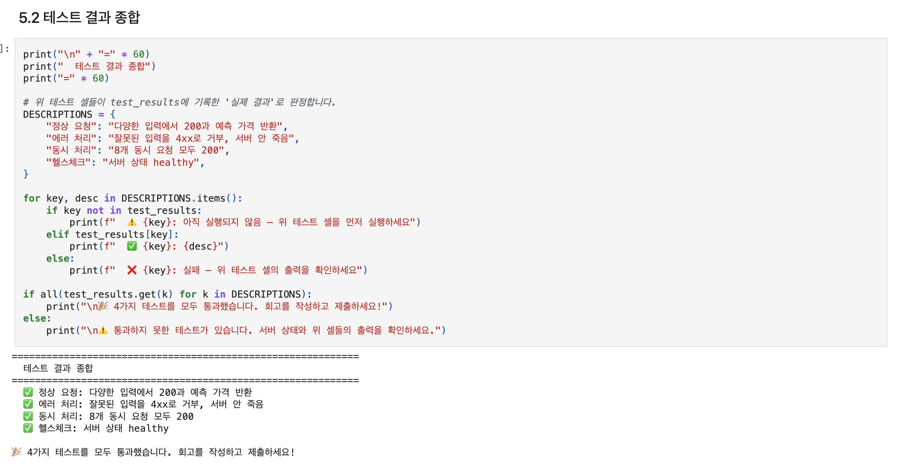
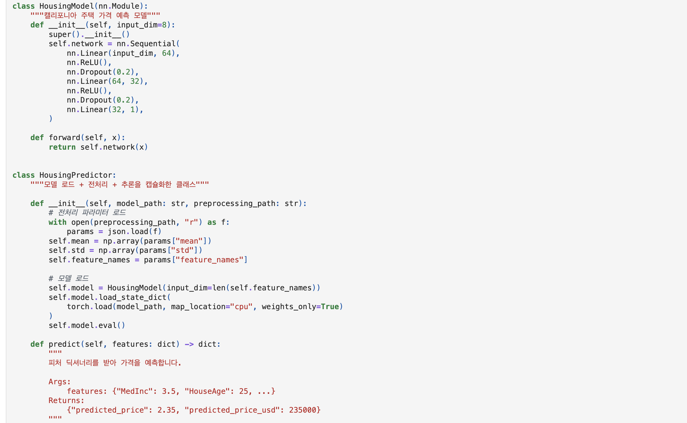
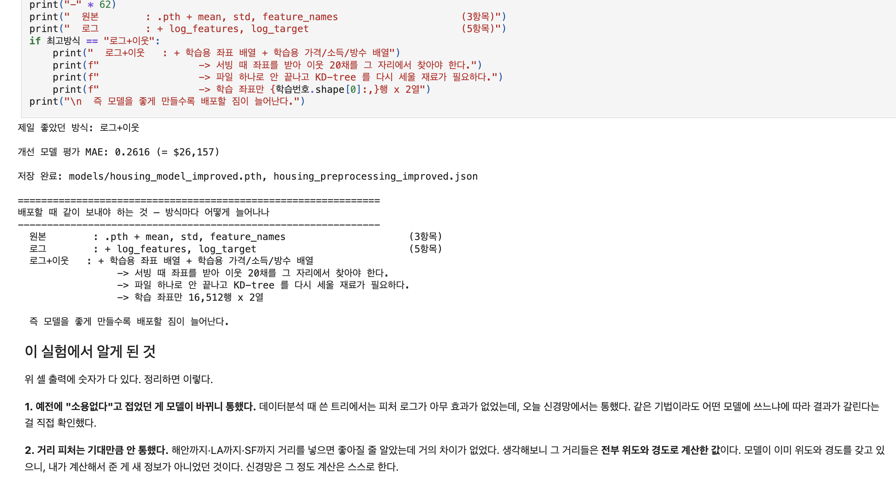
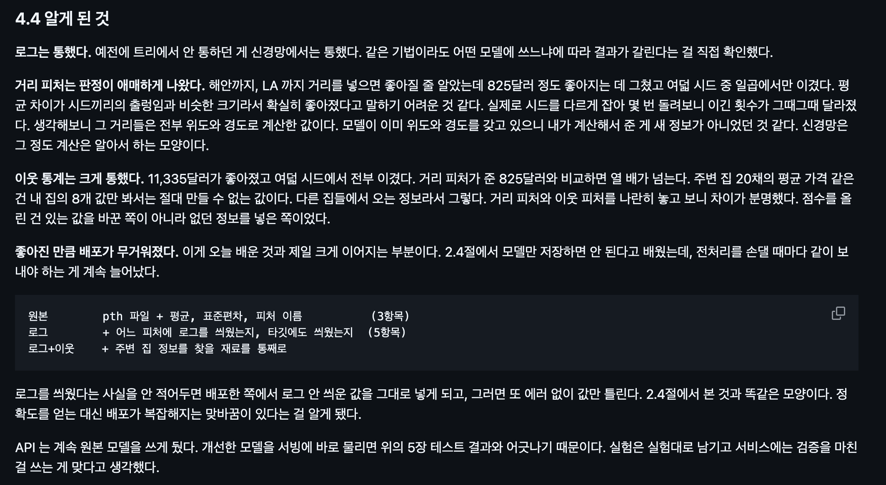
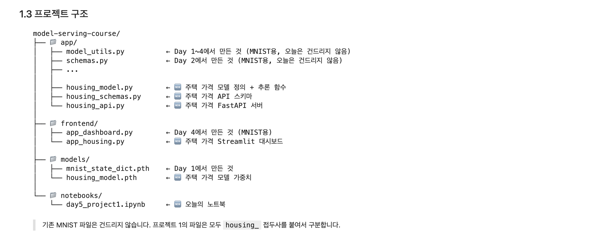

# AIFFEL Campus Online Code Peer Review Templete

- 코더 : 김민욱님
- 리뷰어 : 강경수

# PRT(Peer Review Template)

- ✅ **1. 주어진 문제를 해결하는 완성된 코드가 제출되었나요?**
  - 모델 학습부터 FastAPI, Streamlit, 정상·에러·동시 요청·헬스체크 통합 테스트까지 전체 흐름이 완성되어 있어 요구사항을 잘 충족했습니다.
  - 

- ✅ **2. 전체 코드에서 가장 핵심적이거나 가장 복잡하고 이해하기 어려운 부분에 작성된 주석 또는 doc string을 보고 해당 코드가 잘 이해되었나요?**
  - `HousingPredictor`의 모델 로드·정규화·추론 과정과 FastAPI 비동기 추론 부분에 주석과 docstring이 잘 작성되어 있어 코드의 역할과 흐름을 이해하기 좋았습니다.
  - 

- ✅ **3. 에러가 난 부분을 디버깅하여 문제를 해결한 기록을 남겼거나 새로운 시도 또는 추가 실험을 수행해봤나요?**
  - 로그 변환·거리 피처·이웃 통계를 시드 8개로 비교하고 입력 검증 범위의 한계까지 추가로 점검하여, 기본 요구사항을 넘어선 실험과 분석이 잘 이루어졌습니다.
  - 

- ✅ **4. 회고를 잘 작성했나요?**
  - 전처리 재현성, 피처 순서, 모델별 전처리 효과, 배포 복잡성, 스키마 검증의 한계까지 배운 점을 구체적으로 연결해 회고한 점이 좋았습니다.
  - 

- ✅ **5. 코드가 간결하고 효율적인가요?**
  - 모델·스키마·API·프론트엔드를 각각 모듈로 분리하고 `HousingPredictor`, `call_api` 등으로 기능을 캡슐화해 중복이 적고 구조가 명확했습니다.
  - 

# 회고(참고 링크 및 코드 개선)

모델 학습부터 API와 UI, 통합 테스트까지 전체 서비스 흐름이 잘 연결되어 있어 구조를 이해하는 데 도움이 많이 되었습니다.  
특히 추가 실험을 통해 새로운 피처가 성능에 주는 영향과 전처리가 복잡해질수록 배포도 함께 복잡해진다는 점까지 확인한 부분에서 배울 점이 많았습니다.
