# DP06 — 인증과 이미지 업로드 붙이기

모델 배포 기초 6일차. 어제까지 만든 API 는 주소만 알면 누구나 부를 수 있었는데,
오늘은 키를 가진 사람만 부를 수 있게 막는 것과 숫자 대신 이미지 파일을 받는 것을 붙였다.
노트북은 같은 폴더의 [`모델배포개론06.ipynb`](모델배포개론06.ipynb) 이고,
아래 숫자는 그 노트북 셀 출력에서 가져온 것이고,
7절과 8절은 노트북 밖에서 따로 돌린 것이다.

```
환경    Ubuntu · Python 3.12.3 · torch 2.9.1(ROCm) · fastapi · uvicorn
포트    FastAPI 8000 (순서 재보는 실험용 서버 8010, 7절 체인 실험 8020~8022)
모델    Day 1 에서 학습해 둔 MNIST 분류 모델 (models/mnist_state_dict.pth)
입력    올라온 이미지를 28 곱하기 28 그레이스케일로 줄여서 넣는다
```

소스는 같은 폴더에 같이 뒀다.

| 파일 | 무엇 |
| --- | --- |
| [`app/auth.py`](app/auth.py) | API Key 검증 (오늘 새로 만든 것) |
| [`app/image_utils.py`](app/image_utils.py) | 업로드 파일 검증과 전처리 (오늘 새로 만든 것) |
| [`app/image_api.py`](app/image_api.py) | 인증과 업로드를 붙인 이미지 분류 서버 (오늘 새로 만든 것) |
| [`app/order_probe.py`](app/order_probe.py) | 5.3 실험에만 쓴 서버. 서버 안에서 일이 일어난 순서를 찍어보려고 만들었다 |
| [`chain/`](chain/) | 7절에서 만든 직렬 3단 서버 (게이트웨이, 전처리, 추론) |
| [`distill/`](distill/) | 8절에서 쓴 모델 도용 실험 스크립트 네 개 |

오늘 미션은 다섯 개였다.

```
1  auth 모듈을 만들어 인증이 붙은 엔드포인트와 안 붙은 엔드포인트를 비교해보기
2  이미지 업로드에 크기 제한과 형식 검증, 리사이징 걸기
3  API Key 인증 + UploadFile + MNIST 모델을 합친 API 완성하기
4  테스트 다섯 종을 돌려보기 (인증 없음 401 / 잘못된 키 401 / 정상 요청 / 잘못된 형식 400 / 연속 이미지)
5  Swagger UI 에서 직접 이미지를 올려보고 프로젝트 구조 확인하기
```

---

## 1. 오늘 새로 붙은 것은 두 개

Day 5 까지는 계속 숫자였다. 집 정보 여덟 개를 JSON 으로 보내면 결과 하나가 나왔다.
오늘 바뀐 건 두 가지인데, 하나는 "누가 부르는지 확인하는 것" 이고 다른 하나는 "파일을 받는 것" 이다.

| | Day 5 까지 | 오늘 |
| --- | --- | --- |
| 입력 | JSON 안의 숫자 여덟 개 | 이미지 파일 |
| 크기 | 몇 백 바이트로 거의 고정 | 몇 KB 에서 몇 MB 까지 왔다갔다 |
| 검증 | 값의 범위가 맞는지 | 진짜 이미지인지, 너무 크지 않은지 |
| 호출 권한 | 주소만 알면 누구나 | X-API-Key 헤더가 맞아야 |

값 검증은 Day 5 에서 스키마로 했는데, 파일은 스키마로 걸러지는 게 아니라
직접 열어봐야 알 수 있다는 부분이 새로 확인된 점이다.

---

## 2. API Key 인증

### 2.1 헤더 이름이 함수 파라미터 이름에서 나온다

`auth.py` 에 검증 함수를 하나 만들고 파라미터를 `x_api_key: str = Header(None)` 으로 적으면,
FastAPI 가 요청의 `X-API-Key` 헤더 값을 그 변수에 넣어준다.
언더스코어를 하이픈으로 바꾸고 대소문자는 무시하는 방식이라고 한다.

이게 Swagger UI 에도 그대로 나와서, 캡처 07 을 보면 입력란 이름이 `x-api-key` 로 떠 있다.
문서를 따로 적어준 게 아니라 함수 파라미터에서 만들어진 것이라
Day 2 에서 스키마가 문서로 이어지던 것과 유사한 구조라는 생각이 들었다.

`Header(None)` 의 `None` 은 헤더가 아예 없을 때 들어오는 값이다.
그래서 키가 없는 경우와 키가 틀린 경우를 따로 나눠서 메시지를 다르게 줄 수 있었다.

### 2.2 Depends 한 줄이 하는 일

엔드포인트 함수에 `user: str = Depends(verify_api_key)` 를 한 줄 넣는 게 전부다.
그러면 요청이 들어왔을 때 엔드포인트 본문보다 먼저 `verify_api_key` 가 실행되고,
성공하면 그 반환값("사용자A")이 `user` 변수에 담겨서 들어온다.
실패해서 HTTPException 이 나면 엔드포인트 본문은 아예 실행되지 않는다.

인증 코드를 엔드포인트마다 복사해 넣지 않아도 되는 게 편했다.
`/health` 처럼 아무나 불러도 되는 곳은 이 줄을 안 붙이면 그대로 열려 있다.

### 2.3 401 이라는 응답

인증에 실패하면 401 을 준다. 401 은 "네가 누군지 확인이 안 된다" 는 뜻이고,
누군지는 알지만 권한이 없을 때 쓰는 403 과는 다르다고 한다.
오늘 만든 건 사용자 구분 없이 키만 보는 방식이라 전부 401 로 끝났다.

---

## 3. 업로드 안전장치는 네 단계

`image_utils.py` 의 `validate_and_read_image` 가 순서대로 네 가지를 한다.

```
1. 타입 검증     content_type 이 image/png 나 image/jpeg 인지        아니면 400
2. 크기 검증     다 읽어서 5MB 넘는지                                넘으면 400
3. 디코딩 검증   PIL 로 실제로 열리는지                              안 열리면 400
4. 리사이징      그레이스케일로 바꾸고 28 곱하기 28 로 줄이기         (에러 없이 변환)
```

1번의 `content_type` 은 보내는 쪽이 적어주는 값이라 얼마든지 다르게 쓸 수 있다.
그래서 이건 텍스트 파일처럼 대놓고 엉뚱한 것만 싸게 걸러내는 단계이고,
진짜로 이미지인지는 3번에서 열어봐야 알 수 있다는 것이 노트북 설명이었다.
이 부분은 말로만 되어 있어서 5.1 에서 직접 해봤다.

4번은 에러를 내지 않는 단계다. 큰 이미지가 와도 28 곱하기 28 로 줄여버린다.
모델이 28 곱하기 28 흑백만 받도록 학습되어 있어서 그 크기로 맞춰주는 것인데,
어떤 크기가 들어와도 같은 크기로 나온다는 점에서 검증이라기보다 변환에 가깝다.

---

## 4. 섹션 6 실행 결과

### 4.1 서버 실행

모델은 요청마다 읽지 않고 서버가 켜질 때 한 번만 읽는다. lifespan 안에서 로드한다.

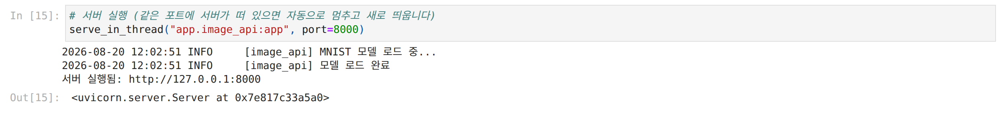

### 4.2 테스트 다섯 종

**테스트 1. 키 없이 요청하면 401**

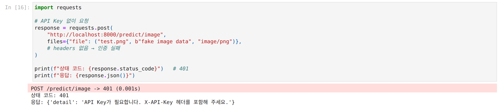

**테스트 2. 틀린 키로 요청해도 401 인데 메시지가 다르다**

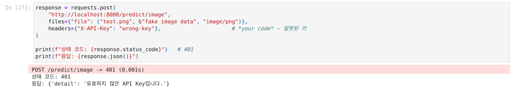

키가 없을 때는 "API Key가 필요합니다", 틀렸을 때는 "유효하지 않은 API Key입니다" 로 갈린다.
같은 401 이어도 부르는 쪽에서 뭘 고쳐야 하는지 알 수 있어서 나눠둔 것 같다.

**테스트 3. 올바른 키와 MNIST 이미지를 보내면 성공**

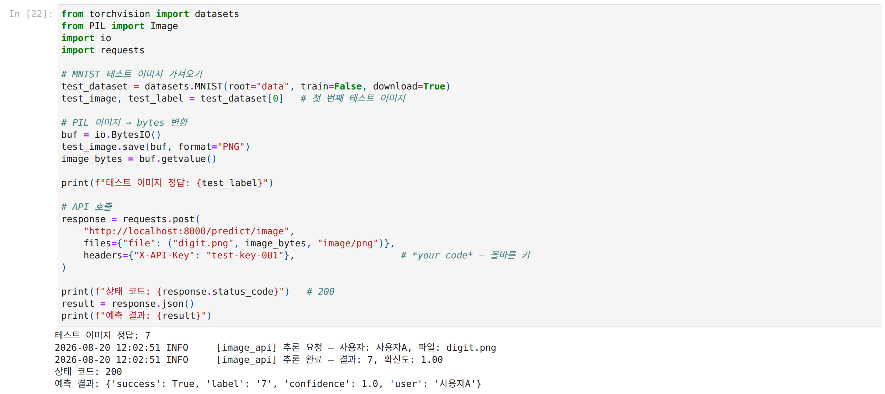

정답이 7 인 이미지를 보냈고 `{'success': True, 'label': '7', 'confidence': 1.0, 'user': '사용자A'}` 가 왔다.
응답에 `user` 가 같이 들어가는 게 눈에 띄었는데, 이건 인증 함수가 돌려준 값이 그대로 실려 나온 것이다.

**테스트 4. 텍스트 파일을 보내면 400**

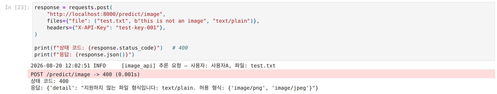

`text/plain` 은 1번 타입 검증에서 걸렸다. 401 이 아니라 400 인 게 중요한 것 같은데,
키는 맞았으니 누구인지는 확인이 된 것이라고 생각된다. 이건 보낸 내용이 잘못된 경우라서 그럴 것이다.

**테스트 5. 다섯 장 연속으로 보내기**

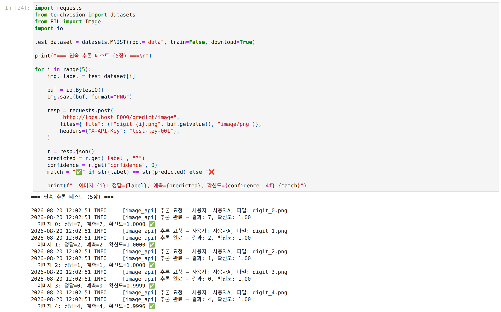

정답이 7, 2, 1, 0, 4 인 이미지 다섯 장을 연달아 보냈고 전부 확인되었다.
확신도는 앞의 세 장이 1.0000, 나머지가 0.9999 와 0.9996 이었다.

### 4.3 Swagger UI (6.8)

`UploadFile` 을 쓰면 Swagger 화면에 파일 선택 버튼이 자동으로 생긴다.
`x-api-key` 칸에 `test-key-001` 을 넣고 digit.png 를 올려서 Execute 를 눌렀다.

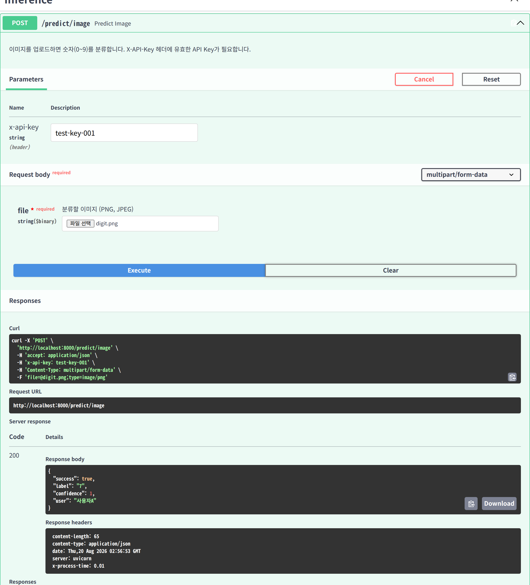

200 이 오고 응답 본문에 `"label": "7"` 이 찍혔다.
응답 헤더의 `x-process-time: 0.01` 은 Day 3 에서 만든 미들웨어가 붙여주는 값이다.

같은 화면에서 키만 `wrong-key` 로 바꿔서 한 번 더 눌러봤다.

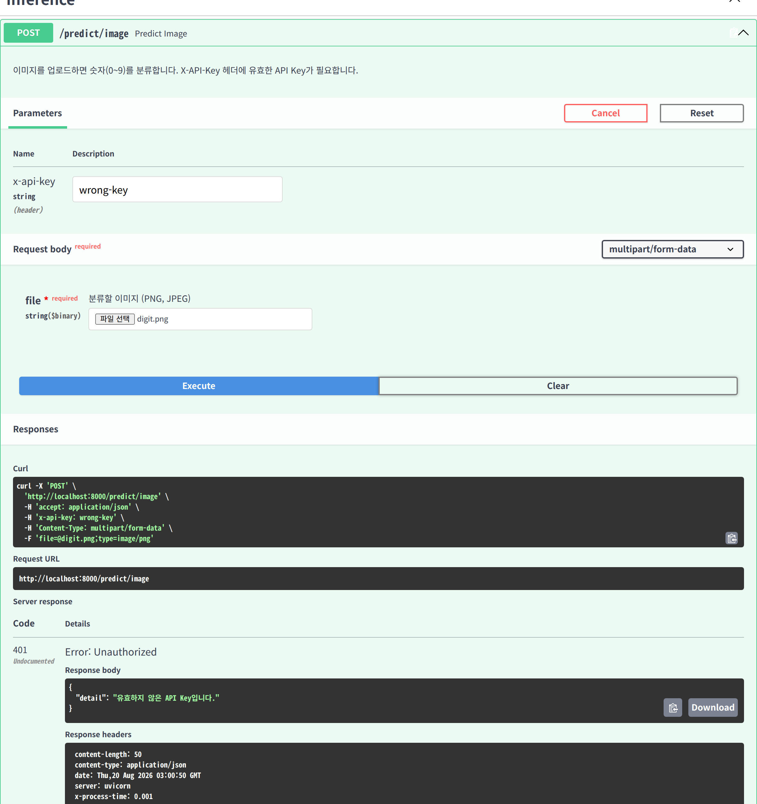

이번에는 401 과 함께 "유효하지 않은 API Key입니다" 가 왔다.
파일은 똑같이 올렸는데 키만 바뀌어서 막힌 것이다. 이 점이 5.3 실험으로 이어졌다.

### 4.4 프로젝트 구조

오늘 새로 생긴 건 `app/` 안의 세 개다. 나머지는 Day 1 부터 5 까지 만들어 둔 것을 그대로 가져다 썼다.

```
model-serving-course/
├── app/
│   ├── auth.py           (오늘) API Key 검증
│   ├── image_utils.py    (오늘) 업로드 파일 검증과 전처리
│   ├── image_api.py      (오늘) 인증과 업로드를 붙인 서버
│   ├── model_utils.py    (Day 1) 모델 정의와 추론
│   ├── logger_config.py  (Day 3) 로거
│   ├── error_handlers.py (Day 3) 에러 핸들러
│   ├── middleware.py     (Day 3) 요청 로깅
│   ├── housing_api.py    (Day 5) 주택 가격 API
│   └── ...
└── models/
    └── mnist_state_dict.pth
```

---

## 5. 추가 실험 세 가지 (노트북 7절)

4장 설명에 말로만 적혀 있고 숫자가 없는 대목이 세 군데 있어서 직접 확인 측정을 해봤다.
노트북 원본 셀은 그대로 두고 뒤에 7절로 붙였다.

### 5.1 exe 파일을 png 로 위장하면 어디서 걸리나

리눅스 `ls` 명령 파일을 그대로 읽어서 이름만 `fake.png` 로 바꾸고 `content_type` 도 `image/png` 라고 적어 보냈다.

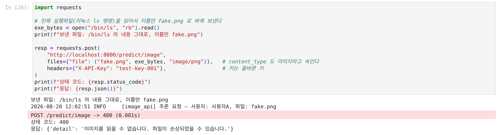

400 이 왔는데 메시지가 "이미지를 읽을 수 없습니다" 였다.
"지원하지 않는 파일 형식" 이 아니었으니 1번 타입 검증은 통과했고 3번 디코딩에서 걸린 것이다.
노트북 설명대로였다. 보내는 쪽이 적어주는 값은 그대로 믿을 수 없고,
실제로 열어보는 단계가 있어야 막힌다는 걸 눈으로 확인하게 되었다.

### 5.2 5MB 를 넘는 파일은 언제 거부되나

크기 검증이 `await file.read()` 로 다 읽은 뒤에 길이를 재는 방식이라,
거부당하는 요청도 파일은 이미 다 올라온 뒤가 아닐까 싶었다.
난수로 채운 PNG 를 작은 것과 큰 것으로 만들어 보냈다.

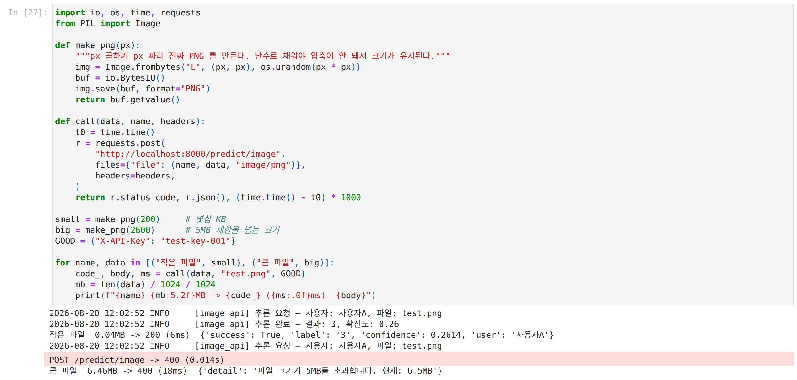

| 보낸 것 | 응답 | 걸린 시간 |
| --- | --- | --- |
| 0.04MB | 200 | 6ms |
| 6.46MB | 400 (5MB 초과) | 18ms |

거부당한 쪽이 오히려 시간이 더 걸렸다. 받지도 않고 잘라냈다면 이렇게 나오지 않았을 것 같다.
서버가 다 받고 나서 거부하는 방식이라는 뜻으로 생각되었다.

### 5.3 인증에 실패하면 업로드도 막히나

1장에서 인증이 없으면 서버가 과부하로 멈추고 비용이 커진다고 했다.
그러면 반대로 인증을 걸어두면 틀린 키로 온 요청은 파일도 안 받고 잘라내는지 궁금했다.
`verify_api_key` 는 헤더만 보는 함수라서 파일보다 먼저 실행될 것 같은데,
코드만 봐서는 순서를 알 수 없었다.

그래서 서버 안에서 일이 일어난 시각을 찍는 실험용 서버(`order_probe.py`)를 따로 만들었다.
미들웨어에서 "요청 도착" 을 찍고, 인증 함수 안에서 "인증 함수 실행" 을 찍은 다음,
틀린 키로 파일 크기만 바꿔가며 보내서 그 사이 간격을 확인해보았다.

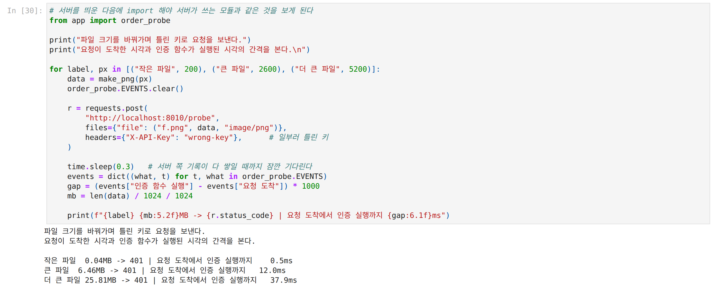

| 보낸 파일 | 응답 | 요청 도착에서 인증 실행까지 |
| --- | --- | --- |
| 0.04MB | 401 | 0.5ms |
| 6.46MB | 401 | 12.0ms |
| 25.81MB | 401 | 37.9ms |

파일이 커질수록 간격이 같이 늘어났다.
인증 함수는 헤더만 읽는데도 파일이 다 도착한 다음에야 실행된다는 뜻으로 보인다.
그러면 틀린 키로 오는 요청도 업로드 자체는 막지 못하는 것일 것이다.

1장에서 인증이 서버 부하와 비용을 막아준다고 했던 것이 반만 맞는 이야기였다고 생각하게 되었다.
GPU 를 쓰는 추론 쪽은 확실히 막아준다. 401 이 나면 모델은 아예 돌지 않는다.
하지만 회선과 메모리, 디스크를 쓰는 업로드 쪽은 인증이 실행되기 전에 이미 끝나 있었다.
그건 인증보다 앞에서 크기를 끊는 다른 장치가 해야 하는 일인 것 같다.
4장 설명에도 nginx 의 `client_max_body_size` 같은 걸 앞단에 둔다는 이야기가 있었는데,
그게 왜 필요한지가 이 실험으로 좀 이해가 되는듯 하다.

---

## 6. 체크포인트 답

### 1절 체크포인트

**1. 인증 없는 API 가 위험한 이유**

- **서버 자원 고갈 및 다운 위험 (DoS/DDoS)**: 머신러닝 추론은 CPU 나 GPU 연산 자원을 크게 소모하는데,
  인증이 없으면 악의적인 사용자가 무한 루프나 대량 요청을 보내 서버를 과부하시켜
  정상 사용자의 접근을 멈추게 할 수 있을 것 같다.
- **클라우드 비용 폭탄**: 클라우드 환경(AWS, GCP 등)에서 GPU 인스턴스를 운영할 경우,
  불특정 다수의 무차별 호출로 인해 사용량이 급증하여 과도한 비용이 청구될 수 있겠다.
- **모델 도용 (Model Stealing)**: 공격자가 대량의 입력-출력 데이터를 수집하여
  원본 모델을 모방한 모델을 학습(증류/복제)시키는 방식으로 지적 재산과 모델 가치가 유출될 수 있을 것이다.
- **악의적 요청 추적 불가**: 문제가 발생하거나 에러가 났을 때 누가 요청을 보냈는지 식별할 수 없어
  공격자를 차단하거나 원인을 분석하기 어렵겠다.

**2. API Key 방식이 ML 추론 API 에 적합한 이유**

- **간단한 구현과 비상태성(Stateless)**: 복잡한 사용자 로그인 세션이나 사용자 인터페이스(UI) 없이,
  클라이언트가 HTTP 요청 헤더에 키를 실어 보내는 것만으로 즉시 인증이 가능할 것 같다.
- **사용자 식별 및 사용량 추적 용이**: API Key 하나만으로 호출 주체를 식별하고,
  요청 횟수 제한(Rate Limiting)이나 과금(Usage/Billing)을 손쉽게 연결해 관리할 수 있어
  OpenAI, Hugging Face 등 실무 표준으로 널리 사용될 수 있을 것 같다.

### 2절 체크포인트

**1. `Header(None)` 에서 None 이 들어가는 상황**

클라이언트가 HTTP 요청을 보낼 때 `X-API-Key` 헤더를 포함하지 않았을 때 기본값으로 None 이 할당된다.

**2. `Depends(verify_api_key)` 추가 시 요청 처리 흐름의 변화**

- **실행 순서 우선권**: 엔드포인트 함수 본문이 실행되기 전에 `verify_api_key()` 의존성 함수가 먼저 실행된다.
- **인증 성공 시**: 검증 함수의 반환값(예: 사용자 식별자)이 엔드포인트 함수의 매개변수로 주입된 후
  본문 로직이 정상 처리된다.
- **인증 실패 시**: `HTTPException(401)` 이 즉시 발생하여 엔드포인트 함수는 실행되지 않고
  클라이언트에 즉각 401 에러 응답을 반환한다.

다만 5.3 에서 재보니 "먼저 실행된다"가 요청의 모든 것보다 먼저는 아니었다.
파일은 이미 다 도착한 뒤에 인증 함수가 실행됐다. 엔드포인트 본문보다 먼저인 것이 맞다.

**3. HTTP 상태 코드 401 (Unauthorized) 의 의미**

"인증되지 않음(Unauthenticated)" 을 의미하며, 클라이언트가 요청한 리소스에 접근하기 위한
유효한 인증 자격 증명(API Key, 토큰 등)이 누락되었거나 유효하지 않음을 나타낸다.

### 4절 체크포인트

**1. `UploadFile` 과 Base64 방식의 핵심 차이**

- **전송 방식 및 데이터 구조**: `UploadFile` 은 바이너리 파일 형태(multipart/form-data)로 직접 전송하며,
  Base64 는 바이너리 데이터를 텍스트 문자열로 인코딩하여 JSON 등에 포함해 전송한다.
- **오버헤드 및 용량**: Base64 인코딩은 원본보다 데이터 크기가 약 33% 증가하는 오버헤드가 발생하지만,
  `UploadFile` 은 원본 바이너리를 그대로 전송하여 효율적이다.
- **사용 편의성**: `UploadFile` 을 사용하면 Swagger UI 등에서 직관적인 파일 선택 버튼이 생성되어 테스트가 편리하다.
  다른 JSON 필드와 함께 묶어 하나의 페이로드로 전송해야 할 때는 Base64 가,
  독립된 파일을 다룰 때는 `UploadFile` 이 적합하다.

**2. `file.content_type` 으로 타입을 검증하는 이유**

- **1차적인 비정상 입력 차단 (비용 절감)**: 텍스트 파일(.txt), 실행 파일 등 명백히 지원하지 않는 형식이
  들어왔을 때, 파일을 디코딩하거나 모델 파이프라인에 진입시키지 않고 즉시 400 Bad Request 로 거를 수 있다.
- **주의점**: `content_type` 은 클라이언트가 헤더에 명시하는 값으로 위조될 수 있으므로,
  1차 거름망 역할만 수행하며 실제 유효성 검증은 라이브러리(PIL 등)의 디코딩 과정을 통해 이루어진다.

**3. 파일 크기를 제한하지 않을 때 발생할 수 있는 문제**

- **서버 메모리 고갈 (OOM) 및 다운**: 대용량 파일(예: 수백 MB 이상)이 동시에 업로드되면
  RAM 자원을 과도하게 소모하여 서버 전체가 다운될 수 있다.
- **서비스 거부 (DoS) 위험**: 정상적인 사용자의 요청 처리 지연이나 장애를 초래하여 서비스 가용성이 훼손된다.
- **불필요한 대역폭 및 스토리지 낭비**: 불필요하게 큰 입력 처리를 위해
  네트워크 트래픽과 임시 디스크 I/O 가 과도하게 발생한다.

여기에 5.2 에서 재본 것을 덧붙이면, 지금 코드의 크기 제한은 파일을 **다 받은 뒤에** 거부하는 방식이라
대역폭과 임시 디스크 낭비는 제한을 걸어둬도 그대로 일어난다(6ms 대 18ms).

### Day 6 최종 체크포인트

**Q1. API Key 인증이 없으면 어떤 위험이 있습니까? (두 가지 이상)**

- **서버 자원 고갈 및 다운 (DoS)**: 모델 추론은 연산량이 커서 무단 호출 및 무한 요청 루프로
  서버가 과부하되어 다운될 수 있다.
- **클라우드 비용 폭탄**: 불특정 다수의 무차별 호출로 인해 GPU 사용량이 급증해 과도한 요금이 청구될 수 있다.
- **모델 도용 (Model Stealing)**: 입력-출력 데이터를 대량 수집해 모방 모델을 학습시키는 행위로
  지적 재산이 유출될 수 있다.
- **추적 불가**: 에러나 공격 발생 시 호출 주체를 식별할 수 없어 원인 파악 및 차단이 어렵다.

**Q2. `Depends(verify_api_key)` 는 엔드포인트 실행 전에 어떤 일을 합니까?**

- 요청 헤더의 `X-API-Key` 를 추출하여 유효한 키 목록에 있는지 검증한다.
- **인증 성공 시**: 해당 사용자 정보를 엔드포인트 파라미터로 넘겨주고 엔드포인트를 실행한다.
- **인증 실패 시**: 즉시 401 Unauthorized 예외를 발생시켜 엔드포인트 함수 실행을 차단하고
  에러 응답을 반환한다.

**Q3. `UploadFile` 방식이 Base64 보다 편리한 점은 무엇입니까?**

- 바이너리 파일을 직접 전송하므로 인코딩에 따른 용량 증가(약 33% 오버헤드)가 없다.
- Swagger UI 등 API 문서 도구에서 자동으로 파일 선택(Choose File) 버튼이 생성되어
  별도의 텍스트 인코딩 작업 없이 간편하게 테스트할 수 있다.

**Q4. 파일 업로드 시 크기 제한을 하지 않으면 어떤 문제가 생깁니까?**

- 대용량 파일(수백 MB 이상) 업로드로 인해 서버 메모리(RAM) 부족 및 OOM(Out of Memory) 현상이 발생하여
  서버가 다운될 수 있다.
- 과도한 네트워크 대역폭과 디스크 I/O 소모로 인해 정상적인 사용자의 요청 처리가 지연되는
  서비스 거부 상태가 초래된다.

5.3 을 재보고 하나 덧붙이자면, 인증은 이 문제를 막아주지 못한다.
틀린 키로 온 요청도 파일이 다 도착한 뒤에야 401 이 나가기 때문에, 대역폭과 메모리는 이미 쓰인 뒤다.

**Q5. 이미지를 28 곱하기 28 그레이스케일로 변환하는 이유는 무엇입니까?**

- **모델 입력 규격 일치**: 학습된 MNIST 모델이 기대하는 입력 텐서 형상인
  (1, 1, 28, 28) (1개 채널 흑백, 28 곱하기 28 픽셀 크기)에 맞추기 위함이다.
- 사용자가 업로드하는 다양한 크기나 색상(RGB 등)의 이미지를 모델이 추론할 수 있는
  표준 규격으로 일관되게 전처리하기 위해 변환한다.

---

## 7. 노드 밖에서 해본 것 1 — 서버를 직렬 3단으로 묶고 JWT 붙여보기

인증을 한 대에 붙이고 나니, 서버가 여러 대로 늘어나면 인증이 어떻게 되는지가 궁금해졌다.
예전에 일할 때 LDAP 이나 AD, SSO 같은 이름이 오갔는데 구조를 모른 채 넘어갔던것이 계속 걸려서,
JWT 로라도 그 모양을 만들어보고 싶었다.

**아래는 보안을 점검한 것이 아닌, 구조를 이해하려고 해본 간단한 테스트다.**
서버 세 대가 전부 내 컴퓨터 안에 있어서 실제 신뢰 경계가 없긴하다.
그래서 여기 나온 결과를 실제 시스템이 안전한지 판단하는 근거로 쓰면 안 될 것 같다.

```
  바깥
   |
   v
[게이트웨이 8020]  ---> [전처리 8021]  ---> [추론 8022]
   인증 담당              자기 일               결과 반환
```

소스는 [`chain/`](chain/) 에 넣어뒀다. 추론은 진짜 모델을 돌리지 않고 결과를 흉내만 낸다.
보고 싶은 게 인증 쪽이라서 그랬다. 같은 체인을 두 방식으로 열어뒀다.

```
순진한 방식   게이트웨이가 API Key 를 확인하고, 뒤에는 "X-User: userA" 헤더만 붙여 넘긴다
JWT 방식      게이트웨이가 토큰을 발급하고, 각 홉이 그 토큰의 서명을 자기가 직접 확인한다
```

### 7.1 앞에서만 인증하면 뒷단은 어떻게 되나

| 무엇을 했나 | 응답 |
| --- | --- |
| 정상 경로 (게이트웨이에 올바른 API Key) | 200, 세 홉 모두 userA 로 인식 |
| 게이트웨이에 틀린 키 | 401 |
| 게이트웨이를 건너뛰고 전처리(8021) 직접 호출, 인증 없이 | **200** |
| 맨 뒤 추론(8022) 직접 호출, 인증 없이 | **200** |

앞문에 자물쇠를 달았는데 뒷문 두 개가 열려 있었다.
게이트웨이가 막아주는 건 게이트웨이로 들어오는 요청뿐이고,
8021 과 8022 는 자기가 누구를 위해 일하는지 확인할 방법 자체가 없었다.

### 7.2 게이트웨이가 붙여주는 헤더를 내가 직접 붙이면

| 무엇을 했나 | 응답 |
| --- | --- |
| 전처리에 직접, `X-User: userA` 를 내가 적어서 | 200, userA 로 인식 |
| 없는 이름으로 `X-User: admin` | 200, **admin 으로 인식** |

헤더는 그냥 글자라서 게이트웨이가 붙였는지 내가 붙였는지 뒷단이 구분하지 못한다.
목록에 없는 이름을 적어도 통과했다.

여기서 막혔던 한가지: 처음엔 사용자 이름을 한글("사용자A")로 뒀는데 요청이 500 으로 터졌다.
HTTP 헤더는 latin-1 만 담을 수 있어서 한글이 안 들어간다. 그래서 이름을 영문으로 바꿨다.
JWT 안에는 한글을 넣어도 되는데, 토큰은 내용을 base64 로 감싸서 보내니까
실제로 나가는 글자는 ASCII 라서 그런 것 같다.

### 7.3 같은 체인을 JWT 로 바꾸면

| 무엇을 했나 | 응답 |
| --- | --- |
| 토큰으로 정상 경로 | 200, 세 홉이 각자 서명을 확인하고 통과 |
| 전처리에 직접, `X-User` 만 적어서 (7.2 와 같은 방법) | **401** "토큰이 없다" |
| 토큰 내용을 admin 으로 고치고 서명은 그대로 | **401 InvalidSignatureError** |
| 맨 뒤 추론(8022)에 직접, 진짜 토큰으로 | 200 |

7.2 에서 통과하던 게 여기서 걸렸다.
헤더는 누구나 적을 수 있고 토큰은 비밀을 아는 쪽만 만들 수 있다는 차이인 것 같다.

토큰을 점으로 잘라 base64 를 풀어봤더니 비밀번호 없이 그냥 읽혔다.

```
헤더   {"alg":"HS256","typ":"JWT"}
내용   {"sub":"userA","iat":1787197327,"exp":1787197627}
서명   ysxRsq0NkAbM71ZnQB4c...   (이건 못 읽는다)
```

JWT 는 암호화가 아니라 서명이라고 한다. 내용을 감추는 게 아니라 고쳐졌는지를 잡는 것이다.
그래서 토큰 안에 비밀번호 같은 걸 넣으면 안 되겠다는 생각이 들었다.
실제로 내용을 admin 으로 바꾸고 서명은 그대로 붙여서 보냈더니 서명이 안 맞아서 걸렸다.

맨 뒤 서버를 직접 불렀는데 200 이 나온 건 7.1 과 다른 이야기다.
7.1 은 아무것도 없이 통과한 것이고 이건 진짜 토큰을 들고 간 것이라,
뒷단이 앞을 거치지 않고도 스스로 판단할 수 있다는 뜻으로 읽었다.

### 7.4 체인 도중에 토큰이 만료되면

수명 2초짜리 토큰으로 세 가지를 해봤다.

| 무엇을 했나 | 응답 |
| --- | --- |
| 바로 호출 | 200 (36ms) |
| 전처리가 3초 걸리게 해놓고 호출 | **401 "추론(8022): 토큰이 만료됐다"** (3043ms) |
| 이미 만료된 토큰을 다시 사용 | 401 "게이트웨이(8020): 토큰이 만료됐다" |

가운데가 재밌었다. 게이트웨이와 전처리는 통과했는데 마지막에서 막혔다.
만료는 입구에서 한 번 보고 끝나는 게 아니라 홉마다 그 순간 시계로 다시 판정되는 것 같다.

수명을 길게 잡으면 이 실패는 없어지는데, 대신 토큰을 훔친 사람도 그만큼 오래 쓸 수 있다.
서버가 목록을 안 뒤지는 게 이 방식의 장점인데 그래서 이미 나간 토큰을 취소할 곳도 없다.
짧은 수명이 사실상의 취소 수단인 것으로 보인다.

### 7.5 예전에 이름만 듣던 것들의 자리

만들어놓고 견주어 보니 조금 이해가 되는것 같다. 그래서 인증은 크게 두 갈래인 것 같다.

```
조회형   서비스가 매번 어딘가에 물어본다      LDAP 의 bind
지참형   요청자가 증표를 들고 온다            Kerberos 티켓, JWT, SAML
```

LDAP 은 사람과 그룹 정보를 담아두는 디렉터리와 거기에 물어보는 프로토콜이라고 한다.
인증은 `bind` 로 하는데 서비스가 비밀번호를 받아서 디렉터리에 대신 물어봐 주는 구조다.
디렉터리가 멈추면 인증이 전부 멈춘다.

AD 는 마이크로소프트의 디렉터리 서비스이고, 조회는 LDAP 으로 하고 로그인은 보통 Kerberos 로 한다.
Kerberos가 오늘 만든 것과 구조가 거의 같은것 같아서 좀 놀랐다.

```
오늘 만든 것                      Kerberos
-------------------------------------------------------
게이트웨이의 토큰 발급 창구         KDC (티켓 발급소)
API Key 를 내고 토큰을 받음         비밀번호로 TGT 를 받음
토큰을 들고 각 홉에 감              서비스 티켓을 들고 서버에 감
각 홉이 서명을 직접 검증            서버가 자기 키로 티켓을 검증
exp 로 수명 제한                   티켓 유효기간
```

SSO 는 한 번 로그인해 여러 서비스를 쓰는 것이고 SAML 이나 OIDC 를 쓴다고 한다.
OIDC 는 OAuth 2.0 위에 얹은 것이라는데, 거기서 오가는 `id_token` 이 JWT 라고 한다.
그러고보면 오늘 만든 게 SSO 의 아주 작은 모형이었던 것 같다.
신원 확인은 한 곳에서 하고 검증은 각 서비스가 서명으로 스스로 하는 구조가 비슷한것 같다.

### 7.6 이 실험의 취약점

세 서버가 같은 비밀 하나를 나눠 갖는 방식(HS256)이라 추론 서버도 토큰을 만들 수 있다.
검증만 할 수 있어야 하는데 발급까지 되는 상태다.
실제 SSO는 대개 RS256 을 써서 발급소만 개인키로 서명하고 서비스는 공개키로 검증만 한다고 한다.
이어서 해본다면 여기를 바꿔보는 게 다음 진행할 사항인것 같다.

---

## 8. 노드 밖에서 해본 것 2 — 응답만 가져가면 모델을 베낄 수 있나

6절에 옮겨 적은 1절 체크포인트에 "모델 도용" 을 적었는데, 적고 나서 보니 증류나 복제라는 말만 들어봤지 
실제로 어떻게 하는 건지는 모르고 쓴 것이었다. 그래서 한번 연구해보기로 했다. 

7절 처럼, 보안을 점검한 것이 아니라 어떻게 되는 건지 궁금해서 해본 간단한 테스트다. 
모델도 데이터도 전부 내 컴퓨터 안에 있는 MNIST 라서, 여기 숫자를 실제 서비스가 얼마나 유효한지에 대한 
근거로 쓰기는 어려울 것 같다.

### 8.1 어떻게 실험해봤나

가져가는 쪽을 흉내내려면 두 사람이 필요하다.

```
빼앗기는 쪽   오늘 API 뒤에 있는 MNIST 모델. 테스트 1만 장에서 99.06%, 평균 확신도 0.9928
가져가는 쪽   이미지를 던져서 돌아온 응답만 보고 자기 모델을 학습시킨다
```

가져가는 쪽에는 세 가지를 안 준다. 모델 파일도, 모델 구조도, 진짜 정답 라벨도 안 준다.
구조를 모르니까 일부러 다르게 잡았다. 원본은 합성곱이고 베끼는 쪽은 784-256-10 짜리 평범한 MLP 다.
학습에 쓰는 정답 자리에는 진짜 라벨 대신 **API 가 돌려준 응답**을 넣는다.

조건을 하나 정해두고 시작했다. **이 실험은 서버를 띄우고 진짜로 호출하지 않는다.**
원본이 계산한 확률 열 칸을 메모리에서 그대로 가져가는 쪽에 건넨다.

보려는 게 "응답에 무엇을 담느냐가 얼마나 영향을 주나" 라서 그렇게 했다.
중간에 전송하면서 값이 깎이면, 차이가 담긴 내용 때문인지 깎여서인지 갈라지지 않는다.
그래서 깎이는 부분을 아예 빼고 형식만 비교했다.

대신 이 조건은 가져가는 쪽에 제일 유리하다. 그러니까 아래 표는 평균이 아니라
**가져가는 쪽이 최대한 유리할 때 어디까지 가는가**, 그러니까 위쪽 끝을 잰 것으로 읽어야 한다.
실제 API 가 그 끝에 얼마나 닿는지는 8.2 마지막과 8.4 에서 따로 잰다.

바꿔가며 본 것은 두 가지다.

```
질의 횟수      1000 / 5000 / 20000 번
응답에 담긴 것  label 만  /  확률 열 칸 전부  /  확률을 펴서 준 것
```

"펴서" 라는 건 가져가는 쪽이 하는 후처리다. 이게 무슨 말인지 나도 처음엔 안 잡혀서
숫자 3 짜리 이미지 한 장을 넣고 원본이 뭘 내놓는지 직접 찍어봤다.

```
숫자        0    1    2      3      4    5    6    7    8    9
원본 확률   0    0    0    1.000000   0    0    0    0    0    0
```

0 처럼 보이지만 진짜 0 은 아니다. 자리를 더 벌려서 보면 이렇다.

```
1등  3  ->  1.000000
2등  5  ->  0.000000003
3등  9  ->  0.000000002
```

여기 정보가 하나 들어 있다. 원본이 이 3 을 보면서 그나마 닮은 걸 꼽자면 5 라고 판단했다는 것이다.
그런데 0.000000003 은 너무 작아서, 이걸 정답 자리에 넣고 학습시켜도
가져가는 쪽 눈에는 그냥 3 에만 1 이 서 있는 것으로 보인다. label 만 준 것과 같아지는 것이다.

그래서 각 칸을 네제곱근 하고 다시 합이 1 이 되게 맞춘다. 같은 장이 이렇게 바뀐다.

```
숫자        0        1        2        3        4        5        6        7        8        9
원본     0.000000 0.000000 0.000000 1.000000 0.000000 0.000000 0.000000 0.000000 0.000000 0.000000
편 것    0.000971 0.001689 0.002848 0.970878 0.000971 0.007396 0.000971 0.002917 0.005187 0.006173
```

1등은 1.0 에서 0.97 로 거의 그대로인데 2등은 0.000000003 에서 0.0074 가 됐다.
네제곱근은 1 에 가까운 수는 거의 안 건드리고 아주 작은 수만 크게 끌어올린다.
어두워서 안 보이던 사진을 밝기만 올려서 들여다보는 것에 가까운 것 같다.
원본이 없던 걸 만들어내는 게 아니라 원래 갖고 있던 걸 보이게 하는 것이다.

여기서 곱하는 수를 온도(T)라고 부른다. T=1 이 원본 그대로이고 위 예시는 T=4 다.
원본이 헷갈려한 장은 사정이 다르다. 7 을 9 로 잘못 본 장을 보면
원본에서 이미 `7 -> 0.468051`, `9 -> 0.486185` 로 비슷해서 펴도 크게 안 변한다.
그러니까 펴기가 듣는 건 원본이 확신하는 장들이고, 이 모델은 평균 확신도가 0.9928 이라
대부분이 그런 장인 것 같다.

seed 를 0, 1, 2 세 개로 돌려서 평균을 봤다. 미세한 차이를 seed 하나로 판단하면 안 된다는 걸
전에 집값 프로젝트에서 겪어서 그렇게 했다.

### 8.2 응답에 무엇을 담느냐

정확도는 테스트 1만 장 기준이고, 괄호 안은 seed 세 개의 폭이다.

| 질의 횟수 | label 만 | 확률 전부 | 확률을 펴서 | (비교) 같은 학생을 진짜 라벨로 가르쳤을 때 |
| --- | --- | --- | --- | --- |
| 1000 | 88.50% (88.44~88.60) | 88.81% (88.75~88.84) | **90.10%** (90.00~90.17) | 88.50% |
| 5000 | 94.19% (94.16~94.24) | 94.67% (94.51~94.80) | **95.72%** (95.69~95.78) | 94.36% |
| 20000 | 97.21% (97.12~97.26) | 97.43% (97.33~97.61) | **97.91%** (97.89~97.96) | 97.43% |

맨 오른쪽 칸은 도용이 아니라 비교용이다. 원본 모델의 점수가 아니라는 걸 짚어둔다.
**베끼는 쪽 모델을 그대로 두고, 정답 자리에만 API 응답 대신 MNIST 진짜 라벨을 넣어 다시 가르친 것**이다.
구조도 질의 이미지도 학습 조건도 왼쪽 세 칸과 전부 같고 정답만 진짜다.
그러니까 "이 학생이 제대로 배웠으면 이 정도" 라는 기준으로 옆에 세워둔 것이고,
왼쪽 칸들이 여기에 얼마나 붙는지를 보려고 넣었다.

셋 다 예상보다 컸다. 특히 **label 만 돌려줘도 2만 번에 97.21% 까지 올라간 게 제일 놀랐다.**
확률을 감추면 안 새는 줄 알았는데 그렇지 않았다.

그리고 label 만 준 것과 진짜 정답을 준 것이 거의 붙어 있다.
2만 번에서 97.21% 대 97.43% 로 0.22 포인트 차이다.
1000 번과 5000 번에서는 seed 폭이 서로 겹쳐서 차이라고 보기 어렵고,
2만 번에서만 폭이 안 겹쳐서(97.12~97.26 대 97.31~97.52) 진짜 정답 쪽이 조금 나은 것 같다.
어느 쪽이든 0.22 포인트라, 진짜 정답을 몰라도 거의 그만큼 배운 것으로 읽힌다.
원본이 99% 짜리라서 원본의 답이 사실상 정답 노릇을 하는 것으로 보인다.
원본이 70% 짜리였으면 이 칸이 이렇게 붙지는 않았을 것 같다.

확률을 통째로 준 것(T=1)은 label 만 준 것보다 0.3, 0.5, 0.2 포인트 높다.
크지는 않은데 세 조건 다 seed 폭이 안 겹쳐서 방향은 일정한 것 같다.
펴서 쓴 경우는 그보다 더 벌어졌다. label 만 준 것과 비교하면 1.60, 1.53, 0.70 포인트다.
**다만 질의가 많아질수록 그 이득이 줄어든다.** 2만 번쯤 부를 수 있으면
응답에 뭐가 담겼든 어차피 97% 대에 도달해서, 형식 차이가 묻히는 것 같다.

**그러면 실제 API 가 이 위쪽 끝에 닿을 수 있나.**

8.1 에서 정한 대로 위 표는 값이 안 깎인다는 조건에서 잰 것이다.
그러니 실제로 어디까지 닿는지 보려면, 8.1 에서 본 2등 값 0.000000003 같은 수가
응답에 실려 가져가는 쪽까지 갈 수 있는지부터 봐야 한다.
실험은 메모리에서 건넸으니 이건 따로 확인해야 해서, JSON 으로 내보냈다 다시 읽어봤다.

```
서버가 확률 열 칸을 그대로 내보내면
  보낸 것   3.368062051479e-09
  받은 것   3.368062051479e-09      값이 그대로 복원된다
```

전송 된다. JSON 이 지수 표기를 쓰기 때문에 이만큼 작은 값도 자리를 잃지 않는다.
그러니까 확률을 전부 돌려주게 만든 API 라면 표의 가운데 두 칸은 실제로 일어날 수 있는 이야기다.

**다만 오늘 만든 API 는 그렇게 만들지 않았다.** `app/image_api.py` 의 응답은 이렇게 나간다.

```
{"success": true, "label": 3, "confidence": 1.0, "user": "userA"}
```

확률 열 칸이 아예 없고, 나가는 하나마저 `round(x, 4)` 를 거친다.
같은 장의 확률 열 칸을 4자리로 잘라보면 `[0.0, 0.0, 0.0, 1.0, 0.0, ...]` 이 되어
2등 자리가 그냥 0 이 된다. 0.000000003 은 서버 밖으로 나간 적이 없는 것이다.

정리하면 표의 각 칸이 어떤 API 를 가정한 것인지가 이렇게 갈린다.

| 어떤 API 인가 | 가져가는 쪽이 실제로 받는 것 | 표의 어느 칸 |
| --- | --- | --- |
| 오늘 만든 것 | `label` 과 `confidence` 하나 | label 만 |
| 확률을 다 주게 만들었다면 | 열 칸 전부, 작은 값도 온전히 | 확률 전부 / 확률을 펴서 |
| 확률을 주되 잘라서 준다면 | 열 칸인데 아홉 개가 0.0 | 8.4 에서 따로 잰다 |

그래서 8.4 의 반올림 이야기는 가정이 아니라 **이미 코드에 들어 있는 것**이고,
그게 2등 정보를 실제로 지운다.

### 8.3 그러면 계속 펴면 계속 좋아지나

펴서 이득을 봤으니 더 펴면 더 좋아질지가 궁금해서, 질의 2만 번을 고정해두고
온도만 1 에서 32 까지 올려가며 다시 돌려봤다.

| 설정 | 1등이 차지하는 비중 | 가져간 쪽 정확도 |
| --- | --- | --- |
| label 만 | (해당 없음) | 97.21% (97.12~97.26) |
| T=1 | 0.9928 | 97.48% (97.32~97.56) |
| T=2 | 0.9696 | 97.66% (97.55~97.73) |
| T=4 | 0.8322 | **97.91%** (97.89~97.96) |
| T=8 | 0.4995 | 97.80% (97.73~97.91) |
| T=16 | 0.2594 | 97.72% (97.63~97.80) |
| T=32 | 0.1656 | 97.70% (97.60~97.76) |

올라가다 어딘가에서 꺾인다. 다만 T=4 와 T=8 은 seed 폭이 조금 겹쳐서(97.89~97.91)
꼭대기가 정확히 T=4 인지는 확정하지 못하겠다. T=16, T=32 하고는 폭이 안 겹쳐서
꺾이는 것 자체는 맞다고 본다.

처음에 나는 많이 펴면 순위가 흔들려서 꺾이는 것이라고 생각했는데, 측정해보니 아닌걸 알게 되었다.
값이 서로 다른 칸끼리 자리가 뒤집힌 장이 T=4 에서도 T=32 에서도 한 장도 없었고
1등도 2만 장 전부 그대로였다. 네제곱근은 큰 값을 큰 값으로 보내는 계산이라
순서를 바꿀 수가 없는 것 같다.

그리고 더 중요한건, **바뀌는 건 순위가 아니라 격차였다**는 점이다. 가운데 칸을 보면 그게 보인다.

```
T=1     0.9928     1등이 거의 다 가져간다. 2등이 안 보인다        덜 배운다
T=4     0.8322     1등도 살아 있고 2등도 보인다                  제일 낫다
T=32    0.1656     열 칸이 다 비슷해진다. 정답이 흐려진다          다시 내려간다
```

너무 안 펴면 2등 정보가 안 보이고, 너무 펴면 이번엔 정답이 무엇인지가 묻힌다.
그래서 가운데 어딘가가 제일 좋은 모양이 나오는 것 같다.

한 가지 더 걸린 게 있다. 여기 T=1 이 97.48% 인데 8.2 표의 같은 칸은 97.43% 다.
같은 설정인데 0.05 포인트가 달랐다. 처음에는 스레드를 여러 개 써서 계산 순서가
매번 달라지는 것이라고 짐작했는데, 그렇게 보기 어려웠다.
`label 만` 과 `T=4` 는 두 번 돌린 값이 소수점까지 똑같이 나왔기 때문이다.
흔들림이면 그 칸들도 같이 흔들렸어야 할 것 같았다.

그래서 스크립트 두 개를 나란히 놓고 봤더니 펴는 함수가 서로 달랐다.
8.2 쪽은 T=1 이면 확률을 손대지 않고 그대로 돌려주는데,
여기 쓴 것은 T=1 에서도 아주 작은 값들을 1e-12 까지 끌어올리고 다시 합을 맞춘다.
실제로 재보니 확률 칸의 11.25% 가 1e-12 보다 작았다. 그러니까 두 번 돌린 게 아니라
**애초에 조금 다른 것을 가르친 것**이었다.

이 방향이 재밌다. 아주 작은 값을 살짝 들어올린 것만으로 0.05 포인트가 올라갔는데,
그건 펴기를 아주 약하게 한 것과 같은 이야기라서 이 표의 흐름과 어긋나지 않는다고 생각된다.
다만 이건 8.2 의 T=1 과 나란히 놓고 비교하면 안 될 것 같다.

### 8.4 확률을 잘라서 주면 덜 새나

그러면 확률을 주더라도 소수점을 잘라서 주면 되지 않을까 싶어서 이어서 실험해봤다.
다른 조건은 다 같고 서버가 확률을 몇 자리까지 주느냐만 바꿨다. 질의는 2만 번, 받은 쪽은 펴서 쓴다.

| 서버가 주는 자릿수 | 0 으로 뭉개진 칸 | 가져간 쪽 정확도 |
| --- | --- | --- |
| 자르지 않음 | 0.0% | 97.95% (97.90~98.00) |
| 소수 4자리 | 83.1% | 97.18% (97.13~97.23) |
| 소수 2자리 | 88.8% | 97.37% (97.31~97.42) |

4자리로 자르는 것만으로 확률 칸의 83.1% 가 0 이 됐다. 원본이 워낙 확신에 차 있어서
나머지 아홉 칸이 대부분 0.0001 보다 작았던 것 같다.
그리고 그렇게 하니 가져간 쪽이 97.18% 로, label 만 줬을 때(97.21%)와 같아졌다.
펴서 얻던 이득이 없어진 것이다.

다만 4자리와 2자리를 비교하면 오히려 2자리 쪽이 조금 높은데, 자릿수를 더 줄였으니
더 낮아야 말이 되는 방향이다. 이건 seed 를 두 개만 돌려서 그런 것인지 다른 이유가 있는 것인지
모르겠다. 여기는 확정하지 않고 남겨둔다.

### 8.5 정작 크게 갈린 건 응답 형식이 아니었다

위 실험에는 숨은 조건이 하나 있었다. 가져가는 쪽에게 던질 MNIST 이미지 2만 장을 이미 쥐여준 것이다.
그게 없으면 어떻게 되는지 궁금해서, 질의 이미지를 전부 난수로 만들어서 다시 돌려봤다.

| 응답에 담긴 것 | MNIST 이미지로 질의 | 난수 이미지로 질의 |
| --- | --- | --- |
| label 만 | 97.21% | **16.49%** |
| 확률 전부 | 97.43% | **15.17%** |
| 확률을 펴서 | 97.91% | **17.86%** |

전부 무너졌다. 숫자 열 개짜리 문제에서 찍으면 10% 니까 거의 못 배운 것에 가깝다.
원본에 난수 이미지를 넣으면 아무 숫자나 하나를 자신 있게 골라 주는데,
그런 답을 아무리 많이 모아도 진짜 손글씨에 대해서는 쓸 데가 없었던 것 같다.

응답 형식을 바꿔서 벌어진 차이는 제일 클 때 1.6 포인트, 2만 번에서는 0.7 포인트였는데,
질의 이미지를 바꾸니 97% 와 16% 로 갈렸다. 재보기 전에는 응답에 뭘 담느냐가 중요할 거라고
생각하고 시작했는데 그쪽이 아니었다.

그래서 확률을 감추는 것보다 **애초에 얼마나 부를 수 있느냐를 막는 게 먼저인 것 같다.**
2만 번을 부를 수 있느냐 아니냐가 결과를 정한다면, 그건 오늘 진행한 인증과 호출 횟수 제한 쪽 내용 부분일 것이다.
1절 체크포인트에서 도용을 인증이 없을 때의 위험으로 적었는데, 그 내용이 맞았던 것 같다.

### 8.6 이 실험의 취약점

MNIST 라서 나온 숫자일 가능성이 크다. 열 종류짜리 쉬운 문제이고 원본이 99% 라
label 만으로도 진짜 정답과 다를 게 없었는데, 종류가 수천 개인 문제나 원본이 덜 정확한 문제에서는
label 과 확률의 차이가 훨씬 클 것 같다.

난수 질의가 무너진 것도 MNIST 가 검은 배경에 흰 획이라는 좁은 모양이라서 그런 면이 있어 보인다.
실제로 가져가려는 쪽이라면 아예 난수를 쓰지는 않고 비슷한 종류의 공개 이미지를 구해서 쓸 텐데,
그 중간을 안 측정해보지 않아서 어디쯤에서 갈리는지는 모른다. 이어서 해본다면 그 사이를 추적해보는 게 다음 단계일 것 같다.

8.3 의 온도 실험은 질의 2만 번에서만 측정해봤다. 8.2 를 보면 질의가 적을수록 펴기의 이득이 컸으니
질의 1000 번에서는 꼭대기가 다른 자리에 있을 수도 있는데 측정해보지 않았다.
그리고 seed 를 세 개만 돌려서, T=4 와 T=8 처럼 폭이 겹치는 칸은 어느 쪽이 위인지 결정 못한다.

스크립트는 [`distill/`](distill/) 에 넣어뒀다. 노트북이 아니라 따로 돌린 것이고,
`app/` 과 `models/` 를 참조해서 실습 폴더 안에서 실행했다.

---

## 9. 오늘 정리

인증을 붙이는 건 생각보다 짧았다. 함수 하나 만들고 `Depends` 한 줄이면 끝이었다.
파일 검증도 순서대로 네 단계를 놓는 것이라 어렵지 않았다.

대신 5절과 7절에서 잰 게 오래 남을 것 같다.
401 이 나면 다 막힌 줄 알았는데 파일은 이미 서버에 다 들어와 있었고,
게이트웨이에서 인증을 했는데도 뒷단은 그걸 확인할 방법이 없었다.
막았다고 생각한 것과 실제로 막힌 것이 다를 수 있다는 걸 확인하게 되었다.

8절은 시도해보기 전과 생각이 제일 많이 달라진 쪽이다.
응답에 확률을 담느냐 마느냐가 중요할 거라고 보고 시작했는데,
label 만 줘도 97% 까지 따라왔고 정작 크게 갈린 건 상대가 질의할 이미지를 가졌는가였다.
그래서 오늘 붙인 인증이 생각보다 앞쪽에 있는 것 같다는 생각이 들었다.

