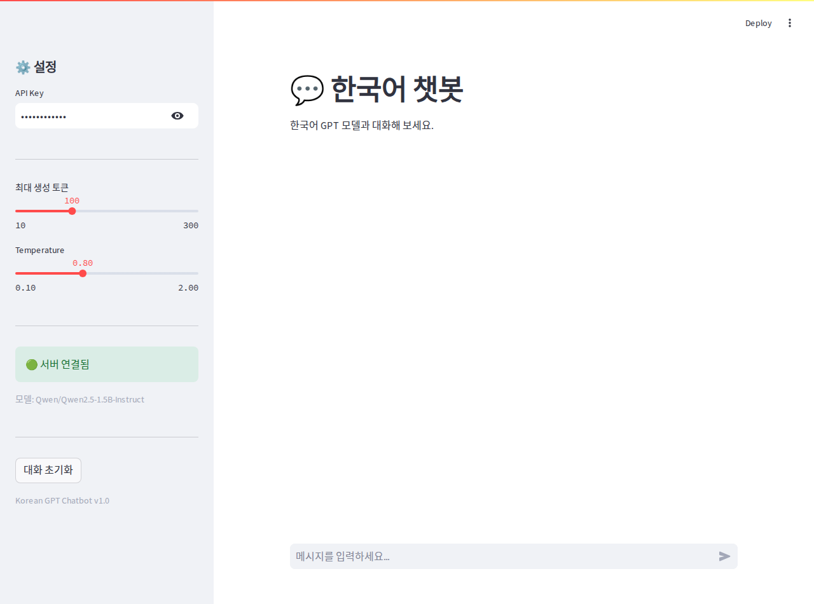
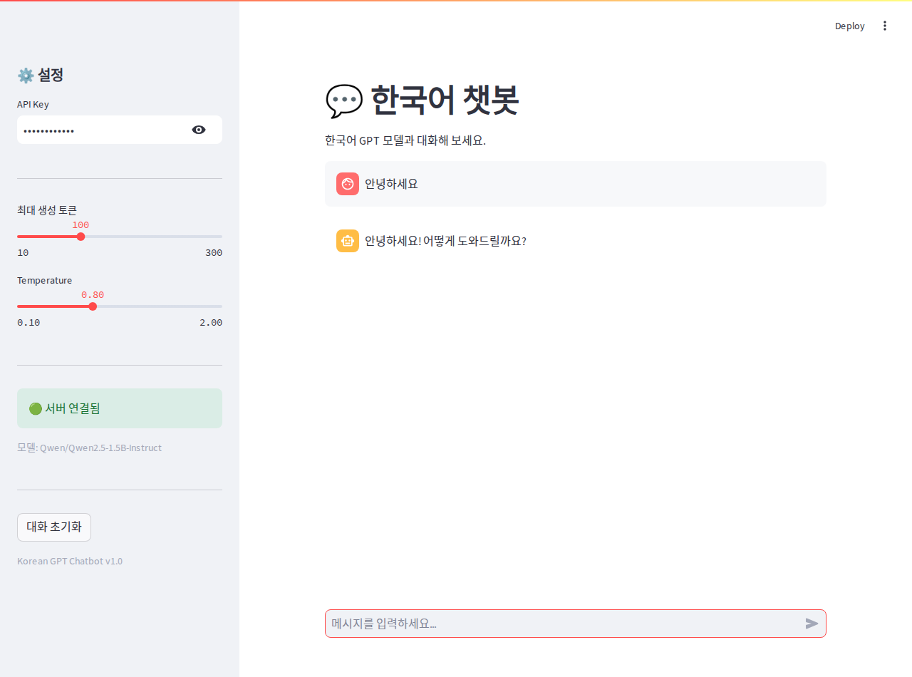
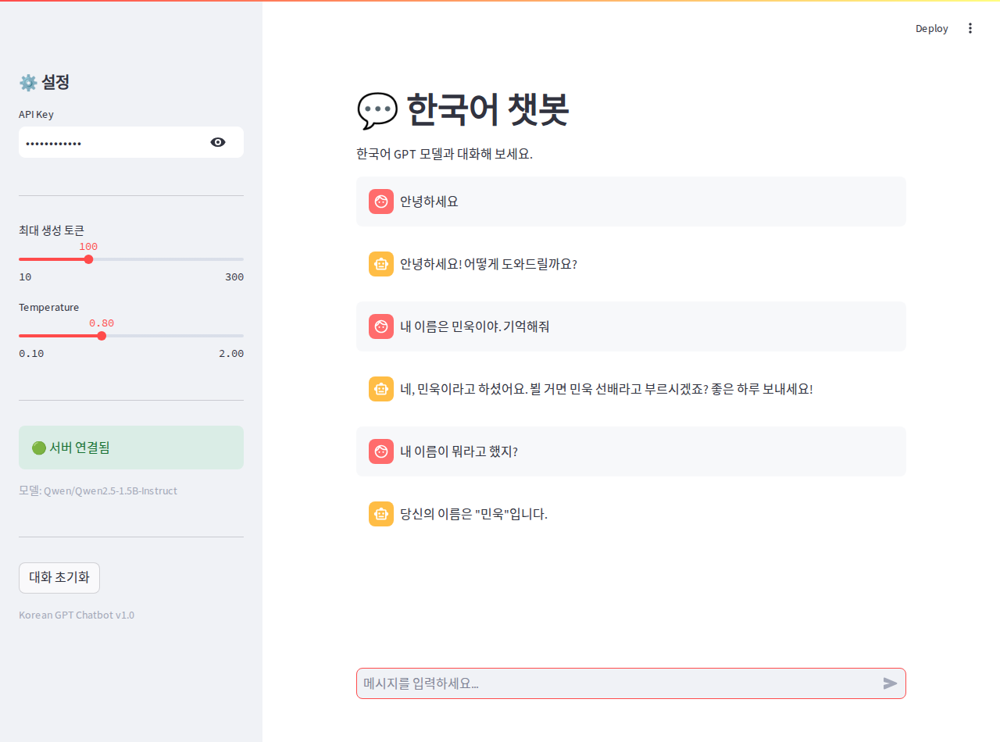
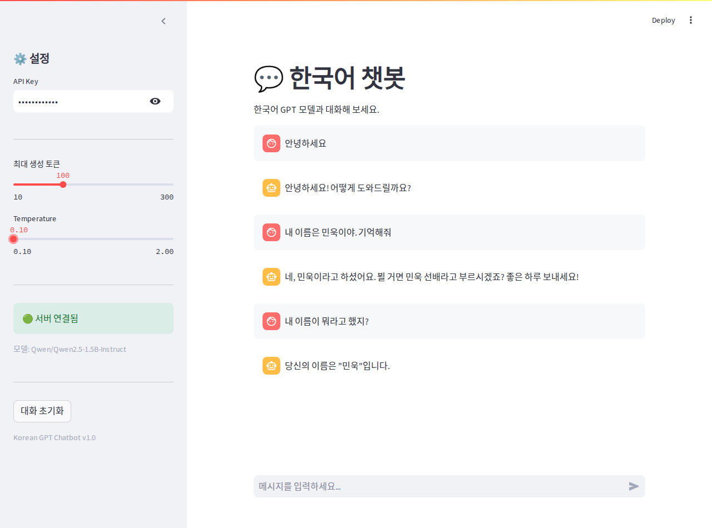
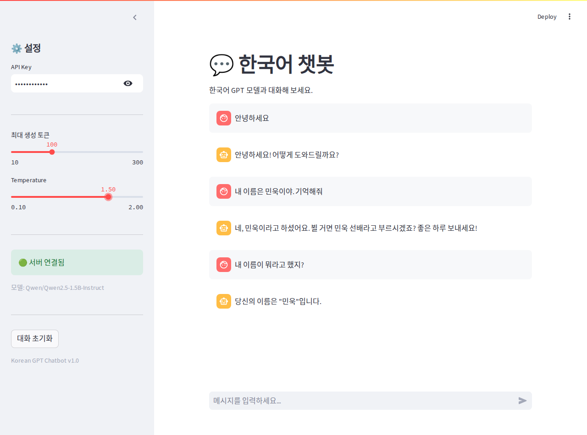
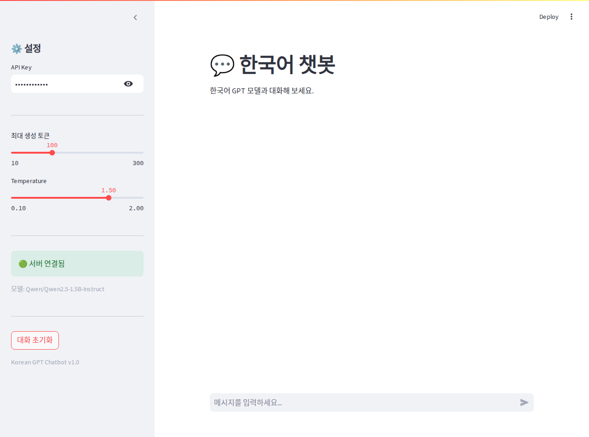
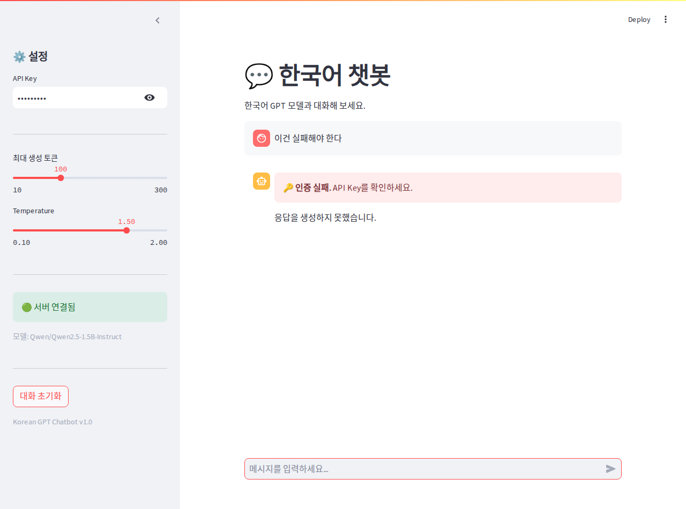

# DP07 — 트랜스포머 챗봇 서비스 만들기

모델 배포 기초 7일차. Day 5 까지는 숫자를 넣으면 숫자가 나오는 서비스였고 Day 6 에서 이미지를 받았는데,
오늘은 글을 받아 글을 만들어 돌려주는 챗봇을 붙였다.
노트북은 같은 폴더의 [`모델배포개론07.ipynb`](모델배포개론07.ipynb) 이다.

```
환경    Ubuntu · Python 3.12.3 · torch 2.9.1(ROCm) · transformers 5.16.1 · fastapi · uvicorn · streamlit
GPU     AMD Radeon (ROCm), VRAM 108GiB
모델    Qwen/Qwen2.5-1.5B-Instruct (약 15억 파라미터, fp16 으로 GPU 에 올림)
포트    FastAPI 8508 · Streamlit 8505
```

**포트를 노트북 기본값에서 옮겼다.** 노트북은 8000 과 8501 을 쓰는데 내 컴퓨터에서는 8000 을
Day 5 의 집값 예측 서버가, 8501~8504 를 예전 개인 프로젝트들이 이미 쓰고 있었다.
남의 서버를 내리는 것보다 비어 있는 포트로 가는 쪽이 안전하다고 판단했다.
그래서 노트북을 그 자리에서 실행하지 않고, 같은 코드를 포트만 바꿔 스크립트로 돌렸다.
아래 결과는 전부 그 스크립트 출력이고 스크립트도 같이 올려뒀다.

| 파일 | 무엇 |
| --- | --- |
| [`app/chatbot_model.py`](app/chatbot_model.py) | 모델 로드와 응답 생성 (오늘 새로 만든 것) |
| [`app/chatbot_schemas.py`](app/chatbot_schemas.py) | 챗봇 요청·응답 스키마 (오늘 새로 만든 것) |
| [`app/chatbot_api.py`](app/chatbot_api.py) | 챗봇 FastAPI 서버 (오늘 새로 만든 것) |
| [`app/auth.py`](app/auth.py) | Day 6 인증 모듈. **한 글자도 안 고치고 그대로 썼다** |
| [`frontend/app_chatbot.py`](frontend/app_chatbot.py) | 채팅 Streamlit 화면 (오늘 새로 만든 것) |
| [`experiments/`](experiments/) | 통합 테스트와 추가 실험 스크립트 세 개 |

오늘 미션은 다섯 개였다.

```
1  Hugging Face 한국어 모델을 불러와 텍스트를 만들어보기
2  대화 기록을 넣어 멀티턴으로 이어지게 하기
3  FastAPI 로 챗봇 엔드포인트 만들고 Day 6 인증 붙이기
4  Streamlit 으로 채팅 화면 만들고 API 에 연결하기
5  통합 테스트 네 종과 UI 테스트 네 종 돌려보기
```

서버 두 개를 띄우고 브라우저로 연 첫 화면이다. 사이드바에 모델 이름과 서버 상태가 뜬다.



---

## 1. Day 5 와 무엇이 달라졌나

Day 5 는 집 정보 숫자 여덟 개를 보내면 가격 하나가 나왔다. 오늘은 입력도 출력도 글이다.

| | Day 5 (프로젝트 1) | Day 7 (프로젝트 2) |
| --- | --- | --- |
| 데이터 | 정형 (숫자 8개) | 비정형 (텍스트) |
| 모델 | 직접 학습시킨 PyTorch MLP | 남이 학습해 둔 Hugging Face 모델 |
| 태스크 | 회귀 (가격 예측) | 텍스트 생성 |
| 전처리 | 평균과 표준편차로 정규화 | 토크나이저로 글자를 숫자로 |
| 후처리 | 숫자를 가격으로 | 숫자를 다시 글자로 |
| 인증 | 없음 | Day 6 의 API Key 그대로 |

제일 크게 바뀐 것은 **모델을 내가 안 만들었다는 점**이다. Day 5 는 데이터를 모아 학습을 돌렸는데
오늘은 이름만 적으면 내려받아진다. 대신 그 모델이 무엇을 기대하는 형식인지를 맞춰줘야 했다.

---

## 2. 인스트럭션 튜닝 모델과 채팅 템플릿

교안이 모델을 고를 때 **Instruct 또는 Chat 표기가 있는 것**을 쓰라고 했다.
그냥 이어쓰기만 배운 모델은 "안녕"을 넣으면 대답이 아니라 뒤에 아무 글이나 이어 붙인다고 한다.

그리고 대화 기록을 그냥 이어붙이는 게 아니라 `apply_chat_template` 로 넘긴다.
모델마다 학습할 때 쓴 대화 표시 방법이 정해져 있어서, 그 형식에 맞춰야 대답 차례라는 걸 알아듣는다.

```python
chat = [{"role": "system", "content": "너는 친절한 한국어 챗봇이야. ..."}]
for msg in messages:
    role = "user" if msg["role"] == "user" else "assistant"
    chat.append({"role": role, "content": msg["content"]})
encoded = self.tokenizer.apply_chat_template(chat, add_generation_prompt=True, return_tensors="pt")
```

모델 로드는 46.4초 걸렸고 파라미터는 1,543,714,304 개였다.

---

## 3. 멀티턴을 기억하는 건 서버가 아니었다

노트북 체크포인트에 "서버가 대화 기록을 저장하지 않고 클라이언트가 매번 전체 기록을 보내는 이유는?"
이라는 질문이 있었다. 글로만 읽으면 그런가 싶은데 정말 그런지 재보고 싶어서 세 번 던져봤다
([`experiments/stateless_check.py`](experiments/stateless_check.py)).

```
[1] "내 이름은 민욱이야. 기억해줘"
    봇: 네, 민욱이라고 해요. 어떻게 도와드릴까요?

[2] 위 대화를 같이 실어 보내고 "내 이름이 뭐라고 했지?"
    봇: 당신의 이름은 민욱입니다.                       <- 맞힘

[3] 같은 서버에 기록 없이 "내 이름이 뭐라고 했지?" 만
    봇: 당신의 이름은 "김영희"입니다. 어떻게 도와드릴까요?   <- 지어냄
```

[3] 이 재밌었다. 모른다고 하는 게 아니라 **없는 이름을 지어서 자신 있게 답했다.**
바로 앞에 같은 서버로 [1] 을 보냈는데도 그렇다. 서버는 아무것도 안 들고 있는 것이다.

그러면 화면에서 대화가 이어지는 것처럼 보이는 건 Streamlit 쪽이 `st.session_state` 에
기록을 쌓아뒀다가 매번 통째로 다시 보내주고 있어서다. 기억은 브라우저 쪽에 있다는 게
말이 아니라 숫자로 보였다.

---

## 4. 통합 테스트 네 종

전체 출력은 [`experiments/integration_tests.py`](experiments/integration_tests.py) 를 돌린 것이다.

```
[헬스체크] {'status': 'healthy', 'model': 'Qwen/Qwen2.5-1.5B-Instruct'}
```

### 4.1 테스트 1 — 인증

| 무엇을 보냈나 | 응답 |
| --- | --- |
| 헤더 없이 | 401 "API Key가 필요합니다. X-API-Key 헤더를 포함해 주세요." |
| `X-API-Key: wrong-key` | 401 "유효하지 않은 API Key입니다." |
| `X-API-Key: test-key-001` | 200 (1.4초), user 필드에 "사용자A" |

Day 6 에 만든 `auth.py` 를 **한 글자도 안 고치고** 그대로 가져다 붙였는데 됐다.
인증 함수가 "키를 확인하고 사용자 이름을 돌려준다"는 일만 하고 있어서, 뒤에 무엇이 오든
상관이 없기 때문인 것 같다. 이미지 분류에 쓰던 것이 챗봇에 그대로 붙는 게 좀 신기했다.

### 4.2 테스트 2 — 멀티턴 대화

```
사용자: 안녕하세요!
봇:    안녕하세요! 어떻게 도와드릴 수 있을까요?

사용자: 오늘 뭐 하면 좋을까?
봇:    네, 오늘은 여러분의 취향에 따라 다양한 활동들을 추천할 수 있어요. 예를 들어요, 문화 상품을 ...

사용자: 맛있는 거 추천해줘
봇:    물론이죠! 오늘은 맛있는 한식 요리를 추천 드릴게요. 우리가 잘-known하고 맛있는 한식 중 하나인 '보쌈'을 ...

총 대화 턴: 3 (보낸 메시지 수 6)
```

세 턴이 이어졌다. 다만 "예를 들어요", "잘-known하고" 처럼 어색한 데가 보인다.
15억 짜리 작은 모델이라 그런 것 같고, 이건 서비스를 만드는 것과는 다른 이야기라 그냥 적어둔다.

### 4.3 테스트 3 — 입력 검증

| 무엇을 보냈나 | 응답 |
| --- | --- |
| 빈 메시지 목록 `[]` | 422 |
| `temperature: 5.0` | 422 |
| 빈 문자열 `content: ""` | 422 |
| `max_new_tokens: 9` | 422 |

네 개 다 서버 코드에 도달하기 전에 Pydantic 이 걸렀다. 스키마에 `min_length`, `ge`, `le` 를
적어둔 것만으로 걸린 것이라 따로 검사 코드를 쓸 일이 없었다. Day 2 에서 편하다고 느낀 게 여기서도 같았다.

### 4.4 테스트 4 — 동시 요청 네 개

```
요청 #1: 0.7초 (HTTP 200)
요청 #2: 0.7초 (HTTP 200)
요청 #3: 1.9초 (HTTP 200)
요청 #4: 2.2초 (HTTP 200)
전체: 2.2초   (순차였다면 대략 5.5초)
```

넷을 한꺼번에 보냈는데 두 개는 0.7초에 끝나고 두 개는 1.9초와 2.2초가 걸렸다.
`chatbot_api.py` 의 `ThreadPoolExecutor(max_workers=2)` 때문인 것으로 읽었다.
자리가 두 개뿐이라 앞의 둘이 먼저 들어가고 뒤의 둘은 기다렸다가 들어간 모양이다.
그래도 전체는 2.2초로 끝나서, 순차로 했을 때의 5.5초보다는 빨랐다.

---

## 5. UI 테스트 네 종

Streamlit 화면을 브라우저에서 실제로 조작하면서 캡처했다.

### 5.1 테스트 A — 기본 대화와 멀티턴

먼저 화면을 띄우고 한 마디 보냈다.



그다음 이름을 알려주고 뒤에 다시 물어봤다. 화면에서도 기억한다.



사이드바에 "서버 연결됨"과 모델 이름이 뜨고, 말풍선이 여섯 개(사용자 3, 봇 3)로 쌓였다.
마지막 답이 `당신의 이름은 "민욱"입니다.` 다. 3절에서 잰 것과 같은 이야기이고,
여기서는 Streamlit 이 기록을 들고 있어서 이어진 것이다.

### 5.2 테스트 B — Temperature 바꾸기

사이드바 슬라이더를 0.1 로 내리고 1.5 로 올려봤다.





슬라이더 숫자가 0.10 과 1.50 으로 바뀐 것이 사이드바에 보인다.
값이 바뀌는 것은 이렇게 화면으로 확인했는데, **슬라이더가 움직였다고 응답이 달라졌다고 말할 수는 없다는**
생각이 들어서 따로 재봤다. 6절에 적었다.

### 5.3 테스트 C — 대화 초기화

여섯 개까지 쌓인 말풍선이 "대화 초기화" 를 누르니 0 개가 됐다.



`st.session_state["chat_messages"] = []` 로 비우고 `st.rerun()` 을 부르는 코드다.
비우기만 하고 다시 그리지 않으면 화면은 그대로 남는다고 한다.

### 5.4 테스트 D — 인증 실패

API Key 를 `wrong-key` 로 바꾸고 메시지를 보냈다.



말풍선 자리에 `🔑 인증 실패. API Key를 확인하세요.` 가 뜨고 그 아래 "응답을 생성하지 못했습니다." 가 붙었다.
프론트가 401 을 받아서 그 경우만 따로 문구를 바꿔주는 것이다.

여기서 하나 눈에 들어온 게 있다. **왼쪽 사이드바는 여전히 "서버 연결됨" 이라고 초록불이다.**
사이드바는 `/health` 를 부르는데 거기에는 인증이 안 걸려 있어서 그렇다.
같은 서버인데 문을 하나만 잠근 것이라, 화면의 초록불이 "내가 이 API 를 쓸 수 있다" 는 뜻은 아니었다.

---

## 6. 추가 실험 — temperature 를 올리면 정말 다양해지나

5.2 에서 슬라이더만 움직이고 넘어가는 게 걸려서, 같은 질문을 온도별로 다섯 번씩 던져봤다
([`experiments/temperature_experiment.py`](experiments/temperature_experiment.py)).
질문은 "주말에 뭐 하면 좋을까?" 하나로 고정했다.

얼마나 다른지를 눈으로만 보면 애매해서, **답끼리 앞부분이 몇 글자나 같은지**를 같이 셌다.
같은 말로 시작하면 사실상 같은 답이라고 봤다.

| temperature | 5개 중 서로 다른 답 | 답끼리 같은 앞부분 |
| --- | --- | --- |
| 0.1 | 4개 | 27.0 글자 |
| 0.8 | 5개 | 5.3 글자 |
| 1.5 | 5개 | 0.5 글자 |

0.1 은 다섯 개 중 네 개가 "다른 답" 으로 세어지긴 했는데, 앞의 27글자가 똑같았다.

```
0.1  1. 주말에는 다양한 활동을 즐길 수 있어요. 예를 들어, 가족과 함께 밥을 먹고 영화를 보거나, ...
     4. 주말에는 다양한 활동을 즐길 수 있어요. 예를 들어, 가족과 함께 밥을 먹고 영화를 보거나, ...
```

여기까지는 예상대로였다. 그런데 1.5 는 예상과 달랐다.

```
1.5  1. weekend에는 좀 자다 재미있는 TV를 볼 시간 보내고 맛있는 밥 요리하면 좋겠어요! 또한 축구가 재잘거리기 좋은 것도 좋你会
     3. 제안: 어 supervised machine learning algorithm training!   하지만 실내에서 가능하신가요?
     4. 주말에는 가족과 어르라운드를 할거나 여행하기에 좋은 경험이 여러개 있어요. 편안한 카페에서 짭ILDOK이나
```

한국어가 아닌 글자가 섞이고("좋你会", "짭ILDOK"), 영어 문장이 통째로 튀어나오고,
"어르라운드" 같은 없는 말이 나온다. **다양해진 게 아니라 무너진 쪽에 가까워 보인다.**

교안이 슬라이더 최대값을 2.0 으로 열어뒀는데, 적어도 이 모델에서는 1.5 도 쓸 만한 범위가 아닌 것 같다.
쓸 수 있는 폭은 0.1 에서 0.8 사이 어디쯤이겠구나 싶었다. 어디서부터 무너지기 시작하는지는
0.8 과 1.5 사이를 안 재봐서 모른다.

---

## 7. 체크포인트 답

### 섹션 체크포인트

**1절 — Day 5(정형 데이터)와 Day 7(텍스트 생성)에서 전처리가 어떻게 다른가**

Day 5 는 숫자를 학습 때 쓴 평균과 표준편차로 정규화하는 것이 전부였다.
Day 7 은 글자를 토큰 ID 로 바꾸고, 그 전에 대화를 모델이 학습한 채팅 형식에 맞춰 늘어놓아야 한다.
나올 때도 숫자를 다시 글자로 되돌리는 단계가 붙는다.

**1절 — Hugging Face Transformers 라이브러리의 역할**

모델과 토크나이저를 이름만 적으면 내려받아 쓸 수 있게 해준다.
모델마다 다른 구조와 대화 형식을 `AutoTokenizer`, `AutoModelForCausalLM`,
`apply_chat_template` 같은 같은 이름의 함수로 다룰 수 있게 맞춰준다.

**2절 — 토크나이저의 `encode()` 와 `decode()` 는 각각 어떤 변환을 하나**

`encode()` 는 글자를 모델이 다룰 수 있는 숫자(토큰 ID) 목록으로 바꾸고, `decode()` 는 그 반대로
숫자를 다시 글자로 되돌린다. 모델은 글자를 못 보고 숫자만 보기 때문에 들어갈 때와 나올 때
두 번 통역을 거치는 셈이 된다.

**2절 — `model.generate()` 의 `temperature` 는 생성 결과에 어떤 영향을 주나**

낮추면 매번 비슷한 답이 나오고 올리면 답이 갈린다. 6절에서 같은 질문을 온도별로 다섯 번씩 던져
직접 재봤는데, 답끼리 앞부분이 같은 길이가 0.1 에서 27.0글자, 0.8 에서 5.3글자, 1.5 에서 0.5글자였다.
다만 1.5 에서는 다양해지는 것을 넘어 한국어가 아닌 글자가 섞여 나왔다.

**2절 — 멀티턴에서 이전 대화 기록을 프롬프트에 포함하는 이유**

모델이 이전 요청을 기억하지 못하기 때문이다. 3절에서 기록을 빼고 물어봤더니
이름을 지어내는 것으로 확인했다.

**3절 — `ChatRequest` 의 `messages` 가 리스트인 이유**

한 번에 한 마디만 보내는 게 아니라 지금까지의 대화를 통째로 실어 보내야 해서다.
마지막 항목이 이번에 물어보는 말이고 앞의 것들이 문맥이 된다.

**3절 — 서버가 대화 기록을 저장하지 않고 클라이언트가 매번 전체 기록을 보내는 이유**

서버가 여러 대면 그걸 공유하도록 하는 중간 장치 혹은 조치가 필요한데,
서버가 아예 안 들고 있으면 여러 대여도 공유할 게 없다.
대신 대화가 길어질수록 매 요청이 무거워지는 대가가 있다.

**3절 — `max_new_tokens` 을 너무 크게 잡으면**

생성이 그만큼 오래 걸린다. 테스트 4 에서 30 토큰짜리 요청 네 개가 2.2초였는데,
이걸 최대값인 500 으로 올리면 한 요청이 그만큼 자리를 오래 차지해서 뒤에 온 요청이 더 기다리게 될 것 같다.

**4절 — `st.chat_message` 와 `st.chat_input` 은 각각 어떤 역할을 하나**

`st.chat_message("user")` 는 말풍선 하나를 그리는 자리를 만든다. 역할에 따라 아이콘과 배경이 갈린다.
`st.chat_input` 은 화면 아래 붙어 있는 입력란이고, 사용자가 엔터를 치면 그 문자열을 돌려준다.

**4절 — `st.session_state["chat_messages"]` 에 대화 기록을 저장하는 이유**

Streamlit 은 무엇을 누를 때마다 스크립트를 처음부터 다시 돌린다. 그냥 변수에 담아두면
다시 돌 때 사라지기 때문에, 살아남아야 하는 것은 `session_state` 에 넣어야 한다.
서버가 기억을 안 하니 여기가 유일하게 대화가 남아 있는 자리다.

**4절 — "대화 초기화" 버튼이 `st.rerun()` 을 부르는 이유**

기록을 비우기만 하면 화면은 이미 그려진 상태 그대로 남는다.
`st.rerun()` 으로 스크립트를 처음부터 다시 돌려야 비워진 기록으로 화면이 다시 그려진다.
5.3 에서 말풍선이 여섯 개에서 0 개가 되는 것으로 확인했다.

**5절 — 챗봇 API 에서 인증이 실패하면 서버는 어떤 상태 코드를 반환하나**

401 이다. 키가 없을 때와 틀렸을 때 둘 다 401 이고 문구만 갈린다(테스트 1).

**5절 — UI 의 `call_chat_api()` 는 401 을 받으면 무엇을 보여주나**

`raise_for_status()` 로 예외를 만들고 그 예외의 상태 코드가 401 일 때만
`🔑 인증 실패. API Key를 확인하세요.` 를 띄운다. 그 외 에러는 다른 문구로 간다(5.4).

**5절 — Day 6 의 `app/auth.py` 를 수정 없이 재사용할 수 있는 이유**

`verify_api_key` 가 하는 일이 "헤더에서 키를 꺼내 목록에 있는지 보고 사용자 이름을 돌려준다" 뿐이라,
그 뒤에 이미지 분류가 오든 챗봇이 오든 상관이 없어서인 것 같다.
`Depends` 로 갖다 붙이기만 하면 되는 구조였다.

### Day 7 최종 체크포인트

**Q1. Day 5(정형 데이터)와 Day 7(텍스트 생성)에서 전처리 방식의 차이는?**

Day 5 는 숫자를 숫자로 바꾸는 것이었다. 학습할 때 쓴 평균과 표준편차로 정규화만 하면 끝이고,
결과도 스케일을 되돌리면 바로 가격이 됐다.

Day 7 은 두 단계가 더 붙는다. 먼저 토크나이저로 글자를 토큰 ID 로 바꿔야 하고,
그 전에 대화를 모델이 학습한 형식(채팅 템플릿)에 맞춰 늘어놓아야 한다.
나올 때도 숫자를 다시 글자로 디코딩해야 한다.
그러니까 Day 5 는 값의 크기를 맞추는 일이었고 Day 7 은 형식을 통역하는 일에 가까웠다.

**Q2. 멀티턴 대화에서 서버가 상태를 유지하지 않는 이유는?**

3절에서 재본 대로 서버는 아무것도 안 들고 있고, 기록은 화면 쪽이 들고 매번 같이 보낸다.

내가 DB 쪽을 오래 해서 그쪽으로 옮겨 생각해봤다. 서버가 대화를 기억한다는 건
세션마다 임시테이블을 만들어 쌓아두는 것과 비슷하다. 그런데 서버가 여러 대면
그걸 공유하도록 하는 중간 장치 혹은 조치가 필요하다. 뷰나 시노님 같은 걸로 묶든지,
아니면 다들 같이 보는 저장소를 하나 더 세우든지 해야 한다. db 링크는 좀 무겁고.

서버가 아예 안 들고 있으면 여러 대여도 공유할 게 없다. 그래서 그 장치가 통째로 없어진다.
서버를 1대로 줄여서 해결하는 게 아니라, 몇 대로 늘려도 상관없게 만드는 쪽이라는 걸
정리하면서 알았다. 사람이 몰리면 서버를 늘려야 하는데 그때 코드를 안 고쳐도 되는 셈이다.

대신 대가가 있다. 대화가 길어질수록 매 요청이 무거워진다.
20턴짜리 대화면 20턴을 매번 통째로 다시 보내는 것이다.
그래서 교안에도 최근 대화만 남기라는 이야기가 있었던 것 같다.

**Q3. API Key가 잘못되면 서버는 어떤 상태 코드를 반환하고, UI는 어떻게 처리합니까?**

서버는 **401** 을 돌려준다. 키가 아예 없으면 "API Key가 필요합니다", 틀린 키면
"유효하지 않은 API Key입니다" 로 문구가 갈린다(테스트 1).

UI 는 `call_chat_api()` 에서 `raise_for_status()` 로 예외를 만들고, 그 예외의 상태 코드가
401 일 때만 `🔑 인증 실패. API Key를 확인하세요.` 를 띄운다. 그 외 에러는 다른 문구로 간다.

여기에 하나 덧붙일 게 있다. 5.4 에서 인증이 실패했는데도 **사이드바는 계속 "서버 연결됨" 초록불**이었다.
사이드바가 확인하는 `/health` 에는 인증이 안 걸려 있어서 그렇다.
화면의 초록불은 서버가 살아 있다는 뜻이지 내가 쓸 수 있다는 뜻은 아니었다.

**Q4. temperature를 낮추면 생성 결과에 어떤 변화가 있습니까?**

**온도를 낮추면 늘 같은 말만 하고, 높이면 아무 말이나 하게 된다.**

6절에서 같은 질문을 온도별로 다섯 번씩 던져 재봤다.
0.1 로 낮추면 답끼리 앞부분 27글자가 같았고, 0.8 에서는 5.3글자, 1.5 에서는 0.5글자였다.
낮출수록 매번 거의 같은 답이 나온다.

정리하면서 알게 된 게 있다. 온도를 낮추는 게 **신중하게 고르는 것은 아니다.**
모델은 다음에 올 후보마다 점수를 매겨두는데, 온도는 그 점수를 나누는 수다.
작은 수로 나누면 점수 차가 벌어져서 1등만 계속 뽑히고, 큰 수로 나누면 차가 좁혀져서
꼴찌도 뽑힐 차례가 온다. 그러니까 낮은 온도는 **더 맞는 답**이 아니라 **더 똑같은 답**이다.
1등이 틀린 답이면 다섯 번 물어도 다섯 번 다 틀린다.

그래서 매번 같은 답이 나와야 하는 일에는 낮게 쓰고, 여러 안을 받고 싶을 때만 조금 올리는 게
맞겠다 싶었다.

올리면 다양해진다고 알고 있었는데 1.5 에서는 그것과 좀 달랐다.
한국어가 아닌 글자가 섞이고 없는 낱말이 나왔다. 다양해지는 것과 무너지는 것이 이어져 있고
그 사이 어디쯤에 쓸 만한 구간이 있는 것 같다는 생각이 들었다.

**Q5. 이 서비스를 다른 컴퓨터에서 실행하려면 무엇이 필요합니까?**

오늘 내 컴퓨터에서 실제로 손댄 것을 그대로 적으면 이렇다.

```
파이썬 3.12 와 패키지    torch, transformers, accelerate, fastapi, uvicorn, streamlit, requests, pydantic
모델                    Qwen2.5-1.5B-Instruct 약 3GB 내려받기 (인터넷 필요)
하드웨어                GPU 가 있으면 1.5B, 없으면 코드가 알아서 0.5B 로 내려간다
설정                    API Key 목록 (지금은 auth.py 에 하드코딩되어 있다)
포트                    FastAPI 와 Streamlit 두 개. 비어 있는지 확인해야 한다
```

오늘 포트를 8000 에서 8508 로 옮겨야 했던 것도 여기 들어간다.
내 컴퓨터에서 되던 게 다른 컴퓨터에서 그대로 될 거라고 볼 수 없다는 걸,
남의 서버가 포트를 쓰고 있어서 옮긴 오늘 일로 조금 겪었다.
이런 걸 매번 손으로 맞추지 않게 하는 게 다음 모듈에서 배울 내용인 것 같다.

---

## 8. 회고

붙이는 일 자체는 짧았다. 새로 쓴 파일이 네 개뿐이고 인증은 Day 6 것을 그대로 가져다 썼다.
이미지 분류에 쓰던 인증 모듈이 챗봇에 손 하나 안 대고 붙는 걸 보니,
앞 며칠 동안 나눠 만들어 둔 게 이런 데서 값을 하는구나 싶었다.

오래 남을 것 같은 건 두 가지다.

하나는 **서버가 아무것도 기억하지 않는다**는 것이다. 화면에서 대화가 이어지니 서버가 들고 있는 줄 알았는데,
기록을 빼고 물어보니 이름을 "김영희" 라고 지어냈다. 모른다고 하지 않고 지어낸다는 게 특히 걸렸다.
글로 읽었을 때는 그런가 보다 했는데 직접 보니까 다른 이야기로 들렸다.

다른 하나는 **슬라이더가 움직였다고 결과가 달라졌다고 말하면 안 된다**는 것이다.
UI 테스트 B 는 화면에서 값이 바뀌는 것만 보면 끝나는 항목이었는데,
그러면 "무엇이 어떻게 달라졌나" 에는 답을 못 한다는 생각이 들어서 따로 재봤다.
재고 나니 예상과 다른 것도 하나 나왔다. 1.5 는 다양해지는 게 아니라 무너지는 쪽이었다.

정리하면서 두 가지가 더 잡혔다.

하나는 **서버가 기억하지 않는다는 것의 뜻**이다. 내가 DB 쪽을 오래 해서 그쪽으로 옮겨보니
바로 잡혔다. 서버가 대화를 들고 있으면 세션 임시테이블 같은 것인데, 서버가 여러 대면
그걸 공유할 장치가 또 필요하다. 그런데 아예 안 들고 있으면 공유할 게 없다.
서버를 1대로 줄여서 푸는 게 아니라 **몇 대로 늘려도 상관없게 만드는 쪽**이라는 걸 뒤늦게 알았다.

다른 하나는 **온도를 낮추는 게 신중해지는 게 아니라는 것**이다. 처음엔 낮추면 더 조심스럽게
고르는 줄 알았는데, 그냥 1등만 계속 뽑는 것이었다. 1등이 틀린 답이면 다섯 번 물어도 다섯 번
다 틀린다. 낮은 온도는 더 맞는 답이 아니라 더 똑같은 답이다.

아쉬운 것도 있다. 0.8 과 1.5 사이 어디서부터 무너지기 시작하는지는 안 재봤다.
그리고 동시 요청에서 `max_workers` 를 2 에서 바꿔가며 재보면 대기 시간이 어떻게 변하는지
볼 수 있었을 텐데 거기까지는 못 갔다. Day 3 에서 비슷한 걸 재봤던 게 떠올라서 더 아쉬웠다.

제일 아쉬운 건 따로 있다. **아직 전체 그림이 안 그려진다.**
인증, 검증, 모델 로드, 비동기 처리, 화면 — 조각은 하나씩 다 만져봤는데
그것들이 하나의 구조로 어떻게 이어지는지는 머릿속에 안 잡힌다.
Day 1 부터 오늘까지가 같은 구조에 한 겹씩 얹은 것이라는 건 알겠는데,
그 그림을 내 손으로 그려본 적이 없어서 그런 것 같다. 한 번 앉아서 그려봐야겠다.
