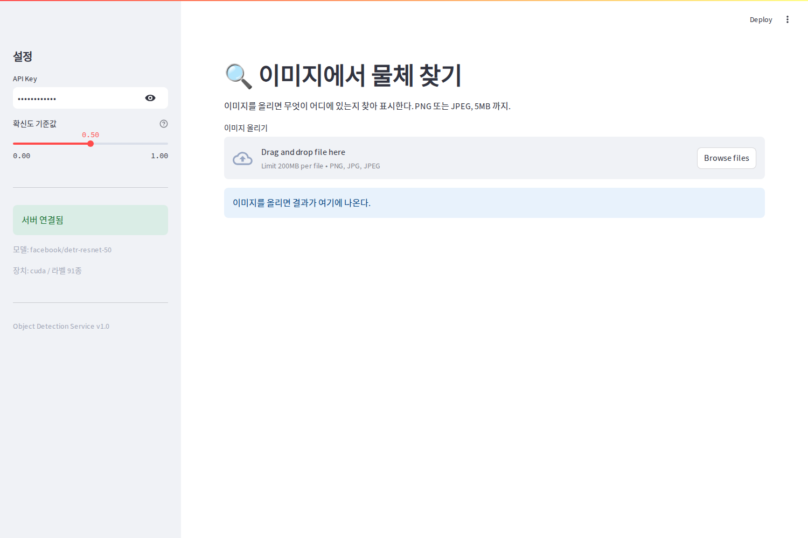
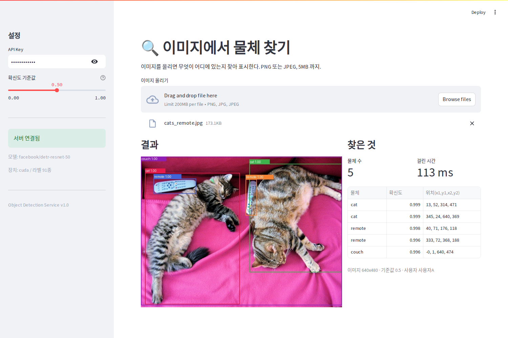
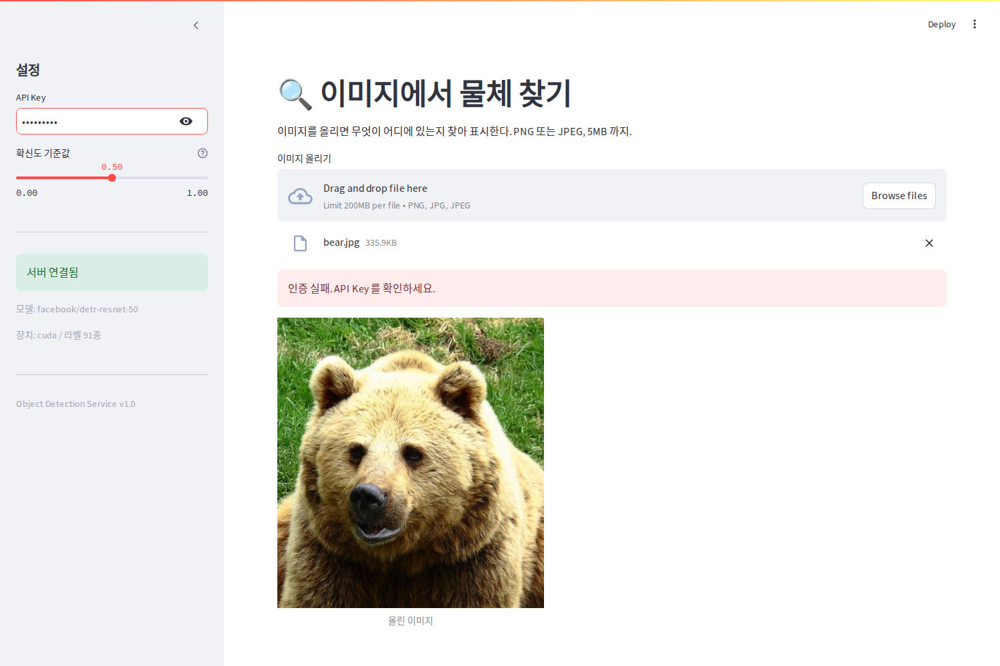
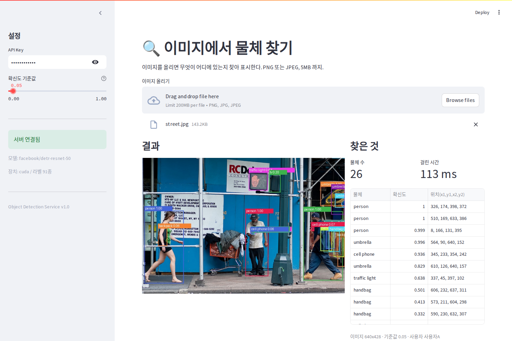

# DP08 — 자율 프로젝트: 이미지에서 물체 찾아주는 서비스

모델 배포 기초 마지막 날. 앞의 7일과 달리 교안이 "이걸 만들어라" 하고 정해주지 않고,
조건만 주고 무엇을 만들지는 알아서 고르라고 했다.

## 무엇을 골랐고 왜 골랐나

**객체 탐지(object detection)** 를 골랐다. 이미지를 올리면 그 안에 무엇이 어디에 있는지
네모로 표시해 돌려주는 서비스다.

고른 이유는 세 가지다.

첫째, **앞 7일과 겹치지 않는다.** Day 6 도 이미지를 받았지만 돌려주는 건 라벨 하나와 숫자 하나였다.
객체 탐지는 몇 개가 나올지 미리 알 수 없고 각각 위치까지 딸려 나온다.
그래서 응답 스키마가 처음으로 한 겹 더 들어간 구조가 되는데, 그걸 만들어보고 싶었다.

둘째, **전에 해본 것의 반대쪽이라서다.** 앞선 프로젝트에서 풍력 발전기 사진에 YOLO 를 붙여본 적이 있는데
그때는 학습시키는 쪽만 했다. 다 만들어진 탐지 모델을 남이 쓸 수 있는 서비스로 내놓는 건 안 해봤다.

셋째, **결과가 눈에 보인다.** 숫자가 아니라 그림 위에 상자가 그려지니 잘 됐는지 안 됐는지 바로 보인다.

```
환경    Ubuntu · Python 3.12.3 · torch 2.9.1(ROCm) · transformers 5.16.1 · fastapi · uvicorn · streamlit
모델    facebook/detr-resnet-50 (COCO 91종, 학습은 안 하고 가져다 씀)
포트    FastAPI 8509 · Streamlit 8510
```

포트는 노트북 기본값인 8000 과 8501 이 내 컴퓨터에서 이미 다른 서버들에 쓰이고 있어서 옮겼다.
Day 7 때와 같은 이유다.

| 파일 | 무엇 | 어디서 왔나 |
| --- | --- | --- |
| [`Final_Code/app/detection_schemas.py`](../Final_Code/app/detection_schemas.py) | 요청·응답 스키마 | 새로 씀 |
| [`Final_Code/app/detection_utils.py`](../Final_Code/app/detection_utils.py) | 업로드 이미지 검증 | Day 6 을 고쳐 씀 |
| [`Final_Code/app/detection_model.py`](../Final_Code/app/detection_model.py) | DETR 로드와 추론 | 새로 씀 |
| [`Final_Code/app/detection_api.py`](../Final_Code/app/detection_api.py) | FastAPI 서버 | 새로 씀 |
| [`Final_Code/app/auth.py`](../Final_Code/app/auth.py) | API Key 인증 | **Day 6 그대로** |
| [`Final_Code/frontend/app_detection.py`](../Final_Code/frontend/app_detection.py) | Streamlit 화면 | 새로 씀 |
| [`Final_Code/experiments/`](../Final_Code/experiments/) | 평가 기준 점검 스크립트 | 새로 씀 |

---

## 1. 만든 것의 구조

```
  브라우저
     |  이미지 파일 업로드
     v
[Streamlit 8510]  결과를 상자로 그리고 표로 보여준다
     |  HTTP multipart + X-API-Key + threshold
     v
[FastAPI 8509]
     |  1  인증        Day 6 auth.py
     |  2  파일 검증   타입 -> 크기 -> 디코딩
     |  3  비동기 추론 run_in_executor 로 스레드에 넘김
     v
[DETR resnet-50]  물체 목록 + 위치를 돌려준다
```

Day 1 부터 하나씩 붙여온 것을 그대로 모았다.
로깅과 에러 처리는 Day 3, 인증은 Day 6, 화면은 Day 4~5, 비동기 추론은 Day 3 에서 가져왔다.

---

## 2. Day 6 과 무엇이 달라졌나 — 응답이 목록이 된다

Day 6 은 이렇게 돌려주면 끝이었다.

```json
{"success": true, "label": 3, "confidence": 1.0, "user": "사용자A"}
```

객체 탐지는 몇 개가 나올지 모른다. 그래서 스키마를 세 겹으로 나눴다.

```
BoundingBox        네모 하나 (x_min, y_min, x_max, y_max)
Detection          물체 하나 = 이름 + 확신도 + BoundingBox
DetectionResponse  전체 = 개수 + Detection 목록 + 기준값 + 이미지 크기 + 걸린 시간
```

Day 2 에서 Pydantic 이 편하다고 느꼈던 게 여기서 좀 다르게 다가왔다.
그때는 숫자 몇 개의 범위를 적어두는 정도였는데, 이번에는 **응답의 모양 자체를 설명하는 일**이 됐다.
스키마를 적어두니 Swagger 문서에 중첩 구조가 그대로 나오고, 프론트에서 무엇을 꺼내 쓸지도 그걸 보고 정했다.

---

## 3. Day 6 인증은 그대로 붙었는데 이미지 검증은 안 붙었다

재사용하려고 Day 6 파일 두 개를 가져와봤는데 결과가 갈렸다.

**`auth.py` 는 한 글자도 안 고치고 붙었다.** Day 7 에서 챗봇에 붙였던 그 파일 그대로다.
이걸로 세 번째 재사용이다(이미지 분류 -> 챗봇 -> 객체 탐지).

**`image_utils.py` 는 그대로 못 썼다.** 검증 순서(타입 -> 크기 -> 디코딩)는 그대로 쓸 만했는데
마지막 줄이 문제였다.

```python
# Day 6 의 마지막 단계
image = image.convert("L").resize(target_size)   # 28x28 그레이스케일
```

28x28 로 줄이고 흑백으로 바꿔서 돌려준다. MNIST 모델이 그걸 원해서 그렇게 짠 것이다.
그런데 객체 탐지는 원본 크기 컬러가 그대로 필요하다. 상자 좌표가 원본 픽셀 기준이어야 하기 때문이다.
그래서 `detection_utils.py` 를 따로 만들고 마지막 단계만 바꿨다.

왜 하나는 붙고 하나는 안 붙었는지 생각해봤다.
`auth.py` 는 "헤더에서 키를 꺼내 목록에 있는지 보고 이름을 돌려준다" 는 일만 하고
그 뒤에 무엇이 오는지 모른다. 반면 `image_utils.py` 는 마지막 줄에 **모델이 원하는 입력 모양이 박혀 있었다.**
가져다 쓸 수 있느냐가 코드 길이나 잘 짰느냐가 아니라, 그 안에 뒷단 사정이 얼마나 들어가 있느냐로
갈리는 것 같다는 생각이 들었다.

---

## 4. 평가 기준 다섯 항목 점검

교안이 준 평가 기준을 그대로 스크립트로 만들어 돌렸다
([`Final_Code/experiments/evaluation_tests.py`](../Final_Code/experiments/evaluation_tests.py)).

### 4.1 서버가 정상적으로 실행되는가

```
/health -> {'status': 'healthy', 'model': 'facebook/detr-resnet-50', 'device': 'cuda', 'num_labels': 91}
```

### 4.2 추론이 동작하는가

샘플 세 장을 넣어봤다. 기준값은 기본인 0.5 다.

| 이미지 | 결과 | 찾은 것 |
| --- | --- | --- |
| 고양이와 리모컨 (640x480) | 5개 | cat 1.00, cat 1.00, remote 1.00, remote 1.00, couch 1.00 |
| 곰 (586x640) | 1개 | bear 1.00 |
| 거리 사진 (640x428) | 8개 | person 1.00 x3, umbrella 1.00, cell phone 0.94, umbrella 0.83, traffic light 0.638, handbag 0.501 |


거리 사진에서 사람 셋과 우산을 제대로 잡았다.
다만 왼쪽 위 간판에 그려진 손 그림을 `traffic light 0.638` 로 잡은 것이 보인다.
사진에 찍힌 물체가 아니라 그림인데도 잡는 걸 보니, 확신도가 0.638 정도면
맞다고 그냥 믿을 수는 없겠다는 생각이 들었다.

### 4.3 API Key 없이 요청하면 401 이 반환되는가

| 무엇을 보냈나 | 응답 |
| --- | --- |
| 헤더 없이 | 401 "API Key가 필요합니다. X-API-Key 헤더를 포함해 주세요." |
| `X-API-Key: wrong-key` | 401 "유효하지 않은 API Key입니다." |
| `X-API-Key: test-key-001` | 200 |

### 4.4 잘못된 입력에 적절한 에러가 나오는가

| 무엇을 보냈나 | 응답 |
| --- | --- |
| 텍스트 파일 (`text/plain`) | 400 "지원하지 않는 파일 형식입니다: text/plain" |
| png 로 위장한 파일 | 400 "이미지 파일을 읽을 수 없습니다. 손상되었거나 이미지가 아닙니다." |
| 6MB 파일 | 400 "파일 크기가 5MB를 초과합니다. 현재: 6.0MB" |
| 기준값 1.5 (범위 밖) | 422 |
| 기준값 -0.1 (범위 밖) | 422 |

앞의 세 개는 내가 쓴 검증 코드가 400 으로 거절했고, 뒤의 두 개는 Pydantic 이 422 로 막았다.
**같은 "잘못된 입력" 인데 막는 주체가 다르다는 게 눈에 들어왔다.**
기준값은 스키마에 `ge=0.0, le=1.0` 한 줄 적어둔 것으로 끝났고,
파일 쪽은 내가 직접 세 단계를 순서대로 놓아야 했다. Day 6 에서 배운 것이 그대로 여기 쓰였다.

### 4.5 Streamlit UI 에서 입력에서 결과 확인까지 되는가

브라우저에서 실제로 조작하며 캡처했다. 5절에 있다.

### 덤 — 동시 요청 네 개

```
요청 #1: 0.21초   요청 #2: 0.42초   요청 #3: 0.37초   요청 #4: 0.31초
전체 0.42초 (순차였다면 대략 1.31초)
```

---

## 5. 화면

### 5.1 첫 화면



사이드바에 모델 이름과 장치(cuda), 라벨 91종이 뜬다. 이 정보는 `/health` 에서 가져온다.

### 5.2 고양이와 리모컨



다섯 개를 찾았고 오른쪽 표에 이름·확신도·좌표가 나온다.
고양이 두 마리와 리모컨 두 개, 그리고 배경 전체를 소파로 잡았다.

### 5.3 인증 실패



API Key 를 `wrong-key` 로 바꾸고 올리면 "인증 실패. API Key 를 확인하세요." 가 뜬다.
Day 7 때와 마찬가지로 사이드바는 여전히 "서버 연결됨" 초록불인데,
사이드바가 부르는 `/health` 에는 인증이 안 걸려 있어서 그렇다.

---

## 6. 추가로 재본 것

### 6.1 기준값을 낮추면 더 찾는 게 아니라 같은 걸 여러 번 찾는다

사이드바 슬라이더로 기준값을 바꿔가며 같은 거리 사진을 넣어봤다.

| 기준값 | 찾은 개수 | 무엇이 늘었나 |
| --- | --- | --- |
| 0.05 | 26개 | cell phone x9, handbag x6, person x3, umbrella x3, backpack x2 |
| 0.3 | 10개 | person x3, handbag x3, umbrella x2 |
| 0.5 | 8개 | person x3, umbrella x2, cell phone, traffic light, handbag |
| 0.7 | 6개 | person x3, umbrella x2, cell phone |
| 0.9 | 5개 | person x3, umbrella, cell phone |
| 0.95 | 4개 | person x3, umbrella |



0.05 로 내렸을 때 26개가 나왔는데, 표를 보면 `handbag` 이 세 줄이고 좌표가 이렇다.

```
handbag 0.501   606, 232, 637, 311
handbag 0.413   573, 211, 604, 298
handbag 0.332   590, 230, 632, 307
```

거의 같은 자리를 세 번 잡은 것이다. 개수가 늘어난 게 새로 찾은 게 아니라
**같은 것을 조금씩 다르게 여러 번 답한 것**에 가까웠다.
사람 수는 0.05 에서나 0.95 에서나 셋으로 그대로였다.

기준값을 낮추면 놓치는 걸 줄일 수 있다고만 생각했는데, 실제로 재보니
같은 자리를 겹쳐 답하는 것이 먼저 늘었다. 겹치는 걸 정리하는 처리가 따로 필요하겠구나 싶었다.

### 6.2 첫 요청만 유난히 느리다 (그리고 처음 잰 값은 재현되지 않았다)

서버를 새로 띄우고 처음 세 장을 넣었을 때 이런 값이 나왔다.

```
1번째 (고양이)    943.9 ms
2번째 (곰)       5338.3 ms
3번째 (거리)     7113.3 ms
```

뒤로 갈수록 느려지는 게 이상해서, 이미지마다 크기가 달라서 그때마다 준비를 다시 하는 것이라고
생각했다. 그런데 확인하려고 서버를 내렸다 다시 띄우고 같은 순서로 재봤더니 이렇게 나왔다.

```
1번째 (고양이)   1006.1 ms
2번째 (곰)        141.9 ms
3번째 (거리)      163.7 ms
```

**2번째와 3번째가 재현되지 않았다.** 5338 ms 가 141.9 ms 로, 7113 ms 가 163.7 ms 로 나왔다.
그러니까 "이미지 크기가 바뀔 때마다 느려진다" 는 내 짐작은 틀렸다.
느린 건 **첫 요청 하나뿐**이고, 그 뒤로는 처음 보는 크기여도 빠르다.

이미 겪은 이미지를 다시 넣으면 이렇다.

| 이미지 | 1회 | 2회 | 3회 |
| --- | --- | --- | --- |
| 고양이 | 114.1 ms | 101.9 ms | 102.0 ms |
| 곰 | 95.7 ms | 96.3 ms | 96.6 ms |
| 거리 | 113.5 ms | 110.0 ms | 111.0 ms |

정리하면 **첫 요청 약 1초, 그 뒤로는 100 ms 대**다. 10배쯤 차이가 난다.

처음에 5초, 7초가 나온 이유는 확실히 모르겠다. 다만 그때는 Day 7 에서 띄운 챗봇 서버가
같은 GPU 에 아직 올라가 있었고(VRAM 3.9 GB), 두 번째로 잴 때는 그걸 내린 뒤였다.
그 차이일 수도 있는데 확인해보지는 않았다. 여기는 짐작으로 남겨둔다.

어느 쪽이든 첫 요청이 느리다는 것 자체는 두 번 다 같았다.
서버를 띄우자마자 사용자가 들어오면 첫 사람만 1초를 기다린다.
서버가 뜰 때 아무 이미지나 한 번 넣어보고 시작하면 될 것 같은데 이번에는 안 해봤다.

**여기서 하나 배웠다.** 처음 잰 값만 보고 "크기가 바뀔 때마다 느려진다" 는 이야기를 그대로 적을 뻔했다.
다시 재봤기 때문에 틀린 걸 알았다. 한 번 재고 결론을 내리면 안 되겠다는 생각이 들었다.

---

## 7. Day 8 최종 체크포인트

**Q1. 본인의 프로젝트에서 Pydantic 검증은 어떤 잘못된 입력을 막아줍니까?**

기준값(threshold)의 범위를 막아준다. 스키마에 `ge=0.0, le=1.0` 을 적어둬서
1.5 나 -0.1 을 보내면 서버 코드에 닿기 전에 422 로 거절된다(4.4).

응답 쪽에서도 일을 한다. `DetectionResponse` 에 개수·목록·좌표의 모양을 적어뒀기 때문에
내가 실수로 다른 모양을 돌려주면 그 자리에서 걸린다.

다만 **파일 자체는 Pydantic 이 못 막는다.** 업로드 파일은 스키마로 걸러지는 게 아니라
직접 열어봐야 알 수 있어서, 타입과 크기와 디코딩을 순서대로 확인하는 코드를 따로 써야 했다.

**Q2. `Depends(verify_api_key)` 를 제거하면 어떤 위험이 있습니까?**

주소만 알면 아무나 부를 수 있게 된다. 추론은 GPU 를 쓰는 일이라
누가 대량으로 호출하면 자원이 그쪽으로 다 가고, 클라우드였다면 비용도 같이 나간다.
누가 불렀는지 알 수 없어서 문제가 생겨도 막을 대상을 못 고른다.

Day 6 에서 이 항목을 적을 때 "모델 도용" 도 같이 적었는데, 그때 따로 재봤을 때
호출 횟수를 막는 것이 응답 형식을 감추는 것보다 먼저였다.
여기도 같은 이야기라고 생각한다.

**Q3. `run_in_executor` 를 사용한 이유는 무엇입니까?**

추론이 GPU 를 붙잡고 있는 동안 그 스레드가 멈춰 있는데,
이걸 이벤트 루프에서 바로 돌리면 그동안 다른 요청은 아무것도 처리되지 못한다.
헬스체크 하나도 안 돌아간다.

별도 스레드로 넘기면 그 사이 다른 요청이 접수된다. 실제로 동시 요청 네 개가
전체 0.42초에 끝났는데 각각의 합은 1.31초였다(4절 덤).
Day 3 에서 이걸 오래 재봤던 게 그대로 쓰였다.

**Q4. Day 1~8 중 가장 많이 참고한 Day는 어디였습니까? 왜?**

**Day 6** 이다. 이번 프로젝트가 이미지를 파일로 받는 서비스라 겹치는 게 제일 많았다.
인증은 그 파일을 그대로 가져왔고, 파일 검증도 순서를 그대로 따라갔다.
3절에 적었듯이 한쪽은 그대로 붙고 한쪽은 못 붙었는데, 어느 쪽이든 Day 6 을 열어놓고 봤다.

그다음이 **Day 5** 다. Streamlit 에서 결과를 표로 보여주는 부분을 다시 봤다.
Day 3 은 `run_in_executor` 를 쓸 때 한 번 확인했다.

**Q5. 이 서비스를 실제로 배포하려면 추가로 무엇이 필요합니까?**

지금 상태에서 걸리는 것을 적어보면 이렇다.

```
API Key 가 auth.py 에 하드코딩되어 있다     코드에 비밀이 들어 있고, 키를 바꾸려면 코드를 고쳐야 한다
첫 요청이 5~7초 걸린다                     서버가 뜰 때 미리 한 번 돌려두는 것이 필요해 보인다
포트를 손으로 맞춰야 한다                   Day 7 과 오늘 둘 다 포트를 옮겨야 했다
서버가 죽으면 아무도 모른다                 지금은 내가 curl 로 확인하는 것이 전부다
호출 횟수 제한이 없다                       인증은 있지만 한 사람이 얼마나 부를 수 있는지는 안 정해뒀다
```

특히 세 번째가 이번에 몸으로 느껴졌다. 내 컴퓨터에서 되던 게 다른 데서 그대로 될 거라고
볼 수 없다는 걸, 포트가 막혀 옮기면서 두 번 겪었다.
교안 제한 사항에 Docker 는 다음 과정에서 다룬다고 적혀 있었는데,
왜 그게 다음에 오는지가 이 목록을 적고 나니 좀 보이는 것 같다.

---

## 8. 발표 항목

**어떤 도메인과 태스크를 선택했는가** — 객체 탐지. 이미지에서 물체의 이름과 위치를 찾는 것.

**어떤 모델을 사용했는가, 선택 이유** — `facebook/detr-resnet-50`.
교안 추천 목록에 있던 것이고, COCO 91종을 다뤄서 아무 사진이나 넣어도 뭔가는 잡히니
데모로 보여주기 좋다고 생각했다. 별도 후처리 없이 상자와 확신도가 바로 나오는 것도 골랐던 이유다.

**데모 시연** — Streamlit 화면(5절). 이미지를 올리면 상자가 그려지고 표가 뜬다.
기준값 슬라이더를 움직이면 개수가 26개에서 4개까지 바뀌는 것도 그 자리에서 보여줄 수 있다.

**구현하면서 가장 어려웠던 부분** — 코드보다 **숫자를 해석하는 쪽**이 어려웠다.
6.2 에서 첫 측정만 보고 "이미지 크기가 바뀔 때마다 느려진다" 고 적었는데,
서버를 내렸다 다시 띄워 재보니 그 값이 재현되지 않았다.
다시 재봤기 때문에 틀린 걸 알았지 안 그랬으면 그대로 제출할 뻔했다.

---

## 9. 회고

**Day 1~7 교안 없이 코드를 작성할 수 있었는가**

절반쯤이다. 전체 구조 — 인증을 앞에 두고, 파일을 검증하고, 추론을 스레드로 넘기고,
응답 스키마를 정해서 돌려주고, 프론트에서 그걸 받아 그린다 — 는 교안을 안 보고 세울 수 있었다.
8일 동안 같은 모양을 여섯 번쯤 봐서 그런 것 같다.

못 한 건 세부 사항이다. `post_process_object_detection` 에 넣는 `target_sizes` 가
(세로, 가로) 순서라는 것이나, 응답 스키마를 중첩으로 짜는 방법은 찾아봐야 했다.

**어떤 부분에서 교안을 다시 찾아봤는가**

Day 6 의 파일 검증 순서, Day 3 의 `run_in_executor` 쓰는 모양, Day 5 의 Streamlit 표 그리기.
셋 다 "어떻게 하는지" 가 아니라 "그때 뭐라고 썼더라" 를 확인하러 간 것에 가까웠다.

**다음에 다시 만든다면 무엇을 다르게 하겠는가**

두 가지다.

하나는 **서버가 뜰 때 미리 한 번 돌려두는 것**이다. 6.2 에서 첫 요청이 50배 느린 걸 봤는데
이건 코드 몇 줄이면 될 것 같은데 이번에는 재기만 하고 안 고쳤다.

다른 하나는 **겹친 상자를 정리하는 것**이다. 6.1 에서 기준값을 낮추니 같은 자리를 세 번 답했다.
기준값만 만지는 걸로는 안 되고 겹침을 걸러내는 처리가 따로 있어야 할 것 같은데,
그게 어떻게 하는 것인지는 아직 모른다.

**8일 전체를 돌아보면**

Day 1 에 "주소만 알면 누구나 부를 수 있는 API" 로 시작해서, 오늘은 인증이 걸려 있고
잘못된 입력을 거절하고 동시에 여러 요청을 받는 서비스를 만들었다.
하루하루는 작은 것 하나씩 붙이는 것이었는데 8일치를 한꺼번에 쓰니 그게 다 필요했다.

제일 남는 건 `auth.py` 파일 하나다. Day 6 에 만들어서 Day 7 챗봇에 붙이고 오늘 또 붙였는데
세 번 다 한 글자도 안 고쳤다. 처음엔 인증이라는 기능을 배웠다고 생각했는데,
지금은 **다른 데 붙여도 안 깨지게 나누는 법**을 본 쪽에 가깝다는 생각이 든다.
같은 Day 6 에서 나온 `image_utils.py` 는 안 붙었으니 더 그렇다.
