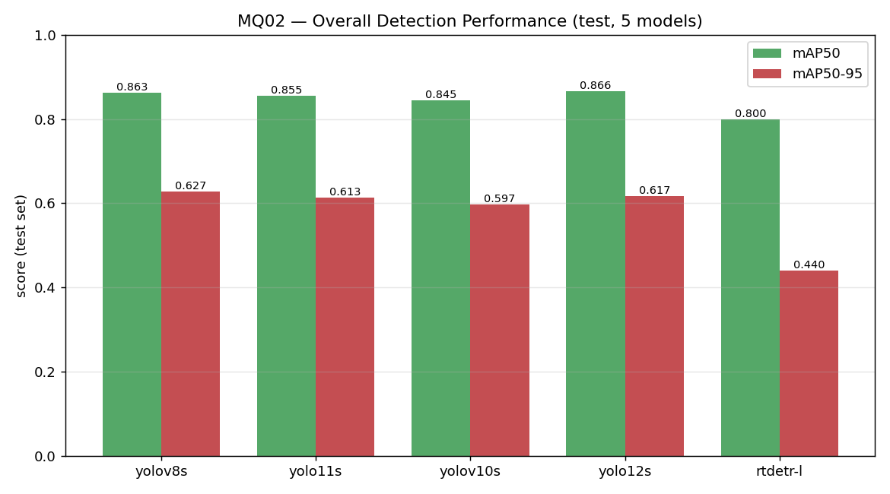
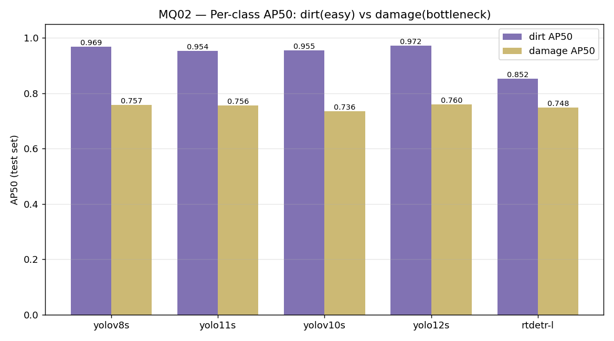
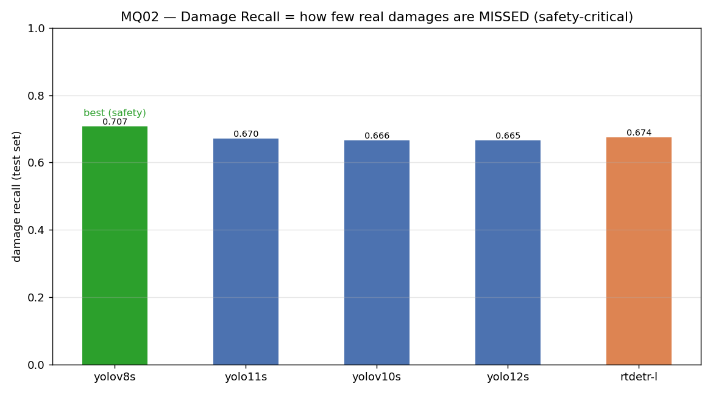
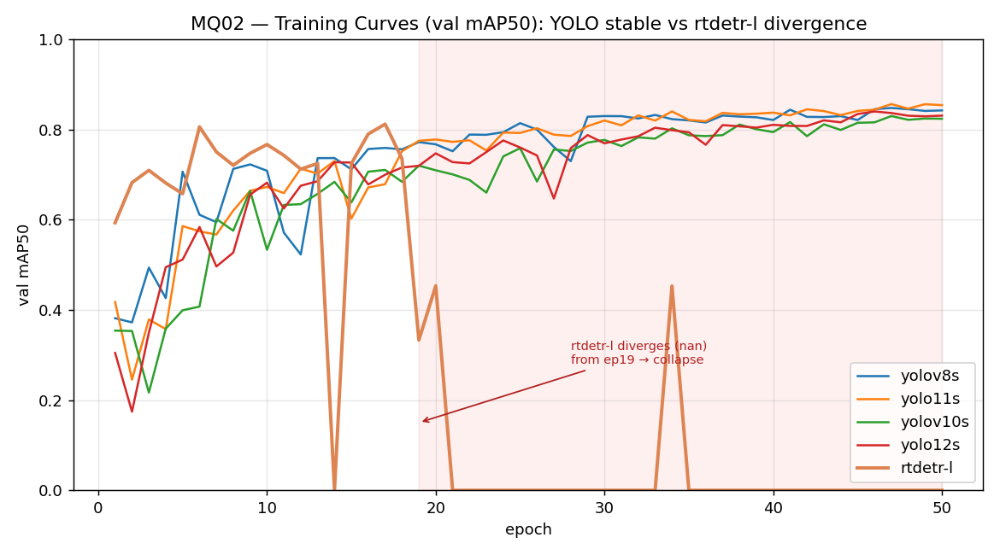
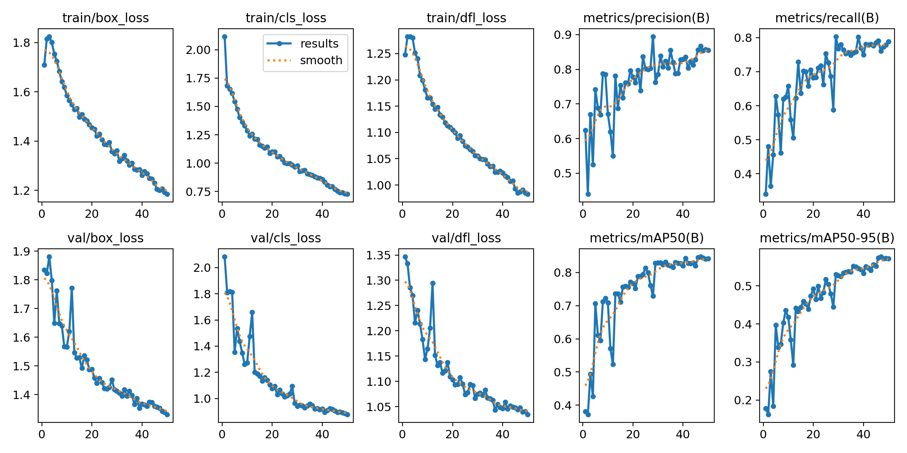
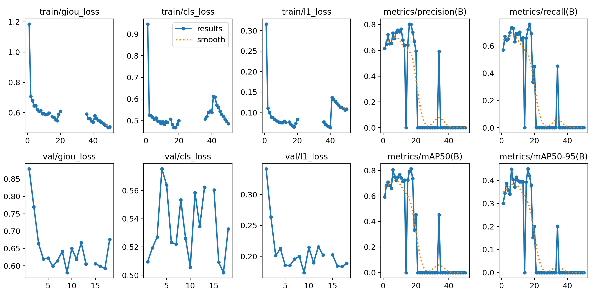
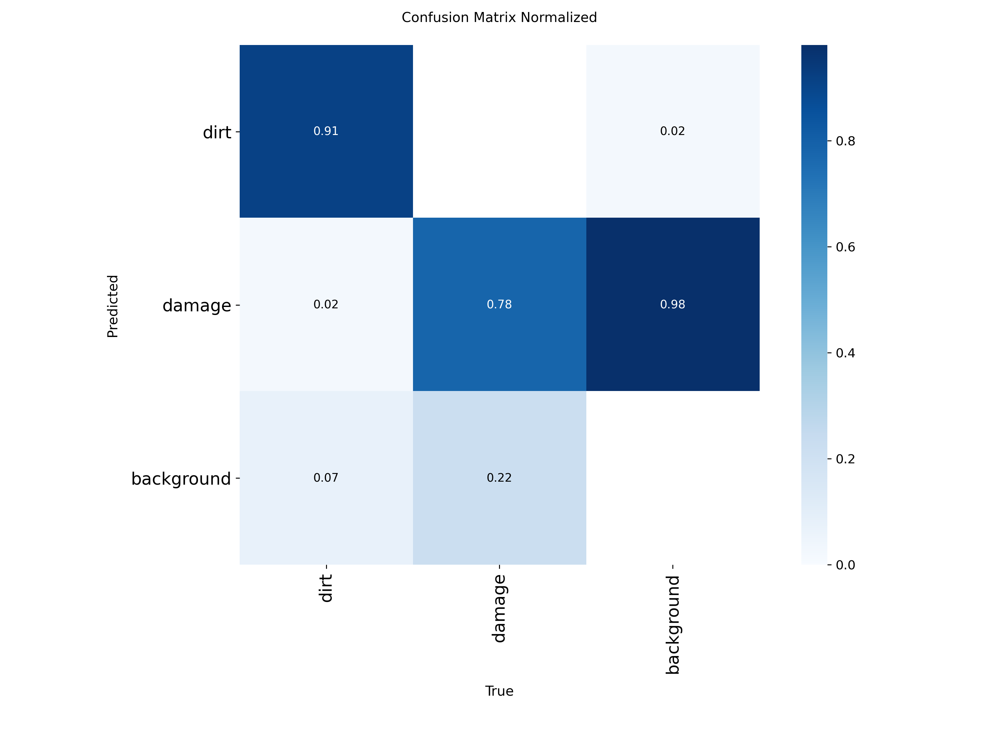
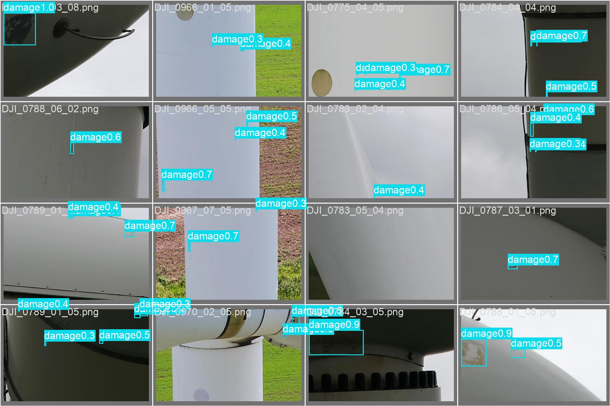

# MQ02 풍력터빈 손상탐지 — 1단계 수행 결과 (모델 5종 비교)

> 엔지니어 3기 런케이션 해커톤 / 팀 공동작업. 이 문서는 1단계(baseline 파인튜닝 + 모델 비교)를 종합한 것이다.
> 드론이 찍은 풍력터빈 블레이드 사진에서 오염(Dirt)과 손상(Damage) 2종을 YOLO 계열로 탐지한다.
> 결론을 먼저 보이고, 그 근거가 되는 데이터와 원본 자료는 아래쪽에 붙였다.

## 한 줄 결론

- 5종(yolov8s / yolo11s / yolov10s / yolo12s / rtdetr-l)을 같은 조건으로 파인튜닝해 test로 비교했다.
- **현재 최선은 yolov8s** (특히 손상을 제일 덜 놓치는 안전 관점에서).
- 공통 병목은 **Damage를 30% 안팎 놓치는 것(recall)**. 이게 2단계 개선 타깃이다.

---

# 1단계 결론 — 모델 5종 종합 비교

아래 성능은 전부 **학습에 한 번도 안 쓴 test 301장(952박스)** 으로 잰 것이다.
5종 전부 동일 설정: **50에폭 / imgsz 640 / batch 16 / seed 42 / 같은 split**.

## 전체 성능 — mAP50 / mAP50-95

- mAP50(박스가 대충 절반 이상 겹치면 맞다고 보는 후한 기준)은 5종이 0.80~0.87로 다닥다닥 붙어 있다.
- mAP50-95(박스를 얼마나 정밀하게 그렸는지까지 보는 깐깐한 기준)에서는 YOLO 4종(0.60~0.63)이 rtdetr-l(0.44)보다 확실히 앞선다.
- 다만 **rtdetr-l은 불리한 조건이었다** — 학습 중 발산이 나서 반쪽만 학습한 모델이다(아래 학습곡선 참고). 그래서 이 숫자만으로 "rtdetr가 나쁘다"고 단정하면 안 된다.

## 클래스별 AP — 진짜 어려운 건 Damage였다

- 데이터가 1대 15로 Dirt가 희귀해서 "Dirt가 약할 것"이라 예상했는데 **정반대**다.
- **Dirt는 5종 전부 AP50 0.85~0.97로 아주 잘 잡는다.** (Dirt는 크고 뚜렷해서 쉬운 듯.)
- **오히려 Damage가 병목이다(AP50 0.74~0.76).** Damage는 작고 다양해서 더 어렵다.
- 이게 모델 5종에서 똑같이 나타난다 -> 모델 탓이 아니라 데이터 특성이다. 결론의 신뢰도가 올라간다.

## Damage Recall — 안전 관점에서 제일 중요한 숫자

- Recall은 "실제 있는 손상 중 몇 %를 놓치지 않고 잡았나"다. 풍력터빈 점검에서 손상을 못 보고 지나치는 건 제일 위험한 실수라, 여기가 핵심이다.
- 5종 다 0.665~0.707 -> **실제 손상의 30% 안팎을 놓치고 있다.** 아직 갈 길이 있다는 뜻이고, 개선 타깃이다.
- 그중 **yolov8s가 0.707로 가장 덜 놓친다.** 안전 관점에서 현재 1등.

## 학습곡선 — rtdetr-l의 발산(환경 제약 이야기)

- YOLO 4종은 위쪽에서 안정적으로 수렴한다.
- **rtdetr-l(굵은 주황선)은 ep17에서 최고점(mAP50 0.81)을 찍은 뒤 ep19부터 nan으로 발산해 무너진다.** 그래서 마지막 가중치가 아니라 ep17 시점 best 가중치를 썼다(반쪽 학습).
- 이건 과적합이 아니라 **수치 발산**이다(과적합이면 곡선이 서서히 나빠지는데, 여기는 한순간에 0으로 폭발했다).
- 원인 의심: rtdetr는 트랜스포머 계열이라 내부 연산이 예민한데, 우리 로컬 GPU(AMD, 최신 칩이라 커널 우회 사용)에서 그 연산이 수치적으로 불안정해진 것으로 본다. YOLO는 이 연산이 없어서 멀쩡했고, 코랩(NVIDIA)에서 돌린 rtdetr는 발산이 없었다. -> "환경에 따라 쓸 수 있는 모델이 갈린다"는 발표 포인트.

## 모델별 장단점 정리

| 모델 | test mAP50 | mAP50-95 | damage recall | 한 줄 성격 |
|------|-----------|----------|---------------|-----------|
| **yolov8s** | 0.863 | **0.627** | **0.707** | **만능·안전형.** 박스 정밀도 최고 + 손상 제일 덜 놓침. 종합 1등. |
| yolo12s | **0.866** | 0.617 | 0.665 | dirt 저격수. mAP50·dirt 최고지만 손상은 제일 많이 놓침. |
| yolo11s | 0.855 | 0.613 | 0.670 | 무난한 중간. |
| yolov10s | 0.846 | 0.597 | 0.666 | 살짝 처지는 편. |
| rtdetr-l | 0.800 | 0.440 | 0.674 | 이방인(트랜스포머 계열). 발산으로 반쪽 학습이라 지금은 불리. 구조가 달라서 앙상블 재료로는 가치. |

- **가장 오래된 yolov8s가 최신(v10/v11/v12)을 이겼다.** "최신이 곧 최고는 아니다"가 우리 결과의 재미있는 점.
- YOLO 4종은 같은 계열이라 성적이 비슷하다 -> 이들끼리 앙상블해봐야 큰 이득이 없다(같은 실수를 함). 구조가 다른 rtdetr를 섞어야 서로의 구멍을 메운다.

## 다음 단계

1. **탐지 결과 시각화·데모** — test 이미지에 예측 박스를 그려 "실제로 잘 잡는지" 눈으로 확인(서비스 데모로 확장).
2. **개선 실험** — 정상 78% 데이터 포함, 증강, Damage 위주 튜닝으로 recall 끌어올리기.
3. **rtdetr 발산 극복** — batch를 키워(gradient 안정화) 발산 없이 완주시키고 공정 비교.
4. **앙상블** — 구조가 다른 YOLO + rtdetr를 합쳐 서로의 약점 보완.

---

# 근거 자료

## 데이터와 실험 설정 (EDA)

- 데이터: YOLO Annotated Wind Turbine Surface Damage. 전체 13,470장.
- EDA에서 나온 두 가지 중요한 사실:
  - **정상(라벨 없는) 이미지가 10,475장으로 전체의 78%.** baseline은 이걸 안 쓴다(라벨 있는 것만 학습). -> "정상 포함" 개선 실험 거리.
  - **박스 개수가 Dirt 581 : Damage 8,770 = 약 1대 15로 불균형.** Dirt가 희귀하다. 그래서 전체 mAP만 보면 Damage에 휘둘리니 **클래스별 AP를 꼭 따로 봐야 한다.**
- split: 라벨 있는 이미지를 Dirt 포함 여부로 층화해서 train 2,395 / val 299 / test 301로 나눴다. seed 고정이라 팀 전원이 같은 split을 쓴다(그래야 비교가 성립).
- 학습: COCO 사전학습 가중치에서 우리 2클래스로 **파인튜닝**.

## 원본 자료 — 학습 곡선 대시보드 (results.png)

ultralytics가 학습 전체를 한 판에 요약해주는 그림. 학습이 건강하게 됐는지(loss가 잘 떨어졌는지, 과적합은 없는지, 언제 수렴했는지)를 여기서 다 읽는다.

### yolov8s — 건강하게 수렴한 예

- 위 3개(train box/cls/dfl loss)와 아래 왼쪽 3개(val loss)가 **전부 우하향**한다.
- ★ **train loss와 val loss가 같이 내려간다 = 과적합이 아니다.** (과적합이면 train은 계속 내려가는데 val이 어느 순간 위로 꺾인다. 여기는 안 꺾였다.)
- 오른쪽 precision / recall / mAP50 / mAP50-95는 우상향해서 mAP50 0.8+, mAP50-95 0.55+로 안정적으로 눕는다(수렴).
- val loss가 ep12쯤 한 번 삐죽 튄 건 학습 중 흔들림이고 곧 회복한다. 정상 범위.
- 50에폭 끝에서도 loss가 아직 아주 미세하게 내려가는 중이지만 mAP는 거의 평평하다 -> 이미 수렴했고, 에폭을 더 늘려도 큰 이득은 없을 것이라는 뜻.

### rtdetr-l — 발산한 예 (대비)

- **ep17까지는 yolov8s와 똑같이** 건강하게 내려가고 mAP도 0.8까지 오른다.
- 그런데 **ep19에서 precision·recall·mAP가 절벽처럼 0으로 추락**하고, train loss 곡선은 **중간이 뚝 끊긴다(nan이라 안 그려짐)**.
- 한 그림 안에서 왼쪽(정상 학습)과 오른쪽(붕괴)이 갈리는 게 발산의 시각적 증거다. 과적합처럼 서서히 나빠진 게 아니라 한순간에 무너졌다.

## 원본 자료 — confusion matrix (yolov8s)

이 표 하나가 우리 이야기를 두 개 증명한다.
- **True damage 열: 0.78만 damage로 맞히고 0.22를 background로 놓친다.** -> 위의 "Damage recall 병목(30% 놓침)"과 같은 말.
- **True background 열: 0.98이 damage로 오탐된다.** -> 정상/배경을 손상으로 잘못 잡는 과탐이 크다는 뜻. 이건 **정상 78%를 학습에 안 쓴 대가**로 본다. 정상 데이터를 넣으면 이 과탐이 줄 것이라는 개선 실험의 근거.

## 원본 자료 — 실제 예측 이미지 (yolov8s)

숫자가 아니라 실제 드론 사진에 손상 박스와 신뢰도를 그린 것. "정말로 잡는다"의 눈으로 보는 근거다.
(신뢰도 낮은 것까지 다 그려서 다소 복잡하다. 데모 때는 신뢰도 기준을 걸어 깔끔하게 보일 수 있다.)

## 각 모델 원본 폴더

`results/<모델>/` 안에 모델별 원본이 다 있다: `results.csv`(에폭별 지표), `args.yaml`(학습 설정), `results.png`(학습 종합 곡선), `confusion_matrix*.png`, `Box*_curve.png`(PR/F1 등), `val_batch*_pred.jpg`(예측 이미지). 무거운 가중치(best.pt)와 데이터는 용량 때문에 repo에 안 올렸다.

## 재현 방법
- split 생성: `code/make_split.py` (경로 2줄만 바꾸면 동일 split 재생성)
- 학습: `code/MQ02_baseline.py` (맨 위 MODEL 한 줄만 바꿔 5종 각각) / rtdetr 로컬은 `code/run_rtdetr_local.py`
- test 평가(클래스별 AP): `code/eval_colab_yolo.py`(YOLO) / `code/eval_best.py`(rtdetr)
- 종합 비교 그래프: `code/make_comparison_charts.py`
- 데이터 원본은 Kaggle "YOLO Annotated Wind Turbine Surface Damage", 학습된 best.pt는 팀 드라이브 참조.
