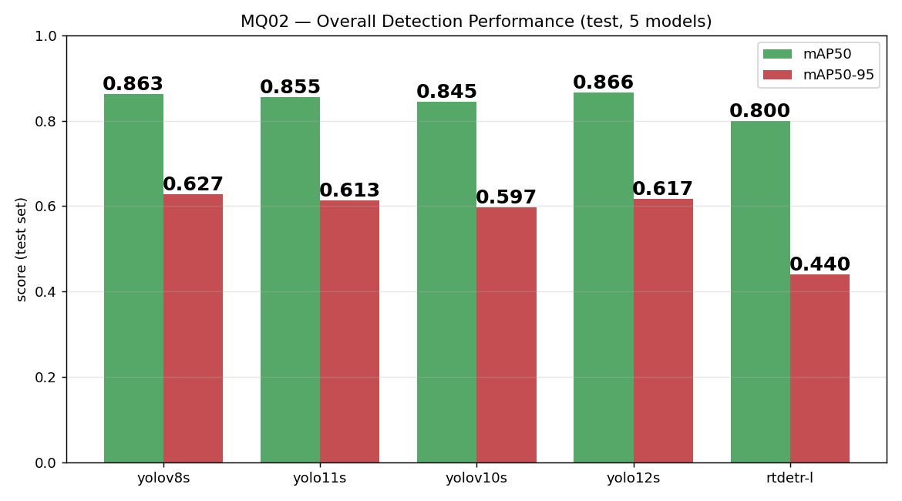
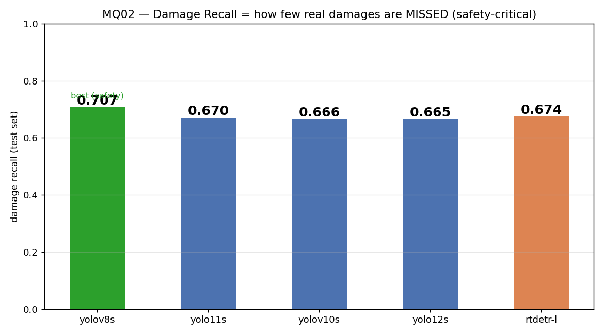
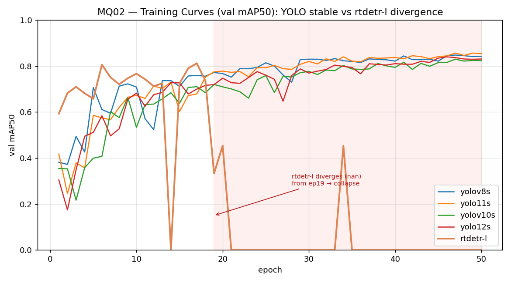
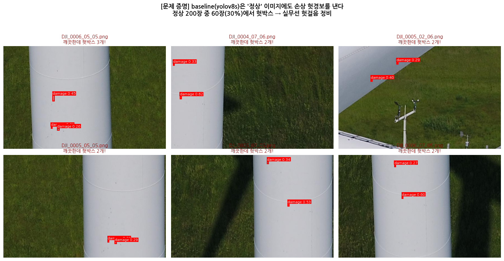
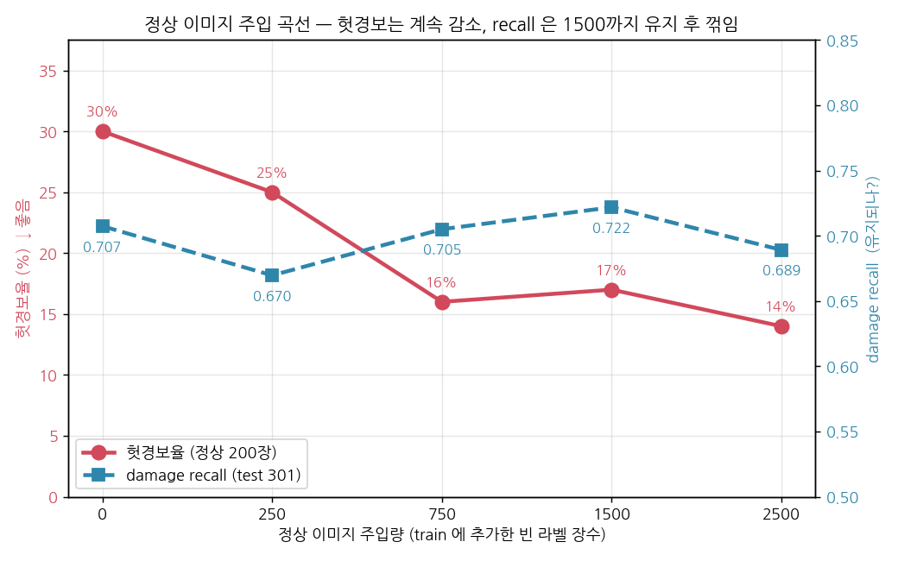

# MQ02 풍력터빈 손상탐지 — 프로젝트 종합 히스토리 (발표 근거 문서)

> 이 문서는 지금까지의 모든 진행을 **시간 순서**로 정리한 종합 문서다.
> 여러 실험이 섞여 순서와 지표 발전이 헷갈리기 시작해서, 마무리 전에 한 번 정리한다.
> 발표 자료를 짤 때 여기서 표·그래프·결론을 그대로 꺼내 쓰면 된다.

## 읽기 전에 — 지표 잣대가 2종류 (★중요)

이 프로젝트의 숫자는 **두 가지 다른 자로 잰 것**이라, 섞어서 비교하면 안 된다.

- **잣대 A = ultralytics 공식 val** — 1단계 모델 비교, 콜랩 4모델 평가에 사용. **절대값이 그대로 유효**.
- **잣대 B = 내가 numpy로 직접 계산(conf 0.05)** — 앙상블, WTBD 측정에 사용. 저신뢰도 박스까지 넣어 재서 **절대값은 공식과 다르다. "앙상블이 단일보다 오르나" 같은 상대비교만 유효**.

그래서 예를 들어 1단계 yolov8s damage recall 0.707(잣대 A)과 앙상블 0.944(잣대 B)를 "0.24 올랐다"로 읽으면 안 된다. 각 잣대 안에서만 비교한다. 아래 표마다 어느 잣대인지 표시했다.

---

## 0. 프로젝트 개요

- **문제**: 풍력터빈 블레이드 사진에서 오염(dirt=0)·손상(damage=1) 2클래스를 YOLO로 탐지.
- **데이터**: Kaggle NordTank 586x371. 전체 13,470장 중 **라벨 있는 건 2,995장, 정상(무라벨)이 10,475장(78%)**. 박스 개수는 **Dirt 581 : Damage 8,770 = 1:15**로 불균형.
- **split**: 라벨된 것만, Dirt 층화, seed42, 80/10/10 -> **train 2,395 / val 299 / test 301**. (val·test는 전 실험 고정 = 공정 비교)
- **평가지표**: mAP50, mAP50-95, 클래스별 AP, damage recall(우리 병목). 서비스 데모(박스 시각화)도 필수.
- **팀**: 5명. 김민욱 = 발표 + rtdetr-l + 정상주입/앙상블 담당.
- **환경**: 로컬 AMD Strix Halo(gfx1151, 통합메모리 108GB). YOLO는 ROCm에서 잘 돌지만 **RT-DETR은 MIOpen 커널 문제로 크래시** -> 우회 설정(HSA_OVERRIDE + MIOPEN_FIND_MODE=2)으로 겨우 학습. batch16이 sweet spot(10분/에폭), batch24/32는 메모리 대역폭 병목으로 3배 느림.

## 타임라인 한눈에

| 시점 | 단계 | 한 일 | 핵심 결과 |
|------|------|-------|-----------|
| 06-30 | 문제·환경 | 데이터 EDA, split, 환경 검증 | 정상 78%·1:15 불균형 발견, YOLO는 로컬OK/rtdetr는 우회 필요 |
| 07-01 | 1단계 모델비교 | 5모델(yolov8s/11s/v10s/12s/rtdetr) 파인튜닝·평가 | **yolov8s 종합승자**, 공통 병목 = damage 놓침(recall ~0.70) |
| 07-01 | 2단계-A 정상주입 | 빈 라벨(배경 negative) 주입 실험 (0/250/750/1500/2500) | **헛경보 30%->14%**, recall 은 1500까지 유지 후 2500서 꺾임 (김민욱 고유 레인) |
| 07-01 | 2단계-B 앙상블 | 4모델 + rtdetr WBF 합침 | **damage recall 0.856->0.944** (잣대 B) |
| 07-02 | 2단계-C 일반화 | 외부데이터 2종(WTBD·blade30 타일화)에 앙상블 적용 | 둘 다 절대성능 붕괴(전처리로 도메인갭 못 메움) but 앙상블 우위는 견고(n=2) |
| 07-02 | 정상주입 곡선 완성 | norm2500 끝점까지 5점 측정 | **recall 꺾이는 지점 확인(2500), sweet spot=750~1500** |

---

## 1단계 — 5개 모델 비교 (잣대 A: 공식 val, test 301장)

사전학습 모델을 우리 2클래스로 파인튜닝. 전부 동일 설정(50에폭 / imgsz640 / batch16 / seed42)이라 공정 비교.

| 모델 | mAP50 | mAP50-95 | dirt AP50 | damage AP50 | **damage recall** |
|------|-------|----------|-----------|-------------|-------------------|
| yolov8s | 0.863 | 0.627 | 0.969 | 0.757 | **0.707** ← 승자(안전관점) |
| yolo12s | 0.866 | 0.617 | 0.972 | 0.760 | 0.665 |
| yolo11s | 0.855 | 0.613 | 0.954 | 0.756 | 0.670 |
| yolov10s | 0.846 | 0.597 | 0.955 | 0.736 | 0.666 |
| rtdetr-l (ep17, 반쪽) | 0.800 | 0.440 | 0.852 | 0.748 | 0.674 |

**발견**
- **yolov8s가 종합 승자.** mAP50-95 최고(0.627), damage recall 최고(0.707) = 안전(놓침 적음) 관점 1등. "최신 모델(v10/v12)이 항상 낫진 않다."
- **dirt는 다 잘 잡는다(AP50 0.95+), damage가 병목**(AP50 0.74~0.76, recall ~0.70 = 손상 30%를 놓침). 이게 이후 모든 개선의 타깃.
- rtdetr은 mAP50-95가 확 낮은데, 이건 성능 문제라기보다 **학습이 반쪽만 됐기 때문**(아래 환경 이야기).

### 곁가지지만 발표 카드 — rtdetr 발산과 환경 한계

rtdetr은 ep17까지 잘 오르다 **ep19에서 nan으로 발산**하고 이후 붕괴했다. lr을 낮춰봤더니 발산이 ep19->ep24로 **지연만** 될 뿐 결국 또 터졌다. 결론은 **"lr은 시점만 조절하고, 근본 원인은 환경(ROCm 우회의 수치 불안정)"**이다. 즉 이 하드웨어엔 rtdetr을 안정적으로 학습시킬 lr이 없다. -> "성능차가 아니라 학습 안정성(환경)차"라는 발표 포인트.

---

## 2단계-A — 정상 이미지 주입 (헛경보 줄이기, 김민욱)

**개념**: 1단계는 라벨 있는 사진(전부 어딘가 손상/오염 있음)만 학습해서, 모델이 "무조건 어딘가 문제가 있다"는 전제를 갖게 됐다. confusion matrix에서 **깨끗한 배경을 damage로 오인(과탐 0.98)**. 그래서 **정상(라벨 없는) 이미지를 빈 라벨(= 배경 negative)로 train에 주입**해 "문제 없는 경우도 있다"를 가르친다.

**baseline이 정상 사진에 헛박스를 그리는 증거 (킬러 슬라이드)**

정상 200장에 baseline yolov8s를 돌리니 **60장(30%)에서 헛박스 80개**(잔디·기둥을 damage로). 이게 문제 정의.

**비율 실험 결과** (yolov8s 고정 = 변수 격리, 헛경보는 정상 200장 기준, recall은 test 301장)

| 주입량 | 헛경보율 | damage recall | mAP50 |
|--------|----------|---------------|-------|
| norm0 (baseline) | 30% | 0.707 | 0.863 |
| norm250 (~9%) | 25% | 0.670 | 0.862 |
| norm750 (~24%) | **16%** | 0.705 | **0.870** |
| norm1500 (~48%) | 17% | **0.722** | 0.869 |
| norm2500 (~51%) | **14%** | 0.689 | 0.865 |

(잣대 A: ultralytics 공식 val, test 301장. 헛경보율은 라벨 없는 정상 200장 conf 0.25 기준.)

**발견**: 정상을 넣을수록 **헛경보가 30% -> 14%로 계속 감소**한다. damage recall 은 **norm1500까지는 유지·회복**(0.707 -> 0.722, 오히려 최고)되다가 **norm2500(train 의 ~51%)에서 처음으로 꺾인다(0.722 -> 0.689)**. 즉 곡선 끝점의 질문("어디까지 넣으면 recall 이 꺾이나")에 답이 나왔다 — **너무 많은 배경(정상)은 모델을 보수적으로 만들어 손상을 놓치기 시작한다.** sweet spot 은 **norm750~1500**: 헛경보를 30% -> 16~17% 로 절반 가까이 줄이면서 recall 은 오히려 유지·회복. -> "적당한 negative 주입은 recall 을 거의 안 내주고 헛경보를 줄이는 맞교환이지만, 과하면 recall 을 갉아먹는다."

---

## 2단계-B — WBF 앙상블 (놓침 줄이기)

**개념**: 성격이 다른 여러 모델의 예측을 **WBF(Weighted Boxes Fusion)**로 합치면, 서로 놓친 걸 메워 recall이 오를까? 콜랩에서 정상주입판 4모델(yolov8s_norm1500 / yolo11s·v10s·12s_norm750)을 학습하고, 발산했던 rtdetr(ep17, 가중치 0.5)까지 얹었다. **재학습 없이 추론만 합침.**

| 방법 | mAP50 | mAP50-95 | **damage recall** | precision |
|------|-------|----------|-------------------|-----------|
| yolov8s_n1500 (챔피언) | 0.846 | 0.532 | 0.856 | 0.394 |
| yolo11s_n750 | 0.822 | **0.547** | 0.853 | 0.372 |
| yolov10s_n750 | 0.799 | 0.511 | 0.820 | 0.454 |
| yolo12s_n750 | 0.824 | 0.525 | 0.838 | 0.369 |
| **ENS_YOLO (4종)** | 0.842 | 0.537 | **0.891** | 0.335 |
| **ENS_ALL (+rtdetr)** | **0.863** | 0.542 | **0.944** | 0.150 |

*(잣대 B: numpy conf 0.05, 상대비교용. 챔피언은 공식 val에서도 damage recall 1위(0.722)로 확인됨.)*

**챔피언이 놓친 세로 균열을 앙상블이 잡은 예 (킬러 슬라이드)**

**발견**
- 앙상블이 damage recall을 **0.856 -> 0.944**로 끌어올림(병목 직격). 발산해서 "혼자선 못 쓴다"던 rtdetr을 멤버로 넣으니 recall·mAP 둘 다 최고 -> transformer 계열이 YOLO들과 다른 실수를 해서 팀으론 제 몫.
- **정직한 한계**: mAP50-95는 단일 yolo11s(0.547)가 앙상블(0.542)을 근소하게 앞선다. WBF가 박스를 평균내며 위치가 살짝 뭉툭해지기 때문. **앙상블의 강점은 "더 많이 찾기(recall)"이지 "더 정밀하게 맞추기"는 아니다.** precision 0.15도 conf 0.05 탓 + 저신뢰 박스 다수라, 실사용 땐 임계값을 올려야 한다.

---

## 2단계-C — 김민님의 데이터(WTBD)에서 일반화 시험

팀원이 준 **WTBD**(실제 UAV 풍력터빈 결함, Nature 논문 데이터, 1024², 6클래스 전부 손상류 -> 우리 damage로 통합)의 test 161장에 우리 앙상블을 그대로 적용.

| 방법 | mAP50 | mAP50-95 | **damage recall** | (참고: 우리 test recall) |
|------|-------|----------|-------------------|--------------------------|
| yolov8s_n1500 (챔피언) | 0.035 | 0.017 | 0.139 | (0.856) |
| **ENS_ALL (+rtdetr)** | **0.062** | **0.027** | **0.429** | (0.944) |

**"해상도 탓 아니냐?"를 실험으로 확인 -> 기각**

WTBD가 1024²라 추론도 1024로 키우면 나을까 싶었지만 **오히려 나빠졌다**(앙상블 recall 0.429 -> 0.399). 우리 모델은 imgsz 640으로 학습돼서 추론도 640(=학습 해상도)이 최적이기 때문. -> **낮은 점수는 측정 착오가 아니라 진짜 도메인갭.**

**발견 (두 얼굴)**
1. **절대 성능은 붕괴** (mAP50 우리 0.85 -> WTBD 0.06). WTBD는 흰 배경 결함 크롭에 손상 종류(craze, thunderstrike 등)도 새로워서 우리 모델이 그대로는 거의 못 잡는다. -> **"한 출처로만 배우면 전이가 안 된다" = 2단계에서 다양한 데이터를 섞어야 하는 근거.**
2. **그럼에도 앙상블 우위는 견고** (챔피언 recall 0.139 -> 앙상블 0.429, 3배). 낯선 데이터·해상도 바뀜에도 무너지지 않음 -> **앙상블 전략 검증.**

**두 번째 외부데이터 — blade30_tiles (이예령 타일화 전처리, 2026-07-02)**

이예령이 원본을 960² 타일로 쪼갠 데이터(val 75장, 클래스 우리와 동일). "타일로 눈높이를 맞추면 일반화가 나아질까?" 확인.

| 데이터 (ENS_ALL, imgsz640) | mAP50 | damage recall |
|------|-------|---------------|
| 우리 test301 | 0.863 | 0.944 |
| WTBD | 0.062 | 0.429 |
| **blade30_tiles (타일화)** | **0.021** | **0.405** |

- **타일화 가설 기각**: blade30(0.021)이 WTBD(0.062)보다도 낮다 -> 타일화해도 절대성능 붕괴는 그대로. **도메인갭의 원인은 해상도가 아니라 도메인 자체**임이 재확인(WTBD 결론 강화). 640>960도 재확인.
- **앙상블 우위는 여기서도 견고**(recall 챔피언 0.167 -> 앙상블 0.405, 2.4배). -> **n=2 로 앙상블 견고성 강화.**
- (정직) 타일 안 한 원본이 없어 "타일화 순효과"는 격리 불가. 상세 `blade30_generalization/blade30_일반화_리포트.md`.

**-> 외부데이터 일반화 결론(n=2 일관):** 한 소스로만 배우면 낯선 도메인에서 붕괴하고, **전처리로는 도메인갭을 못 메운다**(다양한 데이터 실제 학습이 답). **앙상블은 도메인·해상도·전처리 무관하게 견고.**

---

## 지표 발전 종합 (핵심 숫자 한 표)

| 국면 | 대표 모델/방법 | damage recall | 잣대 | 의미 |
|------|----------------|---------------|------|------|
| 1단계 baseline | yolov8s | 0.707 | A | 출발점, 30% 놓침 |
| 2A 정상주입 | yolov8s norm750 | 0.705 (헛경보 30%->16%) | A | recall 유지하며 헛경보 절반 |
| 2B 앙상블 | ENS_ALL | 0.856 -> 0.944 | B | 놓침 직격(상대비교) |
| 2C 일반화 | ENS_ALL on WTBD | 0.139 -> 0.429 | B | 도메인갭 크지만 앙상블 견고 |

> 다시 강조: 1단계(잣대 A)와 앙상블(잣대 B)의 recall 절대값은 **자가 다르니** 직접 빼서 비교하지 말 것. 각 국면은 "그 안에서의 개선"으로 읽는다.

## 진행 중 / 준비된 것

- **norm2500** ✅완료 — 정상주입 곡선의 끝점(train의 ~51%). 헛경보 14%(최저)까지 줄지만 damage recall 이 0.722 -> 0.689 로 **처음 꺾임**. "너무 많은 정상은 recall 을 갉아먹는다"는 한계점 확인. 곡선 5점 완성(위 2단계-A 표).
- **Copy-Paste 증강** — 우리 damage 6,373개를 다양한 배경에 붙여 라벨 없이 손상 데이터 생성(`build/copypaste_augment.py`, 작동 확인).
- **영상 -> 데이터셋 파이프라인** — 유튜브 풍차 영상을 프레임 추출·오토라벨하는 뼈대(스텁). 영상 확보 대기.

## 발표용 핵심 메시지 (근거 연결)

1. **문제를 데이터로 정의했다** — 정상 78%·1:15 불균형·damage 30% 놓침·배경 과탐 0.98. (EDA + confusion + 헛경보 데모)
2. **"최신 != 최고"** — yolov8s가 종합 승자, rtdetr은 환경 탓 반쪽. (1단계 비교표 + 발산 곡선)
3. **두 방향으로 개선** — 정상주입으로 헛경보 절반(30->16%), 앙상블로 놓침 감소(recall up). 둘은 서로 보완(FP down / recall up).
4. **일반화까지 정직하게 검증** — 남의 데이터엔 안 통하지만(도메인갭) 앙상블 우위는 견고. 가설(해상도)도 실험으로 기각. -> 과학적 태도가 서사의 강점.

## 부록 — 파일 위치 / 재현

- 1단계: `results_summary/charts/`, `results_summary/1단계_모델비교_결과.md`, 코드 `build/eval_colab_yolo.py`
- 정상주입: `build/build_normals_nb.py`, `build/compare_fp_norm.py`, 데모 `build/make_baseline_fp_demo.py`
- 앙상블: `build/ensemble_wbf_final.py`, `build/make_ensemble_viz.py`, 문서 `results_summary/ensemble_wbf/앙상블_결과_설명.md`
- WTBD: `build/make_wtbd_report_assets.py`, `build/compute_map5095.py`, 문서 `results_summary/wtbd_generalization/WTBD_일반화_리포트.md`
- 전체 작업 타임라인 원본: `_scratch/Main_Quest/MQ02/LOG.md`
