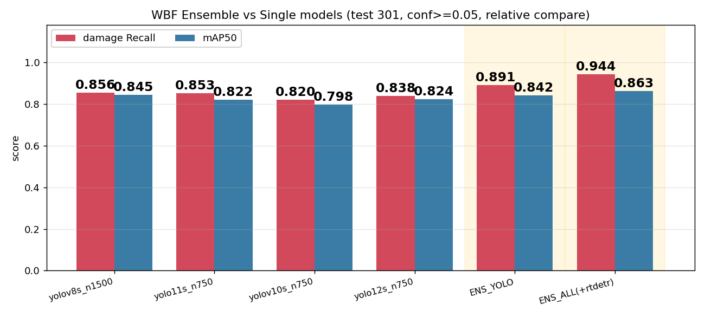
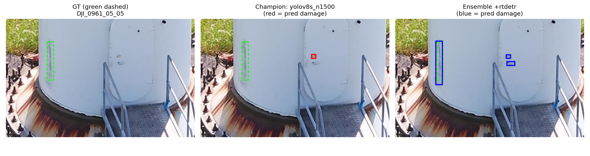
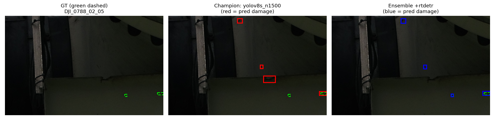
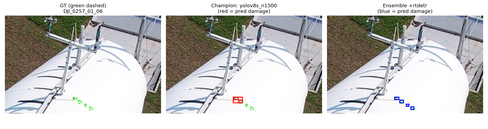
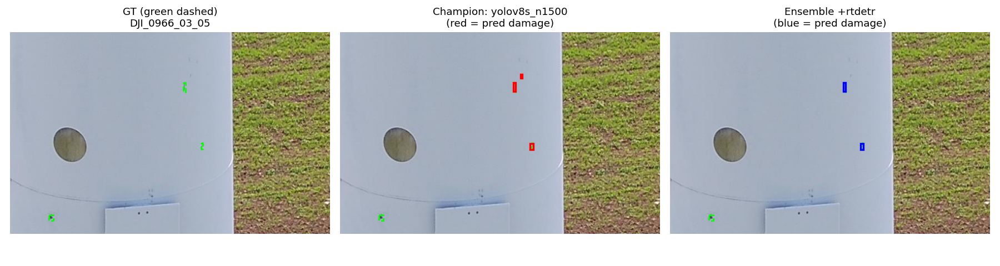
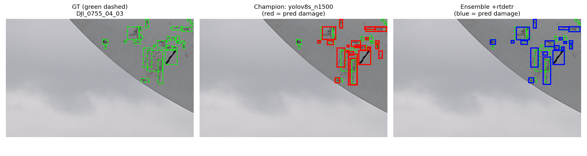
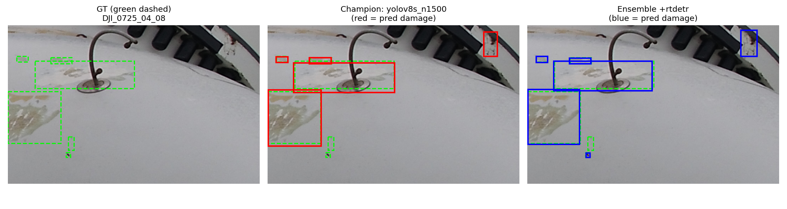

# MQ02 WBF 앙상블 결과 — 만든 방법과 이미지별 설명

> 콜랩에서 학습한 4개 모델(yolov8s/11s/v10s/12s, 정상이미지 주입판)에 rtdetr까지 더해
> **WBF(Weighted Boxes Fusion)** 로 합치면 우리 병목인 "damage 놓침(recall)"이 정말 줄어드는지를
> 숫자 + 눈으로 확인한 자료. 재학습은 안 했고 **이미 있는 best.pt로 추론만** 합쳐서 얻은 결과다.

## 왜 만들었나

1단계 결론이 "모델들이 damage를 30% 정도 놓친다(recall 병목)"였다.
한 모델을 더 키우는 대신, **성격이 다른 여러 모델의 예측을 합치면** 서로가 놓친 걸 메워줄까 궁금했다.
mAP 숫자만으론 "정말 놓치던 손상을 새로 잡았는지"가 안 보여서, 정답(GT)과 챔피언·앙상블 예측을
**같은 사진에 나란히** 그려 눈으로 대조했다.

## 어떻게 만들었나 (코드)

스크립트 두 개.

1. `build/ensemble_wbf_final.py` — 수치 계산 + 시각화용 박스 저장
   - test 301장에 대해 4개 YOLO + rtdetr을 **CPU로 추론**(학습 GPU 안 건드림).
   - **WBF** = 여러 모델이 친 박스들을 신뢰도로 가중평균해 하나로 합치는 방식(IoU 0.55로 겹치는 박스끼리 묶음).
   - rtdetr은 발산으로 반쪽만 학습돼서(mAP 0.81) **가중치 0.5**로 낮게 = "거들기만".
   - AP/recall은 무거운 라이브러리 없이 numpy로 직접 계산. **단일·앙상블에 똑같은 잣대(conf>=0.05)** 를 써서 상대비교가 공정하게.

2. `build/make_ensemble_viz.py` — 그림 생성
   - `ensemble_bars.png` = 방법별 damage Recall / mAP50 막대.
   - `ensemble_qual_*.png` = `정답(초록 점선) | 챔피언(빨강) | 앙상블(파랑)` 3단 비교. 그림엔 신뢰도 0.25 이상만 그려 깔끔하게.

## 방법별 수치 (test 301장, 상대비교용)

| 방법 | mAP50 | mAP50-95 | damage recall | damage precision |
|------|-------|----------|---------------|------------------|
| yolov8s_n1500 (단일 챔피언) | 0.846 | 0.532 | 0.856 | 0.394 |
| yolo11s_n750 | 0.822 | **0.547** | 0.853 | 0.372 |
| yolov10s_n750 | 0.799 | 0.511 | 0.820 | 0.455 |
| yolo12s_n750 | 0.824 | 0.525 | 0.838 | 0.369 |
| **ENS_YOLO (4종)** | 0.842 | 0.537 | **0.891** | 0.335 |
| **ENS_ALL (+rtdetr)** | **0.863** | 0.542 | **0.944** | 0.150 |

> **mAP50 / mAP50-95 차이**: mAP50은 "박스가 대충 맞으면(IoU 0.5)" 인정, mAP50-95는 IoU 0.5~0.95를 평균해서 **박스를 얼마나 딱 맞게 쳤는지(위치 정확도)**까지 본다.
> 여기서 정직한 포인트 하나 — 앙상블은 mAP50·recall에선 1등이지만 **mAP50-95는 단일 yolo11s(0.547)가 근소하게 앞선다(앙상블 0.542).** WBF가 여러 박스를 평균내며 위치가 살짝 뭉툭해지기 때문. 즉 **앙상블의 강점은 "더 많이 찾는 것(recall)"이지 "더 정밀하게 맞추는 것"은 아니다.** 이 데이터에선 놓침이 병목이라 앙상블이 유리하지만, 위치 정밀도가 중요하면 단일 모델도 경쟁력 있다.

> 위 그림에서 노란 음영 = 앙상블 구간. 빨강(damage Recall)이 앙상블로 갈수록 확 치솟는 게 한눈에 보인다.

- 앙상블이 damage recall을 **0.856 -> 0.944** 로 끌어올렸다. mAP50도 0.863으로 최고.
- precision 0.15는 성능 저하가 아니라 **AP 계산을 conf 0.05로 해서** 낮은 신뢰도 박스가 많이 섞인 것뿐이다. 실제 쓸 땐 임계값을 0.25~0.3으로 올리면 회복된다(그래서 그림은 0.25로 그림).

## 어떤 기준으로 이미지를 골랐나

정성비교 6장은 **"챔피언이 놓쳤는데 앙상블이 새로 잡은 damage가 있는" 이미지**를 우선 골랐다.
= 앙상블의 recall 이득이 눈으로 가장 잘 보이는 사진들.

## 이미지별 설명 (신뢰도 0.25 기준)

| 이미지 | 정답 damage | 챔피언이 잡음 | 앙상블이 잡음 | 무엇을 보여주나 |
|--------|------------|-------------|-------------|----------------|
| DJI_0961_05_05 | 1 | 0 | 1 | ★타워 세로 **긴 균열**을 챔피언은 통째로 놓침 -> 앙상블이 잡음. **킬러 예시.** |
| DJI_0788_02_05 | 2 | 0 | 1 | 챔피언 0개인 사진에서 앙상블이 손상 1개를 새로 건짐. |
| DJI_0257_01_06 | 4 | 2 | 4 | 챔피언 절반만 잡던 걸 앙상블이 **4개 다** 잡음. |
| DJI_0966_03_05 | 3 | 1 | 2 | 챔피언 1개 -> 앙상블 2개로 놓침 회복. |
| DJI_0755_04_03 | 27 | 17 | 18 | 손상 밀집 어려운 케이스. 앙상블이 1개 더 건지지만 아직 여럿 놓침(=한계도 보임). |
| DJI_0725_04_08 | 6 | 4 | 5 | 6개 중 4 -> 5로 한 개 더 잡음. |

### 읽는 법
- **초록 점선 = 정답, 빨강 = 챔피언 예측, 파랑 = 앙상블 예측.** 각 그림은 `정답 | 챔피언 | 앙상블` 3단.
- 초록 위에 색 박스가 겹치면 "그 손상을 잡았다", 초록만 있고 색이 없으면 "놓쳤다".
- 즉 **빨강엔 없고 파랑엔 있는 초록** = 앙상블이 새로 잡아낸 손상(=recall 이득).

### 그림 (표와 같은 순서, 킬러 예시부터)

**DJI_0961_05_05 — 타워 세로 긴 균열: 챔피언 0개(놓침) -> 앙상블 1개(잡음). ★발표 킬러 슬라이드.**

**DJI_0788_02_05 — 챔피언이 하나도 못 잡은 사진에서 앙상블이 손상 1개를 새로 건짐.**

**DJI_0257_01_06 — 챔피언은 4개 중 2개만, 앙상블은 4개를 다 잡음.**

**DJI_0966_03_05 — 챔피언 1개 -> 앙상블 2개로 놓침 회복.**

**DJI_0755_04_03 — 손상 밀집 어려운 케이스. 앙상블이 1개 더 건지지만(17->18) 아직 여럿 놓침 = 한계도 보인다.**

**DJI_0725_04_08 — 6개 중 4 -> 5로 한 개 더 잡음.**

## 총평 (발표 포인트)

- 앙상블은 **재학습 없이 추론만 합쳐** damage recall을 0.856 -> 0.944로 올렸다. 병목을 직접 때린 결과.
- 특히 발산해서 "혼자선 못 쓴다"던 **rtdetr을 멤버로 넣으니 recall도 mAP도 최고**가 됐다. transformer 계열이라 YOLO들과 **다른 실수**를 해서, 팀으로 묶이니 제 몫을 한 것. ("버린 카드가 앙상블에선 활약")
- 발표 땐 **막대그래프(recall이 앙상블에서 치솟는 그림) + DJI_0961(챔피언 놓침 vs 앙상블 잡음)** 을 나란히 놓으면 "합쳐서 놓침을 줄였다"가 한 번에 전달된다.
- 한계도 솔직히: DJI_0755처럼 손상이 아주 많고 작은 사진은 앙상블도 여럿 놓친다 -> 다음 단계(Copy-Paste 증강, 추가 데이터)의 이유가 된다.
