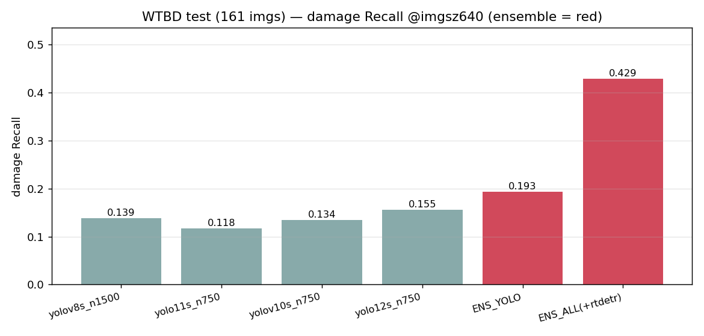
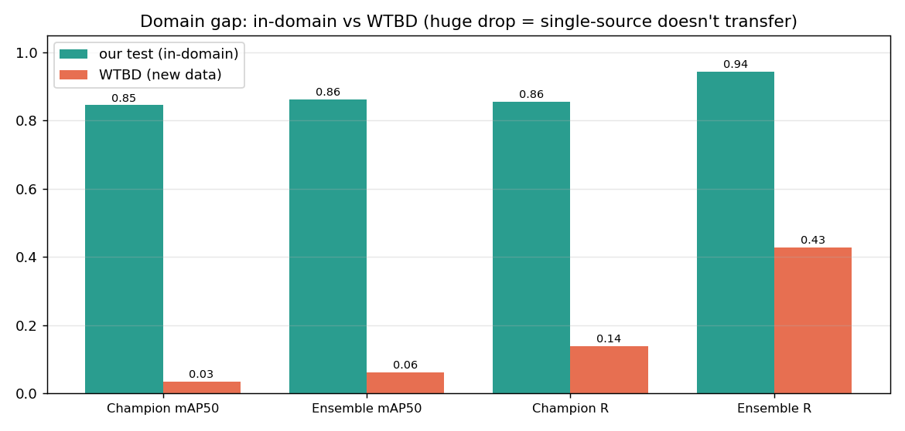
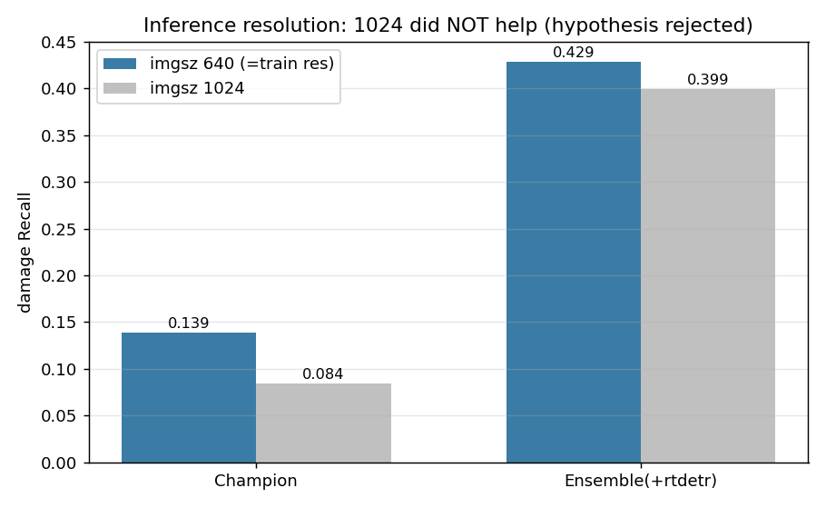
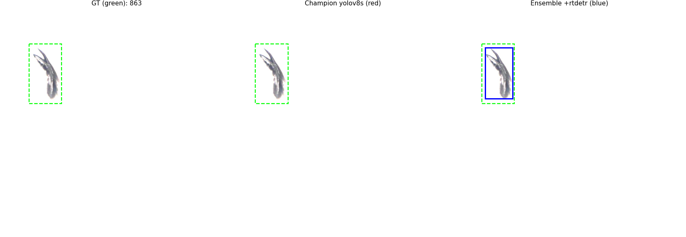
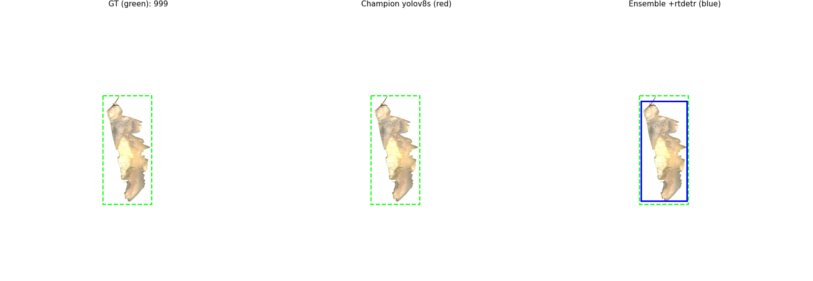
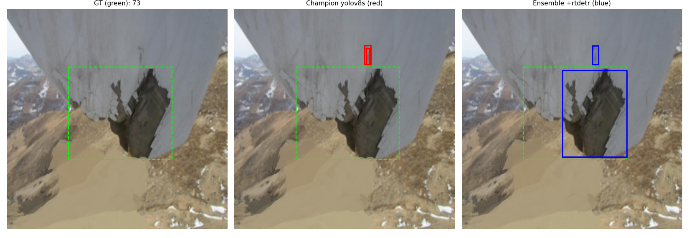
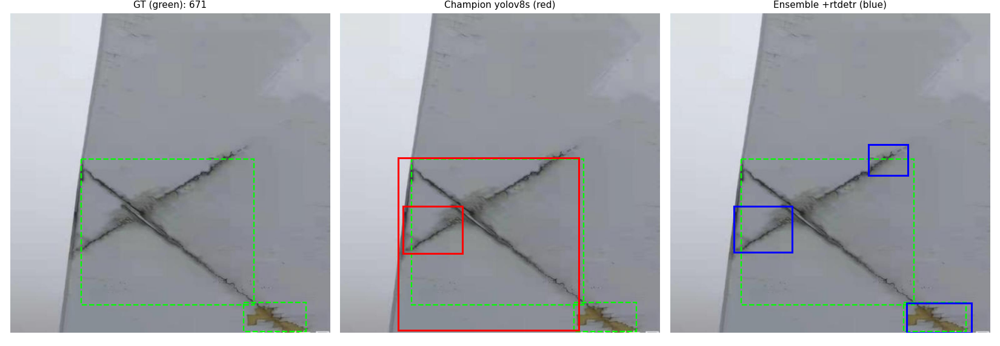

# MQ02 — 우리 앙상블을 남의 데이터(WTBD)에 붙여본 결과 (일반화 리포트)

> 팀원이 준 **WTBD 데이터셋**(실제 UAV 풍력터빈 결함, Nature 논문 데이터)에 우리 5모델 WBF 앙상블을
> 그대로 얹어서, "우리 앙상블이 학습 안 한 새 데이터에서 얼마나 통하나"를 측정한 자료다.
> 두 줄 결론 먼저: **(1) 절대 성능은 크게 무너진다(도메인갭 실재). (2) 그래도 앙상블은 어디서든 놓침을 크게 줄인다.**

## 왜 했나

우리 앙상블은 우리 데이터(Nordtank 타일)에서 damage recall 0.856 -> 0.944로 좋았다.
그런데 "이게 우리 데이터에만 잘 맞춘 것 아니냐"는 의심이 남는다.
그래서 완전히 다른 출처인 WTBD에 그대로 붙여, 일반화(generalization)를 시험했다.

## 어떻게 했나

- **데이터**: WTBD test 서브셋 **161장 / 손상 박스 238개**. 원본은 1024x1024, VOC XML 라벨.
- **클래스 매핑**: WTBD 6종(surface_injure/hide_craze/craze/corrosion/crack/thunderstrike)은 **전부 손상류**라 우리 `damage(1)`로 통합. (WTBD엔 dirt(오염)가 없어서, 이 데이터로는 우리의 **damage 탐지력만** 순수하게 측정된다 = 우리 병목 지표라 오히려 딱 맞다.)
- **모델**: 우리 5모델(yolov8s_n1500 / yolo11s / yolov10s / yolo12s / rtdetr)을 WBF로 합침. **재학습 없음, 추론만.**
- 변환기 `build/make_wtbd_report_assets.py`, 원본 데이터 `ETC/wtbd_yolo/`.

## 결과 1 — 수치표 (WTBD test 161장, imgsz 640)

| 방법 | mAP50 | mAP50-95 | damage recall | damage precision | (참고: 우리 test recall) |
|------|-------|----------|---------------|------------------|--------------------------|
| yolov8s_n1500 (챔피언) | 0.035 | 0.017 | 0.139 | 0.039 | (0.856) |
| yolo11s_n750 | 0.041 | 0.017 | 0.118 | 0.035 | (0.853) |
| yolov10s_n750 | 0.042 | 0.019 | 0.135 | 0.050 | (0.820) |
| yolo12s_n750 | 0.034 | 0.015 | 0.156 | 0.039 | (0.838) |
| **ENS_YOLO (4종)** | 0.045 | 0.018 | **0.193** | 0.030 | (0.891) |
| **ENS_ALL (+rtdetr)** | **0.062** | **0.027** | **0.429** | 0.025 | (0.944) |

> mAP50-95(IoU 0.5~0.95 평균, 박스 위치 정확도까지 반영)도 우리 test 0.54 -> WTBD 0.02~0.03으로 똑같이 붕괴한다. 지표를 엄격하게 봐도 결론(도메인갭)은 그대로다. WTBD엔 dirt가 없어 mAP = damage AP 이다.

- 앙상블(빨강)이 단일 챔피언 recall 0.139를 **0.429로 약 3배** 끌어올렸다. 새 데이터에서도 "합치면 놓침이 준다"가 그대로 작동.
- 단, **precision이 0.02~0.05로 거의 바닥**이다. 성능이 이 정도로 낮으면 모델이 사실상 여기저기 찍는 상태라, 이 recall은 **헛박스를 잔뜩 동반한** 값이다. 정직하게 같이 봐야 한다.

## 결과 2 — 도메인갭: 우리 데이터 vs WTBD

- mAP50이 우리 test 0.85 -> WTBD 0.06으로 **거의 무너졌다.** 즉 우리 모델은 WTBD에 그대로는 잘 안 통한다.
- 이유: WTBD는 이미지가 1024² 통짜에 흰 배경 결함 크롭이 많고, 터빈 기종·손상 종류(craze, thunderstrike 등 우리엔 없던 것)가 다르다.
- 이건 실패가 아니라 **"한 가지 출처로만 학습하면 다른 데이터엔 전이가 안 된다"**는 증거다. -> 2단계에서 **다양한 데이터를 섞어야 하는 이유**를 그대로 보여준다.

## 결과 3 — "해상도 탓 아니냐?" 를 실험으로 확인 (가설 기각)

WTBD가 1024²라, 추론도 1024로 키우면 나아질까 싶어 다시 측정했다. 결과는 **반대**였다.

- 1024로 올리니 오히려 나빠졌다 (앙상블 recall 0.429 -> 0.399, 챔피언 0.139 -> 0.084).
- 이유: 우리 모델은 **imgsz 640으로 학습**돼서, 추론도 640(=학습 해상도)이 최적이다. 1024로 키우면 손상이 학습 때보다 크게 보여 오히려 못 잡는다. **추론 해상도는 원본 이미지 크기가 아니라 "학습 해상도"에 맞춰야 한다.**
- 덕분에 결론이 단단해졌다: 낮은 점수는 측정 착오(해상도)가 아니라 **진짜 도메인갭**이다.

## 눈으로 보기 — 정성비교 (GT 초록 / 챔피언 빨강 / 앙상블 파랑)

챔피언은 놓쳤는데 앙상블은 잡은 예들. 새 데이터에서도 앙상블이 더 건진다는 걸 눈으로 확인.

*863 — 챔피언(빨강)은 아무것도 못 잡음, 앙상블(파랑)만 결함을 잡음.*

(WTBD 이미지가 흰 배경의 결함 크롭이라, 우리 학습 데이터(하늘 배경 + 블레이드 타일)와 시각적으로 많이 다른 게 보인다. 도메인갭이 왜 큰지 눈으로도 드러난다.)

## 총평 (팀 공유 / 발표 포인트)

1. **우리 앙상블은 낯선 데이터엔 그대로는 거의 안 통한다** (mAP 0.85 -> 0.06). 해상도를 바꿔봐도 안 오르니 진짜 도메인갭이다. -> **2단계에서 다양한 데이터(WTBD 포함)를 섞어 재학습해야 한다는 근거.**
2. **그럼에도 앙상블은 어떤 조건(우리 데이터든, 남의 데이터든, 640이든 1024든)에서도 damage 놓침을 크게 줄인다** (챔피언 대비 3~5배 recall). -> 앙상블 전략은 견고하다.
3. 서사로서 강한 점: "혹시 해상도 탓인가?"라는 반박을 **직접 실험해 기각**했다. 가설-검증-기각의 과학적 흐름이라 그냥 숫자만 있는 것보다 설득력 있다.

## 부록 — 재현 / 파일 위치

- 결과 수치: `ETC/wtbd_ensemble_out/`(640), `ETC/wtbd_ensemble_out_1024/`(1024) 각각 `results.txt` + `summary.json`.
- 그림 생성: `build/make_wtbd_report_assets.py`.
- VOC->YOLO 변환은 test 서브셋 161장 기준. 전체 1065장으로 넓히려면 서브셋 조건만 바꾸면 된다.
